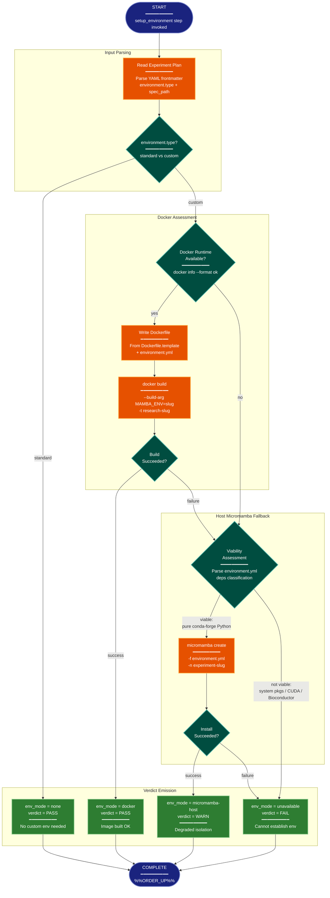
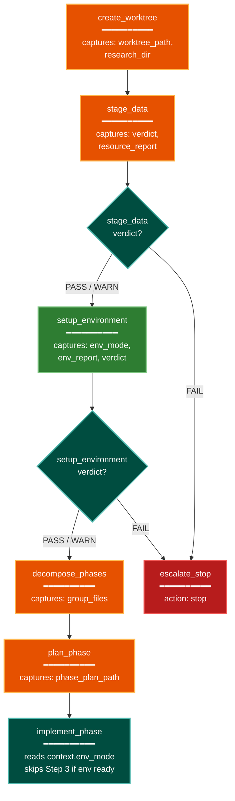

# Design Spec: Dedicated Environment-Setup Skill

**Status:** Draft
**Date:** 2026-05-05
**Issue:** [#838](https://github.com/TalonT-Org/AutoSkillit/issues/838)
**Blocks:** [#839](https://github.com/TalonT-Org/AutoSkillit/issues/839) (skill implementation)

## Overview

This document specifies the `setup-environment` skill — a discrete recipe step inserted between `stage_data` and `decompose_phases` in `research.yaml`. The skill decouples environment decisions (Docker vs host-micromamba vs none) from `implement-experiment`'s inline Docker build (Step 3c) and makes the environment-mode decision a testable, pre-flight gate with structured output tokens consumed by downstream steps.

## Skill Identity

- **Skill name:** `setup-environment`
- **Location:** `src/autoskillit/skills_extended/setup-environment/SKILL.md`
- **Recipe step name:** `setup_environment`
- **Invocation:** `/autoskillit:setup-environment <worktree_path> <experiment_plan>`

### Arguments

| Position | Name | Type | Required | Description |
|---|---|---|---|---|
| 1 | `worktree_path` | `directory_path` | Yes | Absolute path to the experiment worktree |
| 2 | `experiment_plan` | `file_path` | Yes | Absolute path to the experiment plan YAML |

## Structured Output Tokens

The skill emits exactly four tokens before `%%ORDER_UP%%`:

```
env_mode = {none|docker|micromamba-host|unavailable}
env_report = {absolute_path_to_environment_setup_report.md}
verdict = {PASS|WARN|FAIL}
%%ORDER_UP%%
```

| Token | Description | Consumed by |
|---|---|---|
| `env_mode` | Resolved environment execution mode | `implement_phase`, `run_experiment`, `generate_report` via `${{ context.env_mode }}` |
| `env_report` | Absolute path to detailed report file | `troubleshoot-experiment` for post-failure diagnostics |
| `verdict` | Routing signal | `on_result` in the recipe step |

The `env_report` file is always written (`write_behavior: always`), providing a diagnostic trail for `troubleshoot-experiment` when later steps fail.

## Environment-Mode Verdict Enum

Four values extending the issue's three-value suggestion to handle the `environment.type = standard` case from `plan-experiment`:

| `env_mode` value | Meaning | `verdict` | Downstream behavior |
|---|---|---|---|
| `none` | Experiment does not need a custom environment (`environment.type = standard` in plan) | `PASS` | `implement_phase` skips Docker/env setup entirely; `run_experiment` runs scripts directly on host |
| `docker` | Docker runtime available, image built successfully | `PASS` | `implement_phase` skips Step 3 (env already built); `run_experiment` uses `docker run`; `generate-report` uses existing image for visualizations |
| `micromamba-host` | Docker unavailable but host micromamba environment created | `WARN` | `implement_phase` skips Step 3; `run_experiment` uses `micromamba run -n {env}`; `generate-report` runs visualization scripts in micromamba env instead of Docker |
| `unavailable` | Custom environment required but neither Docker nor host micromamba viable | `FAIL` | Recipe routes to `escalate_stop`; experiment is blocked |

The `WARN` verdict for `micromamba-host` reflects degraded isolation (no container boundary) while still being a viable execution path. Downstream steps treat `WARN` the same as `PASS` for routing purposes but log the degradation.

## Process Flow: Environment-Setup Skill Decision Logic



## Per-Task Fallback Viability Rules

When Docker is unavailable (or Docker build fails), the skill decides whether `micromamba-host` is a viable fallback by parsing the experiment's `environment.yml` and the Dockerfile template's `apt-get install` layer.

### Viable (micromamba-host OK)

- All dependencies are pure conda-forge Python packages (e.g., `numpy`, `pandas`, `scipy`, `scikit-learn`, `pytest`)
- No system packages beyond what the host already provides
- No compiled C/Fortran extensions that require specific system libraries not available via conda-forge

### Not Viable (must use Docker or fail)

- `environment.yml` references non-conda-forge channels that require system-level setup
- The Dockerfile template's `apt-get install` layer includes packages not present on the host AND those packages are required at runtime (not just build-time)
- Dependencies include CUDA libraries (`cudatoolkit`, `cuda-*`, `nvidia-*`)
- Dependencies include Bioconductor R packages that require system-level R installation
- Dependencies include packages with known native compilation requirements that conda-forge cannot satisfy on the host architecture

### Assessment Algorithm

1. Parse `environment.yml` — extract `channels` list and `dependencies` list
2. Check channels: if only `conda-forge` (and optionally `defaults`), mark channels as viable
3. Classify each dependency:
   - Look up in a hardcoded allowlist of known pure-Python conda-forge packages → `viable`
   - Check for CUDA/GPU markers (`cuda`, `nvidia`, `cudnn`, `nccl`) → `not_viable`
   - Check for Bioconductor markers (`bioconductor-*`, `r-*` with system deps) → `not_viable`
   - Unknown packages → `viable` (optimistic default; failure caught at install time)
4. Parse the Dockerfile template's `apt-get install` line — extract system packages
5. For each system package, check if it exists on the host via `dpkg -l` or `which`
6. If any required system package is missing AND is not installable via conda-forge → `not_viable`
7. Final verdict: all checks pass → `viable`; any `not_viable` → `not_viable`

### Viability Examples

| Scenario | environment.yml | Viability | Reason |
|---|---|---|---|
| Statistical analysis | `numpy`, `scipy`, `pandas`, `matplotlib` | Viable | Pure conda-forge Python packages |
| GPU ML training | `pytorch`, `cudatoolkit=11.8` | Not viable | CUDA system library required |
| Bioinformatics | `bioconductor-deseq2`, `r-base` | Not viable | System R + Bioconductor ecosystem |
| Web scraping | `requests`, `beautifulsoup4`, `selenium` | Viable | Pure Python; selenium webdriver is a user concern |
| Image processing | `opencv`, `pillow`, `scikit-image` | Viable | conda-forge provides pre-built binaries |

## Downstream Consumption

The `env_mode` value is captured into recipe context and passed to downstream steps via `${{ context.env_mode }}`.

### `implement_phase` (via `implement-experiment` SKILL.md, modified in WI 3.2)

```
If context.env_mode == "none":
    Skip Step 3 entirely (no Dockerfile, no Taskfile, no docker build)
    Write scripts that run directly on host Python

If context.env_mode == "docker":
    Skip Step 3a–3c (Dockerfile already written, image already built by setup-environment)
    Step 3b: Write Taskfile.yml referencing existing image "research-{slug}"
    Verify image exists: docker image inspect "research-{slug}"

If context.env_mode == "micromamba-host":
    Skip Step 3a–3c entirely
    Write Taskfile.yml with micromamba-based tasks:
      run-experiment: micromamba run -n {env} python {script}
      test: micromamba run -n {env} pytest {test_dir}
    Verify env exists: micromamba env list | grep {env}

If context.env_mode == "unavailable":
    This case never reaches implement_phase (recipe routes to escalate_stop)
```

### `run_experiment` (via `run-experiment` SKILL.md)

`run-experiment` is already environment-agnostic — it reads the plan and executes what the plan describes. The Taskfile.yml written by `implement_phase` encapsulates the execution mode. No changes are needed to `run-experiment` itself.

### `generate_report` (via `generate-report` SKILL.md, modified in WI 3.2)

Step 2.5 currently does `docker run` for visualizations. It must branch on `env_mode`:

```
If context.env_mode == "docker":
    (current behavior) docker run --rm -v ... "research-{slug}" bash -c "..."

If context.env_mode == "micromamba-host":
    micromamba run -n {env} python /workspace/scripts/fig{N}_{slug}.py

If context.env_mode == "none":
    python scripts/fig{N}_{slug}.py  (host Python, no container)
```

## Canonical Dockerfile Formula Reference

The canonical Dockerfile template lives at:

```
src/autoskillit/assets/research/Dockerfile.template
```

### Version Pin

- **Base image:** `mambaorg/micromamba:1.0-bullseye-slim`
- **System packages:** `procps git curl build-essential`
- **Taskfile installer:** `https://taskfile.dev/install.sh`
- **Shell hook mechanism:** `BASH_ENV=/etc/container.bashrc` + `micromamba shell hook --shell=bash`

### Docker Build Context Staging Requirement

The template uses `COPY ${MAMBA_ENV}.yaml /opt/research/env/`. The build arg `MAMBA_ENV` is the experiment slug, not the literal string `environment.yml`. The setup-environment skill must stage the build context before running `docker build`:

1. Create a temp build directory under `.autoskillit/temp/`
2. Copy `Dockerfile.template` into the build dir as `Dockerfile`
3. Copy the experiment's `environment.yml` into the build dir as `{slug}.yaml`
4. Run: `docker build --build-arg MAMBA_ENV={slug} -t research-{slug} {build_dir}`

This staging requirement exists so that WI 3.2 implementers do not place `environment.yml` directly in the build context (which would be silently ignored by the `COPY ${MAMBA_ENV}.yaml` instruction).

### Single Source of Truth

The `Dockerfile.template` asset file is the single source of truth for the Docker build formula. Any future helper-agents mirror must be kept in sync via a contract test.

**Contract test for WI 3.2:** `test_dockerfile_template_base_image_pinned` — asserts `mambaorg/micromamba:1.0-bullseye-slim` appears in the template. (Already partially covered by existing `test_dockerfile_template_uses_micromamba_base` in `tests/contracts/test_generate_report_contracts.py`.)

## Recipe Integration

New step `setup_environment` inserted between `stage_data` and `decompose_phases`. The `stage_data` step's PASS/WARN routes change from `decompose_phases` to `setup_environment`.

### Recipe Flow Diagram



### Proposed Recipe YAML (for WI 3.2 implementation)

```yaml
setup_environment:
  tool: run_skill
  model: ""
  with:
    skill_command: "/autoskillit:setup-environment ${{ context.worktree_path }} ${{ context.experiment_plan }}"
    cwd: "${{ context.worktree_path }}"
    step_name: setup_environment
  capture:
    env_mode: "${{ result.env_mode }}"
    env_report: "${{ result.env_report }}"
  on_result:
    field: verdict
    routes:
      PASS: decompose_phases
      WARN: decompose_phases
      FAIL: escalate_stop
  on_failure: escalate_stop
  stale_threshold: 600
  retries: 1
  on_exhausted: escalate_stop
```

### Changes to Existing Steps (for WI 3.2 implementation)

1. `stage_data.on_result.routes.PASS` and `WARN`: change target from `decompose_phases` to `setup_environment`
2. `implement_phase.with.skill_command`: append `${{ context.env_mode }}` so the skill knows what environment mode to use
3. `generate_report` step: append `${{ context.env_mode }}` to its `skill_command` (or add `optional_context_refs: [env_mode]`)

## Skill Contract

Entry for `src/autoskillit/recipe/skill_contracts.yaml` (added in WI 3.2):

```yaml
setup-environment:
  inputs:
  - name: worktree_path
    type: directory_path
    required: true
  - name: experiment_plan
    type: file_path
    required: true
  outputs:
  - name: env_mode
    type: string
  - name: env_report
    type: file_path
  - name: verdict
    type: string
  expected_output_patterns:
  - "env_mode\\s*=\\s*(none|docker|micromamba-host|unavailable)"
  - "verdict\\s*=\\s*(PASS|WARN|FAIL)"
  - "env_report\\s*=\\s*/.+"
  pattern_examples:
  - "env_mode = docker\nenv_report = /tmp/env_setup_report.md\nverdict = PASS\n%%ORDER_UP%%"
  - "env_mode = micromamba-host\nenv_report = /tmp/env_setup_report.md\nverdict = WARN\n%%ORDER_UP%%"
  - "env_mode = unavailable\nenv_report = /tmp/env_setup_report.md\nverdict = FAIL\n%%ORDER_UP%%"
  write_behavior: always
```
