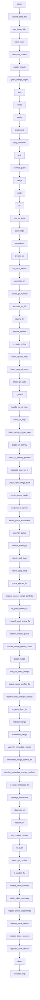

<!-- autoskillit-recipe-hash: sha256:ed565e3970c6c0e0ca198a904be337c1b0160c39d3be5b13a2c19f310855299b -->
<!-- autoskillit-diagram-format: v7 -->
# implementation

```mermaid
flowchart TD
    S0[clone]
    S1[capture_base_sha]
    S0 --> S1
    S2[get_issue_title]
    S1 --> S2
    S3[claim_issue]
    S2 --> S3
    S4[compute_branch]
    S3 --> S4
    S5[create_branch]
    S4 --> S5
    S6[push_merge_target]
    S5 --> S6
    S7[plan]
    S6 --> S7
    S8[review]
    S7 --> S8
    S9[verify]
    S8 --> S9
    S10[implement]
    S9 --> S10
    S11[retry_worktree]
    S10 --> S11
    S12[test]
    S11 --> S12
    S13[commit_guard]
    S12 --> S13
    S14[merge]
    S13 --> S14
    S15[push]
    S14 --> S15
    S16[fix]
    S15 --> S16
    S17[next_or_done]
    S16 --> S17
    S18[audit_impl]
    S17 --> S18
    S19[remediate]
    S18 --> S19
    S20[prepare_pr]
    S19 --> S20
    S21[run_arch_lenses]
    S20 --> S21
    S22[compose_pr]
    S21 --> S22
    S23[extract_pr_number]
    S22 --> S23
    S24[annotate_pr_diff]
    S23 --> S24
    S25[review_pr]
    S24 --> S25
    S26[resolve_review]
    S25 --> S26
    S27[re_push_review]
    S26 --> S27
    S28[check_review_loop]
    S27 --> S28
    S29[check_repo_ci_event]
    S28 --> S29
    S30[check_pr_state]
    S29 --> S30
    S31[ci_watch]
    S30 --> S31
    S32[handle_no_ci_runs]
    S31 --> S32
    S33[check_ci_loop]
    S32 --> S33
    S34[check_active_trigger_loop]
    S33 --> S34
    S35[trigger_ci_actively]
    S34 --> S35
    S36[check_ci_already_passed]
    S35 --> S36
    S37[escalate_stop_no_ci]
    S36 --> S37
    S38[check_repo_merge_state]
    S37 --> S38
    S39[route_queue_mode]
    S38 --> S39
    S40[enqueue_to_queue]
    S39 --> S40
    S41[verify_queue_enrollment]
    S40 --> S41
    S42[wait_for_queue]
    S41 --> S42
    S43[reenroll_stalled_pr]
    S42 --> S43
    S44[check_stall_loop]
    S43 --> S44
    S45[check_eject_limit]
    S44 --> S45
    S46[queue_ejected_fix]
    S45 --> S46
    S47[resolve_queue_merge_conflicts]
    S46 --> S47
    S48[re_push_queue_fix]
    S47 --> S48
    S49[ci_watch_post_queue_fix]
    S48 --> S49
    S50[reenter_merge_queue]
    S49 --> S50
    S51[reenter_merge_queue_cheap]
    S50 --> S51
    S52[direct_merge]
    S51 --> S52
    S53[wait_for_direct_merge]
    S52 --> S53
    S54[direct_merge_conflict_fix]
    S53 --> S54
    S55[resolve_direct_merge_conflicts]
    S54 --> S55
    S56[re_push_direct_fix]
    S55 --> S56
    S57[redirect_merge]
    S56 --> S57
    S58[immediate_merge]
    S57 --> S58
    S59[wait_for_immediate_merge]
    S58 --> S59
    S60[immediate_merge_conflict_fix]
    S59 --> S60
    S61[resolve_immediate_merge_conflicts]
    S60 --> S61
    S62[re_push_immediate_fix]
    S61 --> S62
    S63[remerge_immediate]
    S62 --> S63
    S64[diagnose_ci]
    S63 --> S64
    S65[resolve_ci]
    S64 --> S65
    S66[pre_resolve_rebase]
    S65 --> S66
    S67[re_push]
    S66 --> S67
    S68[detect_ci_conflict]
    S67 --> S68
    S69[ci_conflict_fix]
    S68 --> S69
    S70[release_issue_success]
    S69 --> S70
    S71[patch_token_summary]
    S70 --> S71
    S72[register_clone_unconfirmed]
    S71 --> S72
    S73[release_issue_failure]
    S72 --> S73
    S74[register_clone_success]
    S73 --> S74
    S75[register_clone_failure]
    S74 --> S75
    S76[done]
    S75 --> S76
    S77[escalate_stop]
    S76 --> S77
```
