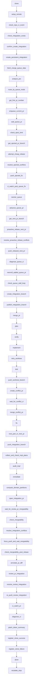

<!-- autoskillit-recipe-hash: sha256:40c05a082886b9279b6f8fb4227a55f28e00d30790f96c81b5e2f25f1823be2a -->
<!-- autoskillit-diagram-format: v7 -->
# merge-prs

```mermaid
flowchart TD
    S0[clone]
    S1[setup_remote]
    S0 --> S1
    S2[check_repo_ci_event]
    S1 --> S2
    S3[check_integration_exists]
    S2 --> S3
    S4[confirm_create_integration]
    S3 --> S4
    S5[create_persistent_integration]
    S4 --> S5
    S6[fetch_merge_queue_data]
    S5 --> S6
    S7[analyze_prs]
    S6 --> S7
    S8[route_by_queue_mode]
    S7 --> S8
    S9[get_first_pr_number]
    S8 --> S9
    S10[enqueue_current_pr]
    S9 --> S10
    S11[wait_queue_pr]
    S10 --> S11
    S12[check_eject_limit]
    S11 --> S12
    S13[get_ejected_pr_branch]
    S12 --> S13
    S14[attempt_cheap_rebase]
    S13 --> S14
    S15[resolve_ejected_conflicts]
    S14 --> S15
    S16[push_ejected_fix]
    S15 --> S16
    S17[ci_watch_post_queue_fix]
    S16 --> S17
    S18[reenter_queue]
    S17 --> S18
    S19[advance_queue_pr]
    S18 --> S19
    S20[get_next_pr_branch]
    S19 --> S20
    S21[proactive_rebase_next_pr]
    S20 --> S21
    S22[resolve_proactive_rebase_conflicts]
    S21 --> S22
    S23[push_rebased_next_pr]
    S22 --> S23
    S24[diagnose_queue_ci]
    S23 --> S24
    S25[reenroll_stalled_queue_pr]
    S24 --> S25
    S26[check_queue_stall_loop]
    S25 --> S26
    S27[create_integration_branch]
    S26 --> S27
    S28[publish_integration_branch]
    S27 --> S28
    S29[merge_pr]
    S28 --> S29
    S30[plan]
    S29 --> S30
    S31[verify]
    S30 --> S31
    S32[implement]
    S31 --> S32
    S33[retry_worktree]
    S32 --> S33
    S34[test]
    S33 --> S34
    S35[push_worktree_branch]
    S34 --> S35
    S36[create_conflict_pr]
    S35 --> S36
    S37[wait_for_conflict_ci]
    S36 --> S37
    S38[merge_conflict_pr]
    S37 --> S38
    S39[fix]
    S38 --> S39
    S40[next_part_or_next_pr]
    S39 --> S40
    S41[push_integration_branch]
    S40 --> S41
    S42[collect_and_check_impl_plans]
    S41 --> S42
    S43[audit_impl]
    S42 --> S43
    S44[remediate]
    S43 --> S44
    S45[compute_domain_partitions]
    S44 --> S45
    S46[open_integration_pr]
    S45 --> S46
    S47[wait_for_review_pr_mergeability]
    S46 --> S47
    S48[check_mergeability]
    S47 --> S48
    S49[resolve_integration_conflicts]
    S48 --> S49
    S50[force_push_and_wait_mergeability]
    S49 --> S50
    S51[check_mergeability_post_rebase]
    S50 --> S51
    S52[annotate_pr_diff]
    S51 --> S52
    S53[review_pr_integration]
    S52 --> S53
    S54[resolve_review_integration]
    S53 --> S54
    S55[re_push_review_integration]
    S54 --> S55
    S56[ci_watch_pr]
    S55 --> S56
    S57[diagnose_ci]
    S56 --> S57
    S58[patch_token_summary]
    S57 --> S58
    S59[register_clone_success]
    S58 --> S59
    S60[register_clone_failure]
    S59 --> S60
    S61[done]
    S60 --> S61
    S62[escalate_stop]
    S61 --> S62
```
