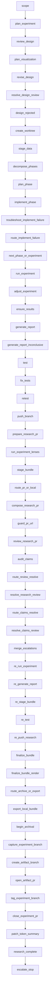

<!-- autoskillit-recipe-hash: sha256:d2f5cf26a4efbb7cd83c602b3710089f7d208958522dd6c2cb4c7487f9a16a16 -->
<!-- autoskillit-diagram-format: v7 -->
# research

```mermaid
flowchart TD
    S0[scope]
    S1[plan_experiment]
    S0 --> S1
    S2[review_design]
    S1 --> S2
    S3[plan_visualization]
    S2 --> S3
    S4[revise_design]
    S3 --> S4
    S5[resolve_design_review]
    S4 --> S5
    S6[design_rejected]
    S5 --> S6
    S7[create_worktree]
    S6 --> S7
    S8[stage_data]
    S7 --> S8
    S9[decompose_phases]
    S8 --> S9
    S10[plan_phase]
    S9 --> S10
    S11[implement_phase]
    S10 --> S11
    S12[troubleshoot_implement_failure]
    S11 --> S12
    S13[route_implement_failure]
    S12 --> S13
    S14[next_phase_or_experiment]
    S13 --> S14
    S15[run_experiment]
    S14 --> S15
    S16[adjust_experiment]
    S15 --> S16
    S17[ensure_results]
    S16 --> S17
    S18[generate_report]
    S17 --> S18
    S19[generate_report_inconclusive]
    S18 --> S19
    S20[test]
    S19 --> S20
    S21[fix_tests]
    S20 --> S21
    S22[retest]
    S21 --> S22
    S23[push_branch]
    S22 --> S23
    S24[prepare_research_pr]
    S23 --> S24
    S25[run_experiment_lenses]
    S24 --> S25
    S26[stage_bundle]
    S25 --> S26
    S27[route_pr_or_local]
    S26 --> S27
    S28[compose_research_pr]
    S27 --> S28
    S29[guard_pr_url]
    S28 --> S29
    S30[review_research_pr]
    S29 --> S30
    S31[audit_claims]
    S30 --> S31
    S32[route_review_resolve]
    S31 --> S32
    S33[resolve_research_review]
    S32 --> S33
    S34[route_claims_resolve]
    S33 --> S34
    S35[resolve_claims_review]
    S34 --> S35
    S36[merge_escalations]
    S35 --> S36
    S37[re_run_experiment]
    S36 --> S37
    S38[re_generate_report]
    S37 --> S38
    S39[re_stage_bundle]
    S38 --> S39
    S40[re_test]
    S39 --> S40
    S41[re_push_research]
    S40 --> S41
    S42[finalize_bundle]
    S41 --> S42
    S43[finalize_bundle_render]
    S42 --> S43
    S44[route_archive_or_export]
    S43 --> S44
    S45[export_local_bundle]
    S44 --> S45
    S46[begin_archival]
    S45 --> S46
    S47[capture_experiment_branch]
    S46 --> S47
    S48[create_artifact_branch]
    S47 --> S48
    S49[open_artifact_pr]
    S48 --> S49
    S50[tag_experiment_branch]
    S49 --> S50
    S51[close_experiment_pr]
    S50 --> S51
    S52[patch_token_summary]
    S51 --> S52
    S53[research_complete]
    S52 --> S53
    S54[escalate_stop]
    S53 --> S54
```
