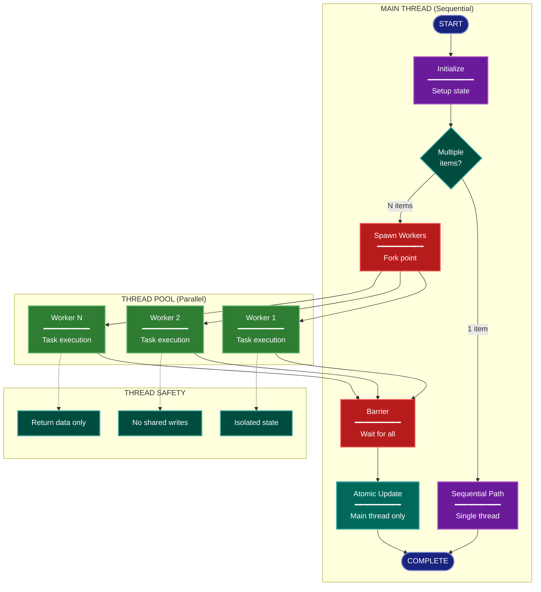

# Concurrency Architecture Lens

**Philosophical Mode:** Physiological
**Primary Question:** "How does parallelism work?"
**Focus:** Parallel Execution, Thread Pools, Synchronization, Barriers

## Arguments

`/autoskillit:arch-lens-concurrency [context_path]`

- **context_path** (optional) — Absolute path to a PR context file containing new files
  (★-prefixed) and modified files (●-prefixed) from the PR diff. When provided, read
  this file before beginning analysis and focus the diagram on the architectural areas
  affected by these specific files. When absent, explore the full CWD.

---

## When to Use

- Need to understand concurrent execution patterns
- Documenting thread pools and worker management
- Analyzing synchronization and thread safety
- User invokes `/autoskillit:arch-lens-concurrency` or `/autoskillit:make-arch-diag concurrency`

## Critical Constraints

**NEVER:**
- Fabricate, invent, or embellish information not supported by the available evidence or code.

- Do not litter the codebase with useless comments, TODO markers, or explanatory annotations — the skill output and diagram speak for ourselves
- Create files outside `{{AUTOSKILLIT_TEMP}}/arch-lens-concurrency/`
- Modify any source code files
- Conflate with general process flow (that's a different lens)
- Ignore thread safety implications
- Detach child delegations instead of joining them (joining every child is required)
- Run exploration leaves in the background
- Start independent child delegations sequentially

**ALWAYS:**
- Focus on PARALLEL execution specifically
- Show synchronization barriers and coordination
- Identify thread safety guarantees
- Document the concurrency MODEL used
- BEFORE creating any diagram, LOAD the `/autoskillit:mermaid` skill using the Skill tool - this is MANDATORY
- If the Skill tool cannot be used (disable-model-invocation) or refuses this invocation, do NOT proceed with diagram creation. Abort this step and omit the diagram from output.
- Write output to `{{AUTOSKILLIT_TEMP}}/arch-lens-concurrency/arch_diag_concurrency_{"{"}YYYY-MM-DD_HHMMSS{}}.md`
- After writing the file, emit the structured output token as **literal plain text** with no
  markdown formatting on the token name (the adjudicator performs a regex match):

  ```
  diagram_path = /absolute/path/to/{{AUTOSKILLIT_TEMP}}/arch-lens-concurrency/arch_diag_concurrency_{"{"}YYYY-MM-DD_HHMMSS{}}.md
  ```
- Start all independent child delegations before awaiting any result to maximize concurrency
- Use the registered exploration roles for all repository reads
- Dispatch exactly 6 exploration vectors through the deterministic router
- Route bounded declarative configuration, registry, generated-artifact, test, fixture, and consumer handoffs to `repository-impact-profiler` through the parent-owned plan
- Wait for every exploration result before mapping concurrency boundaries, evaluating thread safety, or creating the diagram
- Retain parent authority over concurrency and thread-safety judgments, Mermaid generation, and output writing


## Analysis Workflow

### Step 0: Read PR context (when provided)

If a `context_path` positional argument is present:
1. Read the file at `context_path`
2. Extract: new files list (★-prefixed), modified files list (●-prefixed)
3. Focus Step 1 exploration on the modules/components these files belong to
4. Apply ★ prefix on diagram nodes representing new files/components
5. Apply ● prefix on diagram nodes representing modified files/components

If no `context_path` is provided, skip this step and explore the full CWD in Step 1.

### Step 1: Launch 6 Routed Exploration Vectors (SINGLE MESSAGE)

Dispatch all ready, scope-disjoint vectors through the deterministic router in a single message before awaiting any result. Do not iterate across multiple turns.

Do not output any prose between subagent dispatches. Immediately proceed to the next tool call.

Dispatch exactly these six authored vectors under their registered role policies. Mixed code and declarative evidence remains one parent-owned plan; bounded profiler handoffs return to the originating vector and do not add graph dependencies.

<!-- autoskillit:exploration-vector id="concurrency-model" -->
1. **Concurrency Model** — Find the primary concurrency approach: threading, asyncio, multiprocessing, coroutines, goroutines, or executors. Trace definitions, imports, and calls; the parent determines the documented model.
<!-- /autoskillit:exploration-vector -->

<!-- autoskillit:exploration-vector id="worker-pools" -->
2. **Worker Pools** — Find thread or process pool construction, executors, worker limits, `max_workers`, and submission paths. Route declarative worker configuration through the parent to the profiler.
<!-- /autoskillit:exploration-vector -->

<!-- autoskillit:exploration-vector id="parallel-operations" -->
3. **Parallel Operations** — Find the work parallelized through map, submit, gather, pool, or equivalent calls and report the definitions and call paths involved.
<!-- /autoskillit:exploration-vector -->

<!-- autoskillit:exploration-vector id="synchronization-points" -->
4. **Synchronization Points** — Find barriers, result collection, waits, gathers, locks, semaphores, and other coordination calls, with evidence for each convergence point.
<!-- /autoskillit:exploration-vector -->

<!-- autoskillit:exploration-vector id="state-access" -->
5. **State Access** — Trace shared-state reads and writes plus Lock, RLock, Queue, thread-local, immutable, atomic, and mutex mechanisms. The parent evaluates safety and ownership.
<!-- /autoskillit:exploration-vector -->

<!-- autoskillit:exploration-vector id="sequential-boundaries" -->
6. **Sequential Boundaries** — Trace main-thread or process responsibilities, single-threaded calls, and atomic update paths that provide evidence for required serialization.
<!-- /autoskillit:exploration-vector -->

### Step 2: Map Concurrency Boundaries

Document:
- **Main Thread**: What runs sequentially
- **Worker Pool**: What runs in parallel
- **Barriers**: Where parallel work converges
- **Atomic Operations**: What requires exclusive access

**CRITICAL - Analyze Read/Write Direction:**
For EVERY concurrent component and shared resource:
- **Reads from shared state**: What data do workers READ?
- **Writes to shared state**: What data do workers WRITE?
- **Return values**: Do workers return data (read by main thread)?
- **Side effects**: Do workers write to storage directly?

Identify:
- Read-only access (safe for parallelism)
- Write access (needs synchronization)
- Worker isolation (no shared state during execution)

### Step 3: Identify Thread Safety

For each shared resource:
- How is it protected?
- Who can read/write?
- Are there race conditions?

### Step 4: Create the Diagram

Use flowchart with:

**Direction:** `TB` for spawn-barrier-collect pattern

**Subgraphs:**
- Main Thread (sequential operations)
- Thread/Process Pool (parallel workers)
- Subprocess/External (if spawned processes)
- Isolation (thread safety guarantees)

**Node Styling:**
- `terminal` class: Start/end points
- `phase` class: Sequential nodes
- `newComponent` class: Parallel workers (green)
- `detector` class: Spawn and barrier points
- `handler` class: Processing within workers
- `output` class: Atomic state updates
- `stateNode` class: Thread safety mechanisms

**Special Elements:**
- Show fork/join points clearly
- Use edge labels for conditions
- Group parallel workers visually

### Step 5: Write Output

Write the diagram to: `{{AUTOSKILLIT_TEMP}}/arch-lens-concurrency/arch_diag_concurrency_{YYYY-MM-DD_HHMMSS}.md` (relative to the current working directory)

After writing the diagram file, emit a structured output line:

> **IMPORTANT:** Emit the structured output tokens as **literal plain text with no
> markdown formatting on the token names**. Do not wrap token names in `**bold**`,
> `*italic*`, or any other markdown. Do not wrap the output block in a code fence.
> The adjudicator performs a regex match on the exact token name — decorators and
> code fences cause match failure.

```
diagram_path = {absolute_path_to_diagram_file}
```

---

## Output Template

```markdown
# Concurrency Diagram: {System Name}

**Lens:** Concurrency (Physiological)
**Question:** How does parallelism work?
**Date:** {YYYY-MM-DD}
**Scope:** {What was analyzed}

## Concurrency Model

| Aspect | Value | Notes |
|--------|-------|-------|
| Primary Model | {threading/asyncio/multiprocessing} | |
| Worker Pool Type | {ThreadPoolExecutor/etc} | |
| Max Workers | {count} | |
| Parallel Operations | {what is parallelized} | |

## Concurrency Diagram



**Color Legend:**
| Color | Category | Description |
|-------|----------|-------------|
| Dark Blue | Terminal | Start and end points |
| Purple | Sequential | Single-threaded nodes |
| Green | Workers | Parallel workers |
| Red | Synchronization | Spawn and barrier points |
| Dark Teal | Atomic | Main-thread-only state updates |
| Teal | Isolation | Thread safety guarantees |

## Concurrency Boundaries

| Component | Model | Synchronization |
|-----------|-------|-----------------|
| {component} | {single-threaded/parallel} | {mechanism} |

## Thread Safety Guarantees

- **Isolation**: {how workers are isolated}
- **State Access**: {who can modify shared state}
- **Barrier**: {how results are collected}
```

---

## Pre-Diagram Checklist

Before creating the diagram, verify:

- [ ] LOADED `/autoskillit:mermaid` skill using the Skill tool
- [ ] Using ONLY classDef styles from the mermaid skill (no invented colors)
- [ ] Diagram will include a color legend table

---

## Related Skills

- `/autoskillit:make-arch-diag` - Parent skill for lens selection
- `/autoskillit:mermaid` - MUST BE LOADED before creating diagram
- `/autoskillit:arch-lens-process-flow` - For general workflow view
- `/autoskillit:arch-lens-error-resilience` - For parallel failure handling
