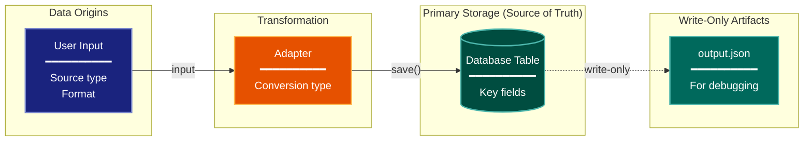

# Data Lineage Architecture Lens

**Philosophical Mode:** Data-Centric
**Primary Question:** "Where is the data?"
**Focus:** Information Flow, Transformations, Storage Locations, Format Conversions

## Arguments

`/autoskillit:arch-lens-data-lineage [context_path]`

- **context_path** (optional) — Absolute path to a PR context file containing new files
  (★-prefixed) and modified files (●-prefixed) from the PR diff. When provided, read
  this file before beginning analysis and focus the diagram on the architectural areas
  affected by these specific files. When absent, explore the full CWD.

---

## When to Use

- Need to understand how data flows through the system
- Documenting data transformations and conversions
- Identifying storage destinations and access patterns
- User invokes `/autoskillit:arch-lens-data-lineage` or `/autoskillit:make-arch-diag data`

## Critical Constraints

**NEVER:**
- Treat Related Skills as executable dependencies or invoke any cross-reference from that section; those entries are documentation-only and do not imply execution. Invoke only the required `/autoskillit:mermaid` skill; never invoke `/autoskillit:make-arch-diag`, another architecture lens, or any other cross-reference.
- Fabricate, invent, or embellish information not supported by the available evidence or code.

- Do not litter the codebase with useless comments, TODO markers, or explanatory annotations — the skill output and diagram speak for ourselves
- Create files outside `{{AUTOSKILLIT_TEMP}}/arch-lens-data-lineage/`
- Modify any source code files
- Focus on runtime behavior (that's process flow lens)
- Show static structure without data context
- Detach child delegations instead of joining them (joining every child is required)
- Run exploration leaves in the background
- Start independent child delegations sequentially

**ALWAYS:**
- Trace data from INPUT to STORAGE
- Show transformation stages and format changes
- Identify the single source of truth
- Distinguish read vs write operations
- BEFORE creating any diagram, LOAD the `/autoskillit:mermaid` skill using the Skill tool - this is MANDATORY
- If the Skill tool cannot be used (disable-model-invocation) or refuses this invocation, do NOT proceed with diagram creation. Abort this step and omit the diagram from output.
- Write output to `{{AUTOSKILLIT_TEMP}}/arch-lens-data-lineage/arch_diag_data_lineage_{"{"}YYYY-MM-DD_HHMMSS{}}.md`
- After writing the file, emit the structured output token as **literal plain text** with no
  markdown formatting on the token name (the adjudicator performs a regex match):

  ```
  diagram_path = /absolute/path/to/{{AUTOSKILLIT_TEMP}}/arch-lens-data-lineage/arch_diag_data_lineage_{"{"}YYYY-MM-DD_HHMMSS{}}.md
  ```
- Start all independent child delegations before awaiting any result to maximize concurrency
- Use the registered exploration roles for all repository reads
- Dispatch every exploration vector below through the deterministic router
- Route mixed semantic and declarative subfrontiers through the parent-owned plan; bounded handoffs return evidence to the originating vector without adding dependencies
- Wait for every exploration result before mapping data flow, identifying conversion boundaries, or creating the diagram
- Retain parent authority over lineage, source-of-truth, read/write, artifact, Mermaid, and output judgments


## Analysis Workflow

### Step 0: Read PR context (when provided)

If a `context_path` positional argument is present:
1. Read the file at `context_path`
2. Extract: new files list (★-prefixed), modified files list (●-prefixed)
3. Focus Step 1 exploration on the modules/components these files belong to
4. Apply ★ prefix on diagram nodes representing new files/components
5. Apply ● prefix on diagram nodes representing modified files/components

If no `context_path` is provided, skip this step and explore the full CWD in Step 1.

### Step 1: Launch the Routed Exploration Vectors (SINGLE MESSAGE)

Dispatch all ready, scope-disjoint vectors through the deterministic router in a single message before awaiting any result. Do not iterate across multiple turns.

Do not output any prose between subagent dispatches. Immediately proceed to the next tool call.

Dispatch every authored vector below under their registered role policies. The parent routes code definitions, calls, and control flow to the navigator and declarative schemas, configuration, generated artifacts, tests, fixtures, and consumers to the profiler.

<!-- autoskillit:exploration-vector id="data-origins-inputs" -->
1. **Data Origins (Inputs)** — Find user-input handling, external data sources, CLI arguments, API requests, file reads, imports, and ingestion call paths. The parent classifies the final origin categories.
<!-- /autoskillit:exploration-vector -->

<!-- autoskillit:exploration-vector id="transformation-stages" -->
2. **Transformation Stages** — Trace adapters, converters, transforms, parsers, serializers, `from_*`, `to_*`, mappings, and conversion calls with their inputs and outputs.
<!-- /autoskillit:exploration-vector -->

<!-- autoskillit:exploration-vector id="format-changes" -->
3. **Format Changes** — Trace schema models, type definitions, serialization, deserialization, and JSON, XML, protobuf, or other format boundaries. Route declarative schema evidence through the parent to the profiler.
<!-- /autoskillit:exploration-vector -->

<!-- autoskillit:exploration-vector id="storage-destinations" -->
4. **Storage Destinations** — Identify persistence declarations, database and file destinations, generated outputs, storage artifacts, and consumers. Route bounded `.save()`, `.create()`, `.write()`, and other operation call tracing through the parent to the navigator.
<!-- /autoskillit:exploration-vector -->

<!-- autoskillit:exploration-vector id="access-patterns" -->
5. **Access Patterns** — Trace retrieval code, queries, `.get()`, `.find()`, `.load()`, reads, and data-access-layer calls. Report evidence without deciding source-of-truth or lineage meaning.
<!-- /autoskillit:exploration-vector -->

### Step 2: Map Data Flow

Document the journey of key data entities:
- **Origin**: Where does it come from?
- **Transformations**: What changes happen?
- **Storage**: Where is it persisted?
- **Retrieval**: How is it accessed later?

**CRITICAL - Analyze Read/Write Direction:**
For EVERY storage location and data flow:
- **Read sources (inputs)**: Components that READ from this location
- **Write destinations (outputs)**: Components that WRITE to this location
- **Read-write (primary storage)**: Both read and written by the system
- **Write-only (artifacts)**: Written but NEVER read back by the system

Clearly distinguish:
- Primary storage (source of truth) - system reads AND writes
- Write-only artifacts (debugging, logging) - system writes but never reads back
- External inputs - system reads only

Use different arrow styles:
- Solid arrows for read/write primary storage
- Dashed arrows for write-only artifacts

### Step 3: Identify Conversion Boundaries

Find format changes:
- External format -> Internal format
- Internal format -> Database format
- Database format -> API response
- Note naming convention changes

### Step 4: Create the Diagram

Use flowchart with:

**Direction:** `LR` (left-to-right) for data flow, or `TB` for hierarchical

**Subgraphs for Stages:**
- Input/Origins
- Transformation/Processing
- Storage (primary)
- Artifacts (secondary/write-only)
- External Sync (if applicable)

**Node Styling:**
- `cli` class: Data origins, user input
- `handler` class: Transformation, adapters
- `stateNode` class: Database tables, primary storage
- `output` class: Write-only artifacts, files
- `integration` class: External sync, APIs

**Connection Types:**
- Solid arrows for primary data flow
- Dashed arrows for write-only/secondary
- Label with operation names

**Database Nodes:**
- Use cylinder shape: `[(Label)]`
- Show table relationships

### Step 5: Write Output

Write the diagram to: `{{AUTOSKILLIT_TEMP}}/arch-lens-data-lineage/arch_diag_data_lineage_{YYYY-MM-DD_HHMMSS}.md` (relative to the current working directory)

After writing the diagram file, emit a structured output line:

> **IMPORTANT:** Emit the structured output tokens as **literal plain text with no
> markdown formatting on the token names**. Do not wrap token names in `**bold**`,
> `*italic*`, or any other markdown. Do not wrap the output block in a code fence.
> The adjudicator performs a regex match on the exact token name — decorators and
> code fences cause match failure.

```
diagram_path = {absolute_path_to_diagram_file}
```

---

## Output Template

```markdown
# Data Lineage Diagram: {System Name}

**Lens:** Data Lineage (Data-Centric)
**Question:** Where is the data?
**Date:** {YYYY-MM-DD}
**Scope:** {What was analyzed}

## Data Flow Overview

| Stage | Format | Key Transformation |
|-------|--------|-------------------|
| Input | {format} | {description} |
| Processing | {format} | {description} |
| Storage | {format} | {description} |

## Lineage Diagram



**Color Legend:**
| Color | Category | Description |
|-------|----------|-------------|
| Dark Blue | Input | Data origins (user, external) |
| Orange | Transform | Format conversion and adapters |
| Teal | Storage | Primary storage (source of truth) |
| Dark Teal | Artifacts | Write-only outputs |
| Red | Sync | External sync services |

## Data Transformation Summary

| Stage | Format | Key Conversion |
|-------|--------|----------------|
| {stage} | {format} | {conversion} |

## Storage Destinations

| Entity | Primary Storage | Secondary | Access Pattern |
|--------|-----------------|-----------|----------------|
| {entity} | {location} | {artifact} | {how accessed} |

## Critical Design Principle

> **Source of Truth**: {e.g., "Database is single source of truth. File outputs are write-only."}
```

---

## Pre-Diagram Checklist

Before creating the diagram, verify:

- [ ] LOADED `/autoskillit:mermaid` skill using the Skill tool
- [ ] Using ONLY classDef styles from the mermaid skill (no invented colors)
- [ ] Diagram will include a color legend table

---

## Related Skills

- `/autoskillit:make-arch-diag` - Parent skill for lens selection
- `/autoskillit:mermaid` - MUST BE LOADED before creating diagram
- `/autoskillit:arch-lens-c4-container` - For container-level storage view
