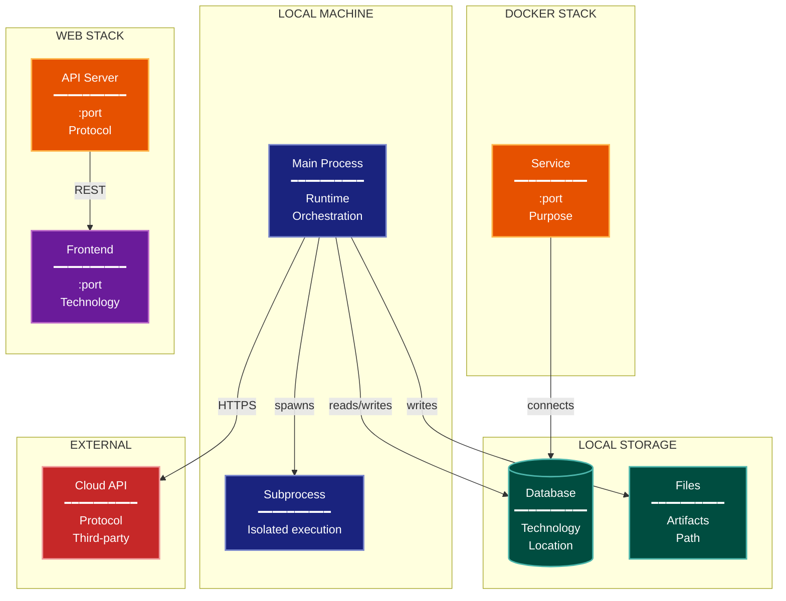

# Deployment/Physical Architecture Lens

**Philosophical Mode:** Physical
**Primary Question:** "Where does it run?"
**Focus:** Infrastructure Topology, Process Boundaries, Data Storage Locations, Network Communication

## Arguments

`/autoskillit:arch-lens-deployment [context_path]`

- **context_path** (optional) — Absolute path to a PR context file containing new files
  (★-prefixed) and modified files (●-prefixed) from the PR diff. When provided, read
  this file before beginning analysis and focus the diagram on the architectural areas
  affected by these specific files. When absent, explore the full CWD.

---

## When to Use

- Need to understand physical deployment
- Documenting infrastructure and processes
- Analyzing where components execute
- User invokes `/autoskillit:arch-lens-deployment` or `/autoskillit:make-arch-diag deployment`

## Critical Constraints

**NEVER:**
- Treat Related Skills as executable dependencies or invoke any cross-reference from that section; those entries are documentation-only and do not imply execution. Invoke only the required `/autoskillit:mermaid` skill; never invoke `/autoskillit:make-arch-diag`, another architecture lens, or any other cross-reference.
- Fabricate, invent, or embellish information not supported by the available evidence or code.

- Do not litter the codebase with useless comments, TODO markers, or explanatory annotations — the skill output and diagram speak for ourselves
- Create files outside `{{AUTOSKILLIT_TEMP}}/arch-lens-deployment/`
- Modify any source code files
- Include code-level details
- Show internal logic
- Detach child delegations instead of joining them (joining every child is required)
- Run exploration leaves in the background
- Start independent child delegations sequentially

**ALWAYS:**
- Focus on PHYSICAL deployment
- Show process boundaries
- Include network/communication protocols
- Document storage locations
- BEFORE creating any diagram, LOAD the `/autoskillit:mermaid` skill using the Skill tool - this is MANDATORY
- If the Skill tool cannot be used (disable-model-invocation) or refuses this invocation, do NOT proceed with diagram creation. Abort this step and omit the diagram from output.
- Write output to `{{AUTOSKILLIT_TEMP}}/arch-lens-deployment/arch_diag_deployment_{"{"}YYYY-MM-DD_HHMMSS{}}.md`
- After writing the file, emit the structured output token as **literal plain text** with no
  markdown formatting on the token name (the adjudicator performs a regex match):

  ```
  diagram_path = /absolute/path/to/{{AUTOSKILLIT_TEMP}}/arch-lens-deployment/arch_diag_deployment_{"{"}YYYY-MM-DD_HHMMSS{}}.md
  ```
- Start all independent child delegations before awaiting any result to maximize concurrency
- Use the registered exploration roles for all repository reads
- Dispatch every exploration vector below through the deterministic router
- Route mixed semantic and declarative deployment subfrontiers through the parent-owned plan; bounded handoffs return evidence to the originating vector without adding dependencies
- Wait for every exploration result before mapping physical topology, identifying communication paths, or creating the diagram
- Retain parent authority over deployment boundaries, locations, protocols, read/write classification, Mermaid generation, and output writing


## Analysis Workflow

### Step 0: Read PR context (when provided)

If a `context_path` positional argument is present:
1. Read the file at `context_path`
2. Extract: new files list (★-prefixed), modified files list (●-prefixed)
3. Focus Step 1 exploration on the modules/components these files belong to
4. Apply ★ prefix on diagram nodes representing new files/components
5. Apply ● prefix on diagram nodes representing modified files/components

If no `context_path` is provided, skip this step and explore the full CWD in Step 1.

### Step 1: Launch the Routed Exploration Vectors (SINGLE MESSAGE)

Dispatch all ready, scope-disjoint vectors through the deterministic router in a single message before awaiting any result. Do not iterate across multiple turns.

Do not output any prose between subagent dispatches. Immediately proceed to the next tool call.

Dispatch every authored vector below under their registered role policies. The parent routes code definitions, imports, calls, and control flow to the navigator and deployment manifests, configuration, registries, generated artifacts, tests, fixtures, and consumers to the profiler.

<!-- autoskillit:exploration-vector id="process-boundaries" -->
1. **Process Boundaries** — Find main process entry points, subprocess creation, process spawning, daemon processes, and their call paths. Route declarative entry-point and process configuration through the parent to the profiler.
<!-- /autoskillit:exploration-vector -->

<!-- autoskillit:exploration-vector id="container-docker" -->
2. **Container/Docker** — Find Dockerfiles, compose files, Kubernetes manifests, container definitions, images, services, ports, volumes, generated artifacts, and consumers.
<!-- /autoskillit:exploration-vector -->

<!-- autoskillit:exploration-vector id="local-storage" -->
3. **Local Storage** — Trace filesystem and database clients, reads, writes, connections, and access calls. Route data directories, database paths, storage volumes, persistence declarations, and generated outputs through the parent to the profiler.
<!-- /autoskillit:exploration-vector -->

<!-- autoskillit:exploration-vector id="network-services" -->
4. **Network Services** — Trace service definitions, servers, APIs, endpoints, listeners, sockets, bind and listen calls, ports, and protocols. Route declarative port or host configuration through the parent to the profiler.
<!-- /autoskillit:exploration-vector -->

<!-- autoskillit:exploration-vector id="external-services" -->
5. **External Services** — Trace external API clients and calls, cloud-service access, imports, authentication, and third-party integrations. The parent determines external boundaries and deployment meaning.
<!-- /autoskillit:exploration-vector -->

<!-- autoskillit:exploration-vector id="web-frontend" -->
6. **Web/Frontend** — Identify frontend and web-server manifests, build configuration, static assets, frontend outputs, serving declarations, CDN configuration, and consumers. Route bounded serving-call traces through the parent to the navigator.
<!-- /autoskillit:exploration-vector -->

### Step 2: Map Physical Topology

| Component | Location | Technology | Port/Protocol |
|-----------|----------|------------|---------------|
| {name} | {where} | {tech} | {port/protocol} |

**CRITICAL - Analyze Read/Write Direction:**
For EVERY process and storage location:
- **Reads from**: What does this process READ? (files, databases, APIs)
- **Writes to**: What does this process WRITE? (files, databases, APIs)
- **Network direction**: Client->Server or bidirectional?

For storage locations:
- **Read/write storage**: Process both reads and writes (databases, state files)
- **Write-only storage**: Process writes, humans or other systems read (logs, artifacts)
- **Read-only sources**: Process reads, doesn't modify (config, external APIs)

Label all connections with direction (reads, writes, or both)

### Step 3: Identify Communication Paths

- Process-to-process (IPC, subprocess)
- Network (HTTP, WebSocket, gRPC)
- File system (shared files)
- Database (connections)

### Step 4: Create the Diagram

Use flowchart with:

**Direction:** `TB` for infrastructure layers

**Subgraphs by Physical Location:**
- Developer Machine (local processes)
- Local Storage (files, DBs)
- Docker Stack (if containerized)
- Web Stack (if applicable)
- External Services (cloud, APIs)

**Node Styling:**
- `cli` class: Main processes
- `stateNode` class: Local storage, databases
- `output` class: File artifacts
- `handler` class: Services, APIs
- `phase` class: Frontend, web UI
- `integration` class: External services

**Connection Labels:**
- Show protocols (HTTP, subprocess, file)
- Show ports where relevant

### Step 5: Write Output

Write the diagram to: `{{AUTOSKILLIT_TEMP}}/arch-lens-deployment/arch_diag_deployment_{YYYY-MM-DD_HHMMSS}.md` (relative to the current working directory)

After writing the diagram file, emit a structured output line:

> **IMPORTANT:** Emit the structured output tokens as **literal plain text with no
> markdown formatting on the token names**. Do not wrap token names in `**bold**`,
> `*italic*`, or any other markdown. Do not wrap the output block in a code fence.
> The adjudicator performs a regex match on the exact token name — decorators and
> code fences cause match failure.

```
diagram_path = {absolute_path_to_diagram_file}
```

---

## Output Template

```markdown
# Deployment Diagram: {System Name}

**Lens:** Deployment/Physical
**Question:** Where does it run?
**Date:** {YYYY-MM-DD}
**Scope:** {What was analyzed}

## Deployment Topology

| Component | Port | Technology | Purpose |
|-----------|------|------------|---------|
| {name} | {port} | {tech} | {purpose} |

## Deployment Diagram



**Color Legend:**
| Color | Category | Description |
|-------|----------|-------------|
| Dark Blue | Processes | Local CLI and subprocess |
| Teal | Storage | Databases and file storage |
| Orange | Services | Backend services and APIs |
| Purple | Frontend | Web UI |
| Red | External | External/cloud services |

## Communication Protocols

| From | To | Protocol | Purpose |
|------|-----|----------|---------|
| {source} | {target} | {protocol} | {purpose} |

## Storage Locations

| Data | Location | Technology |
|------|----------|------------|
| {data} | {path} | {tech} |
```

---

## Pre-Diagram Checklist

Before creating the diagram, verify:

- [ ] LOADED `/autoskillit:mermaid` skill using the Skill tool
- [ ] Using ONLY classDef styles from the mermaid skill (no invented colors)
- [ ] Diagram will include a color legend table

---

## Related Skills

- `/autoskillit:make-arch-diag` - Parent skill for lens selection
- `/autoskillit:mermaid` - MUST BE LOADED before creating diagram
- `/autoskillit:arch-lens-c4-container` - For container-level view
