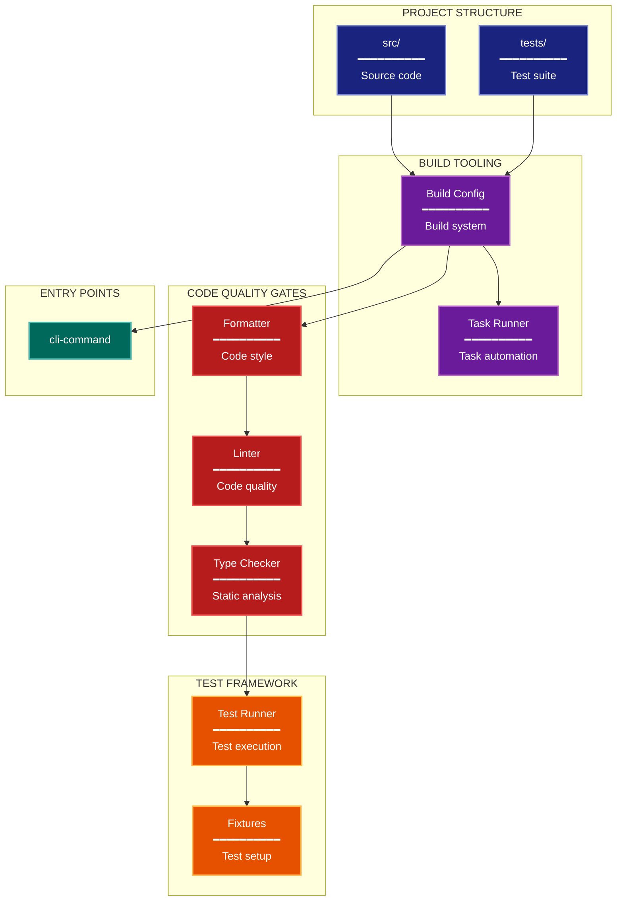

# Development Architecture Lens

**Philosophical Mode:** Development
**Primary Question:** "How is it built and tested?"
**Focus:** Project Structure, Build Tools, Quality Gates, Test Framework

## Arguments

`/autoskillit:arch-lens-development [context_path]`

- **context_path** (optional) — Absolute path to a PR context file containing new files
  (★-prefixed) and modified files (●-prefixed) from the PR diff. When provided, read
  this file before beginning analysis and focus the diagram on the architectural areas
  affected by these specific files. When absent, explore the full CWD.

---

## When to Use

- Need to understand developer experience
- Documenting build and test infrastructure
- Analyzing code quality gates
- User invokes `/autoskillit:arch-lens-development` or `/autoskillit:make-arch-diag development`

## Critical Constraints

**NEVER:**
- Fabricate, invent, or embellish information not supported by the available evidence or code.

- Do not litter the codebase with useless comments, TODO markers, or explanatory annotations — the skill output and diagram speak for ourselves
- Create files outside `{{AUTOSKILLIT_TEMP}}/arch-lens-development/`
- Modify any source code files
- Include runtime architecture details
- Show business logic
- Detach child delegations instead of joining them (joining every child is required)
- Run exploration leaves in the background
- Start independent child delegations sequentially
- Infer code ownership, maintainers, or team responsibility from repository structure

**ALWAYS:**
- Focus on BUILD and TEST infrastructure
- Show quality gate pipeline
- Document test framework setup
- Include entry points
- BEFORE creating any diagram, LOAD the `/autoskillit:mermaid` skill using the Skill tool - this is MANDATORY
- If the Skill tool cannot be used (disable-model-invocation) or refuses this invocation, do NOT proceed with diagram creation. Abort this step and omit the diagram from output.
- Write output to `{{AUTOSKILLIT_TEMP}}/arch-lens-development/arch_diag_development_{"{"}YYYY-MM-DD_HHMMSS{}}.md`
- After writing the file, emit the structured output token as **literal plain text** with no
  markdown formatting on the token name (the adjudicator performs a regex match):

  ```
  diagram_path = /absolute/path/to/{{AUTOSKILLIT_TEMP}}/arch-lens-development/arch_diag_development_{"{"}YYYY-MM-DD_HHMMSS{}}.md
  ```
- Start all independent child delegations before awaiting any result to maximize concurrency
- Use the registered exploration roles for all repository reads
- Dispatch exactly 7 exploration vectors through the deterministic router
- Allow parent-boundary handoff of project metadata and declarative entry-point registration from navigator vectors to `repository-impact-profiler` without creating extra vectors
- Wait for every exploration result before mapping the quality pipeline, calculating project metrics, or creating the diagram
- Retain parent authority over development-workflow and diagram synthesis


## Analysis Workflow

### Step 0: Read PR context (when provided)

If a `context_path` positional argument is present:
1. Read the file at `context_path`
2. Extract: new files list (★-prefixed), modified files list (●-prefixed)
3. Focus Step 1 exploration on the modules/components these files belong to
4. Apply ★ prefix on diagram nodes representing new files/components
5. Apply ● prefix on diagram nodes representing modified files/components

If no `context_path` is provided, skip this step and explore the full CWD in Step 1.

### Step 1: Launch 7 Routed Exploration Vectors (SINGLE MESSAGE)

Dispatch all ready, scope-disjoint vectors through the deterministic router in a single message before awaiting any result. Do not iterate across multiple turns.

Do not output any prose between subagent dispatches. Immediately proceed to the next tool call.

Dispatch exactly these seven vectors under their registered role policies. The parent/router may hand project manifests and declarative entry-point registrations from the two navigator vectors to `repository-impact-profiler`; this does not create another vector. No vector may infer code ownership.

<!-- autoskillit:exploration-vector id="project-structure" -->
1. **Project structure** — Trace top-level code organization, module and package boundaries, imports, and code-defined layout. Include bounded manifest or package-declaration handoffs for profiler evidence; report structure without inferring ownership.
<!-- /autoskillit:exploration-vector -->

<!-- autoskillit:exploration-vector id="build-tooling" -->
2. **Build tooling** — Identify build configuration, package managers, build backends, makefiles, task runners, generated artifacts, and the workflows or files they affect.
<!-- /autoskillit:exploration-vector -->

<!-- autoskillit:exploration-vector id="linting-formatting" -->
3. **Linting and formatting** — Identify linter, formatter, pre-commit, and code-quality declarations, their configured scope, and workflow consumers.
<!-- /autoskillit:exploration-vector -->

<!-- autoskillit:exploration-vector id="type-checking" -->
4. **Type checking** — Identify type-checker and static-analysis configuration, declared strictness, included or excluded paths, and workflow consumers.
<!-- /autoskillit:exploration-vector -->

<!-- autoskillit:exploration-vector id="test-framework" -->
5. **Test framework** — Identify test configuration, directories, runners, naming patterns, fixtures, coverage settings, and build or CI consumers.
<!-- /autoskillit:exploration-vector -->

<!-- autoskillit:exploration-vector id="ci-cd" -->
6. **CI/CD (if present)** — Identify CI/CD configuration, workflow stages, invoked quality commands, generated or published artifacts, triggers, and check consumers. Report absence as evidence rather than inventing a pipeline.
<!-- /autoskillit:exploration-vector -->

<!-- autoskillit:exploration-vector id="entry-points" -->
7. **Entry points** — Trace CLI and binary command definitions, dispatch calls, and invocation paths. Include bounded declarative console-script or package-registration handoffs for profiler evidence; do not infer ownership from entry-point placement.
<!-- /autoskillit:exploration-vector -->

### Step 2: Map Quality Pipeline

Document the code quality pipeline:
```
Code -> Format -> Lint -> Type Check -> Test -> Commit
```

**CRITICAL - Analyze Read/Write Direction:**
For EVERY build/test component:
- **Inputs (reads)**: What files/config does this tool READ?
- **Outputs (writes)**: What does this tool WRITE (reports, modified files)?
- **Side effects**: Does it modify source files or just report?

Distinguish:
- Tools that READ and MODIFY code (formatters)
- Tools that READ and REPORT only (linters, type checkers)
- Tools that READ code and WRITE artifacts (test output files)
- Config files (READ by tools, not written by build process)

### Step 3: Count Project Metrics

| Metric | Value |
|--------|-------|
| Source Files | N |
| Test Files | N |
| Dependencies | N |
| Entry Points | N |

### Step 4: Create the Diagram

Use flowchart with:

**Direction:** `TB` for pipeline flow

**Subgraphs:**
- Project Structure (directories)
- Build Tools (packaging)
- Quality Gates (linting, types)
- Test Framework (test runner, etc)
- Entry Points (CLI commands)

**Node Styling:**
- `cli` class: Project structure, directories
- `phase` class: Build configuration
- `detector` class: Quality gates (linting, typing)
- `handler` class: Test framework
- `output` class: Entry points, outputs

**Show Pipeline Flow:**
- Code through quality gates
- Build to entry points

### Step 5: Write Output

Write the diagram to: `{{AUTOSKILLIT_TEMP}}/arch-lens-development/arch_diag_development_{YYYY-MM-DD_HHMMSS}.md` (relative to the current working directory)

After writing the diagram file, emit a structured output line:

> **IMPORTANT:** Emit the structured output tokens as **literal plain text with no
> markdown formatting on the token names**. Do not wrap token names in `**bold**`,
> `*italic*`, or any other markdown. Do not wrap the output block in a code fence.
> The adjudicator performs a regex match on the exact token name — decorators and
> code fences cause match failure.

```
diagram_path = {absolute_path_to_diagram_file}
```

---

## Output Template

```markdown
# Development Diagram: {Project Name}

**Lens:** Development (Build & Test)
**Question:** How is it built and tested?
**Date:** {YYYY-MM-DD}
**Scope:** {What was analyzed}

## Project Metrics

| Metric | Value |
|--------|-------|
| Source Directories | {count} |
| Test Files | {count} |
| Dependencies | {count} |
| Entry Points | {count} |

## Development Diagram



**Color Legend:**
| Color | Category | Description |
|-------|----------|-------------|
| Dark Blue | Structure | Project directories |
| Purple | Build | Configuration and automation |
| Red | Quality | Linters and type checkers |
| Orange | Testing | Test framework and fixtures |
| Dark Teal | Entry Points | CLI commands |

## Development Workflow

```
Code -> format -> lint -> type-check -> test -> commit
```

## Pre-commit Hooks

| Hook | Purpose |
|------|---------|
| {hook} | {purpose} |

## Entry Points

| Command | Module | Purpose |
|---------|--------|---------|
| {command} | {module} | {purpose} |
```

---

## Pre-Diagram Checklist

Before creating the diagram, verify:

- [ ] LOADED `/autoskillit:mermaid` skill using the Skill tool
- [ ] Using ONLY classDef styles from the mermaid skill (no invented colors)
- [ ] Diagram will include a color legend table

---

## Related Skills

- `/autoskillit:make-arch-diag` - Parent skill for lens selection
- `/autoskillit:mermaid` - MUST BE LOADED before creating diagram
