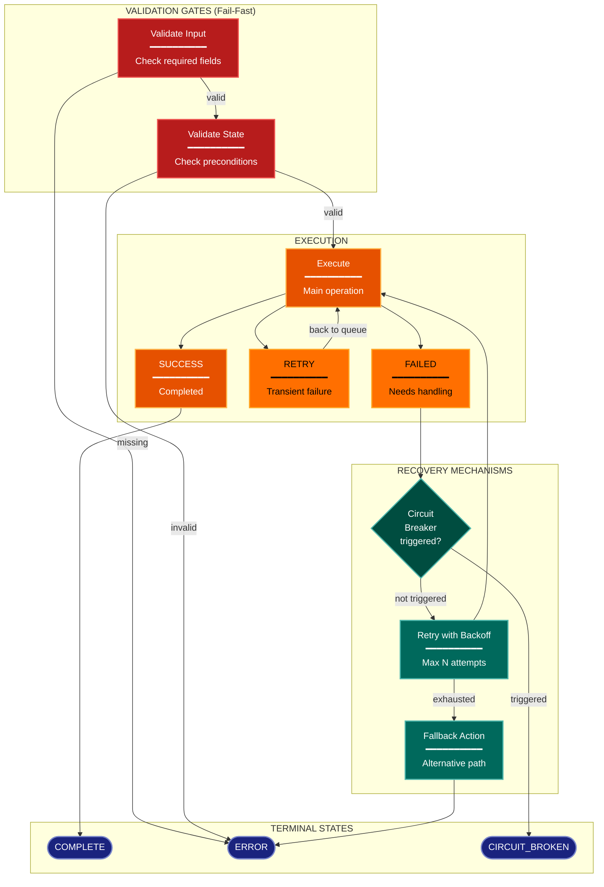

# Error/Resilience Architecture Lens

> **Preflight:** Before acting on any `exploration-vector` directive below, call `enable_exploration` to establish read-only broker authority for this session; the vectors below assume broker access has already been granted.

**Philosophical Mode:** Diagnostic
**Primary Question:** "How are failures handled?"
**Focus:** Error Propagation, Recovery Mechanisms, Circuit Breakers, Validation Gates

## Arguments

`/autoskillit:arch-lens-error-resilience [context_path]`

- **context_path** (optional) — Absolute path to a PR context file containing new files
  (★-prefixed) and modified files (●-prefixed) from the PR diff. When provided, read
  this file before beginning analysis and focus the diagram on the architectural areas
  affected by these specific files. When absent, explore the full CWD.

---

## When to Use

- Need to understand error handling architecture
- Documenting recovery and retry mechanisms
- Analyzing validation gates and circuit breakers
- User invokes `/autoskillit:arch-lens-error-resilience` or `/autoskillit:make-arch-diag error`

## Critical Constraints

**NEVER:**
- Treat Related Skills as executable dependencies or invoke any cross-reference from that section; those entries are documentation-only and do not imply execution. Invoke only the required `/autoskillit:mermaid` skill; never invoke `/autoskillit:make-arch-diag`, another architecture lens, or any other cross-reference.
- Fabricate, invent, or embellish information not supported by the available evidence or code.

- Do not litter the codebase with useless comments, TODO markers, or explanatory annotations — the skill output and diagram speak for ourselves
- Create files outside `{{AUTOSKILLIT_TEMP}}/arch-lens-error-resilience/`
- Modify any source code files
- Show happy path details (that's process flow lens)
- Ignore validation and fail-fast patterns
- Detach child delegations instead of joining them (joining every child is required)
- Start independent child delegations sequentially
- Let an exploration vector judge resilience effectiveness, select recovery policy, map the final error paths, or create the diagram

**ALWAYS:**
- Focus on FAILURE paths and recovery
- Show validation gates and their failure modes
- Document retry limits and circuit breakers
- Include exception hierarchy if present
- BEFORE creating any diagram, LOAD the `/autoskillit:mermaid` skill using the Skill tool - this is MANDATORY
- If the Skill tool cannot be used (disable-model-invocation) or refuses this invocation, do NOT proceed with diagram creation. Abort this step and omit the diagram from output.
- Write output to `{{AUTOSKILLIT_TEMP}}/arch-lens-error-resilience/arch_diag_error_resilience_{"{"}YYYY-MM-DD_HHMMSS{}}.md`
- After writing the file, emit the structured output token as **literal plain text** with no
  markdown formatting on the token name (the adjudicator performs a regex match):

  ```
  diagram_path = /absolute/path/to/{{AUTOSKILLIT_TEMP}}/arch-lens-error-resilience/arch_diag_error_resilience_{"{"}YYYY-MM-DD_HHMMSS{}}.md
  ```
- Start all independent child delegations before awaiting any result to maximize concurrency
- Use the registered exploration roles for all repository reads
- Dispatch every exploration vector below through the deterministic router
- Allow parent-boundary handoff of retry-policy and circuit-breaker configuration from navigator vectors to `repository-impact-profiler` without creating extra vectors
- Wait for every exploration result before mapping error paths, documenting recovery mechanisms, or creating the diagram
- Retain parent authority over resilience hypotheses, judgments, Steps 2+, and diagram synthesis


## Analysis Workflow

### Step 0: Read PR context (when provided)

If a `context_path` positional argument is present:
1. Read the file at `context_path`
2. Extract: new files list (★-prefixed), modified files list (●-prefixed)
3. Focus Step 1 exploration on the modules/components these files belong to
4. Apply ★ prefix on diagram nodes representing new files/components
5. Apply ● prefix on diagram nodes representing modified files/components

If no `context_path` is provided, skip this step and explore the full CWD in Step 1.

### Step 1: Launch the Routed Exploration Vectors (SINGLE MESSAGE)

Dispatch all ready, scope-disjoint vectors through the deterministic router in a single message before awaiting any result. Do not iterate across multiple turns.

Do not output any prose between subagent dispatches. Immediately proceed to the next tool call.

Dispatch every vector below under their registered role policies. The parent/router may hand declarative retry-policy or circuit-breaker configuration to `repository-impact-profiler`; this does not create another vector.

<!-- autoskillit:exploration-vector id="exception-hierarchy" -->
1. **Exception Hierarchy**
- Find custom exception classes
- Map inheritance relationships
- Look for: Exception, Error, raise, error classes, custom exceptions
<!-- /autoskillit:exploration-vector -->

<!-- autoskillit:exploration-vector id="validation-gates" -->
2. **Validation Gates**
- Find validation/guard functions
- Identify fail-fast patterns
- Look for: validate_*, check_*, assert, guard, gate, precondition checks
<!-- /autoskillit:exploration-vector -->

<!-- autoskillit:exploration-vector id="error-detection" -->
3. **Error Detection**
- Find error detection points
- Identify how failures are recognized
- Look for: try/except, catch, on_error, handle_error, error handling
<!-- /autoskillit:exploration-vector -->

<!-- autoskillit:exploration-vector id="recovery-mechanisms" -->
4. **Recovery Mechanisms**
- Find retry logic
- Identify fallback strategies
- Look for: retry, backoff, attempt, max_retries, retry policies
<!-- /autoskillit:exploration-vector -->

<!-- autoskillit:exploration-vector id="circuit-breakers" -->
5. **Circuit Breakers**
- Find patterns that prevent infinite retries
- Identify failure thresholds
- Look for: circuit, breaker, max_failures, trip, failure thresholds
<!-- /autoskillit:exploration-vector -->

<!-- autoskillit:exploration-vector id="error-routing" -->
6. **Error Routing**
- Find how errors are propagated
- Identify error terminal states
- Look for: raise, return Error, error node, ERROR state
<!-- /autoskillit:exploration-vector -->

### Step 2: Map Error Paths

For each major operation, document:
- **Success Path**: Normal completion
- **Retry Path**: Transient failure recovery
- **Failure Path**: Permanent failure handling
- **Circuit Break Path**: Threshold exceeded

**CRITICAL - Analyze Read/Write Direction:**
For EVERY error handling component:
- **Error context capture**: What data is READ to build error context?
- **Error logging**: Where are errors WRITTEN (logs, database, files)?
- **State updates**: What state is WRITTEN on failure?
- **Recovery reads**: What data is READ during recovery?

Distinguish:
- Error logs (write-only, never read back for logic)
- Failure context in database (may be read for retry/debugging)
- Debug artifacts (write-only diagnostics)

### Step 3: Document Recovery Mechanisms

| Mechanism | Trigger | Action | Limit |
|-----------|---------|--------|-------|
| Retry | Transient error | Repeat operation | max N |
| Fallback | Specific error | Alternative action | - |
| Circuit Breaker | Too many failures | Stop retrying | threshold |

### Step 4: Create the Diagram

Use flowchart with:

**Direction:** `TB` for error flow hierarchy

**Subgraphs:**
- Execution (normal operation)
- Validation Gates (fail-fast checks)
- Error Handling (detection and routing)
- Recovery (retry, fallback)
- Terminals (success, failure states)

**Node Styling:**
- `handler` class: Execution nodes
- `detector` class: Validation gates, error detection
- `gap` class: Failed/error state (yellow warning)
- `stateNode` class: Decision points, circuit breaker
- `output` class: Recovery actions
- `terminal` class: Final states (success, error)

**Connection Types:**
- Solid: Normal flow
- Edge labels: Conditions, error types
- Show loops for retry mechanisms

### Step 5: Write Output

Write the diagram to: `{{AUTOSKILLIT_TEMP}}/arch-lens-error-resilience/arch_diag_error_resilience_{YYYY-MM-DD_HHMMSS}.md` (relative to the current working directory)

After writing the diagram file, emit a structured output line:

> **IMPORTANT:** Emit the structured output tokens as **literal plain text with no
> markdown formatting on the token names**. Do not wrap token names in `**bold**`,
> `*italic*`, or any other markdown. Do not wrap the output block in a code fence.
> The adjudicator performs a regex match on the exact token name — decorators and
> code fences cause match failure.

```
diagram_path = {absolute_path_to_diagram_file}
```

---

## Output Template

```markdown
# Error/Resilience Diagram: {System Name}

**Lens:** Error/Resilience (Diagnostic)
**Question:** How are failures handled?
**Date:** {YYYY-MM-DD}
**Scope:** {What was analyzed}

## Exception Hierarchy

```
BaseError
├── ValidationError
├── ProcessingError
│   └── RetryableError
└── FatalError
```

## Resilience Diagram



**Color Legend:**
| Color | Category | Description |
|-------|----------|-------------|
| Orange | Execution | Normal operation and success |
| Yellow | Failed | Failure states requiring handling |
| Red | Gates | Validation gates (fail-fast) |
| Dark Teal | Recovery | Retry and fallback mechanisms |
| Teal | Circuit | Circuit breaker decisions |
| Dark Blue | Terminal | Final states |

## Recovery Mechanisms

| Mechanism | Trigger | Action | Max Attempts |
|-----------|---------|--------|--------------|
| {name} | {condition} | {what happens} | {limit} |

## Validation Gates

| Gate | Checks | Failure Mode |
|------|--------|--------------|
| {name} | {what validated} | {error raised} |
```

---

## Pre-Diagram Checklist

Before creating the diagram, verify:

- [ ] LOADED `/autoskillit:mermaid` skill using the Skill tool
- [ ] Using ONLY classDef styles from the mermaid skill (no invented colors)
- [ ] Diagram will include a color legend table

---

## Related Skills

- `/autoskillit:make-arch-diag` - Parent skill for lens selection
- `/autoskillit:mermaid` - MUST BE LOADED before creating diagram
- `/autoskillit:arch-lens-process-flow` - For normal flow view
- `/autoskillit:arch-lens-concurrency` - For parallel failure handling
