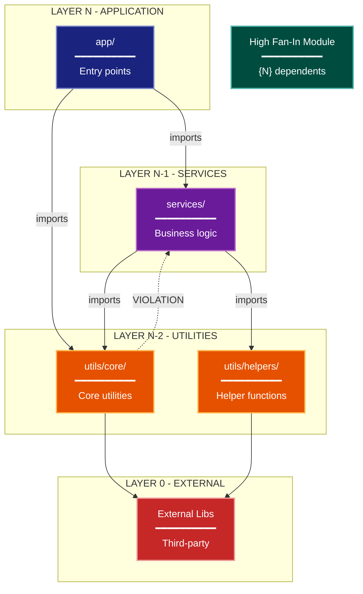

# Module Dependency Architecture Lens

**Philosophical Mode:** Structural
**Primary Question:** "How are modules coupled?"
**Focus:** Package Dependencies, Layering, Coupling Patterns, Fan-In/Fan-Out

## Arguments

`/autoskillit:arch-lens-module-dependency [context_path]`

- **context_path** (optional) — Absolute path to a PR context file containing new files
  (★-prefixed) and modified files (●-prefixed) from the PR diff. When provided, read
  this file before beginning analysis and focus the diagram on the architectural areas
  affected by these specific files. When absent, explore the full CWD.

---

## When to Use

- Need to understand module coupling and dependencies
- Analyzing architectural layering violations
- Identifying high fan-in modules (stability concerns)
- User invokes `/autoskillit:arch-lens-module-dependency` or `/autoskillit:make-arch-diag dependency`

## Critical Constraints

**NEVER:**
- Treat Related Skills as executable dependencies or invoke any cross-reference from that section; those entries are documentation-only and do not imply execution. Invoke only the required `/autoskillit:mermaid` skill; never invoke `/autoskillit:make-arch-diag`, another architecture lens, or any other cross-reference.
- Fabricate, invent, or embellish information not supported by the available evidence or code.

- Do not litter the codebase with useless comments, TODO markers, or explanatory annotations — the skill output and diagram speak for ourselves
- Create files outside `{{AUTOSKILLIT_TEMP}}/arch-lens-module-dependency/`
- Modify any source code files
- Include runtime behavior details
- Show external system integrations in detail
- Detach child delegations instead of joining them (joining every child is required)
- Run exploration leaves in the background
- Start independent child delegations sequentially

**ALWAYS:**
- Focus on IMPORT relationships between modules
- Identify layering and valid dependency directions
- Flag circular dependencies and violations
- Calculate fan-in for key modules
- BEFORE creating any diagram, LOAD the `/autoskillit:mermaid` skill using the Skill tool - this is MANDATORY
- If the Skill tool cannot be used (disable-model-invocation) or refuses this invocation, do NOT proceed with diagram creation. Abort this step and omit the diagram from output.
- Write output to `{{AUTOSKILLIT_TEMP}}/arch-lens-module-dependency/arch_diag_module_dependency_{"{"}YYYY-MM-DD_HHMMSS{}}.md`
- After writing the file, emit the structured output token as **literal plain text** with no
  markdown formatting on the token name (the adjudicator performs a regex match):

  ```
  diagram_path = /absolute/path/to/{{AUTOSKILLIT_TEMP}}/arch-lens-module-dependency/arch_diag_module_dependency_{"{"}YYYY-MM-DD_HHMMSS{}}.md
  ```
- Start all independent child delegations before awaiting any result to maximize concurrency
- Use the registered exploration roles for all repository reads
- Dispatch all 6 exploration vectors through the deterministic router
- Wait for every exploration result before interpreting domains, classifying violations, calculating the final metrics, or creating the diagram
- Retain parent authority over architectural interpretation and diagram creation


## Analysis Workflow

### Step 0: Read PR context (when provided)

If a `context_path` positional argument is present:
1. Read the file at `context_path`
2. Extract: new files list (★-prefixed), modified files list (●-prefixed)
3. Focus Step 1 exploration on the modules/components these files belong to
4. Apply ★ prefix on diagram nodes representing new files/components
5. Apply ● prefix on diagram nodes representing modified files/components

If no `context_path` is provided, skip this step and explore the full CWD in Step 1.

### Step 1: Launch 6 Routed Exploration Vectors (SINGLE MESSAGE)

Dispatch all ready, scope-disjoint vectors through the deterministic router in a single message before awaiting any result. Do not iterate across multiple turns.

Do not output any prose between subagent dispatches. Immediately proceed to the next tool call.

Dispatch all six concurrently under their registered role policies:

<!-- autoskillit:exploration-vector id="project-build-config-artifacts" -->
1. **Project, build, and configuration artifacts** — Identify manifests, build files, package declarations, configuration, and generated project metadata that declare or constrain module and package boundaries. Report artifact evidence and consumers without deciding the intended architecture.
<!-- /autoskillit:exploration-vector -->

<!-- autoskillit:exploration-vector id="module-layer-structure" -->
2. **Module and layer structure** — Find top-level modules and packages, their code-defined purposes, and structural layer boundaries. Trace definitions and references that support the structure; leave intended-layer and domain interpretation to the parent.
<!-- /autoskillit:exploration-vector -->

<!-- autoskillit:exploration-vector id="import-analysis-by-layer" -->
3. **Import analysis by layer** — For each top-level module, trace internal and external imports, references, and call direction. Report candidate layer crossings with file paths and evidence; do not classify them as violations.
<!-- /autoskillit:exploration-vector -->

<!-- autoskillit:exploration-vector id="circular-dependency-detection" -->
4. **Circular dependency detection** — Trace modules that import or call each other, including conditional, deferred, and late imports, and return evidence for each candidate cycle.
<!-- /autoskillit:exploration-vector -->

<!-- autoskillit:exploration-vector id="high-fan-in-modules" -->
5. **Fan metrics** — Count bounded incoming and outgoing module imports and calls, identify the highest fan-in and fan-out modules, and provide the raw values needed for instability calculations. Do not infer interface ownership or stability policy.
<!-- /autoskillit:exploration-vector -->

<!-- autoskillit:exploration-vector id="cross-domain-imports" -->
6. **Cross-domain imports** — Trace imports, references, and calls across domain or package boundaries and document candidate forbidden edges with file paths. The parent decides domain meaning and whether an edge is a violation.
<!-- /autoskillit:exploration-vector -->

### Step 2: Build Dependency Matrix

Create a matrix showing:
```
              layer3  layer2  layer1
  layer3        -       X       X
  layer2        -       -       X
  layer1        ?       ?       -
```

Where:
- `X` = valid imports (downward)
- `?` = potential violations to investigate
- `-` = no imports

**CRITICAL - Analyze Read/Write Direction:**
For EVERY dependency relationship:
- **Import direction**: Which module imports which?
- **Data flow direction**: Does data flow with or against the import?
- **Call direction**: Who calls whom?

Note: Import direction (A imports B) doesn't always equal data flow direction (B may return data to A). Document both.

### Step 3: Calculate Metrics

For key modules:
- **Fan-In**: How many modules depend on this one
- **Fan-Out**: How many modules does this depend on
- **Instability**: Fan-Out / (Fan-In + Fan-Out)

### Step 4: Create the Diagram

Use graph with:

**Direction:** `TB` for layer hierarchy

**Subgraphs for Layers:**
- Layer N: Application (highest)
- Layer N-1: Services/Business Logic
- Layer N-2: Infrastructure/Utilities
- Layer 0: External (lowest)

**Node Styling:**
- `cli` class: Application layer modules
- `phase` class: Service/business logic layer modules
- `handler` class: Infrastructure/utility modules
- `stateNode` class: High fan-in modules (highlight)
- `integration` class: External dependencies

**Connection Types:**
- Solid arrows: Valid downward dependencies
- Dashed arrows: Violations or concerns (with notes)
- Label with import counts where significant

### Step 5: Write Output

Write the diagram to: `{{AUTOSKILLIT_TEMP}}/arch-lens-module-dependency/arch_diag_module_dependency_{YYYY-MM-DD_HHMMSS}.md` (relative to the current working directory)

After writing the diagram file, emit a structured output line:

> **IMPORTANT:** Emit the structured output tokens as **literal plain text with no
> markdown formatting on the token names**. Do not wrap token names in `**bold**`,
> `*italic*`, or any other markdown. Do not wrap the output block in a code fence.
> The adjudicator performs a regex match on the exact token name — decorators and
> code fences cause match failure.

```
diagram_path = {absolute_path_to_diagram_file}
```

---

## Output Template

```markdown
# Module Dependency Diagram: {Project Name}

**Lens:** Module Dependency (Structural)
**Question:** How are modules coupled?
**Date:** {YYYY-MM-DD}
**Scope:** {What was analyzed}

## Layer Structure

| Layer | Modules | May Import From |
|-------|---------|-----------------|
| N - Application | app/ | services/, utils/ |
| N-1 - Services | services/ | utils/ |
| N-2 - Utilities | utils/ | (internal only) |
| 0 - External | stdlib, packages | N/A |

## Dependency Diagram



**Color Legend:**
| Color | Category | Description |
|-------|----------|-------------|
| Dark Blue | Apps | Application layer entry points |
| Purple | Services | Service/business logic layer |
| Orange | Utilities | Shared utilities and infrastructure |
| Teal | High Fan-In | Core modules with many dependents |
| Red | External | External dependencies |
| Dashed Lines | Violation | Architectural violations |

## Dependency Matrix (DSM)

```
              app   services  utils
  app          -       X        X
  services     -       -        X
  utils        -       ?*       -

  Legend: X = valid imports, ?* = violation (investigate)
```

## Key Metrics

| Metric | Value | Assessment |
|--------|-------|------------|
| Circular Dependencies | {count} | {risk level} |
| High Fan-In Modules | {count} | {list them} |
| Layer Violations | {count} | {severity} |

## Violations Identified

| Source | Target | Type | Severity |
|--------|--------|------|----------|
| {module} | {module} | {violation type} | {HIGH/MEDIUM/LOW} |
```

---

## Pre-Diagram Checklist

Before creating the diagram, verify:

- [ ] LOADED `/autoskillit:mermaid` skill using the Skill tool
- [ ] Using ONLY classDef styles from the mermaid skill (no invented colors)
- [ ] Diagram will include a color legend table

---

## Related Skills

- `/autoskillit:make-arch-diag` - Parent skill for lens selection
- `/autoskillit:mermaid` - MUST BE LOADED before creating diagram
- `/autoskillit:arch-lens-c4-container` - For container-level view
