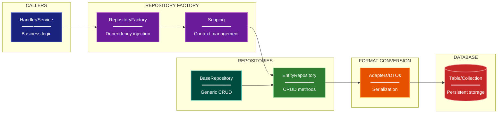

# Repository/Data Access Architecture Lens

> **Preflight:** Before acting on any `exploration-vector` directive below, call `enable_exploration` to establish read-only broker authority for this session; the vectors below assume broker access has already been granted.

**Philosophical Mode:** Data-Centric
**Primary Question:** "How is data accessed?"
**Focus:** Repository Pattern, Entity Relationships, Query Patterns, Format Conversion

## Arguments

`/autoskillit:arch-lens-repository-access [context_path]`

- **context_path** (optional) — Absolute path to a PR context file containing new files
  (★-prefixed) and modified files (●-prefixed) from the PR diff. When provided, read
  this file before beginning analysis and focus the diagram on the architectural areas
  affected by these specific files. When absent, explore the full CWD.

---

## When to Use

- Need to understand data access layer architecture
- Documenting repository pattern implementation
- Analyzing entity relationships and query patterns
- User invokes `/autoskillit:arch-lens-repository-access` or `/autoskillit:make-arch-diag repository`

## Critical Constraints

**NEVER:**
- Treat Related Skills as executable dependencies or invoke any cross-reference from that section; those entries are documentation-only and do not imply execution. Invoke only the required `/autoskillit:mermaid` skill; never invoke `/autoskillit:make-arch-diag`, another architecture lens, or any other cross-reference.
- Fabricate, invent, or embellish information not supported by the available evidence or code.

- Do not litter the codebase with useless comments, TODO markers, or explanatory annotations — the skill output and diagram speak for ourselves
- Create files outside `{{AUTOSKILLIT_TEMP}}/arch-lens-repository-access/`
- Modify any source code files
- Execute target code, application workflows, or target test commands to gather exploration evidence
- Focus on data flow (that's data lineage lens)
- Include business logic details
- Detach child delegations instead of joining them (joining every child is required)
- Run exploration leaves in the background
- Start independent child delegations sequentially

**ALWAYS:**
- Focus on REPOSITORIES and their methods
- Show entity relationships (1:1, 1:N, N:N)
- Document key query patterns
- Identify format conversion boundaries
- BEFORE creating any diagram, LOAD the `/autoskillit:mermaid` skill using the Skill tool - this is MANDATORY
- If the Skill tool cannot be used (disable-model-invocation) or refuses this invocation, do NOT proceed with diagram creation. Abort this step and omit the diagram from output.
- Write output to `{{AUTOSKILLIT_TEMP}}/arch-lens-repository-access/arch_diag_repository_access_{"{"}YYYY-MM-DD_HHMMSS{}}.md`
- After writing the file, emit the structured output token as **literal plain text** with no
  markdown formatting on the token name (the adjudicator performs a regex match):

  ```
  diagram_path = /absolute/path/to/{{AUTOSKILLIT_TEMP}}/arch-lens-repository-access/arch_diag_repository_access_{"{"}YYYY-MM-DD_HHMMSS{}}.md
  ```
- Start all independent child delegations before awaiting any result to maximize concurrency
- Use the registered exploration roles for all repository reads
- Dispatch every exploration vector below through the deterministic router
- Allow parent-boundary handoff of declarative entity artifacts, dependency-injection registrations, and configuration consumers to `repository-impact-profiler` without creating extra vectors
- Wait for every exploration result before mapping entities, classifying access patterns, analyzing read/write direction, or creating the diagram
- Retain parent authority over repository-pattern interpretation, relationship and access-pattern synthesis, read/write analysis, and diagram creation


## Analysis Workflow

### Step 0: Read PR context (when provided)

If a `context_path` positional argument is present:
1. Read the file at `context_path`
2. Extract: new files list (★-prefixed), modified files list (●-prefixed)
3. Focus Step 1 exploration on the modules/components these files belong to
4. Apply ★ prefix on diagram nodes representing new files/components
5. Apply ● prefix on diagram nodes representing modified files/components

If no `context_path` is provided, skip this step and explore the full CWD in Step 1.

### Step 1: Launch the Routed Exploration Vectors (SINGLE MESSAGE)

Dispatch all ready, scope-disjoint vectors through the deterministic router in a single message before awaiting any result. Do not iterate across multiple turns.

Do not output any prose between subagent dispatches. Immediately proceed to the next tool call.

Dispatch every vector below under their registered role policies. When a navigator finds a declarative entity artifact, dependency-injection registration, or configuration-consumer surface, the parent/router may reclassify that bounded handoff to `repository-impact-profiler`; it must not create another vector. Each leaf returns bounded terminal evidence only and must not interpret the architecture, analyze read/write direction, synthesize relationships, select solutions, create diagrams, or write lens output.

<!-- autoskillit:exploration-vector id="repository-classes" -->
1. **Repository classes** — Find all repository implementations and base abstractions, including Repository and DAO patterns; report concrete definitions, inheritance, imports, and references.
<!-- /autoskillit:exploration-vector -->

<!-- autoskillit:exploration-vector id="entity-models" -->
2. **Entity models** — Find entity and model classes plus table or collection definitions, including ORM models, data models, and entity classes; include bounded declarative-artifact handoffs for profiler evidence.
<!-- /autoskillit:exploration-vector -->

<!-- autoskillit:exploration-vector id="crud-operations" -->
3. **CRUD operations** — Trace standard CRUD and specialized query methods, including create, get, update, delete, save, `find_*`, `get_by_*`, and query methods, with their callers and affected operations.
<!-- /autoskillit:exploration-vector -->

<!-- autoskillit:exploration-vector id="query-patterns" -->
4. **Query patterns** — Trace complex queries, joins, index usage, filters, where clauses, ordering, grouping, and query-builder definitions and calls.
<!-- /autoskillit:exploration-vector -->

<!-- autoskillit:exploration-vector id="factory-scoping" -->
5. **Factory/scoping** — Trace repository factories, dependency-injection calls, and session or context scope management; include bounded registry and configuration handoffs for profiler evidence.
<!-- /autoskillit:exploration-vector -->

<!-- autoskillit:exploration-vector id="format-conversion" -->
6. **Format conversion** — Trace adapter and converter patterns at data boundaries, including DTOs, `to_*` and `from_*` methods, serializers, and mappers.
<!-- /autoskillit:exploration-vector -->

### Step 2: Map Entity Relationships

Document:
- **Entities**: All model classes
- **Relationships**: Foreign key relationships, cardinality
- **Key Fields**: Primary keys, business keys
- **Repositories**: Which repo manages which entity

**CRITICAL - Analyze Read/Write Direction:**
For EVERY repository method and data access:
- **Read methods**: `get_*`, `find_*`, `query_*` - data flows OUT of storage
- **Write methods**: `save_*`, `create_*`, `update_*`, `delete_*` - data flows INTO storage
- **Bulk operations**: Direction of each operation in batch

For EVERY caller-to-repository relationship:
- Does the caller READ from this repository?
- Does the caller WRITE to this repository?
- Or both?

Label connections accordingly (reads, writes, reads/writes)

### Step 3: Document Access Patterns

| Pattern | Repository Method | Use Case |
|---------|------------------|----------|
| By ID | get_by_id() | Single entity lookup |
| By Business Key | get_by_* | Domain-specific lookup |
| List | get_all(), get_for_* | Collection queries |
| Bulk | save_many() | Batch operations |

### Step 4: Create the Diagram

Use flowchart with:

**Direction:** `LR` (left-to-right) for caller-to-storage flow

**Subgraphs:**
- Callers (who uses repositories)
- Factory (repository construction)
- Repositories by Category
- Conversion (format boundaries)
- Storage (database tables)

**Node Styling:**
- `cli` class: Callers (nodes, handlers)
- `phase` class: Factory, scoping
- `newComponent` class: Repositories (green to highlight)
- `handler` class: Conversion adapters
- `integration` class: Database storage

**Show Relationships:**
- Entity relationships with cardinality (1:N)
- Repository-to-table mapping
- Conversion flow

### Step 5: Write Output

Write the diagram to: `{{AUTOSKILLIT_TEMP}}/arch-lens-repository-access/arch_diag_repository_access_{YYYY-MM-DD_HHMMSS}.md` (relative to the current working directory)

After writing the diagram file, emit a structured output line:

> **IMPORTANT:** Emit the structured output tokens as **literal plain text with no
> markdown formatting on the token names**. Do not wrap token names in `**bold**`,
> `*italic*`, or any other markdown. Do not wrap the output block in a code fence.
> The adjudicator performs a regex match on the exact token name — decorators and
> code fences cause match failure.

```
diagram_path = {absolute_path_to_diagram_file}
```

---

## Output Template

```markdown
# Repository/Data Access Diagram: {System Name}

**Lens:** Repository/Data Access (Data-Centric)
**Question:** How is data accessed?
**Date:** {YYYY-MM-DD}
**Scope:** {What was analyzed}

## Repository Overview

| Category | Count | Key Repositories |
|----------|-------|------------------|
| {category} | {N} | {names} |

## Data Access Diagram



**Color Legend:**
| Color | Category | Description |
|-------|----------|-------------|
| Dark Blue | Callers | Services/handlers that use repositories |
| Purple | Factory | Repository construction and scoping |
| Green | Repositories | Repository implementations |
| Teal | Base | Generic base repository |
| Orange | Conversion | Format adapters/DTOs |
| Red | Storage | Database tables/collections |

## Repository Categories

| Category | Count | Key Repositories |
|----------|-------|------------------|
| {category} | {N} | {list} |

## Key Query Patterns

| Pattern | Repository Method | Use Case |
|---------|------------------|----------|
| {pattern} | {method} | {use case} |

## Entity Relationships

| Parent | Child | Cardinality | FK |
|--------|-------|-------------|-----|
| {parent} | {child} | {1:N/1:1} | {fk field} |
```

---

## Pre-Diagram Checklist

Before creating the diagram, verify:

- [ ] LOADED `/autoskillit:mermaid` skill using the Skill tool
- [ ] Using ONLY classDef styles from the mermaid skill (no invented colors)
- [ ] Diagram will include a color legend table

---

## Related Skills

- `/autoskillit:make-arch-diag` - Parent skill for lens selection
- `/autoskillit:mermaid` - MUST BE LOADED before creating diagram
- `/autoskillit:arch-lens-data-lineage` - For data flow view
- `/autoskillit:arch-lens-c4-container` - For storage container view
