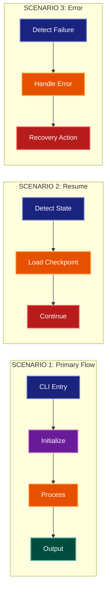

# Scenarios Architecture Lens

**Philosophical Mode:** Validation (+1 Validator)
**Primary Question:** "Do the components work together?"
**Focus:** End-to-End User Journeys, Component Cooperation, Scenario Validation

## Arguments

`/autoskillit:arch-lens-scenarios [context_path]`

- **context_path** (optional) — Absolute path to a PR context file containing new files
  (★-prefixed) and modified files (●-prefixed) from the PR diff. When provided, read
  this file before beginning analysis and focus the diagram on the architectural areas
  affected by these specific files. When absent, explore the full CWD.

---

## When to Use

- Need to validate component cooperation
- Documenting key user scenarios
- Analyzing end-to-end flows through architecture
- User invokes `/autoskillit:arch-lens-scenarios` or `/autoskillit:make-arch-diag scenarios`

## Critical Constraints

**NEVER:**
- Treat Related Skills as executable dependencies or invoke any cross-reference from that section; those entries are documentation-only and do not imply execution. Invoke only the required `/autoskillit:mermaid` skill; never invoke `/autoskillit:make-arch-diag`, another architecture lens, or any other cross-reference.
- Fabricate, invent, or embellish information not supported by the available evidence or code.

- Do not litter the codebase with useless comments, TODO markers, or explanatory annotations — the skill output and diagram speak for ourselves
- Create files outside `{{AUTOSKILLIT_TEMP}}/arch-lens-scenarios/`
- Modify any source code files
- Execute target code, application workflows, or target test commands to gather exploration evidence
- Show internal component details
- Include all possible scenarios (pick key ones)
- Detach child delegations instead of joining them (joining every child is required)
- Run exploration leaves in the background
- Start independent child delegations sequentially

**ALWAYS:**
- Focus on END-TO-END journeys
- Show component touchpoints in sequence
- Select 3-5 representative scenarios
- Validate components work together
- BEFORE creating any diagram, LOAD the `/autoskillit:mermaid` skill using the Skill tool - this is MANDATORY
- If the Skill tool cannot be used (disable-model-invocation) or refuses this invocation, do NOT proceed with diagram creation. Abort this step and omit the diagram from output.
- Write output to `{{AUTOSKILLIT_TEMP}}/arch-lens-scenarios/arch_diag_scenarios_{"{"}YYYY-MM-DD_HHMMSS{}}.md`
- After writing the file, emit the structured output token as **literal plain text** with no
  markdown formatting on the token name (the adjudicator performs a regex match):

  ```
  diagram_path = /absolute/path/to/{{AUTOSKILLIT_TEMP}}/arch-lens-scenarios/arch_diag_scenarios_{"{"}YYYY-MM-DD_HHMMSS{}}.md
  ```
- Start all independent child delegations before awaiting any result to maximize concurrency
- Use the registered exploration roles for all repository reads
- Dispatch exactly 5 exploration vectors through the deterministic router
- Allow parent-boundary handoff of declarative entry-point, integration-registration, and configuration-consumer artifacts to `repository-impact-profiler` without creating extra vectors
- Wait for every exploration result before selecting scenarios, mapping component touchpoints, analyzing read/write direction, or creating the diagram
- Retain parent authority over scenario selection, cooperation validation, component-touchpoint and data-direction synthesis, and diagram creation


## Analysis Workflow

### Step 0: Read PR context (when provided)

If a `context_path` positional argument is present:
1. Read the file at `context_path`
2. Extract: new files list (★-prefixed), modified files list (●-prefixed)
3. Focus Step 1 exploration on the modules/components these files belong to
4. Apply ★ prefix on diagram nodes representing new files/components
5. Apply ● prefix on diagram nodes representing modified files/components

If no `context_path` is provided, skip this step and explore the full CWD in Step 1.

### Step 1: Launch 5 Routed Exploration Vectors (SINGLE MESSAGE)

Dispatch all ready, scope-disjoint vectors through the deterministic router in a single message before awaiting any result. Do not iterate across multiple turns.

Do not output any prose between subagent dispatches. Immediately proceed to the next tool call.

Dispatch exactly these five vectors under their registered role policies. When a navigator finds a declarative entry point, integration registration, or configuration-consumer surface, the parent/router may reclassify that bounded handoff to `repository-impact-profiler`; it must not create another vector. Each leaf returns bounded terminal evidence only and must not select representative scenarios, validate component cooperation, interpret read/write direction, synthesize journeys, create diagrams, or write lens output.

<!-- autoskillit:exploration-vector id="primary-use-cases" -->
1. **Primary use cases** — Find the main user-facing operations, CLI commands, API endpoints, primary workflows, and repository-supported user stories; include bounded declarative entry-point handoffs for profiler evidence.
<!-- /autoskillit:exploration-vector -->

<!-- autoskillit:exploration-vector id="happy-path-flows" -->
2. **Happy path flows** — Trace successful execution paths and ordered component touchpoints through normal and expected behavior.
<!-- /autoskillit:exploration-vector -->

<!-- autoskillit:exploration-vector id="error-recovery-flows" -->
3. **Error/recovery flows** — Trace error-handling branches and recovery mechanisms, including retries, recovery calls, and fallbacks.
<!-- /autoskillit:exploration-vector -->

<!-- autoskillit:exploration-vector id="resume-restart-flows" -->
4. **Resume/restart flows** — Trace state-persistence, checkpoint, restore, resume, restart, and continue paths.
<!-- /autoskillit:exploration-vector -->

<!-- autoskillit:exploration-vector id="integration-points" -->
5. **Integration points** — Trace external-system interactions and cross-component calls, including API calls, subprocesses, and integration boundaries; include bounded declarative registration and configuration handoffs for profiler evidence.
<!-- /autoskillit:exploration-vector -->

### Step 2: Select Key Scenarios

Choose 3-5 representative scenarios:
1. **Primary Happy Path**: The main use case
2. **Secondary Use Case**: Another important flow
3. **Resume/Recovery**: How to continue after interruption
4. **Error Handling**: How failures are managed
5. **Integration**: External system interaction

### Step 3: Map Component Touchpoints

For each scenario:
- Entry point (CLI, API, trigger)
- Processing components (in order)
- State changes
- Output/artifacts
- Exit point

**CRITICAL - Analyze Read/Write Direction:**
For EVERY component in each scenario:
- **What does it READ?** (inputs, state, config)
- **What does it WRITE?** (outputs, state changes, artifacts)
- **What does it PASS THROUGH?** (data transformed and forwarded)

For scenario flows, annotate each arrow:
- "reads from" / "loads" for input operations
- "writes to" / "saves" for output operations
- "transforms" for data that passes through

This reveals the actual data dependencies between scenario steps.

### Step 4: Create the Diagram

Use flowchart with:

**Direction:** `LR` (left-to-right) for sequential scenario flow

**Subgraphs per Scenario:**
- Each scenario gets its own subgraph
- Show components touched in sequence

**Node Styling:**
- `cli` class: Entry points (CLI, triggers)
- `phase` class: Initialization, setup
- `handler` class: Processing components
- `stateNode` class: Data/state components
- `output` class: Outputs, artifacts
- `detector` class: Recovery, continue paths

**Show Sequential Flow:**
- Each scenario flows left to right
- Components connected in order of execution

### Step 5: Write Output

Write the diagram to: `{{AUTOSKILLIT_TEMP}}/arch-lens-scenarios/arch_diag_scenarios_{YYYY-MM-DD_HHMMSS}.md` (relative to the current working directory)

After writing the diagram file, emit a structured output line:

> **IMPORTANT:** Emit the structured output tokens as **literal plain text with no
> markdown formatting on the token names**. Do not wrap token names in `**bold**`,
> `*italic*`, or any other markdown. Do not wrap the output block in a code fence.
> The adjudicator performs a regex match on the exact token name — decorators and
> code fences cause match failure.

```
diagram_path = {absolute_path_to_diagram_file}
```

---

## Output Template

```markdown
# Scenarios Diagram: {System Name}

**Lens:** Scenarios (Validation)
**Question:** Do the components work together?
**Date:** {YYYY-MM-DD}
**Scope:** {What was analyzed}

## Scenario Overview

| Scenario | Purpose | Key Components |
|----------|---------|----------------|
| {name} | {validates what} | {components} |

## Scenarios Diagram



**Color Legend:**
| Color | Category | Description |
|-------|----------|-------------|
| Dark Blue | Entry | CLI/trigger entry points |
| Purple | Init | Initialization and detection |
| Orange | Process | Core processing components |
| Teal | State | Data and state components |
| Red | Continue | Resumption and recovery |

## Scenario Validation Summary

| Scenario | Validates | Key Components |
|----------|-----------|----------------|
| {name} | {what it validates} | {component list} |

## Detailed Scenarios

### Scenario 1: {Name}

**Purpose:** {What this validates}

**Flow:**
1. {Step 1}
2. {Step 2}
3. {Step 3}

### Scenario 2: {Name}

**Purpose:** {What this validates}

**Flow:**
1. {Step 1}
2. {Step 2}
```

---

## Pre-Diagram Checklist

Before creating the diagram, verify:

- [ ] LOADED `/autoskillit:mermaid` skill using the Skill tool
- [ ] Using ONLY classDef styles from the mermaid skill (no invented colors)
- [ ] Diagram will include a color legend table

---

## Related Skills

- `/autoskillit:make-arch-diag` - Parent skill for lens selection
- `/autoskillit:mermaid` - MUST BE LOADED before creating diagram
- `/autoskillit:arch-lens-process-flow` - For detailed workflow view
- `/autoskillit:arch-lens-error-resilience` - For failure handling details
