# Security Architecture Lens

**Philosophical Mode:** Security
**Primary Question:** "Where are the trust boundaries?"
**Focus:** Trust Boundaries, Validation Layers, Path Contracts, Process Isolation

## Arguments

`/autoskillit:arch-lens-security [context_path]`

- **context_path** (optional) — Absolute path to a PR context file containing new files
  (★-prefixed) and modified files (●-prefixed) from the PR diff. When provided, read
  this file before beginning analysis and focus the diagram on the architectural areas
  affected by these specific files. When absent, explore the full CWD.

---

## When to Use

- Need to understand security architecture
- Documenting trust boundaries and validation
- Analyzing path contracts and isolation
- User invokes `/autoskillit:arch-lens-security` or `/autoskillit:make-arch-diag security`

## Critical Constraints

**NEVER:**
- Treat Related Skills as executable dependencies or invoke any cross-reference from that section; those entries are documentation-only and do not imply execution. Invoke only the required `/autoskillit:mermaid` skill; never invoke `/autoskillit:make-arch-diag`, another architecture lens, or any other cross-reference.
- Fabricate, invent, or embellish information not supported by the available evidence or code.

- Do not litter the codebase with useless comments, TODO markers, or explanatory annotations — the skill output and diagram speak for ourselves
- Create files outside `{{AUTOSKILLIT_TEMP}}/arch-lens-security/`
- Modify any source code files
- Execute target code, application workflows, or target test commands to gather exploration evidence
- Expose actual secrets or credentials
- Show implementation details that could aid attacks
- Detach child delegations instead of joining them (joining every child is required)
- Run exploration leaves in the background
- Start independent child delegations sequentially

**ALWAYS:**
- Focus on TRUST BOUNDARIES
- Show validation layers in order
- Document path contracts and restrictions
- Include process isolation mechanisms
- BEFORE creating any diagram, LOAD the `/autoskillit:mermaid` skill using the Skill tool - this is MANDATORY
- If the Skill tool cannot be used (disable-model-invocation) or refuses this invocation, do NOT proceed with diagram creation. Abort this step and omit the diagram from output.
- Write output to `{{AUTOSKILLIT_TEMP}}/arch-lens-security/arch_diag_security_{"{"}YYYY-MM-DD_HHMMSS{}}.md`
- After writing the file, emit the structured output token as **literal plain text** with no
  markdown formatting on the token name (the adjudicator performs a regex match):

  ```
  diagram_path = /absolute/path/to/{{AUTOSKILLIT_TEMP}}/arch-lens-security/arch_diag_security_{"{"}YYYY-MM-DD_HHMMSS{}}.md
  ```
- Start all independent child delegations before awaiting any result to maximize concurrency
- Use the registered exploration roles for all repository reads
- Dispatch exactly 7 exploration vectors through the deterministic router
- Allow parent-boundary handoff of declarative path policy, process configuration, and credential-consumer artifacts to `repository-impact-profiler` without creating extra vectors
- Wait for every exploration result before mapping trust boundaries, assessing validation layers, analyzing read/write direction, or creating the diagram
- Retain parent authority over threat and trust-boundary interpretation, validation-layer synthesis, security judgment, and diagram creation


## Analysis Workflow

### Step 0: Read PR context (when provided)

If a `context_path` positional argument is present:
1. Read the file at `context_path`
2. Extract: new files list (★-prefixed), modified files list (●-prefixed)
3. Focus Step 1 exploration on the modules/components these files belong to
4. Apply ★ prefix on diagram nodes representing new files/components
5. Apply ● prefix on diagram nodes representing modified files/components

If no `context_path` is provided, skip this step and explore the full CWD in Step 1.

### Step 1: Launch 7 Routed Exploration Vectors (SINGLE MESSAGE)

Dispatch all ready, scope-disjoint vectors through the deterministic router in a single message before awaiting any result. Do not iterate across multiple turns.

Do not output any prose between subagent dispatches. Immediately proceed to the next tool call.

Dispatch exactly these seven vectors under their registered role policies. When a navigator finds declarative path policy, process configuration, or credential-consumer artifacts, the parent/router may reclassify that bounded handoff to `repository-impact-profiler`; it must not create another vector. Each leaf returns bounded terminal evidence only and must not expose secret values, assess threats, judge security adequacy, map final trust boundaries, create diagrams, or write lens output.

<!-- autoskillit:exploration-vector id="input-validation" -->
1. **Input validation** — Trace input-validation and sanitization definitions, call sites, guarded inputs, and failure paths, including validate, sanitize, clean, and escape patterns.
<!-- /autoskillit:exploration-vector -->

<!-- autoskillit:exploration-vector id="path-security" -->
2. **Path security** — Trace path validation and restriction control flow, traversal checks, forbidden patterns, and allowlist or denylist use; include bounded declarative path-policy handoffs for profiler evidence.
<!-- /autoskillit:exploration-vector -->

<!-- autoskillit:exploration-vector id="process-boundaries" -->
3. **Process boundaries** — Trace subprocess and isolation code, including process creation, timeouts, guards, sandboxes, cleanup, and failure paths.
<!-- /autoskillit:exploration-vector -->

<!-- autoskillit:exploration-vector id="authentication-authorization" -->
4. **Authentication/authorization** — Trace authentication and authorization definitions, permission checks, token or API-key references, credential consumers, and guarded call paths without reporting credential values.
<!-- /autoskillit:exploration-vector -->

<!-- autoskillit:exploration-vector id="secret-management" -->
5. **Secret management** — Identify secret and credential declarations, environment-variable use, `.env` handling, ignore policy, configuration consumers, and affected surfaces without reading or reporting secret values.
<!-- /autoskillit:exploration-vector -->

<!-- autoskillit:exploration-vector id="file-system-security" -->
6. **File system security** — Identify file-access controls, allowed paths, write-zone restrictions, snapshots, file-change policy, configuration, and affected consumers.
<!-- /autoskillit:exploration-vector -->

<!-- autoskillit:exploration-vector id="database-isolation" -->
7. **Database isolation** — Identify database access controls, per-user or per-tenant scoping, multi-tenancy and isolation declarations, configuration, registrations, and affected consumers.
<!-- /autoskillit:exploration-vector -->

### Step 2: Map Trust Boundaries

Identify boundaries where trust changes:
1. **External -> Application** (user input)
2. **Application -> Subprocess** (code execution)
3. **Application -> FileSystem** (file access)
4. **Application -> Database** (data access)
5. **Application -> External API** (outbound)

**CRITICAL - Analyze Read/Write Direction:**
For EVERY trust boundary crossing:
- **Inbound (reads)**: Data entering from less trusted to more trusted
- **Outbound (writes)**: Data leaving from more trusted to less trusted
- **Validation point**: Where is data validated and in which direction?

Security implications by direction:
- **Reads from untrusted**: Requires input validation
- **Writes to untrusted**: Requires output encoding/sanitization
- **Reads from trusted storage**: Generally safe
- **Writes to trusted storage**: Requires authorization check

### Step 3: Document Validation Layers

For each trust boundary:
- What is validated?
- How are violations handled?
- What's the defense-in-depth strategy?

### Step 4: Create the Diagram

Use flowchart with:

**Direction:** `TB` for layered security view

**Subgraphs per Trust Boundary:**
- Entry (CLI/API input)
- Subprocess Boundary
- FileSystem Boundary
- Path Contract
- Write Zone Enforcement
- Database Isolation

**Node Styling:**
- `cli` class: Entry points, user input
- `detector` class: Validation gates, guards
- `phase` class: Processing after validation
- `gap` class: Forbidden/restricted (yellow warning)
- `stateNode` class: Enforcement points
- `output` class: Isolated resources

**Show Flow Through Boundaries:**
- Sequential validation layers
- What passes vs what's blocked

### Step 5: Write Output

Write the diagram to: `{{AUTOSKILLIT_TEMP}}/arch-lens-security/arch_diag_security_{YYYY-MM-DD_HHMMSS}.md` (relative to the current working directory)

After writing the diagram file, emit a structured output line:

> **IMPORTANT:** Emit the structured output tokens as **literal plain text with no
> markdown formatting on the token names**. Do not wrap token names in `**bold**`,
> `*italic*`, or any other markdown. Do not wrap the output block in a code fence.
> The adjudicator performs a regex match on the exact token name — decorators and
> code fences cause match failure.

```
diagram_path = {absolute_path_to_diagram_file}
```

---

## Output Template

```markdown
# Security Diagram: {System Name}

**Lens:** Security (Trust Boundaries)
**Question:** Where are the trust boundaries?
**Date:** {YYYY-MM-DD}
**Scope:** {What was analyzed}

## Trust Boundaries Overview

| Boundary | Validation | Threat Mitigated |
|----------|------------|------------------|
| {boundary} | {validation} | {threat} |

## Security Diagram

```mermaid
%%{init: {'flowchart': {'nodeSpacing': 40, 'rankSpacing': 50, 'curve': 'basis'}}}%%
flowchart TB
    %% CLASS DEFINITIONS %%
    classDef cli fill:#1a237e,stroke:#7986cb,stroke-width:2px,color:#fff;
    classDef stateNode fill:#004d40,stroke:#4db6ac,stroke-width:2px,color:#fff;
    classDef handler fill:#e65100,stroke:#ffb74d,stroke-width:2px,color:#fff;
    classDef phase fill:#6a1b9a,stroke:#ba68c8,stroke-width:2px,color:#fff;
    classDef detector fill:#b71c1c,stroke:#ef5350,stroke-width:2px,color:#fff;
    classDef output fill:#00695c,stroke:#4db6ac,stroke-width:2px,color:#fff;
    classDef gap fill:#ff6f00,stroke:#ffa726,stroke-width:2px,color:#000;

    subgraph Boundary1 ["TRUST BOUNDARY 1: Entry"]
        INPUT["User Input<br/>━━━━━━━━━━<br/>Untrusted"]
        VALIDATE["Validation<br/>━━━━━━━━━━<br/>Check input"]
    end

    subgraph Boundary2 ["TRUST BOUNDARY 2: Subprocess"]
        PRECHECK["Pre-flight Check<br/>━━━━━━━━━━<br/>Limits check"]
        SUBPROCESS["Subprocess<br/>━━━━━━━━━━<br/>Isolated execution"]
        GUARD["Process Guard<br/>━━━━━━━━━━<br/>Timeout, cleanup"]
    end

    subgraph PathContract ["PATH CONTRACT"]
        FORBIDDEN["Forbidden Patterns<br/>━━━━━━━━━━<br/>credentials, .pem"]
        TRAVERSAL["Traversal Check<br/>━━━━━━━━━━<br/>No '..' allowed"]
        WHITELIST["Directory Whitelist<br/>━━━━━━━━━━<br/>Allowed paths"]
    end

    subgraph WriteZone ["WRITE ZONE ENFORCEMENT"]
        ZONE["Write Zone<br/>━━━━━━━━━━<br/>Restricted area"]
    end

    %% FLOW %%
    INPUT --> VALIDATE
    VALIDATE --> PRECHECK
    PRECHECK --> SUBPROCESS
    SUBPROCESS --> GUARD

    GUARD --> FORBIDDEN
    FORBIDDEN --> TRAVERSAL
    TRAVERSAL --> WHITELIST

    WHITELIST --> ZONE

    %% CLASS ASSIGNMENTS %%
    class INPUT cli;
    class VALIDATE,PRECHECK,GUARD detector;
    class SUBPROCESS phase;
    class FORBIDDEN,TRAVERSAL gap;
    class WHITELIST stateNode;
    class ZONE output;
```



**Color Legend:**
| Color | Category | Description |
|-------|----------|-------------|
| Dark Blue | Entry | Untrusted input |
| Red | Validation | Validation gates and guards |
| Purple | Process | Isolated execution |
| Yellow | Restricted | Forbidden patterns |
| Teal | Enforcement | Whitelist, allowed |
| Dark Teal | Zone | Protected resources |

## Security Validation Layers

| Layer | Component | Threat Mitigated |
|-------|-----------|------------------|
| 1 | {component} | {threat} |
| 2 | {component} | {threat} |

## Path Contract Rules

| Rule | Description |
|------|-------------|
| Forbidden Patterns | {patterns} |
| Traversal Prevention | {how} |
| Whitelist | {allowed dirs} |
```

---

## Pre-Diagram Checklist

Before creating the diagram, verify:

- [ ] LOADED `/autoskillit:mermaid` skill using the Skill tool
- [ ] Using ONLY classDef styles from the mermaid skill (no invented colors)
- [ ] Diagram will include a color legend table

---

## Related Skills

- `/autoskillit:make-arch-diag` - Parent skill for lens selection
- `/autoskillit:mermaid` - MUST BE LOADED before creating diagram
- `/autoskillit:arch-lens-error-resilience` - For error handling view
- `/autoskillit:audit-arch` - For security violation detection
