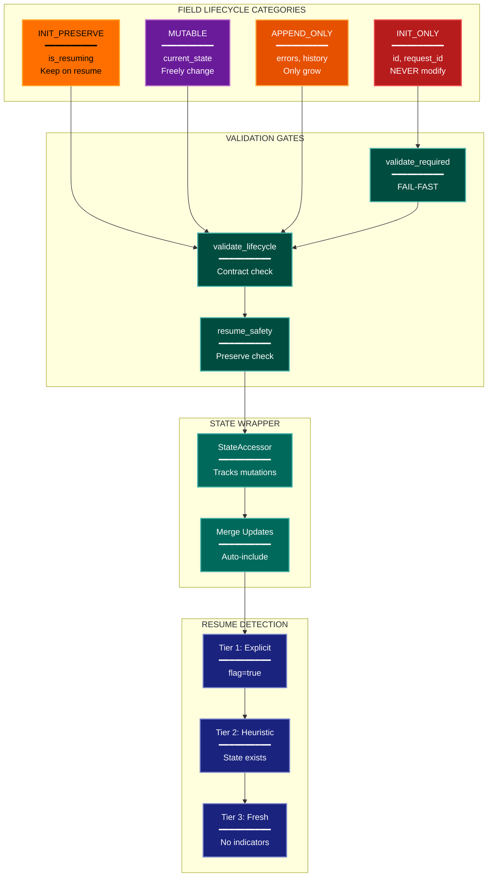

# State Lifecycle Architecture Lens

**Philosophical Mode:** Perspective (Quality Overlay)
**Primary Question:** "How is state corruption prevented?"
**Focus:** Field Contracts, Validation Gates, Resume Safety, State Mutation Control

## Arguments

`/autoskillit:arch-lens-state-lifecycle [context_path]`

- **context_path** (optional) — Absolute path to a PR context file containing new files
  (★-prefixed) and modified files (●-prefixed) from the PR diff. When provided, read
  this file before beginning analysis and focus the diagram on the architectural areas
  affected by these specific files. When absent, explore the full CWD.

---

## When to Use

- Need to understand state management architecture
- Documenting field lifecycle contracts
- Analyzing resume and checkpoint safety
- User invokes `/autoskillit:arch-lens-state-lifecycle` or `/autoskillit:make-arch-diag state`

## Critical Constraints

**NEVER:**
- Treat Related Skills as executable dependencies or invoke any cross-reference from that section; those entries are documentation-only and do not imply execution. Invoke only the required `/autoskillit:mermaid` skill; never invoke `/autoskillit:make-arch-diag`, another architecture lens, or any other cross-reference.
- Fabricate, invent, or embellish information not supported by the available evidence or code.

- Do not litter the codebase with useless comments, TODO markers, or explanatory annotations — the skill output and diagram speak for ourselves
- Create files outside `{{AUTOSKILLIT_TEMP}}/arch-lens-state-lifecycle/`
- Modify any source code files
- Show business logic details
- Focus on data content (focus on mutation rules)
- Detach child delegations instead of joining them (joining every child is required)
- Run exploration leaves in the background
- Start independent child delegations sequentially

**ALWAYS:**
- Focus on STATE MUTATION RULES
- Show field lifecycle categories
- Document validation gates
- Include resume detection strategy
- BEFORE creating any diagram, LOAD the `/autoskillit:mermaid` skill using the Skill tool - this is MANDATORY
- If the Skill tool cannot be used (disable-model-invocation) or refuses this invocation, do NOT proceed with diagram creation. Abort this step and omit the diagram from output.
- Write output to `{{AUTOSKILLIT_TEMP}}/arch-lens-state-lifecycle/arch_diag_state_lifecycle_{"{"}YYYY-MM-DD_HHMMSS{}}.md`
- After writing the file, emit the structured output token as **literal plain text** with no
  markdown formatting on the token name (the adjudicator performs a regex match):

  ```
  diagram_path = /absolute/path/to/{{AUTOSKILLIT_TEMP}}/arch-lens-state-lifecycle/arch_diag_state_lifecycle_{"{"}YYYY-MM-DD_HHMMSS{}}.md
  ```
- Start all independent child delegations before awaiting any result to maximize concurrency
- Use the registered exploration roles for all repository reads
- Dispatch every exploration vector below through the deterministic router
- Allow parent-boundary handoff of declarative artifacts and configuration consumers to `repository-impact-profiler` without creating another vector
- Wait for every exploration result before categorizing fields, mapping validation flow, or creating the diagram
- Retain parent authority over lifecycle, validation, resume, contract, and diagram synthesis


## Analysis Workflow

### Step 0: Read PR context (when provided)

If a `context_path` positional argument is present:
1. Read the file at `context_path`
2. Extract: new files list (★-prefixed), modified files list (●-prefixed)
3. Focus Step 1 exploration on the modules/components these files belong to
4. Apply ★ prefix on diagram nodes representing new files/components
5. Apply ● prefix on diagram nodes representing modified files/components

If no `context_path` is provided, skip this step and explore the full CWD in Step 1.

### Step 1: Launch the Routed Exploration Vectors (SINGLE MESSAGE)

Dispatch all ready, scope-disjoint vectors through the deterministic router in a single message before awaiting any result. Do not iterate across multiple turns.

Do not output any prose between subagent dispatches. Immediately proceed to the next tool call.

Dispatch every vector below under their registered role policies. When a navigator finds a declarative artifact or configuration-consumer surface, the parent/router may reclassify that bounded handoff to `repository-impact-profiler`; it must not create a seventh vector.

<!-- autoskillit:exploration-vector id="state-schema" -->
1. **State schema** — Find state and context definitions, typed state fields, schemas, typed dictionaries, and code references to them. Report exact definitions and consumers; leave lifecycle classification to the parent.
<!-- /autoskillit:exploration-vector -->

<!-- autoskillit:exploration-vector id="field-categories" -->
2. **Field categories** — Trace field reads, writes, and mutation patterns, including immutable, readonly, lifecycle-annotated, and constant fields. Supply evidence for categorization without assigning the final category.
<!-- /autoskillit:exploration-vector -->

<!-- autoskillit:exploration-vector id="validation-gates" -->
3. **Validation gates** — Trace state validators, guards, checks, assertions, call order, guarded fields, and failure paths. Report the code-defined flow without synthesizing the final gate model.
<!-- /autoskillit:exploration-vector -->

<!-- autoskillit:exploration-vector id="resume-detection" -->
4. **Resume detection** — Trace resume, checkpoint, restore, state detection, and checkpoint-loading paths, including differences between fresh and resumed execution. The parent determines the documented resume strategy.
<!-- /autoskillit:exploration-vector -->

<!-- autoskillit:exploration-vector id="state-updates" -->
5. **State updates** — Trace update methods, setters, mutation functions, merge behavior, storage writes, and downstream reads. Distinguish evidenced read/write paths from write-only artifacts; leave update-policy classification to the parent.
<!-- /autoskillit:exploration-vector -->

<!-- autoskillit:exploration-vector id="contract-enforcement" -->
6. **Contract enforcement** — Trace contract declarations, validation calls, enforcement mechanisms, and violation-detection paths. Report exact evidence while the parent interprets the contract rules and creates the diagram.
<!-- /autoskillit:exploration-vector -->

### Step 2: Categorize Fields

| Category | Description | Fields |
|----------|-------------|--------|
| INIT_ONLY | Set once, never modify | {fields} |
| INIT_PRESERVE | Keep on resume | {fields} |
| MUTABLE | Can change freely | {fields} |
| APPEND_ONLY | Can only grow | {fields} |
| DERIVED | Computed, not stored | {fields} |

**CRITICAL - Analyze Read/Write Direction:**
For EVERY state field and storage location:
- **Read patterns**: Who READS this field? When?
- **Write patterns**: Who WRITES this field? When?
- **Read-after-write**: Is the written value ever READ back by the system?

Distinguish clearly:
- **State fields (read/write)**: System both writes AND reads back for decisions
- **Checkpoint storage (read/write)**: Written during execution, read on resume
- **Audit logs (write-only)**: System writes but never reads back for logic
- **Debug artifacts (write-only)**: Written for humans, not read by system

### Step 3: Map Validation Flow

Document:
- Gate order (which runs first)
- Failure modes
- Resume vs fresh start differences

### Step 4: Create the Diagram

Use flowchart with:

**Direction:** `TB` for contract enforcement flow

**Subgraphs:**
- Lifecycles (field categories)
- Validation Gates
- State Wrapper (mutation mechanism)
- Resume Detection
- Phase Jump Routing

**Node Styling:**
- `detector` class: INIT_ONLY fields (red - critical)
- `gap` class: INIT_PRESERVE fields (yellow - warning)
- `phase` class: MUTABLE fields (purple)
- `handler` class: APPEND_ONLY fields (orange)
- `stateNode` class: Validation gates
- `output` class: State wrapper/accessor
- `cli` class: Resume detection tiers

### Step 5: Write Output

Write the diagram to: `{{AUTOSKILLIT_TEMP}}/arch-lens-state-lifecycle/arch_diag_state_lifecycle_{YYYY-MM-DD_HHMMSS}.md` (relative to the current working directory)

After writing the diagram file, emit a structured output line:

> **IMPORTANT:** Emit the structured output tokens as **literal plain text with no
> markdown formatting on the token names**. Do not wrap token names in `**bold**`,
> `*italic*`, or any other markdown. Do not wrap the output block in a code fence.
> The adjudicator performs a regex match on the exact token name — decorators and
> code fences cause match failure.

```
diagram_path = {absolute_path_to_diagram_file}
```

---

## Output Template

```markdown
# State Lifecycle Diagram: {System Name}

**Lens:** State Lifecycle (Contract Overlay)
**Question:** How is state corruption prevented?
**Date:** {YYYY-MM-DD}
**Scope:** {What was analyzed}

## Field Lifecycle Categories

| Category | Description | Example Fields |
|----------|-------------|----------------|
| INIT_ONLY | Never modify after init | {fields} |
| INIT_PRESERVE | Keep on resume | {fields} |
| MUTABLE | Free to change | {fields} |
| APPEND_ONLY | Can only grow | {fields} |

## State Lifecycle Diagram



**Color Legend:**
| Color | Category | Description |
|-------|----------|-------------|
| Red | INIT_ONLY | Never modify (critical) |
| Yellow | INIT_PRESERVE | Preserved on resume |
| Purple | MUTABLE | Freely modifiable |
| Orange | APPEND_ONLY | Can only grow |
| Teal | Gates | Validation gates |
| Dark Teal | Wrapper | State mutation mechanism |
| Dark Blue | Detection | Resume detection tiers |

## State Lifecycle Contract Rules

| Lifecycle | Fresh Start | Resume | Violation Detection |
|-----------|-------------|--------|---------------------|
| INIT_ONLY | Cannot modify | Cannot modify | {detection} |
| INIT_PRESERVE | Can modify | Cannot modify | {detection} |
| MUTABLE | Can modify | Can modify | Never fails |
| APPEND_ONLY | Can append | Can append | {detection} |

## Resume Detection Strategy

| Tier | Check | Result |
|------|-------|--------|
| 1 | Explicit flag | {what happens} |
| 2 | Heuristic | {what happens} |
| 3 | Fresh start | {what happens} |
```

---

## Pre-Diagram Checklist

Before creating the diagram, verify:

- [ ] LOADED `/autoskillit:mermaid` skill using the Skill tool
- [ ] Using ONLY classDef styles from the mermaid skill (no invented colors)
- [ ] Diagram will include a color legend table

---

## Related Skills

- `/autoskillit:make-arch-diag` - Parent skill for lens selection
- `/autoskillit:mermaid` - MUST BE LOADED before creating diagram
- `/autoskillit:arch-lens-process-flow` - For state machine view
- `/autoskillit:arch-lens-error-resilience` - For validation failure handling
