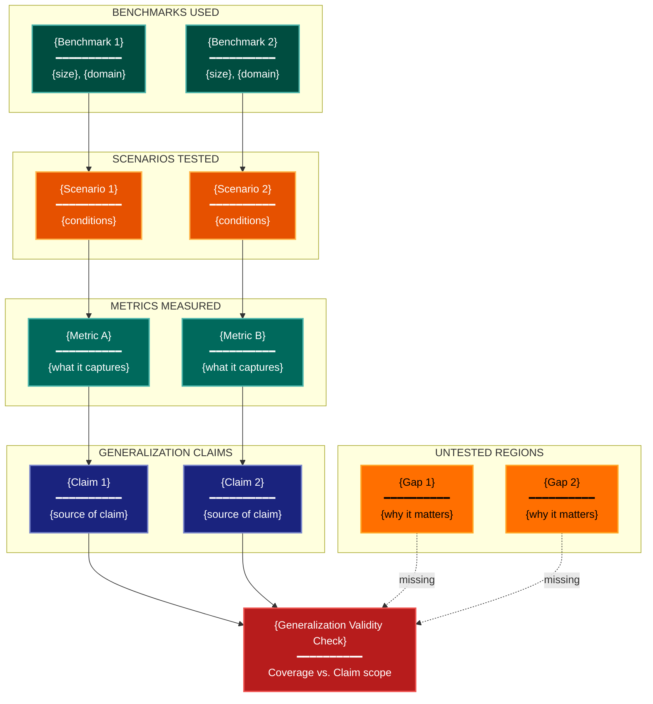

# Benchmark Representativeness Experimental Design Lens

**Philosophical Mode:** Generalizability
**Primary Question:** "Does this generalize beyond the test bed?"
**Focus:** Task Distribution, Scenario Coverage, Missing Regions, Dataset Selection, Generalization Claims

## Arguments

`/autoskillit:exp-lens-benchmark-representativeness [context_path] [experiment_plan_path]`

- **context_path** (optional positional arg 1) — Absolute path to a lens context file
  containing IV/DV tables, H0/H1 hypotheses, controlled variables, and success criteria.
  If provided, read this file before beginning analysis to obtain structured context.
  If omitted, discover context by exploring the CWD.
- **experiment_plan_path** (optional positional arg 2) — Absolute path to the full
  experiment plan. If provided, read for complete experimental methodology and design.
  If omitted, locate the experiment plan by exploring the CWD.

## When to Use

- Evaluating claims that extend beyond specific benchmarks
- Checking coverage of evaluation suite
- Assessing dataset diversity
- User invokes `/autoskillit:exp-lens-benchmark-representativeness` or `/autoskillit:make-experiment-diag benchmark`

## Critical Constraints

**NEVER:**
- Modify any source code files
- Do not litter the codebase with useless comments, TODO markers, or explanatory annotations — the skill output and diagram speak for themselves
- Create files outside `{{AUTOSKILLIT_TEMP}}/exp-lens-benchmark-representativeness/`

**ALWAYS:**
- Focus on GENERALIZATION GAP between benchmark coverage and claimed scope
- Show which regions of the target space are untested
- Document the relationship between benchmark selection and generalization claims
- Include a coverage matrix mapping scenarios to metrics
- BEFORE creating any diagram, LOAD the `/autoskillit:mermaid` skill using the Skill tool - this is MANDATORY
- If the Skill tool cannot be used (disable-model-invocation) or refuses this invocation, do NOT proceed with diagram creation. Abort this step and omit the diagram from output.
- Write output to `{{AUTOSKILLIT_TEMP}}/exp-lens-benchmark-representativeness/exp_diag_benchmark_representativeness_{YYYY-MM-DD_HHMMSS}.md`
- After writing the file, emit the structured output token as **literal plain text** with no
  markdown formatting on the token name (the adjudicator performs a regex match):

  ```
  diagram_path = /absolute/path/to/{{AUTOSKILLIT_TEMP}}/exp-lens-benchmark-representativeness/exp_diag_benchmark_representativeness_{...}.md
  ```

---

## Analysis Workflow

### Step 0: Parse optional arguments

If positional arg 1 (context_path) is provided and the file exists, read it to obtain
IV/DV tables, H0/H1 hypotheses, controlled variables, and success criteria. If positional
arg 2 (experiment_plan_path) is provided and exists, read the experiment plan for full
methodology. Use this structured context as the foundation for Steps 1-5; skip the CWD
exploration for these fields if the context file supplies them.

### Step 1: Launch Parallel Exploration Subagents

Spawn Explore subagents to investigate:

**Benchmark & Dataset Inventory**
- Find all datasets, benchmarks, test suites used
- Look for: `benchmark`, `dataset`, `test_suite`, `eval`, `corpus`, `split`, `GLUE`, `ImageNet`

**Task & Scenario Coverage**
- Find what scenarios, conditions, and domains are tested
- Look for: `task`, `scenario`, `domain`, `category`, `difficulty`, `subset`

**Metric Coverage**
- Find all evaluation metrics used
- Look for: `metric`, `accuracy`, `f1`, `bleu`, `rouge`, `latency`, `cost`, `fairness`

**Claimed Generalization Scope**
- Find claims about generality in docs, papers, READMEs
- Look for: `generalize`, `real-world`, `production`, `deploy`, `robust`, `transfer`, `domain`

**Distribution Characteristics**
- Find data distribution analysis, class balance, domain stats
- Look for: `distribution`, `balance`, `skew`, `size`, `demographics`, `diversity`

### Step 2: Build the Coverage Matrix

Build the coverage matrix: rows = scenarios/domains tested, columns = metrics measured. Identify which cells are populated and which are gaps. Compare the coverage to the stated generalization claims.

### Step 3: CRITICAL — Analyze Generalization Gap

For every generalization claim:
- **Target population**: What is the full population the claim extends to?
- **Benchmark representation**: What subset of that population is represented in the benchmark?
- **Untested regions**: What regions of the space are untested?
- **Coverage ratio**: Is the coverage sufficient to support the claim?

Distinguish clearly:
- **Strong claims** (e.g., "production-ready"): require broad, diverse coverage
- **Scoped claims** (e.g., "best on GLUE"): only require benchmark-specific coverage
- **Implicit claims**: claims made in framing but not stated explicitly

### Step 4: Create the Diagram

Use flowchart with:

**Direction:** `TB` (claims flow from benchmarks up to generalization)

**Subgraphs:**
- `BENCHMARKS USED`
- `SCENARIOS TESTED`
- `METRICS MEASURED`
- `GENERALIZATION CLAIMS`
- `UNTESTED REGIONS`

**Node Styling:**
- `stateNode` class: benchmarks/datasets
- `handler` class: tested scenarios
- `output` class: measured metrics
- `cli` class: generalization claims
- `gap` class: untested regions/missing coverage
- `detector` class: validation of generalization

### Step 5: Write Output

Write the diagram to: `{{AUTOSKILLIT_TEMP}}/exp-lens-benchmark-representativeness/exp_diag_benchmark_representativeness_{YYYY-MM-DD_HHMMSS}.md` (relative to the current working directory)

---

## Output Template

```markdown
# Benchmark Representativeness Diagram: {System Name}

**Lens:** Benchmark Representativeness (Generalizability)
**Question:** Does this generalize beyond the test bed?
**Date:** {YYYY-MM-DD}
**Scope:** {What was analyzed}

## Coverage Matrix

| Scenario / Domain | {Metric A} | {Metric B} | {Metric C} | Coverage |
|-------------------|-----------|-----------|-----------|----------|
| {Scenario 1}      | ✓         | ✓         | ✗         | Partial  |
| {Scenario 2}      | ✗         | ✗         | ✗         | None     |
| {Scenario 3}      | ✓         | ✓         | ✓         | Full     |

## Benchmark Representativeness Diagram



**Color Legend:**
| Color | Category | Description |
|-------|----------|-------------|
| Dark Teal | Benchmarks | Datasets and test suites used |
| Orange | Scenarios | Tested scenarios and conditions |
| Teal | Metrics | Measured evaluation metrics |
| Dark Blue | Claims | Generalization claims made |
| Yellow/Amber | Gaps | Untested regions of target space |
| Red | Validation | Generalization validity check |

## Generalization Gap Analysis

| Claim | Evidence (Benchmarks) | Gap (Untested) | Risk |
|-------|----------------------|----------------|------|
| {Claim 1} | {What covers it} | {What is missing} | High/Med/Low |
| {Claim 2} | {What covers it} | {What is missing} | High/Med/Low |

## Representativeness Assessment

| Dimension | Current Coverage | Required for Claim | Verdict |
|-----------|-----------------|-------------------|---------|
| Domain diversity | {count} domains | {needed} | ✓/✗ |
| Task variety | {count} tasks | {needed} | ✓/✗ |
| Scale range | {min}–{max} | {needed} | ✓/✗ |
| Distribution shift | {tested?} | {needed} | ✓/✗ |
```

---

## Pre-Diagram Checklist

Before creating the diagram, verify:

- [ ] LOADED `/autoskillit:mermaid` skill using the Skill tool
- [ ] Using ONLY classDef styles from the mermaid skill (no invented colors)
- [ ] Diagram will include a color legend table

---

## Related Skills

- `/autoskillit:make-experiment-diag` - Parent skill for lens selection
- `/autoskillit:mermaid` - MUST BE LOADED before creating diagram
- `/autoskillit:exp-lens-measurement-validity` - For metric quality analysis
- `/autoskillit:exp-lens-validity-threats` - For systematic threat inventory
