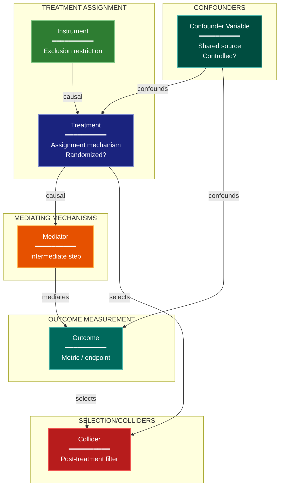

# Causal Assumptions Experimental Design Lens

**Philosophical Mode:** Causal-Structural
**Primary Question:** "What causal assumptions support this design?"
**Focus:** Confounders, Mediators, Colliders, Adjustment Sets, Identification Strategy

## Arguments

`/autoskillit:exp-lens-causal-assumptions [context_path] [experiment_plan_path]`

- **context_path** (optional positional arg 1) — Absolute path to a lens context file
  containing IV/DV tables, H0/H1 hypotheses, controlled variables, and success criteria.
  If provided, read this file before beginning analysis to obtain structured context.
  If omitted, discover context by exploring the CWD.
- **experiment_plan_path** (optional positional arg 2) — Absolute path to the full
  experiment plan. If provided, read for complete experimental methodology and design.
  If omitted, locate the experiment plan by exploring the CWD.

## When to Use

- Experiment claims causal effects
- Pipeline has shared components that might confound
- Need to verify identification strategy
- User invokes `/autoskillit:exp-lens-causal-assumptions` or `/autoskillit:make-experiment-diag causal`

## Critical Constraints

**NEVER:**
- Modify any source code files
- Do not litter the codebase with useless comments, TODO markers, or explanatory annotations — the skill output and diagram speak for themselves
- Create files outside `{{AUTOSKILLIT_TEMP}}/exp-lens-causal-assumptions/`

**ALWAYS:**
- Classify every variable as Treatment, Outcome, Confounder, Mediator, Collider, Instrument, or Selection variable
- Map every directed edge to a concrete code-level data flow
- Flag all unblocked backdoor paths explicitly
- Document the identification strategy with testable assumptions
- BEFORE creating any diagram, LOAD the `/autoskillit:mermaid` skill using the Skill tool - this is MANDATORY
- If the Skill tool cannot be used (disable-model-invocation) or refuses this invocation, do NOT proceed with diagram creation. Abort this step and omit the diagram from output.
- Write output to `{{AUTOSKILLIT_TEMP}}/exp-lens-causal-assumptions/exp_diag_causal_assumptions_{YYYY-MM-DD_HHMMSS}.md`
- After writing the file, emit the structured output token as **literal plain text** with no
  markdown formatting on the token name (the adjudicator performs a regex match):

  ```
  diagram_path = /absolute/path/to/{{AUTOSKILLIT_TEMP}}/exp-lens-causal-assumptions/exp_diag_causal_assumptions_{...}.md
  %%ORDER_UP%%
  ```

---

## Analysis Workflow

### Step 0: Parse optional arguments

If positional arg 1 (context_path) is provided and the file exists, read it to obtain
IV/DV tables, H0/H1 hypotheses, controlled variables, and success criteria. If positional
arg 2 (experiment_plan_path) is provided and exists, read the experiment plan for full
methodology. Use this structured context as the foundation for Steps 1-5; skip the CWD
exploration for these fields if the context file supplies them.

### Step 1: Launch Parallel Exploration Subagents

Spawn Explore subagents to investigate:

**Treatment & Outcome Definition**
- Find experiment config, treatment assignment code, outcome measurement
- Look for: treatment, control, outcome, response, endpoint, metric

**Confounding Pathways**
- Find shared data sources, preprocessing, environment variables
- Look for: shared, common, config, environment, seed, global

**Mediator & Mechanism Variables**
- Find intermediate processing steps between treatment and outcome
- Look for: transform, preprocess, feature, intermediate, pipeline

**Collider & Selection Variables**
- Find filtering, subsetting, or conditional logic applied post-treatment
- Look for: filter, subset, exclude, condition, threshold, select

**Randomization & Assignment**
- Find how experimental units are assigned to conditions
- Look for: random, assign, allocate, split, stratify, block

### Step 2: Build the Causal Graph Structure

For each variable identified, classify as: Treatment, Outcome, Confounder, Mediator, Collider, Instrument, or Selection variable. Map directed edges based on code-level data flow. Flag any unblocked backdoor paths.

### Step 3: Identify Causal Assumptions

**CRITICAL — Analyze Claim Direction:**
For every edge in the causal graph, determine:
- Does code implement a causal mechanism (A produces B) or merely a statistical association?
- Is the direction grounded in temporal ordering or domain knowledge?
- Are there feedback loops?

Document each assumption as either testable or untestable, and record the evidence (or lack of evidence) from the codebase.

### Step 4: Create the Diagram

Use flowchart with:

**Direction:** `TB` (causes flow downward to effects)

**Subgraphs:**
- TREATMENT ASSIGNMENT
- MEDIATING MECHANISMS
- OUTCOME MEASUREMENT
- CONFOUNDERS
- SELECTION/COLLIDERS

**Node Styling:**
- `cli` class: Treatment variables
- `output` class: Outcome variables
- `handler` class: Mediators
- `stateNode` class: Confounders
- `detector` class: Colliders and selection variables
- `gap` class: Unblocked backdoor paths
- `newComponent` class: Instruments

**Edge Labels:** causal, confounds, selects, mediates, blocks

### Step 5: Write Output

Write the diagram to: `{{AUTOSKILLIT_TEMP}}/exp-lens-causal-assumptions/exp_diag_causal_assumptions_{YYYY-MM-DD_HHMMSS}.md` (relative to the current working directory)

---

## Output Template

```markdown
# Causal Assumptions Diagram: {Experiment Name}

**Lens:** Causal Assumptions (Causal-Structural)
**Question:** What causal assumptions support this design?
**Date:** {YYYY-MM-DD}
**Scope:** {What was analyzed}

## Causal Variables

| Variable | Type | Measured? | Controlled? |
|----------|------|-----------|-------------|
| {name} | {Treatment/Outcome/Confounder/Mediator/Collider/Instrument/Selection} | {Yes/No} | {Yes/No} |

## Causal DAG



**Color Legend:**
| Color | Category | Description |
|-------|----------|-------------|
| Dark Blue | Treatment | Treatment assignment variables |
| Dark Teal | Outcome | Outcome measurement variables |
| Orange | Mediator | Intermediate mechanism variables |
| Teal | Confounder | Shared causes of treatment and outcome |
| Red | Collider/Selection | Post-treatment filters (conditioning risk) |
| Green | Instrument | Variables affecting only treatment |
| Amber | Backdoor Path | Unblocked confounding path |

## Identification Strategy

| Assumption | Testable? | Evidence |
|------------|-----------|----------|
| {assumption} | {Yes/No} | {evidence from codebase} |

## Unblocked Backdoor Paths

| Path | Variables | Severity | Mitigation |
|------|-----------|----------|------------|
| {path} | {A -> ... -> B} | {High/Medium/Low} | {adjustment/unavailable} |
```

---

## Pre-Diagram Checklist

Before creating the diagram, verify:

- [ ] LOADED `/autoskillit:mermaid` skill using the Skill tool
- [ ] Using ONLY classDef styles from the mermaid skill (no invented colors)
- [ ] Diagram will include a color legend table

---

## Related Skills

- `/autoskillit:make-experiment-diag` - Parent skill for lens selection
- `/autoskillit:mermaid` - MUST BE LOADED before creating diagram
- `/autoskillit:exp-lens-estimand-clarity` - For clarifying the target estimand
- `/autoskillit:exp-lens-validity-threats` - For broader validity threat inventory
