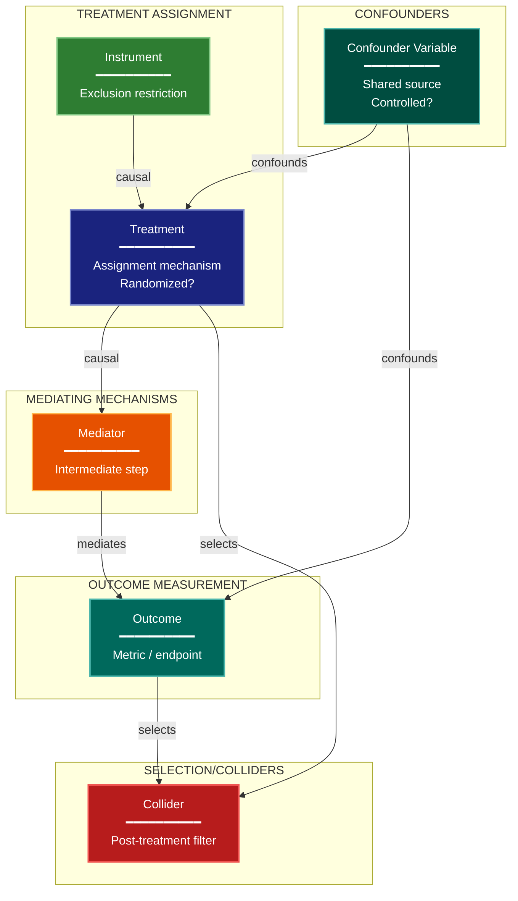

# Causal Assumptions Experimental Design Lens

**Philosophical Mode:** Causal-Structural
**Primary Question:** "What causal assumptions support this design?"
**Focus:** Confounders, Mediators, Colliders, Adjustment Sets, Identification Strategy

## Arguments

`/autoskillit:exp-lens-causal-assumptions [context_path] [experiment_plan_path]`

- **context_path** (optional positional arg 1) — Absolute path to a lens context file
  containing IV/DV tables, H0/H1 hypotheses, controlled variables, and success criteria.
  If provided, read this file before beginning analysis to obtain structured context.
  If omitted, discover context by exploring the CWD.
- **experiment_plan_path** (optional positional arg 2) — Absolute path to the full
  experiment plan. If provided, read for complete experimental methodology and design.
  If omitted, locate the experiment plan by exploring the CWD.

## When to Use

- Experiment claims causal effects
- Pipeline has shared components that might confound
- Need to verify identification strategy
- User invokes `/autoskillit:exp-lens-causal-assumptions` or `/autoskillit:make-experiment-diag causal`

## Critical Constraints

**NEVER:**
- Fabricate, invent, or embellish information not supported by the available evidence or code.

- Modify any source code files
- Do not litter the codebase with useless comments, TODO markers, or explanatory annotations — the skill output and diagram speak for themselves
- Create files outside `{{AUTOSKILLIT_TEMP}}/exp-lens-causal-assumptions/`
- Detach child delegations instead of joining them (joining every child is required)
- Run exploration leaves in the background
- Start independent child delegations sequentially

**ALWAYS:**
- Classify every variable as Treatment, Outcome, Confounder, Mediator, Collider, Instrument, or Selection variable
- Map every directed edge to a concrete code-level data flow
- Flag all unblocked backdoor paths explicitly
- Document the identification strategy with testable assumptions
- BEFORE creating any diagram, LOAD the `/autoskillit:mermaid` skill using the Skill tool - this is MANDATORY
- If the Skill tool cannot be used (disable-model-invocation) or refuses this invocation, do NOT proceed with diagram creation. Abort this step and omit the diagram from output.
- Start all independent child delegations before awaiting any result to maximize concurrency
- Use the registered exploration roles for all repository reads
- Dispatch exactly 6 exploration vectors through the deterministic router
- Route semantic code, symbol, and data-control-flow handoffs to `semantic-code-navigator` and bounded configuration, data, fixture, manifest, generated-artifact, reproduction, test, and pre-existing revision-scoped artifact handoffs to `repository-impact-profiler` through the parent-owned plan
- Wait for every exploration result before classifying variables, building the causal graph, or creating the diagram
- Retain parent authority over causal classification, identification assumptions, Mermaid generation, and output writing
- Write output to `{{AUTOSKILLIT_TEMP}}/exp-lens-causal-assumptions/exp_diag_causal_assumptions_{YYYY-MM-DD_HHMMSS}.md`
- After writing the file, emit the structured output token as **literal plain text** with no
  markdown formatting on the token name (the adjudicator performs a regex match):

  ```
  diagram_path = /absolute/path/to/{{AUTOSKILLIT_TEMP}}/exp-lens-causal-assumptions/exp_diag_causal_assumptions_{...}.md
  ```

---

## Analysis Workflow

### Step 0: Parse optional arguments

If positional arg 1 (context_path) is provided and the file exists, read it to obtain
IV/DV tables, H0/H1 hypotheses, controlled variables, and success criteria. If positional
arg 2 (experiment_plan_path) is provided and exists, read the experiment plan for full
methodology. Use this structured context as the foundation for Steps 1-5; skip the CWD
exploration for these fields if the context file supplies them.

<!-- autoskillit:exploration-vector id="missing-context-fields" -->
After the parent parses the optional context and experiment plan, dispatch repository retrieval only for required fields still absent. Never rediscover or override a supplied complete field. If no fields remain missing, report this vector not applicable and perform no search. If scoped evidence is absent or unrelated, report the field unavailable or unrelated without widening scope, inferring meaning, or importing or executing target code, tests, experiments, models, or benchmarks.
<!-- /autoskillit:exploration-vector -->

### Step 1: Launch 5 Routed Exploration Vectors (SINGLE MESSAGE)

Dispatch all ready, scope-disjoint vectors through the deterministic router in a single message before awaiting any result. Do not iterate across multiple turns.

Do not output any prose between subagent dispatches. Immediately proceed to the next tool call.

Dispatch exactly these five authored vectors under their registered role policies. Mixed code and declarative evidence remains one parent-owned plan; bounded role handoffs return to the originating vector and do not add graph dependencies.

<!-- autoskillit:exploration-vector id="treatment-outcome-definition" -->
1. **Treatment & Outcome Definition** — Find experiment configuration, treatment-assignment code, and outcome measurement through `treatment`, `control`, `outcome`, `response`, `endpoint`, and `metric` evidence. Route bounded configuration and measurement artifacts through the parent to the profiler.
<!-- /autoskillit:exploration-vector -->

<!-- autoskillit:exploration-vector id="confounding-pathways" -->
2. **Confounding Pathways** — Find shared data sources, preprocessing, and environment variables through `shared`, `common`, `config`, `environment`, `seed`, and `global` evidence. Route semantic preprocessing and shared-state code through the parent to the navigator.
<!-- /autoskillit:exploration-vector -->

<!-- autoskillit:exploration-vector id="mediator-mechanism-variables" -->
3. **Mediator & Mechanism Variables** — Find intermediate processing steps between treatment and outcome through `transform`, `preprocess`, `feature`, `intermediate`, and `pipeline` definitions and call paths.
<!-- /autoskillit:exploration-vector -->

<!-- autoskillit:exploration-vector id="collider-selection-variables" -->
4. **Collider & Selection Variables** — Find filtering, subsetting, exclusion, threshold, and selection control flow applied post-treatment through `filter`, `subset`, `exclude`, `condition`, `threshold`, and `select` evidence.
<!-- /autoskillit:exploration-vector -->

<!-- autoskillit:exploration-vector id="randomization-assignment" -->
5. **Randomization & Assignment** — Find how experimental units are assigned to conditions through `random`, `assign`, `allocate`, `split`, `stratify`, and `block` definitions and call paths. Route bounded seed, split, and assignment artifacts through the parent to the profiler.
<!-- /autoskillit:exploration-vector -->

### Step 2: Build the Causal Graph Structure

For each variable identified, classify as: Treatment, Outcome, Confounder, Mediator, Collider, Instrument, or Selection variable. Map directed edges based on code-level data flow. Flag any unblocked backdoor paths.

### Step 3: Identify Causal Assumptions

**CRITICAL — Analyze Claim Direction:**
For every edge in the causal graph, determine:
- Does code implement a causal mechanism (A produces B) or merely a statistical association?
- Is the direction grounded in temporal ordering or domain knowledge?
- Are there feedback loops?

Document each assumption as either testable or untestable, and record the evidence (or lack of evidence) from the codebase.

### Step 4: Create the Diagram

Use flowchart with:

**Direction:** `TB` (causes flow downward to effects)

**Subgraphs:**
- TREATMENT ASSIGNMENT
- MEDIATING MECHANISMS
- OUTCOME MEASUREMENT
- CONFOUNDERS
- SELECTION/COLLIDERS

**Node Styling:**
- `cli` class: Treatment variables
- `output` class: Outcome variables
- `handler` class: Mediators
- `stateNode` class: Confounders
- `detector` class: Colliders and selection variables
- `gap` class: Unblocked backdoor paths
- `newComponent` class: Instruments

**Edge Labels:** causal, confounds, selects, mediates, blocks

### Step 5: Write Output

Write the diagram to: `{{AUTOSKILLIT_TEMP}}/exp-lens-causal-assumptions/exp_diag_causal_assumptions_{YYYY-MM-DD_HHMMSS}.md` (relative to the current working directory)

---

## Output Template

```markdown
# Causal Assumptions Diagram: {Experiment Name}

**Lens:** Causal Assumptions (Causal-Structural)
**Question:** What causal assumptions support this design?
**Date:** {YYYY-MM-DD}
**Scope:** {What was analyzed}

## Causal Variables

| Variable | Type | Measured? | Controlled? |
|----------|------|-----------|-------------|
| {name} | {Treatment/Outcome/Confounder/Mediator/Collider/Instrument/Selection} | {Yes/No} | {Yes/No} |

## Causal DAG


```mermaid
%%{init: {'flowchart': {'nodeSpacing': 50, 'rankSpacing': 60, 'curve': 'basis'}}}%%
flowchart TB
    %% CLASS DEFINITIONS %%
    classDef cli fill:#1a237e,stroke:#7986cb,stroke-width:2px,color:#fff;
    classDef stateNode fill:#004d40,stroke:#4db6ac,stroke-width:2px,color:#fff;
    classDef handler fill:#e65100,stroke:#ffb74d,stroke-width:2px,color:#fff;
    classDef phase fill:#6a1b9a,stroke:#ba68c8,stroke-width:2px,color:#fff;
    classDef newComponent fill:#2e7d32,stroke:#81c784,stroke-width:2px,color:#fff;
    classDef output fill:#00695c,stroke:#4db6ac,stroke-width:2px,color:#fff;
    classDef detector fill:#b71c1c,stroke:#ef5350,stroke-width:2px,color:#fff;
    classDef gap fill:#ff6f00,stroke:#ffa726,stroke-width:2px,color:#000;
    classDef integration fill:#c62828,stroke:#ef9a9a,stroke-width:2px,color:#fff;

    subgraph Confounders ["CONFOUNDERS"]
        CONF["Confounder Variable<br/>━━━━━━━━━━<br/>Shared source<br/>Controlled?"]
    end

    subgraph Treatment ["TREATMENT ASSIGNMENT"]
        TREAT["Treatment<br/>━━━━━━━━━━<br/>Assignment mechanism<br/>Randomized?"]
        INSTR["Instrument<br/>━━━━━━━━━━<br/>Exclusion restriction"]
    end

    subgraph Mediators ["MEDIATING MECHANISMS"]
        MED["Mediator<br/>━━━━━━━━━━<br/>Intermediate step"]
    end

    subgraph Outcome ["OUTCOME MEASUREMENT"]
        OUT["Outcome<br/>━━━━━━━━━━<br/>Metric / endpoint"]
    end

    subgraph Selection ["SELECTION/COLLIDERS"]
        COLL["Collider<br/>━━━━━━━━━━<br/>Post-treatment filter"]
    end

    %% CAUSAL EDGES %%
    CONF -->|"confounds"| TREAT
    CONF -->|"confounds"| OUT
    INSTR -->|"causal"| TREAT
    TREAT -->|"causal"| MED
    MED -->|"mediates"| OUT
    TREAT -->|"selects"| COLL
    OUT -->|"selects"| COLL

    %% CLASS ASSIGNMENTS %%
    class TREAT cli;
    class OUT output;
    class MED handler;
    class CONF stateNode;
    class COLL detector;
    class INSTR newComponent;
```

**Color Legend:**
| Color | Category | Description |
|-------|----------|-------------|
| Dark Blue | Treatment | Treatment assignment variables |
| Dark Teal | Outcome | Outcome measurement variables |
| Orange | Mediator | Intermediate mechanism variables |
| Teal | Confounder | Shared causes of treatment and outcome |
| Red | Collider/Selection | Post-treatment filters (conditioning risk) |
| Green | Instrument | Variables affecting only treatment |
| Amber | Backdoor Path | Unblocked confounding path |

## Identification Strategy

| Assumption | Testable? | Evidence |
|------------|-----------|----------|
| {assumption} | {Yes/No} | {evidence from codebase} |

## Unblocked Backdoor Paths

| Path | Variables | Severity | Mitigation |
|------|-----------|----------|------------|
| {path} | {A -> ... -> B} | {High/Medium/Low} | {adjustment/unavailable} |
```

---

## Pre-Diagram Checklist

Before creating the diagram, verify:

- [ ] LOADED `/autoskillit:mermaid` skill using the Skill tool
- [ ] Using ONLY classDef styles from the mermaid skill (no invented colors)
- [ ] Diagram will include a color legend table

---

## Related Skills

- `/autoskillit:make-experiment-diag` - Parent skill for lens selection
- `/autoskillit:mermaid` - MUST BE LOADED before creating diagram
- `/autoskillit:exp-lens-estimand-clarity` - For clarifying the target estimand
- `/autoskillit:exp-lens-validity-threats` - For broader validity threat inventory
