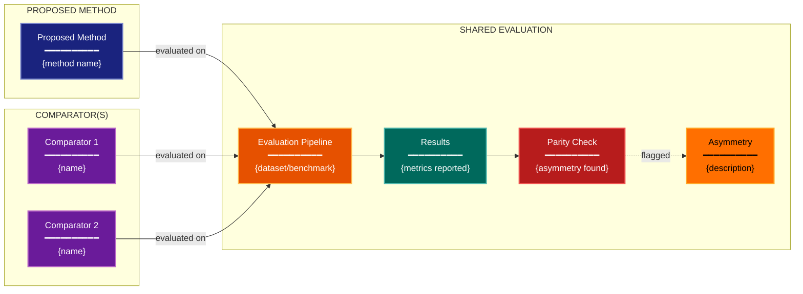

# Comparator Construction Experimental Design Lens

**Philosophical Mode:** Counterfactual
**Primary Question:** "Is the comparator fair and relevant?"
**Focus:** Baseline Choice, Control Realism, Version Matching, Effort Symmetry, Baseline Drift

## Arguments

`/autoskillit:exp-lens-comparator-construction [context_path] [experiment_plan_path]`

- **context_path** (optional positional arg 1) — Absolute path to a lens context file
  containing IV/DV tables, H0/H1 hypotheses, controlled variables, and success criteria.
  If provided, read this file before beginning analysis to obtain structured context.
  If omitted, discover context by exploring the CWD.
- **experiment_plan_path** (optional positional arg 2) — Absolute path to the full
  experiment plan. If provided, read for complete experimental methodology and design.
  If omitted, locate the experiment plan by exploring the CWD.

## When to Use

- Benchmark comparisons where baseline quality is questioned
- Ablation studies needing fair controls
- Claims of improvement over prior work
- User invokes `/autoskillit:exp-lens-comparator-construction` or `/autoskillit:make-experiment-diag comparator`

## Critical Constraints

**NEVER:**
- Modify any source code or experiment files
- Do not litter the codebase with useless comments, TODO markers, or explanatory annotations — the skill output and diagram speak for themselves
- Accept at face value that baselines received symmetric treatment
- Create files outside `.autoskillit/temp/exp-lens-comparator-construction/`

**ALWAYS:**
- Build a fairness matrix covering all treatment-vs-comparator pairs
- Check for confounding differences in implementation, tuning, data access, and compute
- Assess whether each comparator is the best available alternative at the time of the experiment
- Identify temporal drift in baseline relevance
- BEFORE creating any diagram, LOAD the `/autoskillit:mermaid` skill using the Skill tool - this is MANDATORY
- If the Skill tool cannot be used (disable-model-invocation) or refuses this invocation, do NOT proceed with diagram creation. Abort this step and omit the diagram from output.
- Write output to `.autoskillit/temp/exp-lens-comparator-construction/exp_diag_comparator_construction_{YYYY-MM-DD_HHMMSS}.md`
- After writing the file, emit the structured output token as **literal plain text** with no
  markdown formatting on the token name (the adjudicator performs a regex match):

  ```
  diagram_path = /absolute/path/to/.autoskillit/temp/exp-lens-comparator-construction/exp_diag_comparator_construction_{...}.md
  %%ORDER_UP%%
  ```

---

## Analysis Workflow

### Step 0: Parse optional arguments

If positional arg 1 (context_path) is provided and the file exists, read it to obtain
IV/DV tables, H0/H1 hypotheses, controlled variables, and success criteria. If positional
arg 2 (experiment_plan_path) is provided and exists, read the experiment plan for full
methodology. Use this structured context as the foundation for Steps 1-5; skip the CWD
exploration for these fields if the context file supplies them.

### Step 1: Launch Parallel Exploration Subagents

Spawn Explore subagents to investigate:

**Baseline/Control Definitions**
- Find what the proposed method is compared against
- Look for: baseline, control, comparison, prior, state-of-the-art, vanilla, default, reference

**Implementation Parity**
- Find whether baselines get equal engineering effort
- Look for: reproduce, reimplement, original, paper, author, tuned, optimized, hyperparameter

**Version & Environment Match**
- Find whether baselines use the same software/hardware environment
- Look for: version, library, framework, gpu, hardware, environment, checkpoint

**Tuning Protocol Symmetry**
- Find whether hyperparameter tuning is symmetric
- Look for: tune, search, grid, optuna, sweep, budget, trials, epochs

**Temporal Baseline Drift**
- Find whether baselines have been updated or are stale
- Look for: date, published, year, updated, latest, deprecated, legacy

### Step 2: Build the Comparator Inventory

For each comparator, assess:
1. Is it the best available alternative?
2. Is it given equal engineering effort?
3. Is it run in the same environment?
4. Is the tuning budget symmetric?
5. Has it drifted since originally published?

### Step 3: Construct the Fairness Matrix

**CRITICAL — Analyze Counterfactual Quality:**
For each treatment-vs-comparator pair:
- Does the comparison isolate the intended factor?
- Are there confounding differences in implementation, tuning, data access, or compute?

Build a fairness matrix with rows = comparators, columns = fairness dimensions.

### Step 4: Create the Optional Comparison Diagram

If a diagram adds value, create a simplified flowchart. This is OPTIONAL for this hybrid lens — the tables are the primary output.

**Direction:** `LR` (treatment and comparator flow in parallel toward evaluation)

**Subgraphs:** "PROPOSED METHOD", "COMPARATOR(S)", "SHARED EVALUATION"

**Node Styling:**
- `cli` class: proposed method nodes
- `phase` class: comparator method nodes
- `handler` class: shared evaluation pipeline nodes
- `output` class: results nodes
- `gap` class: asymmetries flagged
- `detector` class: parity checks

### Step 5: Write Output

Write the analysis to: `.autoskillit/temp/exp-lens-comparator-construction/exp_diag_comparator_construction_{YYYY-MM-DD_HHMMSS}.md` (relative to the current working directory)

---

## Output Template

```markdown
# Comparator Construction Analysis: {Experiment Name}

**Lens:** Comparator Construction (Counterfactual)
**Question:** Is the comparator fair and relevant?
**Date:** {YYYY-MM-DD}
**Scope:** {What was analyzed}

## Comparator Inventory

| Comparator | Source | Reimplemented? | Same Environment? | Same Tuning Budget? |
|------------|--------|---------------|-------------------|---------------------|
| {name} | {paper/repo} | Yes / No / Partial | Yes / No | Yes / No / Unknown |

## Fairness Matrix

| Comparator | Best Available? | Equal Effort? | Same Env? | Symmetric Tuning? | Temporally Current? |
|------------|----------------|--------------|-----------|-------------------|---------------------|
| {name} | Yes / No | Yes / No | Yes / No | Yes / No | Yes / No |

## Comparison Diagram (Optional)



**Color Legend:**
| Color | Category | Description |
|-------|----------|-------------|
| Dark Blue | Proposed Method | The method being evaluated |
| Purple | Comparators | Baselines and controls |
| Orange | Evaluation | Shared evaluation pipeline |
| Dark Teal | Results | Reported outcomes |
| Red | Parity Checks | Fairness verification points |
| Yellow | Asymmetries | Flagged unfair differences |

## Asymmetry Register

| # | Asymmetry | Affects | Impact Assessment | Remediation |
|---|-----------|---------|-------------------|-------------|
| 1 | {description} | {comparator(s)} | High / Medium / Low | {how to fix} |

## Recommendations

1. {Most critical fairness fix — e.g., retune baseline with same budget}
2. {Version alignment or environment standardization needed}
3. {Additional comparator that should be included}
```

---

## Pre-Diagram Checklist

Before creating the diagram, verify:

- [ ] LOADED `/autoskillit:mermaid` skill using the Skill tool
- [ ] Using ONLY classDef styles from the mermaid skill (no invented colors)
- [ ] Diagram will include a color legend table

---

## Related Skills

- `/autoskillit:make-experiment-diag` - Parent skill for lens selection
- `/autoskillit:mermaid` - MUST BE LOADED before creating diagram
- `/autoskillit:exp-lens-estimand-clarity` - For clarifying what the comparison is measuring
- `/autoskillit:exp-lens-fair-comparison` - For deeper analysis of evaluation protocol fairness
