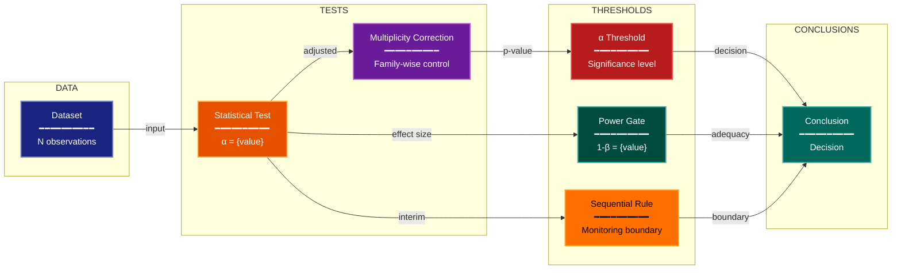

# Error Budget Experimental Design Lens

**Philosophical Mode:** Statistical
**Primary Question:** "Are error risks sized and controlled?"
**Focus:** Type I/II Errors, Power, Minimum Detectable Effect, Multiplicity, Sequential Monitoring

## Arguments

`/autoskillit:exp-lens-error-budget [context_path] [experiment_plan_path]`

- **context_path** (optional positional arg 1) — Absolute path to a lens context file
  containing IV/DV tables, H0/H1 hypotheses, controlled variables, and success criteria.
  If provided, read this file before beginning analysis to obtain structured context.
  If omitted, discover context by exploring the CWD.
- **experiment_plan_path** (optional positional arg 2) — Absolute path to the full
  experiment plan. If provided, read for complete experimental methodology and design.
  If omitted, locate the experiment plan by exploring the CWD.

## When to Use

- Need to verify statistical power before running an experiment
- Multiple comparisons are performed without a stated correction strategy
- Sequential testing or interim analysis is in use without defined stopping rules
- User invokes `/autoskillit:exp-lens-error-budget` or `/autoskillit:make-experiment-diag error`

## Critical Constraints

**NEVER:**
- Fabricate, invent, or embellish information not supported by the available evidence or code.

- Modify any source code files
- Do not litter the codebase with useless comments, TODO markers, or explanatory annotations — the skill output and diagram speak for themselves
- Accept default alpha=0.05 without checking whether it is appropriate for the decision context
- Create files outside `{{AUTOSKILLIT_TEMP}}/exp-lens-error-budget/`
- Run subagents in the background (`run_in_background: true` is prohibited)
- Issue subagent Task calls sequentially — ALL must be in a single parallel message

**ALWAYS:**
- Enumerate every statistical test and account for its error contribution
- Distinguish per-test error rates from family-wise error rates
- Flag any sequential peeking without a formal stopping rule as a critical defect
- Evaluate whether the minimum detectable effect is practically meaningful, not just statistically chosen
- BEFORE creating any diagram, LOAD the `/autoskillit:mermaid` skill using the Skill tool - this is MANDATORY
- If the Skill tool cannot be used (disable-model-invocation) or refuses this invocation, do NOT proceed with diagram creation. Abort this step and omit the diagram from output.
- Issue all Task calls in a single message to maximize parallelism
- Write output to `{{AUTOSKILLIT_TEMP}}/exp-lens-error-budget/exp_diag_error_budget_{YYYY-MM-DD_HHMMSS}.md`
- After writing the file, emit the structured output token as **literal plain text** with no
  markdown formatting on the token name (the adjudicator performs a regex match):

  ```
  diagram_path = /absolute/path/to/{{AUTOSKILLIT_TEMP}}/exp-lens-error-budget/exp_diag_error_budget_{...}.md
  ```

---

## Analysis Workflow

### Step 0: Parse optional arguments

If positional arg 1 (context_path) is provided and the file exists, read it to obtain
IV/DV tables, H0/H1 hypotheses, controlled variables, and success criteria. If positional
arg 2 (experiment_plan_path) is provided and exists, read the experiment plan for full
methodology. Use this structured context as the foundation for Steps 1-5; skip the CWD
exploration for these fields if the context file supplies them. For any field absent from the context file, perform CWD exploration for that specific field only.

### Step 1: Launch Parallel Exploration Subagents (SINGLE MESSAGE)

**Issue ALL Explore/Task subagent calls in a single message — one per item — so they execute in parallel. Do NOT iterate across multiple turns.**

Do not output any prose between subagent dispatches. Immediately proceed to the next tool call.

Spawn Explore subagents to investigate:

**Sample Size & Power**
- Find power calculations or sample size justifications
- Look for: power, sample_size, n_samples, effect_size, minimum_detectable, mde

**Multiple Comparisons**
- Find all statistical tests performed and correction strategies
- Look for: bonferroni, fdr, holm, bh, correction, multiple, comparisons, tests

**Sequential Analysis**
- Find interim analyses, stopping rules, or sequential monitoring
- Look for: interim, early_stopping, sequential, alpha_spending, peek, monitor

**Decision Thresholds**
- Find significance thresholds and decision rules
- Look for: alpha, p_value, threshold, significance, reject, null, hypothesis

**Effect Size Context**
- Find practical significance alongside statistical significance
- Look for: effect_size, cohen, practical, meaningful, magnitude, difference

### Step 2: Build the Error Budget

For each statistical claim:
1. What is the per-test Type I error rate?
2. What is the family-wise Type I error rate?
3. What is the power (1 - Type II error)?
4. What is the minimum detectable effect?
5. Is sequential monitoring in use, and if so, what stopping rule is defined?
6. Is the chosen alpha appropriate for the decision context?

### Step 3: Analyze Error Allocation

For each test, rate alignment as: ALIGNED / CONVENTIONAL / MISALIGNED

### Step 4: Create Optional Decision-Flow Diagram

If a diagram adds value, show Data → Tests → Thresholds → Conclusions, with labeled error rates.

### Step 5: Write Output

Write the analysis to: `{{AUTOSKILLIT_TEMP}}/exp-lens-error-budget/exp_diag_error_budget_{YYYY-MM-DD_HHMMSS}.md` (relative to the current working directory)


## Output Template

```markdown
# Error Budget Analysis: {Experiment Name}

**Lens:** Error Budget (Statistical)
**Question:** Are error risks sized and controlled?
**Date:** {YYYY-MM-DD}
**Scope:** {What was analyzed}

## Error Budget

| Test | α (per-test) | Family-wise α | Power (1-β) | MDE | Sequential Rule | Alignment |
|------|-------------|---------------|-------------|-----|-----------------|-----------|
| {test} | {α} | {α_fw} | {power} | {mde} | {rule or N/A} | {ALIGNED/CONVENTIONAL/MISALIGNED} |

## Decision-Flow Diagram



**Color Legend:**
| Color | Category | Description |
|-------|----------|-------------|
| Dark Blue | Data | Input datasets |
| Orange | Tests | Statistical tests performed |
| Purple | Multiplicity | Multiple comparison corrections |
| Red | α Threshold | Significance decision thresholds |
| Teal | Power | Statistical power assessments |
| Amber | Sequential | Sequential monitoring rules |
| Dark Teal | Conclusions | Final statistical decisions |

## Recommendations

- {Recommendation 1}
- {Recommendation 2}
```

---

## Pre-Diagram Checklist


Before creating the diagram, verify:

- [ ] LOADED `/autoskillit:mermaid` skill using the Skill tool
- [ ] Using ONLY classDef styles from the mermaid skill (no invented colors)
- [ ] Diagram will include a color legend table

---

## Related Skills

- `/autoskillit:make-experiment-diag` - Parent skill
- `/autoskillit:mermaid` - MUST BE LOADED before creating diagram
- `/autoskillit:exp-lens-severity-testing`
- `/autoskillit:exp-lens-variance-stability`
