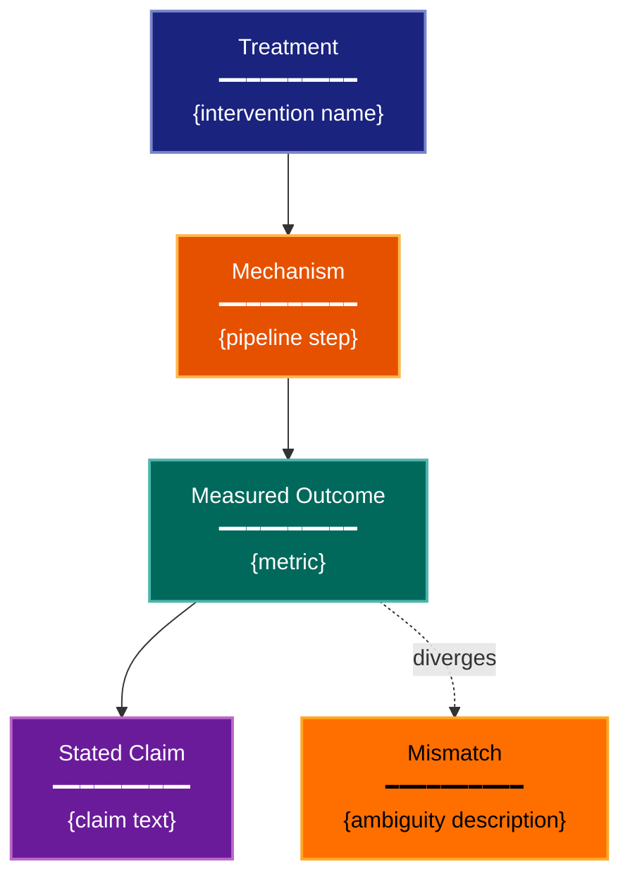

# Estimand Clarity Experimental Design Lens

**Philosophical Mode:** Evidential
**Primary Question:** "What exactly is the claim?"
**Focus:** Effect Definition, Target Population, Outcome Specification, Comparator, Aggregation Level, Complication Handling

## Arguments

`/autoskillit:exp-lens-estimand-clarity [context_path] [experiment_plan_path]`

- **context_path** (optional positional arg 1) — Absolute path to a lens context file
  containing IV/DV tables, H0/H1 hypotheses, controlled variables, and success criteria.
  If provided, read this file before beginning analysis to obtain structured context.
  If omitted, discover context by exploring the CWD.
- **experiment_plan_path** (optional positional arg 2) — Absolute path to the full
  experiment plan. If provided, read for complete experimental methodology and design.
  If omitted, locate the experiment plan by exploring the CWD.

## When to Use

- Experiment has unclear or shifting hypotheses
- Multiple stakeholders interpret results differently
- Claims mix causal and predictive language
- User invokes `/autoskillit:exp-lens-estimand-clarity` or `/autoskillit:make-experiment-diag estimand`

## Critical Constraints

**NEVER:**
- Modify any source code or experiment files
- Do not litter the codebase with useless comments, TODO markers, or explanatory annotations — the skill output and diagram speak for themselves
- Create files outside `.autoskillit/temp/exp-lens-estimand-clarity/`

**ALWAYS:**
- Decompose every stated claim into formal contrast notation (Treatment A vs Treatment B on Outcome Y in Population Z)
- Flag every mismatch between prose claims and code implementation
- Identify the aggregation level (unit, group, time) explicitly
- Document how complications (missing data, failures, exclusions) are handled
- BEFORE creating any diagram, LOAD the `/autoskillit:mermaid` skill using the Skill tool - this is MANDATORY
- If the Skill tool cannot be used (disable-model-invocation) or refuses this invocation, do NOT proceed with diagram creation. Abort this step and omit the diagram from output.
- Write output to `.autoskillit/temp/exp-lens-estimand-clarity/exp_diag_estimand_clarity_{YYYY-MM-DD_HHMMSS}.md`
- After writing the file, emit the structured output token as **literal plain text** with no
  markdown formatting on the token name (the adjudicator performs a regex match):

  ```
  diagram_path = /absolute/path/to/.autoskillit/temp/exp-lens-estimand-clarity/exp_diag_estimand_clarity_{...}.md
  %%ORDER_UP%%
  ```

---

## Analysis Workflow

### Step 0: Parse optional arguments

If positional arg 1 (context_path) is provided and the file exists, read it to obtain
IV/DV tables, H0/H1 hypotheses, controlled variables, and success criteria. If positional
arg 2 (experiment_plan_path) is provided and exists, read the experiment plan for full
methodology. Use this structured context as the foundation for Steps 1-5; skip the CWD
exploration for these fields if the context file supplies them.

### Step 1: Launch Parallel Exploration Subagents

Spawn Explore subagents to investigate:

**Stated Claims & Hypotheses**
- Find hypothesis statements, research questions, README claims
- Look for: hypothesis, claim, goal, objective, question, we show, we demonstrate, improves, outperforms

**Treatment Definition**
- Find what intervention or manipulation is applied
- Look for: treatment, intervention, method, approach, condition, configuration, ablation

**Outcome Definition**
- Find what is measured as the result
- Look for: outcome, metric, measure, endpoint, target, response, dependent

**Population & Scope**
- Find what units, datasets, or contexts the claim covers
- Look for: dataset, population, sample, domain, task, benchmark, scenario, setting

**Complication Handling**
- Find how missing data, failures, timeouts, or exclusions are handled
- Look for: missing, exclude, timeout, fail, drop, impute, censor, incomplete

### Step 2: Extract the Implicit Estimand

Answer each question from the code (not the docs):
1. What is the treatment?
2. What is the comparator?
3. What is the outcome?
4. What is the population?
5. What is the time horizon?
6. How are complications handled?

### Step 3: Compare Claims to Implementation

Compare the explicit claims (from docs/papers) to the implicit estimand (from code). Flag mismatches between what the prose asserts and what the implementation actually measures.

**CRITICAL — Analyze Claim Precision:**
For every stated claim:
- Can you write it as a formal contrast (Treatment A vs Treatment B on Outcome Y in Population Z)? If not, what is ambiguous?
- Does the code measure what the prose claims?

### Step 4: Create the Optional Claim-Flow Diagram

If a diagram adds value, create a simplified flowchart. This is OPTIONAL for this hybrid lens — the tables are the primary output.

**Direction:** `TB` (claim flows from intervention through measurement to conclusion)

**Small diagram: 4-6 nodes showing Treatment → Mechanism → Outcome → Claim**

**Node Styling:**
- `cli` class: treatment/intervention nodes
- `handler` class: mechanism/pipeline nodes
- `output` class: measured outcome nodes
- `phase` class: stated claim nodes
- `gap` class: ambiguity or mismatch between claim and measurement

### Step 5: Write Output

Write the analysis to: `.autoskillit/temp/exp-lens-estimand-clarity/exp_diag_estimand_clarity_{YYYY-MM-DD_HHMMSS}.md` (relative to the current working directory)

---

## Output Template

```markdown
# Estimand Clarity Analysis: {Experiment Name}

**Lens:** Estimand Clarity (Evidential)
**Question:** What exactly is the claim?
**Date:** {YYYY-MM-DD}
**Scope:** {What was analyzed}

## Estimand Decomposition

| Component | Stated | Implemented | Match? |
|-----------|--------|-------------|--------|
| Treatment | {from prose} | {from code} | Yes / No / Partial |
| Comparator | {from prose} | {from code} | Yes / No / Partial |
| Outcome | {from prose} | {from code} | Yes / No / Partial |
| Population | {from prose} | {from code} | Yes / No / Partial |
| Time Horizon | {from prose} | {from code} | Yes / No / Partial |
| Complication Handling | {from prose} | {from code} | Yes / No / Partial |

## Claim Precision Assessment

| Claim | Formal Contrast | Ambiguities |
|-------|----------------|-------------|
| "{stated claim}" | Treatment A vs B on Y in Z | {list ambiguities} |

## Claim-Flow Diagram (Optional)



**Color Legend:**
| Color | Category | Description |
|-------|----------|-------------|
| Dark Blue | Treatment | Intervention applied |
| Orange | Mechanism | Pipeline processing |
| Dark Teal | Outcome | Measured result |
| Purple | Claim | Stated conclusion |
| Yellow | Mismatch | Ambiguity or claim-code divergence |

## Ambiguity Register

| # | Ambiguity | Location | Severity | Resolution Needed |
|---|-----------|----------|----------|-------------------|
| 1 | {description} | {file/section} | High / Medium / Low | {what to clarify} |

## Recommendations

1. {Specific action to resolve most critical ambiguity}
2. {Rewrite suggestion for vague claim}
3. {Code change to align implementation with stated estimand}
```

---

## Pre-Diagram Checklist

Before creating the diagram, verify:

- [ ] LOADED `/autoskillit:mermaid` skill using the Skill tool
- [ ] Using ONLY classDef styles from the mermaid skill (no invented colors)
- [ ] Diagram will include a color legend table

---

## Related Skills

- `/autoskillit:make-experiment-diag` - Parent skill for lens selection
- `/autoskillit:mermaid` - MUST BE LOADED before creating diagram
- `/autoskillit:exp-lens-causal-assumptions` - For causal structure of the stated claim
- `/autoskillit:exp-lens-measurement-validity` - For whether the outcome metric is valid
