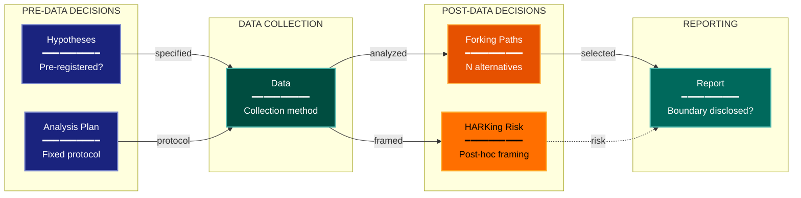

# Exploratory-Confirmatory Experimental Design Lens

**Philosophical Mode:** Boundary
**Primary Question:** "Is this discovery or test, and are norms aligned?"
**Focus:** Pre-specification, Analytic Flexibility, HARKing Detection, Garden of Forking Paths, Transparent Reporting

## Arguments

`/autoskillit:exp-lens-exploratory-confirmatory [context_path] [experiment_plan_path]`

- **context_path** (optional positional arg 1) — Absolute path to a lens context file
  containing IV/DV tables, H0/H1 hypotheses, controlled variables, and success criteria.
  If provided, read this file before beginning analysis to obtain structured context.
  If omitted, discover context by exploring the CWD.
- **experiment_plan_path** (optional positional arg 2) — Absolute path to the full
  experiment plan. If provided, read for complete experimental methodology and design.
  If omitted, locate the experiment plan by exploring the CWD.

## When to Use

- Study mixes exploration and confirmation without clear boundaries
- Post-hoc hypotheses presented as pre-specified
- Many analyses run but only significant ones reported
- User invokes `/autoskillit:exp-lens-exploratory-confirmatory` or `/autoskillit:make-experiment-diag exploratory`

## Critical Constraints

**NEVER:**
- Fabricate, invent, or embellish information not supported by the available evidence or code.

- Modify any source code files
- Create files outside `{{AUTOSKILLIT_TEMP}}/exp-lens-exploratory-confirmatory/`
- Run subagents in the background (`run_in_background: true` is prohibited)
- Issue subagent Task calls sequentially — ALL must be in a single parallel message

**ALWAYS:**
- Map the full analytic timeline — what was decided before vs. after seeing data
- Count forking paths honestly — every analysis choice is a potential fork
- Distinguish genuine exploration (hypothesis-generating) from HARKing (hypothesis-after-results)
- Flag absent preregistration as a finding without assuming bad faith
- BEFORE creating any diagram, LOAD the `/autoskillit:mermaid` skill using the Skill tool - this is MANDATORY
- If the Skill tool cannot be used (disable-model-invocation) or refuses this invocation, do NOT proceed with diagram creation. Abort this step and omit the diagram from output.
- Issue all Task calls in a single message to maximize parallelism
- Write output to `{{AUTOSKILLIT_TEMP}}/exp-lens-exploratory-confirmatory/exp_diag_exploratory_confirmatory_{YYYY-MM-DD_HHMMSS}.md`
- After writing the file, emit the structured output token as **literal plain text** with no
  markdown formatting on the token name (the adjudicator performs a regex match):

  ```
  diagram_path = /absolute/path/to/{{AUTOSKILLIT_TEMP}}/exp-lens-exploratory-confirmatory/exp_diag_exploratory_confirmatory_{...}.md
  ```

---

## Analysis Workflow

### Step 0: Parse optional arguments

If positional arg 1 (context_path) is provided and the file exists, read it to obtain
IV/DV tables, H0/H1 hypotheses, controlled variables, and success criteria. If positional
arg 2 (experiment_plan_path) is provided and exists, read the experiment plan for full
methodology. Use this structured context as the foundation for Steps 1-5; skip the CWD
exploration for these fields if the context file supplies them. For any field absent from the context file, perform CWD exploration for that specific field only.

### Step 1: Launch Parallel Exploration Subagents (SINGLE MESSAGE)

**Issue ALL Explore/Task subagent calls in a single message — one per item — so they execute in parallel. Do NOT iterate across multiple turns.**

Do not output any prose between subagent dispatches. Immediately proceed to the next tool call.

Spawn Explore subagents to investigate:

**Pre-specified Plans**
- Find pre-registration documents, analysis plans, hypothesis files
- Look for: preregister, analysis_plan, hypothesis, registered, protocol, spec

**Analytic Flexibility**
- Find places where multiple analysis paths were possible
- Look for: alternatively, could_also, option, variant, subset, sensitivity, robustness

**Selective Reporting Signals**
- Find evidence of selective reporting or cherry-picking
- Look for: not_significant, excluded, not_shown, supplementary, additional, hidden

**Post-Hoc Rationalization**
- Find language suggesting post-hoc hypothesis generation
- Look for: we_noticed, interestingly, surprisingly, unexpectedly, upon_inspection

**Exploration-Confirmation Separation**
- Find explicit statements about exploratory vs. confirmatory intent
- Look for: exploratory, pilot, hypothesis_generating, confirmatory, pre_specified

### Step 2: Map Analytic Timeline

What was decided before vs. after seeing data? Where is the exploration/confirmation boundary? Count forking paths.

### Step 3: Analyze Boundary Integrity

For every reported result: Was the analysis plan fixed pre-outcome? How many alternatives could have been run? Does reporting distinguish exploratory from confirmatory? Assess survivorship bias.

### Step 4: Create the Diagram (Optional)

**Direction:** LR (time flows left to right). Pre-data decisions → Data collection → Post-data decisions → Reporting

### Step 5: Write Output

Write the output to: `{{AUTOSKILLIT_TEMP}}/exp-lens-exploratory-confirmatory/exp_diag_exploratory_confirmatory_{YYYY-MM-DD_HHMMSS}.md` (relative to the current working directory)


## Output Template

```markdown
# Exploratory-Confirmatory Analysis: {Experiment Name}

**Lens:** Exploratory-Confirmatory (Boundary)
**Question:** Is this discovery or test, and are norms aligned?
**Date:** {YYYY-MM-DD}
**Scope:** {What was analyzed}

## Analytic Timeline

| Decision | Pre/Post Data | Forking Paths | HARKing Risk | Verdict |
|----------|---------------|---------------|--------------|---------|
| {decision} | {Pre/Post} | {count} | {High/Medium/Low/None} | {Exploratory/Confirmatory/Mixed} |

## Boundary Diagram



**Color Legend:**
| Color | Category | Description |
|-------|----------|-------------|
| Dark Blue | Pre-Data | Decisions made before seeing data |
| Teal | Data | Data collection stage |
| Orange | Forking Paths | Post-data analytic choices |
| Amber | HARKing | Hypothesizing After Results Known |
| Dark Teal | Reporting | Final reported results |

## Recommendations

- {Recommendation 1}
- {Recommendation 2}
```

---

## Pre-Diagram Checklist


Before creating the diagram, verify:

- [ ] LOADED `/autoskillit:mermaid` skill using the Skill tool
- [ ] Using ONLY classDef styles from the mermaid skill (no invented colors)
- [ ] Diagram will include a color legend table

---

## Related Skills

- `/autoskillit:make-experiment-diag` - Parent skill
- `/autoskillit:mermaid` - MUST BE LOADED before creating diagram
- `/autoskillit:exp-lens-severity-testing`
- `/autoskillit:exp-lens-sensitivity-robustness`
