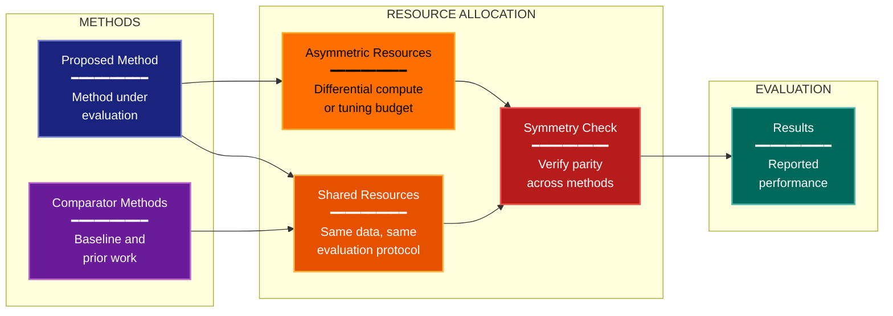

# Fair Comparison Experimental Design Lens

**Philosophical Mode:** Fairness
**Primary Question:** "Are alternatives compared under symmetric constraints?"
**Focus:** Compute Budget Symmetry, Tuning Protocol Parity, Data Access Equality, Engineering Effort Balance, Winner's Curse

## When to Use

- Method comparisons where tuning effort differs
- Benchmark results where compute budgets are unequal
- Claims of SOTA that may reflect process differences
- User invokes `/autoskillit:exp-lens-fair-comparison` or `/autoskillit:make-experiment-diag fairness`

## Critical Constraints

**NEVER:**
- Modify any source code files
- Do not litter the codebase with useless comments, TODO markers, or explanatory annotations — the skill output and diagram speak for themselves
- Create files outside `.autoskillit/temp/exp-lens-fair-comparison/`

**ALWAYS:**
- Build the full symmetry matrix — every method against every resource dimension
- Attribute improvements to method vs. process — both deserve accounting
- Flag undisclosed compute or tuning as a finding, not an assumption
- Assess the winner's curse: did the proposed method benefit from more selection pressure?
- BEFORE creating any diagram, LOAD the `/autoskillit:mermaid` skill using the Skill tool - this is MANDATORY
- Write output to `.autoskillit/temp/exp-lens-fair-comparison/exp_diag_fair_comparison_{YYYY-MM-DD_HHMMSS}.md`
- After writing the file, emit the structured output token as **literal plain text** with no
  markdown formatting on the token name (the adjudicator performs a regex match):

  ```
  diagram_path = /absolute/path/to/.autoskillit/temp/exp-lens-fair-comparison/exp_diag_fair_comparison_{...}.md
  %%ORDER_UP%%
  ```

---

## Analysis Workflow

### Step 1: Launch Parallel Exploration Subagents

Spawn Explore subagents to investigate:

**Compute & Resource Allocation**
- Find compute resources used per method
- Look for: gpu, tpu, hours, cost, memory, flops, compute_budget, machine, cluster

**Tuning Protocol per Method**
- Find tuning procedures for each compared method
- Look for: grid_search, optuna, bayesian_opt, hyperband, tune, sweep, trials, budget, early_stop

**Data Access & Preprocessing**
- Find whether all methods use the same data pipeline
- Look for: data_augmentation, preprocessing, feature, embedding, pretrained, extra_data, auxiliary

**Engineering Effort Indicators**
- Find differential engineering investment
- Look for: custom, specialized, trick, hack, ensemble, post_process, calibrate, threshold_tune

**Reporting Completeness**
- Find whether resource usage is disclosed
- Look for: report, disclose, computational_cost, wall_time, parameter_count, training_time

### Step 2: Build Symmetry Matrix

Build the symmetry matrix: rows = methods compared, columns = resource dimensions (compute, tuning, data, engineering, disclosure).

For each cell:
- Is the allocation symmetric?
- If not, does the asymmetry favor the proposed method?
- Estimate the magnitude of bias from each asymmetry.

### Step 3: Analyze Effort Attribution

**CRITICAL — Analyze Effort Attribution:**
For every claimed improvement:
- What fraction of the improvement can be attributed to the method itself vs. differential engineering effort, tuning budget, or data access?

### Step 4: Create the Diagram

Use the mermaid skill conventions to create a symmetry diagram with:

**Direction:** `LR` (methods flow through resource allocation to evaluation)

**Subgraphs:**
- METHODS
- RESOURCE ALLOCATION
- EVALUATION

**Node Styling:**
- `cli` class: Proposed method
- `phase` class: Comparator methods
- `handler` class: Shared resources
- `gap` class: Asymmetric resources
- `detector` class: Symmetry checks
- `output` class: Results

### Step 5: Write Output

Write the diagram to: `.autoskillit/temp/exp-lens-fair-comparison/exp_diag_fair_comparison_{YYYY-MM-DD_HHMMSS}.md` (relative to the current working directory)

---

## Output Template

```markdown
# Fair Comparison Analysis: {Experiment Name}

**Lens:** Fair Comparison (Fairness)
**Question:** Are alternatives compared under symmetric constraints?
**Date:** {YYYY-MM-DD}
**Scope:** {What was analyzed}

## Symmetry Matrix

| Method | Compute | Tuning Budget | Data Access | Engineering | Disclosure |
|--------|---------|---------------|-------------|-------------|------------|
| {proposed method} | {allocation} | {budget} | {access} | {effort} | {disclosed?} |
| {comparator} | {allocation} | {budget} | {access} | {effort} | {disclosed?} |

## Resource Disclosure

| Resource Type | Proposed Method | Comparators | Symmetric? |
|---------------|-----------------|-------------|------------|
| {GPU hours} | {value} | {value} | {Yes/No} |
| {Tuning trials} | {value} | {value} | {Yes/No} |
| {Extra data} | {value} | {value} | {Yes/No} |

## Symmetry Diagram



## Winner's Curse Assessment

| Factor | Proposed Method Advantage | Impact on Claimed Improvement |
|--------|--------------------------|-------------------------------|
| {tuning trials} | {advantage} | {estimated impact} |
| {engineering tricks} | {advantage} | {estimated impact} |

## Process-vs-Method Attribution Analysis

- Method contribution: {estimated fraction}
- Tuning contribution: {estimated fraction}
- Engineering contribution: {estimated fraction}
- Data access contribution: {estimated fraction}

## Key Findings

- {Description of most significant asymmetries and their impact on claimed improvements}
```

---

## Pre-Diagram Checklist

Before creating the diagram, verify:

- [ ] LOADED `/autoskillit:mermaid` skill using the Skill tool
- [ ] Using ONLY classDef styles from the mermaid skill (no invented colors)
- [ ] Diagram will include a color legend table

---

## Related Skills

- `/autoskillit:make-experiment-diag` - Parent skill for lens selection
- `/autoskillit:mermaid` - MUST BE LOADED before creating diagram
- `/autoskillit:exp-lens-comparator-construction` - For baseline selection and construction adequacy
- `/autoskillit:exp-lens-sensitivity-robustness` - For sensitivity analysis across conditions
