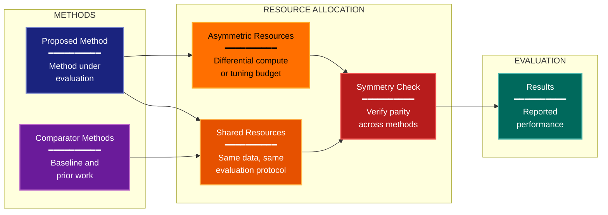

# Fair Comparison Experimental Design Lens

> **Preflight:** Before acting on any `exploration-vector` directive below, call `enable_exploration` to establish read-only broker authority for this session; the vectors below assume broker access has already been granted.

**Philosophical Mode:** Fairness
**Primary Question:** "Are alternatives compared under symmetric constraints?"
**Focus:** Compute Budget Symmetry, Tuning Protocol Parity, Data Access Equality, Engineering Effort Balance, Winner's Curse

## Arguments

`/autoskillit:exp-lens-fair-comparison [context_path] [experiment_plan_path]`

- **context_path** (optional positional arg 1) — Absolute path to a lens context file
  containing IV/DV tables, H0/H1 hypotheses, controlled variables, and success criteria.
  If provided, read this file before beginning analysis to obtain structured context.
  If omitted, discover context by exploring the CWD.
- **experiment_plan_path** (optional positional arg 2) — Absolute path to the full
  experiment plan. If provided, read for complete experimental methodology and design.
  If omitted, locate the experiment plan by exploring the CWD.

## When to Use

- Method comparisons where tuning effort differs
- Benchmark results where compute budgets are unequal
- Claims of SOTA that may reflect process differences
- User invokes `/autoskillit:exp-lens-fair-comparison` or `/autoskillit:make-experiment-diag fairness`

## Critical Constraints

**NEVER:**
- Fabricate, invent, or embellish information not supported by the available evidence or code.

- Modify any source code files
- Do not litter the codebase with useless comments, TODO markers, or explanatory annotations — the skill output and diagram speak for themselves
- Create files outside `{{AUTOSKILLIT_TEMP}}/exp-lens-fair-comparison/`
- Detach child delegations instead of joining them (joining every child is required)
- Start independent child delegations sequentially
- Import or execute target code, tests, experiments, models, or benchmarks
- Let an exploration vector judge fairness, attribute improvements, build the symmetry matrix, or create the diagram

**ALWAYS:**
- Build the full symmetry matrix — every method against every resource dimension
- Attribute improvements to method vs. process — both deserve accounting
- Flag undisclosed compute or tuning as a finding, not an assumption
- Assess the winner's curse: did the proposed method benefit from more selection pressure?
- BEFORE creating any diagram, LOAD the `/autoskillit:mermaid` skill using the Skill tool - this is MANDATORY
- If the Skill tool cannot be used (disable-model-invocation) or refuses this invocation, do NOT proceed with diagram creation. Abort this step and omit the diagram from output.
- Start all independent child delegations before awaiting any result to maximize concurrency
- Use the registered exploration roles for all repository reads
- Dispatch every exploration vector below through the deterministic router
- Route mixed tuning and data-pipeline evidence through the parent for bounded profiler handoff without creating extra vectors
- Wait for every exploration result before building the symmetry matrix, attributing effort, or creating the diagram
- Retain parent authority over experimental, statistical, and comparative judgments in Steps 2+
- Write output to `{{AUTOSKILLIT_TEMP}}/exp-lens-fair-comparison/exp_diag_fair_comparison_{YYYY-MM-DD_HHMMSS}.md`
- After writing the file, emit the structured output token as **literal plain text** with no
  markdown formatting on the token name (the adjudicator performs a regex match):

  ```
  diagram_path = /absolute/path/to/{{AUTOSKILLIT_TEMP}}/exp-lens-fair-comparison/exp_diag_fair_comparison_{...}.md
  ```

---

## Analysis Workflow

### Step 0: Parse optional arguments

If positional arg 1 (context_path) is provided and the file exists, read it to obtain
IV/DV tables, H0/H1 hypotheses, controlled variables, and success criteria. If positional
arg 2 (experiment_plan_path) is provided and exists, read the experiment plan for full
methodology. Use supplied structured context as the foundation for Steps 1-5.

<!-- autoskillit:exploration-vector id="missing-context-fields" -->
After the parent parses supplied context and experiment-plan arguments, inspect only
existing revision-scoped CWD artifacts for fields that remain absent. Never rediscover
or override supplied complete fields. If no fields are missing, return an explicit
not-applicable result without repository search. If relevant evidence is absent or
unrelated, explicitly report it as unavailable or unrelated without widening scope,
inferring meaning, or importing or executing target code, tests, experiments, models,
or benchmarks.
<!-- /autoskillit:exploration-vector -->

### Step 1: Launch the Authored Discovery Vectors (SINGLE MESSAGE)

Dispatch the five authored Step-1 vectors with the ready fallback vector through the deterministic router in a single message before awaiting any result. Do not iterate across multiple turns.

Do not output any prose between subagent dispatches. Immediately proceed to the next tool call.

Use the registered role for each source block. Parent-mediated profiler handoff for mixed evidence does not create another vector.

<!-- autoskillit:exploration-vector id="compute-resource-allocation" -->
1. **Compute & Resource Allocation**
- Find compute resources used per method
- Look for: gpu, tpu, hours, cost, memory, flops, compute_budget, machine, cluster
<!-- /autoskillit:exploration-vector -->

<!-- autoskillit:exploration-vector id="tuning-protocol-per-method" -->
2. **Tuning Protocol per Method**
- Find tuning procedures for each compared method
- Look for: grid_search, optuna, bayesian_opt, hyperband, tune, sweep, trials, budget, early_stop
<!-- /autoskillit:exploration-vector -->

<!-- autoskillit:exploration-vector id="data-access-preprocessing" -->
3. **Data Access & Preprocessing**
- Find whether all methods use the same data pipeline
- Look for: data_augmentation, preprocessing, feature, embedding, pretrained, extra_data, auxiliary
<!-- /autoskillit:exploration-vector -->

<!-- autoskillit:exploration-vector id="engineering-effort-indicators" -->
4. **Engineering Effort Indicators**
- Find differential engineering investment
- Look for: custom, specialized, trick, hack, ensemble, post_process, calibrate, threshold_tune
<!-- /autoskillit:exploration-vector -->

<!-- autoskillit:exploration-vector id="reporting-completeness" -->
5. **Reporting Completeness**
- Find whether resource usage is disclosed
- Look for: report, disclose, computational_cost, wall_time, parameter_count, training_time
<!-- /autoskillit:exploration-vector -->

### Step 2: Build Symmetry Matrix

Build the symmetry matrix: rows = methods compared, columns = resource dimensions (compute, tuning, data, engineering, disclosure).

For each cell:
- Is the allocation symmetric?
- If not, does the asymmetry favor the proposed method?
- Estimate the magnitude of bias from each asymmetry.

### Step 3: Analyze Effort Attribution

**CRITICAL — Analyze Effort Attribution:**
For every claimed improvement:
- What fraction of the improvement can be attributed to the method itself vs. differential engineering effort, tuning budget, or data access?

### Step 4: Create the Diagram

Use the mermaid skill conventions to create a symmetry diagram with:

**Direction:** `LR` (methods flow through resource allocation to evaluation)

**Subgraphs:**
- METHODS
- RESOURCE ALLOCATION
- EVALUATION

**Node Styling:**
- `cli` class: Proposed method
- `phase` class: Comparator methods
- `handler` class: Shared resources
- `gap` class: Asymmetric resources
- `detector` class: Symmetry checks
- `output` class: Results

### Step 5: Write Output

Write the diagram to: `{{AUTOSKILLIT_TEMP}}/exp-lens-fair-comparison/exp_diag_fair_comparison_{YYYY-MM-DD_HHMMSS}.md` (relative to the current working directory)

---

## Output Template

```markdown
# Fair Comparison Analysis: {Experiment Name}

**Lens:** Fair Comparison (Fairness)
**Question:** Are alternatives compared under symmetric constraints?
**Date:** {YYYY-MM-DD}
**Scope:** {What was analyzed}

## Symmetry Matrix

| Method | Compute | Tuning Budget | Data Access | Engineering | Disclosure |
|--------|---------|---------------|-------------|-------------|------------|
| {proposed method} | {allocation} | {budget} | {access} | {effort} | {disclosed?} |
| {comparator} | {allocation} | {budget} | {access} | {effort} | {disclosed?} |

## Resource Disclosure

| Resource Type | Proposed Method | Comparators | Symmetric? |
|---------------|-----------------|-------------|------------|
| {GPU hours} | {value} | {value} | {Yes/No} |
| {Tuning trials} | {value} | {value} | {Yes/No} |
| {Extra data} | {value} | {value} | {Yes/No} |

## Symmetry Diagram


```mermaid
%%{init: {'flowchart': {'nodeSpacing': 50, 'rankSpacing': 60, 'curve': 'basis'}}}%%
graph LR
    %% CLASS DEFINITIONS %%
    classDef cli fill:#1a237e,stroke:#7986cb,stroke-width:2px,color:#fff;
    classDef stateNode fill:#004d40,stroke:#4db6ac,stroke-width:2px,color:#fff;
    classDef handler fill:#e65100,stroke:#ffb74d,stroke-width:2px,color:#fff;
    classDef phase fill:#6a1b9a,stroke:#ba68c8,stroke-width:2px,color:#fff;
    classDef newComponent fill:#2e7d32,stroke:#81c784,stroke-width:2px,color:#fff;
    classDef output fill:#00695c,stroke:#4db6ac,stroke-width:2px,color:#fff;
    classDef detector fill:#b71c1c,stroke:#ef5350,stroke-width:2px,color:#fff;
    classDef gap fill:#ff6f00,stroke:#ffa726,stroke-width:2px,color:#000;
    classDef integration fill:#c62828,stroke:#ef9a9a,stroke-width:2px,color:#fff;

    subgraph Methods ["METHODS"]
        direction TB
        PROP["Proposed Method<br/>━━━━━━━━━━<br/>Method under<br/>evaluation"]
        COMP["Comparator Methods<br/>━━━━━━━━━━<br/>Baseline and<br/>prior work"]
    end

    subgraph Resources ["RESOURCE ALLOCATION"]
        direction TB
        SHARED["Shared Resources<br/>━━━━━━━━━━<br/>Same data, same<br/>evaluation protocol"]
        ASYM["Asymmetric Resources<br/>━━━━━━━━━━<br/>Differential compute<br/>or tuning budget"]
        CHECK["Symmetry Check<br/>━━━━━━━━━━<br/>Verify parity<br/>across methods"]
    end

    subgraph Eval ["EVALUATION"]
        direction TB
        RESULT["Results<br/>━━━━━━━━━━<br/>Reported<br/>performance"]
    end

    PROP --> SHARED
    COMP --> SHARED
    PROP --> ASYM
    SHARED --> CHECK
    ASYM --> CHECK
    CHECK --> RESULT

    %% CLASS ASSIGNMENTS %%
    class PROP cli;
    class COMP phase;
    class SHARED handler;
    class ASYM gap;
    class CHECK detector;
    class RESULT output;
```

## Winner's Curse Assessment

| Factor | Proposed Method Advantage | Impact on Claimed Improvement |
|--------|--------------------------|-------------------------------|
| {tuning trials} | {advantage} | {estimated impact} |
| {engineering tricks} | {advantage} | {estimated impact} |

## Process-vs-Method Attribution Analysis

- Method contribution: {estimated fraction}
- Tuning contribution: {estimated fraction}
- Engineering contribution: {estimated fraction}
- Data access contribution: {estimated fraction}

## Key Findings

- {Description of most significant asymmetries and their impact on claimed improvements}
```

---

## Pre-Diagram Checklist

Before creating the diagram, verify:

- [ ] LOADED `/autoskillit:mermaid` skill using the Skill tool
- [ ] Using ONLY classDef styles from the mermaid skill (no invented colors)
- [ ] Diagram will include a color legend table

---

## Related Skills

- `/autoskillit:make-experiment-diag` - Parent skill for lens selection
- `/autoskillit:mermaid` - MUST BE LOADED before creating diagram
- `/autoskillit:exp-lens-comparator-construction` - For baseline selection and construction adequacy
- `/autoskillit:exp-lens-sensitivity-robustness` - For sensitivity analysis across conditions
