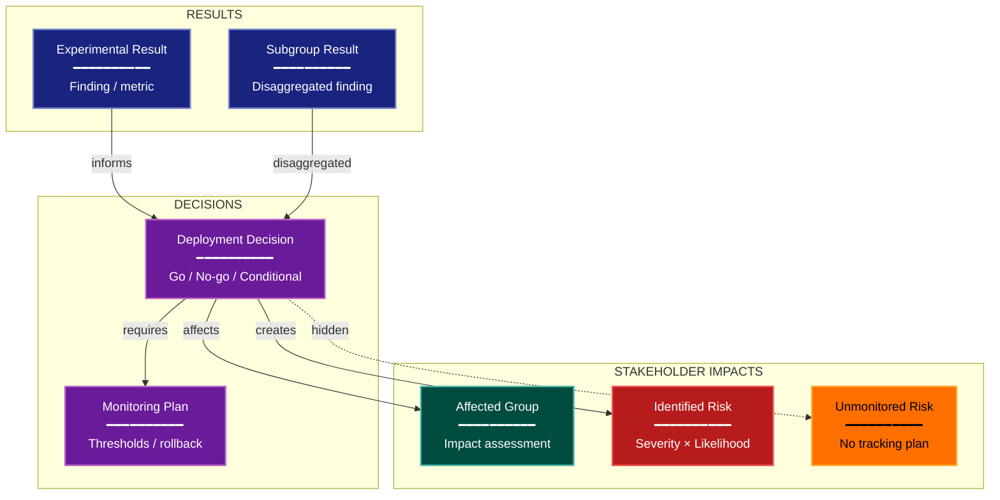

# Governance Risk Experimental Design Lens

**Philosophical Mode:** Governance
**Primary Question:** "What risks arise from acting on this result?"
**Focus:** Deployment Risks, Subgroup Harms, Monitoring Plans, Limitation Disclosure, Responsible Decision-Making

## Arguments

`/autoskillit:exp-lens-governance-risk [context_path] [experiment_plan_path]`

- **context_path** (optional positional arg 1) — Absolute path to a lens context file
  containing IV/DV tables, H0/H1 hypotheses, controlled variables, and success criteria.
  If provided, read this file before beginning analysis to obtain structured context.
  If omitted, discover context by exploring the CWD.
- **experiment_plan_path** (optional positional arg 2) — Absolute path to the full
  experiment plan. If provided, read for complete experimental methodology and design.
  If omitted, locate the experiment plan by exploring the CWD.

## When to Use

- AI evaluation with deployment implications
- Experiments whose results will affect real users
- Safety-relevant benchmarks
- User invokes `/autoskillit:exp-lens-governance-risk` or `/autoskillit:make-experiment-diag governance`

## Critical Constraints

**NEVER:**
- Fabricate, invent, or embellish information not supported by the available evidence or code.

- Modify any source code files
- Create files outside `{{AUTOSKILLIT_TEMP}}/exp-lens-governance-risk/`
- Run subagents in the background (`run_in_background: true` is prohibited)

**ALWAYS:**
- Identify subgroups for whom the experimental evidence may not generalize
- Assess decision sufficiency — does the experiment actually answer the deployment question?
- Treat absent limitation disclosure as a finding requiring explicit flagging
- Distinguish risks that are monitored from risks that are merely acknowledged
- BEFORE creating any diagram, LOAD the `/autoskillit:mermaid` skill using the Skill tool - this is MANDATORY
- If the Skill tool cannot be used (disable-model-invocation) or refuses this invocation, do NOT proceed with diagram creation. Abort this step and omit the diagram from output.
- Write output to `{{AUTOSKILLIT_TEMP}}/exp-lens-governance-risk/exp_diag_governance_risk_{YYYY-MM-DD_HHMMSS}.md`
- After writing the file, emit the structured output token as **literal plain text** with no
  markdown formatting on the token name (the adjudicator performs a regex match):

  ```
  diagram_path = /absolute/path/to/{{AUTOSKILLIT_TEMP}}/exp-lens-governance-risk/exp_diag_governance_risk_{...}.md
  ```

---

## Analysis Workflow

### Step 0: Parse optional arguments

If positional arg 1 (context_path) is provided and the file exists, read it to obtain
IV/DV tables, H0/H1 hypotheses, controlled variables, and success criteria. If positional
arg 2 (experiment_plan_path) is provided and exists, read the experiment plan for full
methodology. Use this structured context as the foundation for Steps 1-5; skip the CWD
exploration for these fields if the context file supplies them. For any field absent from the context file, perform CWD exploration for that specific field only.

### Step 1: Launch Parallel Exploration Subagents

Spawn Explore subagents to investigate:

**Intended Use & Deployment Context**
- Find intended deployment scenario and audience
- Look for: deploy, production, use_case, audience, user, stakeholder, decision

**Subgroup & Fairness Analysis**
- Find evidence of subgroup analysis or fairness evaluation
- Look for: subgroup, demographic, fairness, equity, bias, disaggregate, protected

**Harm & Risk Metrics**
- Find safety or harm metrics tracked
- Look for: harm, safety, risk, adverse, negative, side_effect, failure_mode

**Monitoring & Feedback Plans**
- Find post-deployment monitoring or feedback loops
- Look for: monitor, alert, feedback, drift, rollback, incident, threshold, canary

**Limitation Disclosure**
- Find explicit acknowledgment of limitations
- Look for: limitation, caveat, not_suitable, generalize, scope, restriction, caveat

### Step 2: Build Risk Register

For each potential action: Who is affected? What could go wrong? Severity? Likelihood? Monitoring? Evidence?
Classify by severity × likelihood.

### Step 3: Analyze Decision Sufficiency

For every deployment decision: Does the experiment provide sufficient evidence? What additional evidence is needed? Are there subgroups with insufficient evidence?

### Step 4: Create the Diagram (Optional)

**Direction:** TB. Results → Decisions → Stakeholder Impacts

### Step 5: Write Output

Write the output to: `{{AUTOSKILLIT_TEMP}}/exp-lens-governance-risk/exp_diag_governance_risk_{YYYY-MM-DD_HHMMSS}.md` (relative to the current working directory)

---

## Output Template

```markdown
# Governance Risk Assessment: {Experiment Name}

**Lens:** Governance Risk (Governance)
**Question:** What risks arise from acting on this result?
**Date:** {YYYY-MM-DD}
**Scope:** {What was analyzed}

## Risk Register

| Risk | Affected Group | Severity | Likelihood | Monitored? | Evidence |
|------|---------------|----------|------------|------------|----------|
| {risk} | {group} | {High/Medium/Low} | {High/Medium/Low} | {Yes/No} | {evidence} |

## Decision Sufficiency

| Deployment Decision | Evidence Provided | Gaps | Subgroup Coverage |
|--------------------|--------------------|------|-------------------|
| {decision} | {evidence} | {gaps} | {coverage assessment} |

## Governance Diagram



**Color Legend:**
| Color | Category | Description |
|-------|----------|-------------|
| Dark Blue | Results | Experimental results informing decisions |
| Purple | Decisions | Deployment and monitoring decisions |
| Teal | Stakeholders | Affected groups and impact assessments |
| Red | Identified Risks | Monitored risks with severity ratings |
| Amber | Unmonitored | Risks without tracking or monitoring plans |

## Recommendations

- {Recommendation 1}
- {Recommendation 2}
```

---

## Responsible Deployment Checklist

- [ ] Subgroup performance disaggregated and analyzed
- [ ] Deployment context matches experimental conditions
- [ ] Monitoring plan defined with specific thresholds
- [ ] Rollback criteria specified
- [ ] Limitations disclosed to decision-makers
- [ ] Affected communities consulted where applicable

---

## Pre-Diagram Checklist

Before creating the diagram, verify:

- [ ] LOADED `/autoskillit:mermaid` skill using the Skill tool
- [ ] Using ONLY classDef styles from the mermaid skill (no invented colors)
- [ ] Diagram will include a color legend table

---

## Related Skills

- `/autoskillit:make-experiment-diag` - Parent skill
- `/autoskillit:mermaid` - MUST BE LOADED before creating diagram
- `/autoskillit:exp-lens-validity-threats`
- `/autoskillit:exp-lens-measurement-validity`
