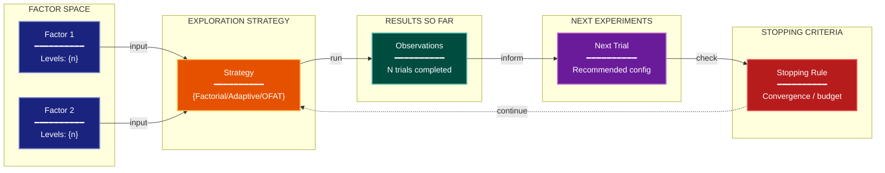

# Iterative Learning Experimental Design Lens

**Philosophical Mode:** Decision-Theoretic
**Primary Question:** "How does this maximize learning per cost?"
**Focus:** Factor Selection, Interaction Probing, Adaptive Allocation, Stopping Rules, Next-Experiment Planning

## Arguments

`/autoskillit:exp-lens-iterative-learning [context_path] [experiment_plan_path]`

- **context_path** (optional positional arg 1) — Absolute path to a lens context file
  containing IV/DV tables, H0/H1 hypotheses, controlled variables, and success criteria.
  If provided, read this file before beginning analysis to obtain structured context.
  If omitted, discover context by exploring the CWD.
- **experiment_plan_path** (optional positional arg 2) — Absolute path to the full
  experiment plan. If provided, read for complete experimental methodology and design.
  If omitted, locate the experiment plan by exploring the CWD.

## When to Use

- Planning a sequence of experiments
- Optimizing hyperparameter search
- Ablation study design
- User invokes `/autoskillit:exp-lens-iterative-learning` or `/autoskillit:make-experiment-diag iterative`

## Critical Constraints

**NEVER:**
- Fabricate, invent, or embellish information not supported by the available evidence or code.

- Modify any source code files
- Recommend one-factor-at-a-time exploration when interactions are plausible
- Create files outside `{{AUTOSKILLIT_TEMP}}/exp-lens-iterative-learning/`
- Run subagents in the background (`run_in_background: true` is prohibited)

**ALWAYS:**
- Evaluate exploration efficiency against the key uncertainty being reduced
- Identify high-value unexplored regions of the factor space
- Assess whether the stopping rule is principled or arbitrary
- Surface interaction structure that one-factor-at-a-time designs would miss
- BEFORE creating any diagram, LOAD the `/autoskillit:mermaid` skill using the Skill tool - this is MANDATORY
- If the Skill tool cannot be used (disable-model-invocation) or refuses this invocation, do NOT proceed with diagram creation. Abort this step and omit the diagram from output.
- Write output to `{{AUTOSKILLIT_TEMP}}/exp-lens-iterative-learning/exp_diag_iterative_learning_{YYYY-MM-DD_HHMMSS}.md`
- After writing the file, emit the structured output token as **literal plain text** with no
  markdown formatting on the token name (the adjudicator performs a regex match):

  ```
  diagram_path = /absolute/path/to/{{AUTOSKILLIT_TEMP}}/exp-lens-iterative-learning/exp_diag_iterative_learning_{...}.md
  ```

---

## Analysis Workflow

### Step 0: Parse optional arguments

If positional arg 1 (context_path) is provided and the file exists, read it to obtain
IV/DV tables, H0/H1 hypotheses, controlled variables, and success criteria. If positional
arg 2 (experiment_plan_path) is provided and exists, read the experiment plan for full
methodology. Use this structured context as the foundation for Steps 1-5; skip the CWD
exploration for these fields if the context file supplies them. For any field absent from the context file, perform CWD exploration for that specific field only.

### Step 1: Launch Parallel Exploration Subagents

Spawn Explore subagents to investigate:

**Factor Space**
- Find all factors being varied across experiments
- Look for: factor, parameter, variable, condition, treatment, level, dimension

**Interaction Structure**
- Find evidence of interaction effects between factors
- Look for: interaction, joint, combined, synergy, cross, factorial

**Cost & Resource Model**
- Find cost per experiment and total budget
- Look for: cost, budget, time, compute, trials, epochs, samples

**Sequential Decision Logic**
- Find how next experiments are chosen based on previous results
- Look for: adaptive, sequential, bayesian, acquisition, exploration, exploitation, bandit

**Learning Objectives**
- Find what uncertainty is being reduced by the experiment sequence
- Look for: objective, uncertainty, information, knowledge, goal, optimize

### Step 2: Map the Design Space

Map factors × levels, explored regions, probed interactions, next high-value experiments. Assess efficiency vs. key uncertainty.

### Step 3: CRITICAL — Analyze Learning Efficiency

Per factor/round: Information gain, Interaction risk, Cost-efficiency, Exploration-exploitation, Stopping rule

Distinguish: Full factorial / Fractional factorial / One-factor-at-a-time / Adaptive/Bayesian

### Step 4: Create the Diagram

**Direction:** LR. Subgraphs: FACTOR SPACE, EXPLORATION STRATEGY, RESULTS SO FAR, NEXT EXPERIMENTS, STOPPING CRITERIA

### Step 5: Write Output

Write the diagram to: `{{AUTOSKILLIT_TEMP}}/exp-lens-iterative-learning/exp_diag_iterative_learning_{YYYY-MM-DD_HHMMSS}.md` (relative to the current working directory)


## Output Template

```markdown
# Iterative Learning Design: {Experiment Name}

**Lens:** Iterative Learning (Decision-Theoretic)
**Question:** How does this maximize learning per cost?
**Date:** {YYYY-MM-DD}
**Scope:** {What was analyzed}

## Design Space

| Factor | Levels | Explored? | Interactions Probed? | Cost per Trial | Information Gain |
|--------|--------|-----------|----------------------|----------------|------------------|
| {factor} | {levels} | {Yes/No} | {Yes/No} | {cost} | {High/Medium/Low} |

## Factor Space Diagram



**Color Legend:**
| Color | Category | Description |
|-------|----------|-------------|
| Dark Blue | Factors | Experimental factors and levels |
| Orange | Strategy | Exploration strategy type |
| Teal | Results | Observations and completed trials |
| Purple | Next | Recommended next experiments |
| Red | Stopping | Convergence and budget criteria |

## Recommendations

- {Recommendation 1}
- {Recommendation 2}
```

---

## Pre-Diagram Checklist


Before creating the diagram, verify:

- [ ] LOADED `/autoskillit:mermaid` skill using the Skill tool
- [ ] Using ONLY classDef styles from the mermaid skill (no invented colors)
- [ ] Diagram will include a color legend table

---

## Related Skills

- `/autoskillit:make-experiment-diag` - Parent skill
- `/autoskillit:mermaid` - MUST BE LOADED before creating diagram
- `/autoskillit:exp-lens-sensitivity-robustness`
- `/autoskillit:exp-lens-error-budget`
