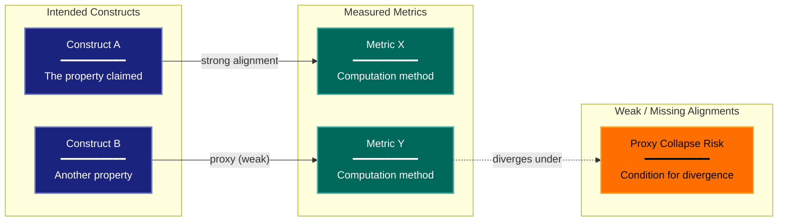

# Measurement Validity Experimental Design Lens

**Philosophical Mode:** Psychometric
**Primary Question:** "Do measurements justify the interpretation?"
**Focus:** Metric-Construct Alignment, Proxy Validity, Reliability, Sensitivity, Consequential Validity

## When to Use

- Metrics may not measure what they claim to; proxy metrics used instead of true objectives
- Evaluation scores treated as "truth" without validation
- Metric choice is contested or under-specified
- User invokes `/autoskillit:exp-lens-measurement-validity` or `/autoskillit:make-experiment-diag measurement`

## Critical Constraints

**NEVER:**
- Modify any source code or experimental artifacts
- Do not litter the codebase with useless comments, TODO markers, or explanatory annotations — the skill output and diagram speak for themselves
- Create files outside `.autoskillit/temp/exp-lens-measurement-validity/`

**ALWAYS:**
- Treat every reported metric as a claim requiring a validity argument
- Enumerate known failure modes: gaming, saturation, proxy collapse, and aggregation artifacts
- Assess reliability (stability under reruns) and sensitivity (ability to distinguish meaningful differences) for each metric
- Identify where metric-construct alignment is weak or unsupported by evidence
- BEFORE creating any optional diagram, LOAD the `/autoskillit:mermaid` skill using the Skill tool - this is MANDATORY
- If the Skill tool cannot be used (disable-model-invocation) or refuses this invocation, do NOT proceed with diagram creation. Abort this step and omit the diagram from output.
- Write output to `.autoskillit/temp/exp-lens-measurement-validity/exp_diag_measurement_validity_{YYYY-MM-DD_HHMMSS}.md`
- After writing the file, emit the structured output token as **literal plain text** with no
  markdown formatting on the token name (the adjudicator performs a regex match):

  ```
  diagram_path = /absolute/path/to/.autoskillit/temp/exp-lens-measurement-validity/exp_diag_measurement_validity_{...}.md
  %%ORDER_UP%%
  ```

---

## Analysis Workflow

### Step 1: Launch Parallel Exploration Subagents

Spawn Explore subagents to investigate:

**Metric Definitions**
- Find all metrics computed and reported
- Look for: metric, score, accuracy, f1, precision, recall, bleu, rouge, loss, error_rate, latency

**Intended Interpretations**
- Find what conclusions are drawn from each metric
- Look for: better, worse, improves, indicates, measures, reflects, captures, proxy

**Metric Computation Details**
- Find exactly how each metric is computed (aggregation, weighting, edge cases)
- Look for: average, macro, micro, weighted, threshold, cutoff, aggregate

**Alternative Metrics Considered**
- Find whether alternative metrics were evaluated and why they were rejected
- Look for: also measured, alternative, we chose, instead of, limitation

**Construct-Metric Gap**
- Find where the metric diverges from the construct it claims to measure
- Look for: limitation, caveat, imperfect, proxy, approximate, does not capture

### Step 2: Build Validity Arguments

For each reported metric, construct a validity argument:
1. What construct does this metric claim to measure?
2. What evidence supports this claim?
3. What are the known failure modes (gaming, saturation, proxy collapse)?
4. Is the metric reliable (stable under reruns)?
5. Is it sensitive (can it distinguish meaningful differences)?

### Step 3: Analyze Metric-Construct Alignment

**CRITICAL — for every metric-to-claim link:**
- Is there a logical argument connecting the number to the concept?
- Could a system score high on this metric while being poor on the intended construct?
- What would gaming look like?
- Does the aggregation method (macro vs micro, mean vs median) preserve the intended construct?
- Are there known saturation regimes where the metric stops being informative?

### Step 4: Optional Metric-Construct Mapping Diagram

This lens does NOT produce a primary mermaid diagram. The output is a structured validity argument. An optional simplified metric mapping diagram may be included if it clarifies the metric-construct relationship.

If including the optional diagram:

**Direction:** `LR` (constructs on left, metrics on right)

**Minimal diagram:** Construct nodes on the left, Metric nodes on the right, with edge labels indicating strength of alignment

**Node Styling:**
- `cli` class: Constructs and intended properties being claimed
- `output` class: Measured metrics (what is actually computed)
- `gap` class: Weak or missing alignments, proxy collapses
- `handler` class: Proxy relationships and intermediate mappings

**Connection Types:**
- Solid arrows for strong, well-evidenced alignment
- Dashed arrows for proxy or contested alignment
- Edge labels naming the type of relationship or its weakness

### Step 5: Write Output

Write the output to: `.autoskillit/temp/exp-lens-measurement-validity/exp_diag_measurement_validity_{YYYY-MM-DD_HHMMSS}.md` (relative to the current working directory)

---

## Output Template

```markdown
# Measurement Validity Analysis: {Experiment Name}

**Lens:** Measurement Validity (Psychometric)
**Question:** Do measurements justify the interpretation?
**Date:** {YYYY-MM-DD}
**Scope:** {What was analyzed}

## Metric Inventory

| Metric | Construct Claimed | Computation | Reliability | Sensitivity |
|--------|-------------------|-------------|-------------|-------------|
| {metric name} | {what it claims to measure} | {aggregation/formula} | {stable / unstable / unknown} | {high / low / saturated} |

## Validity Arguments

### {Metric Name}

**Construct claimed:** {The property this metric is presented as measuring}

**Evidence for alignment:**
- {Supporting argument or citation}

**Evidence against alignment / known failure modes:**
- {Failure mode 1: e.g., gameable by surface pattern matching}
- {Failure mode 2: e.g., proxy collapses when distribution shifts}

**Reliability assessment:** {Stable under reruns? Sensitive to seed?}

**Sensitivity assessment:** {Can it distinguish meaningful differences in the relevant range?}

**Verdict:** {Strong / Partial / Weak / Unsupported}

---

## Proxy Collapse Risks

| Metric | Proxy For | Collapse Condition | Consequence |
|--------|-----------|--------------------|-------------|
| {metric} | {true construct} | {when proxy diverges from construct} | {what is falsely concluded} |

## Gaming Vulnerabilities

| Metric | Gaming Strategy | Detection Method |
|--------|----------------|-----------------|
| {metric} | {how to maximize score without improving construct} | {how to detect gaming} |

## Optional: Metric-Construct Mapping Diagram

{Include only if it clarifies alignment; omit if argument tables are sufficient}



**Color Legend:**
| Color | Category | Description |
|-------|----------|-------------|
| Dark Blue | Construct | Intended properties being claimed |
| Dark Teal | Metric | What is actually computed and reported |
| Yellow | Gap | Weak alignment, proxy collapse, or missing evidence |
| Orange | Proxy | Intermediate proxy relationships |

## Summary Verdict

| Metric | Verdict | Primary Concern |
|--------|---------|----------------|
| {metric} | {Strong / Partial / Weak / Unsupported} | {One-line summary of the key validity concern} |
```

---

## Pre-Diagram Checklist

Before creating any optional diagram, verify:

- [ ] LOADED `/autoskillit:mermaid` skill using the Skill tool
- [ ] Using ONLY classDef styles from the mermaid skill (no invented colors)
- [ ] Diagram will include a color legend table

---

## Related Skills

- `/autoskillit:make-experiment-diag` - Parent skill for lens selection
- `/autoskillit:mermaid` - MUST BE LOADED before creating any optional diagram
- `/autoskillit:exp-lens-estimand-clarity` - For auditing the upstream claim the metric is meant to support
- `/autoskillit:exp-lens-benchmark-representativeness` - For auditing whether the evaluation set generalizes
