# Pipeline Integrity Experimental Design Lens

**Philosophical Mode:** Integrity
**Primary Question:** "Could data handling create optimistic bias?"
**Focus:** Data Splits, Leakage Points, Preprocessing Order, Label Contamination, Pipeline Invariants

## When to Use

- ML pipeline with train/test splits
- Preprocessing before or after splitting is ambiguous
- Feature engineering touching labels
- User invokes `/autoskillit:exp-lens-pipeline-integrity` or `/autoskillit:make-experiment-diag pipeline`

## Critical Constraints

**NEVER:**
- Modify any source code files
- Do not litter the codebase with useless comments, TODO markers, or explanatory annotations — the skill output and diagram speak for themselves
- Create files outside `.autoskillit/temp/exp-lens-pipeline-integrity/`

**ALWAYS:**
- Classify every pipeline stage as pre-split or post-split
- Trace whether transforms are fitted on full data or train-only
- Flag all label-touching feature engineering steps
- Document pipeline invariants that guard against leakage
- BEFORE creating any diagram, LOAD the `/autoskillit:mermaid` skill using the Skill tool - this is MANDATORY
- Write output to `.autoskillit/temp/exp-lens-pipeline-integrity/exp_diag_pipeline_integrity_{YYYY-MM-DD_HHMMSS}.md`
- After writing the file, emit the structured output token as **literal plain text** with no
  markdown formatting on the token name (the adjudicator performs a regex match):

  ```
  diagram_path = /absolute/path/to/.autoskillit/temp/exp-lens-pipeline-integrity/exp_diag_pipeline_integrity_{...}.md
  %%ORDER_UP%%
  ```

---

## Analysis Workflow

### Step 1: Launch Parallel Exploration Subagents

Spawn Explore subagents to investigate:

**Data Loading & Sources**
- Find data ingestion code, raw data paths
- Look for: load, read, fetch, dataset, csv, parquet, download

**Preprocessing & Transforms**
- Find normalization, encoding, imputation steps
- Look for: transform, normalize, scale, encode, impute, clean, preprocess

**Split Logic**
- Find train/test/validation split code
- Look for: split, train_test, fold, cross_val, stratify, group

**Feature Engineering**
- Find feature creation, selection, extraction
- Look for: feature, extract, select, engineer, embed, vectorize

**Model Training & Evaluation**
- Find training loops and evaluation metrics
- Look for: fit, train, predict, evaluate, score, metric, loss

### Step 2: Map the Complete Pipeline

Map the full pipeline from raw data to reported metrics. For each stage, determine:
- What information flows in?
- What information flows out?
- Could any downstream information leak upstream?
- Classify each stage as pre-split or post-split.

### Step 3: Identify Leakage Risks

**CRITICAL — Analyze Leakage Direction:**
For every data transformation:
- Does it use information from the full dataset (leakage risk) or only from the training partition?
- Is normalization fitted on train-only or all data?
- Are features derived from labels?

Assign a severity level (High/Medium/Low) to each leakage risk based on whether it would invalidate reported metrics.

### Step 4: Create the Diagram

Use flowchart with:

**Direction:** `LR` (data flows left to right)

**Subgraphs:**
- RAW DATA
- PREPROCESSING
- SPLIT POINT
- TRAIN PATH
- TEST PATH
- EVALUATION

**Node Styling:**
- `cli` class: Data sources
- `handler` class: Transforms
- `detector` class: Split point and validation gates
- `stateNode` class: Data stores
- `gap` class: Leakage risks
- `output` class: Metrics and results
- `phase` class: Model training

**Edge Labels:** full data, train only, test only, LEAKAGE RISK

### Step 5: Write Output

Write the diagram to: `.autoskillit/temp/exp-lens-pipeline-integrity/exp_diag_pipeline_integrity_{YYYY-MM-DD_HHMMSS}.md` (relative to the current working directory)

---

## Output Template

```markdown
# Pipeline Integrity Diagram: {Experiment Name}

**Lens:** Pipeline Integrity (Integrity)
**Question:** Could data handling create optimistic bias?
**Date:** {YYYY-MM-DD}
**Scope:** {What was analyzed}

## Pipeline Stages

| Stage | Input | Output | Pre/Post Split | Leakage Risk? |
|-------|-------|--------|----------------|---------------|
| {stage} | {input} | {output} | {Pre/Post} | {Yes/No} |

## Pipeline Diagram

```mermaid
%%{init: {'flowchart': {'nodeSpacing': 50, 'rankSpacing': 60, 'curve': 'basis'}}}%%
flowchart LR
    %% CLASS DEFINITIONS %%
    classDef cli fill:#1a237e,stroke:#7986cb,stroke-width:2px,color:#fff;
    classDef stateNode fill:#004d40,stroke:#4db6ac,stroke-width:2px,color:#fff;
    classDef handler fill:#e65100,stroke:#ffb74d,stroke-width:2px,color:#fff;
    classDef phase fill:#6a1b9a,stroke:#ba68c8,stroke-width:2px,color:#fff;
    classDef newComponent fill:#2e7d32,stroke:#81c784,stroke-width:2px,color:#fff;
    classDef output fill:#00695c,stroke:#4db6ac,stroke-width:2px,color:#fff;
    classDef detector fill:#b71c1c,stroke:#ef5350,stroke-width:2px,color:#fff;
    classDef gap fill:#ff6f00,stroke:#ffa726,stroke-width:2px,color:#000;
    classDef integration fill:#c62828,stroke:#ef9a9a,stroke-width:2px,color:#fff;

    subgraph Raw ["RAW DATA"]
        SRC["Raw Dataset<br/>━━━━━━━━━━<br/>Source path<br/>N samples"]
    end

    subgraph Preprocessing ["PREPROCESSING"]
        PREP["Normalization / Encoding<br/>━━━━━━━━━━<br/>Fitted on: full/train?"]
        LEAK["Leaky Transform<br/>━━━━━━━━━━<br/>Uses full dataset"]
    end

    subgraph SplitPoint ["SPLIT POINT"]
        SPLIT["Train/Test Split<br/>━━━━━━━━━━<br/>Stratified? Ratio?"]
    end

    subgraph TrainPath ["TRAIN PATH"]
        TRAIN_DATA["Train Set<br/>━━━━━━━━━━<br/>N_train samples"]
        MODEL["Model Training<br/>━━━━━━━━━━<br/>fit()"]
    end

    subgraph TestPath ["TEST PATH"]
        TEST_DATA["Test Set<br/>━━━━━━━━━━<br/>N_test samples"]
    end

    subgraph Evaluation ["EVALUATION"]
        METRIC["Reported Metric<br/>━━━━━━━━━━<br/>score / loss"]
    end

    %% PIPELINE FLOWS %%
    SRC -->|"full data"| PREP
    PREP -->|"full data"| LEAK
    LEAK -.->|"LEAKAGE RISK"| METRIC
    PREP -->|"full data"| SPLIT
    SPLIT -->|"train only"| TRAIN_DATA
    SPLIT -->|"test only"| TEST_DATA
    TRAIN_DATA -->|"fit"| MODEL
    MODEL -->|"predict"| TEST_DATA
    TEST_DATA -->|"evaluate"| METRIC

    %% CLASS ASSIGNMENTS %%
    class SRC cli;
    class PREP handler;
    class LEAK gap;
    class SPLIT detector;
    class TRAIN_DATA,TEST_DATA stateNode;
    class MODEL phase;
    class METRIC output;
```



**Color Legend:**
| Color | Category | Description |
|-------|----------|-------------|
| Dark Blue | Data Source | Raw input datasets |
| Orange | Transform | Preprocessing and feature engineering steps |
| Red | Split / Gate | Split point and validation gates |
| Teal | Data Store | Partitioned data stores (train/test) |
| Purple | Training | Model training stages |
| Dark Teal | Output | Reported metrics and results |
| Amber | Leakage Risk | Transforms using full-dataset information |

## Leakage Assessment

| Risk | Stage | Mechanism | Severity |
|------|-------|-----------|----------|
| {risk name} | {stage} | {how leakage occurs} | {High/Medium/Low} |

## Pipeline Invariants

- [ ] All scalers/encoders fitted on train partition only
- [ ] Feature selection criteria computed from train partition only
- [ ] No label information used in feature construction
- [ ] Test set never seen by any fitting step
```

---

## Pre-Diagram Checklist

Before creating the diagram, verify:

- [ ] LOADED `/autoskillit:mermaid` skill using the Skill tool
- [ ] Using ONLY classDef styles from the mermaid skill (no invented colors)
- [ ] Diagram will include a color legend table

---

## Related Skills

- `/autoskillit:make-experiment-diag` - Parent skill for lens selection
- `/autoskillit:mermaid` - MUST BE LOADED before creating diagram
- `/autoskillit:exp-lens-reproducibility-artifacts` - For artifact completeness audit
- `/autoskillit:exp-lens-measurement-validity` - For outcome measurement validity
