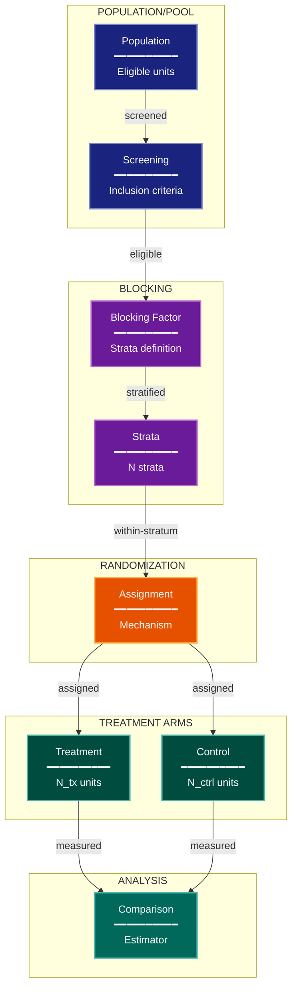

# Randomization & Blocking Experimental Design Lens

**Philosophical Mode:** Design-Structural
**Primary Question:** "Where does comparability come from?"
**Focus:** Assignment Mechanisms, Blocking Factors, Stratification, Balanced Designs, Replication

## Arguments

`/autoskillit:exp-lens-randomization-blocking [context_path] [experiment_plan_path]`

- **context_path** (optional positional arg 1) — Absolute path to a lens context file
  containing IV/DV tables, H0/H1 hypotheses, controlled variables, and success criteria.
  If provided, read this file before beginning analysis to obtain structured context.
  If omitted, discover context by exploring the CWD.
- **experiment_plan_path** (optional positional arg 2) — Absolute path to the full
  experiment plan. If provided, read for complete experimental methodology and design.
  If omitted, locate the experiment plan by exploring the CWD.

## When to Use

- Experiment uses randomization or structured assignment
- Need to verify blocking and stratification
- Checking for pseudoreplication
- User invokes `/autoskillit:exp-lens-randomization-blocking` or `/autoskillit:make-experiment-diag randomization`

## Critical Constraints

**NEVER:**
- Fabricate, invent, or embellish information not supported by the available evidence or code.

- Modify any source code files
- Assume comparability without tracing its source
- Create files outside `{{AUTOSKILLIT_TEMP}}/exp-lens-randomization-blocking/`
- Run subagents in the background (`run_in_background: true` is prohibited)

**ALWAYS:**
- Trace the exact mechanism that creates comparability between treatment groups
- Identify every nuisance factor and how it is controlled
- Flag pseudoreplication risks (replicating at the wrong unit)
- Verify that replication is adequate for the claimed inferential precision
- BEFORE creating any diagram, LOAD the `/autoskillit:mermaid` skill using the Skill tool - this is MANDATORY
- If the Skill tool cannot be used (disable-model-invocation) or refuses this invocation, do NOT proceed with diagram creation. Abort this step and omit the diagram from output.
- Write output to `{{AUTOSKILLIT_TEMP}}/exp-lens-randomization-blocking/exp_diag_randomization_blocking_{YYYY-MM-DD_HHMMSS}.md`
- After writing the file, emit the structured output token as **literal plain text** with no
  markdown formatting on the token name (the adjudicator performs a regex match):

  ```
  diagram_path = /absolute/path/to/{{AUTOSKILLIT_TEMP}}/exp-lens-randomization-blocking/exp_diag_randomization_blocking_{...}.md
  ```

---

## Analysis Workflow

### Step 0: Parse optional arguments

If positional arg 1 (context_path) is provided and the file exists, read it to obtain
IV/DV tables, H0/H1 hypotheses, controlled variables, and success criteria. If positional
arg 2 (experiment_plan_path) is provided and exists, read the experiment plan for full
methodology. Use this structured context as the foundation for Steps 1-5; skip the CWD
exploration for these fields if the context file supplies them. For any field absent from the context file, perform CWD exploration for that specific field only.

### Step 1: Launch Parallel Exploration Subagents

Spawn Explore subagents to investigate:

**Assignment Mechanism**
- Find how experimental units are assigned to conditions
- Look for: random, assign, allocate, split, stratify, block, hash, bucket

**Blocking & Stratification**
- Find blocking factors and stratification variables
- Look for: block, strata, stratify, covariate, match, pair, group_by

**Replication Structure**
- Find how many independent replicates exist per condition
- Look for: replicate, repeat, trial, run, seed, fold, n_replications

**Order & Timing Effects**
- Find potential for carryover or order effects
- Look for: order, sequence, carryover, period, washout, crossover, time

**Exclusion & Attrition**
- Find how units are excluded or drop out during the experiment
- Look for: exclude, drop, attrition, missing, censor, incomplete, filter

### Step 2: Map the Allocation Flow

Trace: Population → assignment → analysis. Identify randomization unit, blocking factors, replication adequacy, and potential confounds.

### Step 3: CRITICAL — Analyze Comparability Source

Distinguish: True randomization / Blocked randomization / Matched pairs / Deterministic assignment

For each: Is the comparability mechanism strong enough for the claimed inference?

### Step 4: Create the Diagram

**Direction:** TB. Subgraphs: POPULATION/POOL, BLOCKING, RANDOMIZATION, TREATMENT ARMS, ANALYSIS

### Step 5: Write Output

Write the diagram to: `{{AUTOSKILLIT_TEMP}}/exp-lens-randomization-blocking/exp_diag_randomization_blocking_{YYYY-MM-DD_HHMMSS}.md` (relative to the current working directory)

---

## Output Template

```markdown
# Randomization & Blocking Design: {Experiment Name}

**Lens:** Randomization & Blocking (Design-Structural)
**Question:** Where does comparability come from?
**Date:** {YYYY-MM-DD}
**Scope:** {What was analyzed}

## Allocation Flow

| Unit | Assignment Mechanism | Blocking Factors | Strata Count | Replication Adequacy |
|------|---------------------|-------------------|--------------|---------------------|
| {unit} | {mechanism} | {factors} | {count} | {Adequate/Marginal/Inadequate} |

## Comparability Analysis

| Comparability Source | Strength | Pseudoreplication Risk | Confound |
|---------------------|----------|----------------------|----------|
| {source} | {Strong/Moderate/Weak} | {High/Medium/Low/None} | {confound or None} |

## Allocation Diagram



**Color Legend:**
| Color | Category | Description |
|-------|----------|-------------|
| Dark Blue | Population | Eligible units and screening |
| Purple | Blocking | Blocking factors and strata |
| Orange | Randomization | Assignment mechanism |
| Teal | Treatment Arms | Treatment and control groups |
| Dark Teal | Analysis | Comparison and estimation |

## Recommendations

- {Recommendation 1}
- {Recommendation 2}
```

---

## Pre-Diagram Checklist

Before creating the diagram, verify:

- [ ] LOADED `/autoskillit:mermaid` skill using the Skill tool
- [ ] Using ONLY classDef styles from the mermaid skill (no invented colors)
- [ ] Diagram will include a color legend table

---

## Related Skills

- `/autoskillit:make-experiment-diag` - Parent skill
- `/autoskillit:mermaid` - MUST BE LOADED before creating diagram
- `/autoskillit:exp-lens-causal-assumptions`
- `/autoskillit:exp-lens-unit-interference`
