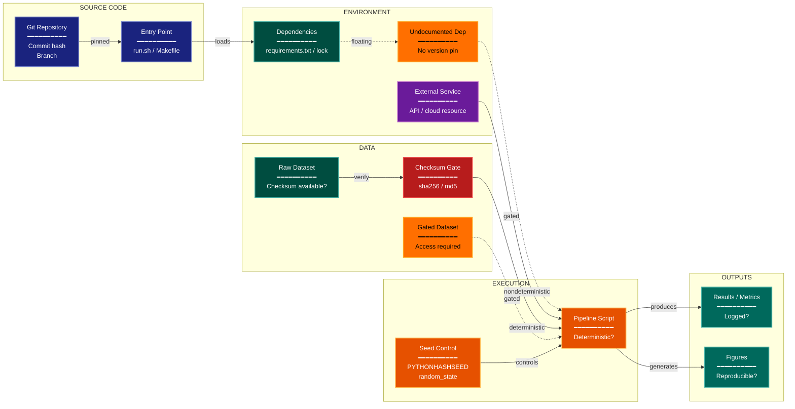

# Reproducibility Artifacts Experimental Design Lens

**Philosophical Mode:** Transparency
**Primary Question:** "Could an independent party reproduce this?"
**Focus:** Run Instructions, Environment Capture, Data Availability, Determinism Controls, Audit Trail

## Arguments

`/autoskillit:exp-lens-reproducibility-artifacts [context_path] [experiment_plan_path]`

- **context_path** (optional positional arg 1) — Absolute path to a lens context file
  containing IV/DV tables, H0/H1 hypotheses, controlled variables, and success criteria.
  If provided, read this file before beginning analysis to obtain structured context.
  If omitted, discover context by exploring the CWD.
- **experiment_plan_path** (optional positional arg 2) — Absolute path to the full
  experiment plan. If provided, read for complete experimental methodology and design.
  If omitted, locate the experiment plan by exploring the CWD.

## When to Use

- Evaluating reproducibility of computational experiments
- Auditing artifact completeness
- Checking for undocumented dependencies
- User invokes `/autoskillit:exp-lens-reproducibility-artifacts` or `/autoskillit:make-experiment-diag reproducibility`

## Critical Constraints

**NEVER:**
- Modify any source code files
- Do not litter the codebase with useless comments, TODO markers, or explanatory annotations — the skill output and diagram speak for themselves
- Create files outside `{{AUTOSKILLIT_TEMP}}/exp-lens-reproducibility-artifacts/`
- Run subagents in the background (`run_in_background: true` is prohibited)

**ALWAYS:**
- Trace the full chain from "clone repo" to "reproduce figures"
- Classify every artifact as available/unavailable and versioned/floating
- Identify the weakest link in the reproduction chain
- Flag all silent non-determinism risks
- BEFORE creating any diagram, LOAD the `/autoskillit:mermaid` skill using the Skill tool - this is MANDATORY
- If the Skill tool cannot be used (disable-model-invocation) or refuses this invocation, do NOT proceed with diagram creation. Abort this step and omit the diagram from output.
- Write output to `{{AUTOSKILLIT_TEMP}}/exp-lens-reproducibility-artifacts/exp_diag_reproducibility_artifacts_{YYYY-MM-DD_HHMMSS}.md`
- After writing the file, emit the structured output token as **literal plain text** with no
  markdown formatting on the token name (the adjudicator performs a regex match):

  ```
  diagram_path = /absolute/path/to/{{AUTOSKILLIT_TEMP}}/exp-lens-reproducibility-artifacts/exp_diag_reproducibility_artifacts_{...}.md
  ```

---

## Analysis Workflow

### Step 0: Parse optional arguments

If positional arg 1 (context_path) is provided and the file exists, read it to obtain
IV/DV tables, H0/H1 hypotheses, controlled variables, and success criteria. If positional
arg 2 (experiment_plan_path) is provided and exists, read the experiment plan for full
methodology. Use this structured context as the foundation for Steps 1-5; skip the CWD
exploration for these fields if the context file supplies them.

### Step 1: Launch Parallel Exploration Subagents

Spawn Explore subagents to investigate:

**Environment & Dependencies**
- Find dependency files, container definitions, environment setup
- Look for: requirements, Dockerfile, environment.yml, conda, pip, nix, lock

**Data Provenance**
- Find data download scripts, checksums, versioning
- Look for: download, checksum, hash, version, dvc, data_url, manifest

**Execution Entry Points**
- Find run scripts, Makefiles, workflow managers
- Look for: Makefile, run.sh, snakemake, nextflow, main, entrypoint, cli

**Random Seed & Determinism**
- Find seed setting, nondeterminism controls
- Look for: seed, random_state, deterministic, cudnn, PYTHONHASHSEED

**Output Artifacts & Logging**
- Find result storage, logging, figure generation
- Look for: save, log, output, results, figures, checkpoint, wandb, mlflow

### Step 2: Map the Reproduction Chain

Map the full chain from "clone repo" to "reproduce figures." Identify each link:
- Is it documented?
- Is it automated?
- Is it deterministic?
- What is the weakest link?

### Step 3: Classify Each Artifact Dependency

**CRITICAL — Analyze Reproduction Chain:**
For every artifact dependency:
- Is the source available (open vs gated)?
- Is the version pinned or floating?
- Is the transform deterministic?
- Could silent environment differences change results?

Assign a status of Pass, Warn, or Fail to each link in the chain based on reproducibility confidence.

### Step 4: Create the Diagram

Use flowchart with:

**Direction:** `LR` (reproduction chain flows left to right)

**Subgraphs:**
- SOURCE CODE
- ENVIRONMENT
- DATA
- EXECUTION
- OUTPUTS

**Node Styling:**
- `cli` class: Entry points and run commands
- `stateNode` class: Versioned and pinned artifacts
- `handler` class: Transforms and scripts
- `output` class: Results and figures
- `gap` class: Missing or undocumented links
- `detector` class: Checksum and validation gates
- `phase` class: External dependencies

**Edge Labels:** pinned, floating, deterministic, nondeterministic, gated

### Step 5: Write Output

Write the diagram to: `{{AUTOSKILLIT_TEMP}}/exp-lens-reproducibility-artifacts/exp_diag_reproducibility_artifacts_{YYYY-MM-DD_HHMMSS}.md` (relative to the current working directory)

---

## Output Template

```markdown
# Reproducibility Artifacts Diagram: {Experiment Name}

**Lens:** Reproducibility Artifacts (Transparency)
**Question:** Could an independent party reproduce this?
**Date:** {YYYY-MM-DD}
**Scope:** {What was analyzed}

## Artifact Inventory

| Artifact | Available? | Versioned? | Deterministic? |
|----------|------------|------------|----------------|
| {artifact} | {Yes/No/Gated} | {Pinned/Floating/None} | {Yes/No/Unknown} |

## Reproduction Chain Diagram



**Color Legend:**
| Color | Category | Description |
|-------|----------|-------------|
| Dark Blue | Entry Point | Run commands and source code |
| Teal | Versioned Artifact | Pinned dependencies and checksummed data |
| Orange | Transform / Script | Pipeline scripts and execution steps |
| Purple | External Dependency | External services and APIs |
| Dark Teal | Output | Results, metrics, and figures |
| Red | Validation Gate | Checksum and integrity checks |
| Amber | Missing Link | Undocumented or gated dependencies |

## Reproduction Checklist

Step-by-step instructions with pass/fail status:

- [ ] Clone repository at pinned commit
- [ ] Reproduce environment from lock/container file
- [ ] Download data and verify checksums
- [ ] Set all random seeds as documented
- [ ] Execute pipeline via documented entry point
- [ ] Compare output metrics/figures to reported values

## Weakest Links

| Link | Issue | Severity | Recommendation |
|------|-------|----------|----------------|
| {link} | {undocumented/gated/floating/nondeterministic} | {High/Medium/Low} | {action} |
```

---

## Pre-Diagram Checklist

Before creating the diagram, verify:

- [ ] LOADED `/autoskillit:mermaid` skill using the Skill tool
- [ ] Using ONLY classDef styles from the mermaid skill (no invented colors)
- [ ] Diagram will include a color legend table

---

## Related Skills

- `/autoskillit:make-experiment-diag` - Parent skill for lens selection
- `/autoskillit:mermaid` - MUST BE LOADED before creating diagram
- `/autoskillit:exp-lens-pipeline-integrity` - For data leakage audit
- `/autoskillit:exp-lens-variance-stability` - For result stability across seeds
