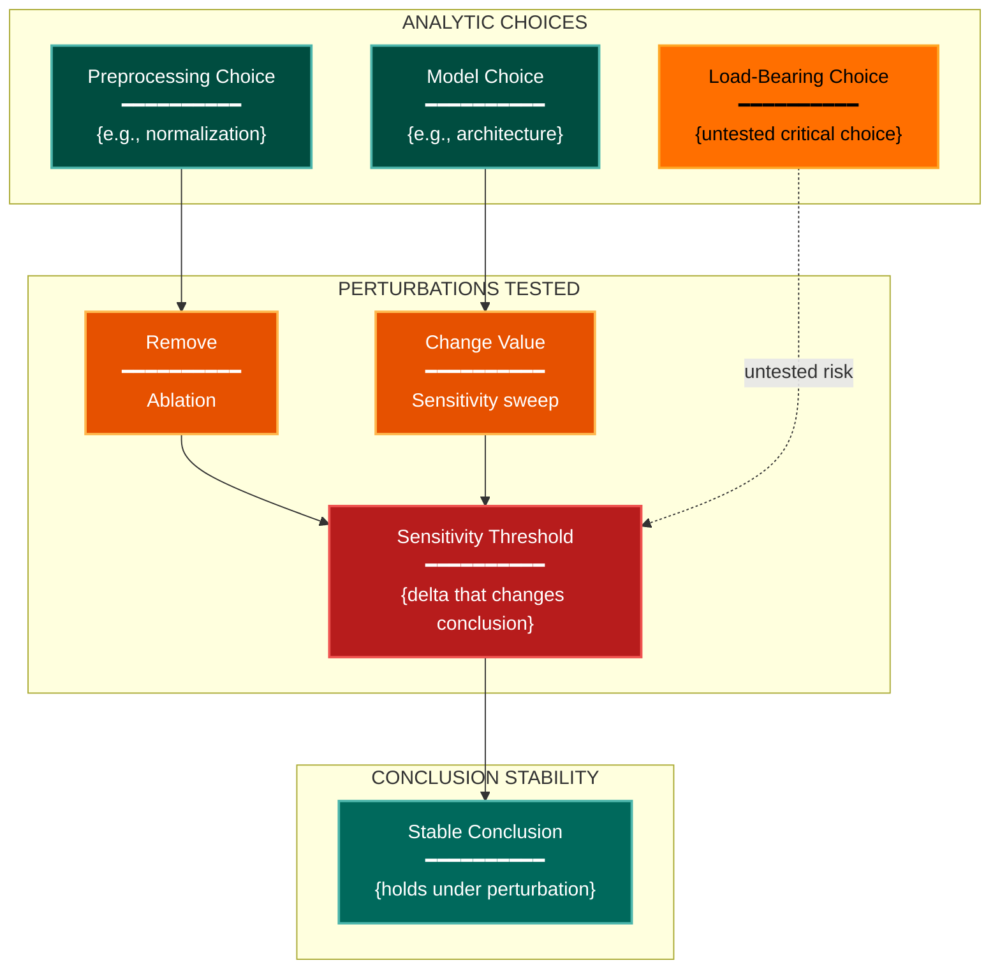

# Sensitivity & Robustness Experimental Design Lens

**Philosophical Mode:** Robustness
**Primary Question:** "Which assumptions are load-bearing?"
**Focus:** Ablation Structure, Preprocessing Sensitivity, Metric Sensitivity, Hyperparameter Sensitivity, Distribution Shift

## When to Use

- Results may depend on specific preprocessing choices
- Need to verify robustness of conclusions across conditions
- Ablation study seems incomplete or cherry-picked
- User invokes `/autoskillit:exp-lens-sensitivity-robustness` or `/autoskillit:make-experiment-diag sensitivity`

## Critical Constraints

**NEVER:**
- Modify any source code or experiment files
- Do not litter the codebase with useless comments, TODO markers, or explanatory annotations — the skill output and diagram speak for themselves
- Treat "untested" as equivalent to "robust"
- Create files outside `.autoskillit/temp/exp-lens-sensitivity-robustness/`

**ALWAYS:**
- Build a full sensitivity matrix (choices x perturbation types)
- Classify every analytic choice as load-bearing, minor, or untested
- Flag cases where the most impactful choices are the least tested
- Distinguish between ablations that were run and choices that were simply fixed
- BEFORE creating any diagram, LOAD the `/autoskillit:mermaid` skill using the Skill tool - this is MANDATORY
- If the Skill tool cannot be used (disable-model-invocation) or refuses this invocation, do NOT proceed with diagram creation. Abort this step and omit the diagram from output.
- Write output to `.autoskillit/temp/exp-lens-sensitivity-robustness/exp_diag_sensitivity_robustness_{YYYY-MM-DD_HHMMSS}.md`
- After writing the file, emit the structured output token as **literal plain text** with no
  markdown formatting on the token name (the adjudicator performs a regex match):

  ```
  diagram_path = /absolute/path/to/.autoskillit/temp/exp-lens-sensitivity-robustness/exp_diag_sensitivity_robustness_{...}.md
  %%ORDER_UP%%
  ```

---

## Analysis Workflow

### Step 1: Launch Parallel Exploration Subagents

Spawn Explore subagents to investigate:

**Analytic Choices Made**
- Find all decision points in the analysis pipeline
- Look for: choice, option, default, parameter, threshold, method, alternative

**Ablation Coverage**
- Find which factors have been ablated
- Look for: ablation, without, remove, disable, vary, sweep, drop

**Preprocessing Variations**
- Find preprocessing steps that could be done differently
- Look for: normalize, tokenize, augment, crop, resize, filter, clean, impute

**Hyperparameter Sensitivity**
- Find which hyperparameters were tuned vs fixed
- Look for: learning_rate, batch_size, epochs, dropout, hidden_size, temperature, alpha, beta

**Distribution/Environment Variations**
- Find evidence of testing under different conditions
- Look for: shift, domain, transfer, cross, out_of_distribution, generalize, different

### Step 2: Build the Sensitivity Matrix

Rows = analytic choices. Columns = perturbation types (remove, change, stress).

For each cell: Does the conclusion survive the perturbation?

### Step 3: Classify Analytic Choices

**CRITICAL — Analyze Assumption Load:**
For every analytic choice:
- What happens if this choice were made differently?
- Is there evidence from ablations, sweeps, or prior literature?
- Are the most impactful choices the least tested?

Classify each choice as:
- **Load-bearing**: Conclusion changes if this choice changes
- **Minor**: Conclusion is robust to changes in this choice
- **Untested**: No evidence either way

### Step 4: Create the Optional Perturbation Diagram

If a diagram adds value, create a simplified flowchart. This is OPTIONAL for this hybrid lens — the tables are the primary output.

**Direction:** `TB` (choices flow down through perturbation to conclusion stability)

**Subgraphs:** "ANALYTIC CHOICES", "PERTURBATIONS TESTED", "CONCLUSION STABILITY"

**Node Styling:**
- `stateNode` class: analytic choice nodes
- `handler` class: perturbation type nodes
- `output` class: stable conclusion nodes
- `gap` class: load-bearing untested choice nodes
- `detector` class: sensitivity threshold nodes

### Step 5: Write Output

Write the analysis to: `.autoskillit/temp/exp-lens-sensitivity-robustness/exp_diag_sensitivity_robustness_{YYYY-MM-DD_HHMMSS}.md` (relative to the current working directory)

---

## Output Template

```markdown
# Sensitivity & Robustness Analysis: {Experiment Name}

**Lens:** Sensitivity & Robustness (Robustness)
**Question:** Which assumptions are load-bearing?
**Date:** {YYYY-MM-DD}
**Scope:** {What was analyzed}

## Sensitivity Matrix

| Analytic Choice | Remove | Change Value | Stress Test | Overall Classification |
|----------------|--------|-------------|-------------|------------------------|
| {choice name} | Stable / Fragile / Untested | Stable / Fragile / Untested | Stable / Fragile / Untested | Load-bearing / Minor / Untested |

## Load-Bearing Assumptions

| Assumption | Evidence Type | Impact if Changed | Tested? |
|------------|--------------|-------------------|---------|
| {assumption} | Ablation / Sweep / Literature / None | High / Medium / Low | Yes / No |

## Ablation Coverage Assessment

| Factor | Ablated? | Result | Interpretation |
|--------|----------|--------|----------------|
| {factor name} | Yes / No | {delta metric if yes} | Conclusion holds / Fragile / Unknown |

## Robustness Profile

| Dimension | Status | Notes |
|-----------|--------|-------|
| Preprocessing choices | Robust / Fragile / Untested | {detail} |
| Hyperparameter choices | Robust / Fragile / Untested | {detail} |
| Metric choices | Robust / Fragile / Untested | {detail} |
| Distribution shift | Robust / Fragile / Untested | {detail} |

## Perturbation Diagram (Optional)



**Color Legend:**
| Color | Category | Description |
|-------|----------|-------------|
| Teal | Analytic Choices | Decision points in the pipeline |
| Yellow | Load-Bearing Untested | Critical choices with no perturbation evidence |
| Orange | Perturbations | Types of tests applied |
| Red | Sensitivity Thresholds | Points where conclusion may change |
| Dark Teal | Stable Conclusions | Results robust to perturbation |

## Recommendations

1. {Most urgent ablation to run — highest impact untested choice}
2. {Preprocessing sensitivity test needed}
3. {Distribution shift or domain generalization test needed}
```

---

## Pre-Diagram Checklist

Before creating the diagram, verify:

- [ ] LOADED `/autoskillit:mermaid` skill using the Skill tool
- [ ] Using ONLY classDef styles from the mermaid skill (no invented colors)
- [ ] Diagram will include a color legend table

---

## Related Skills

- `/autoskillit:make-experiment-diag` - Parent skill for lens selection
- `/autoskillit:mermaid` - MUST BE LOADED before creating diagram
- `/autoskillit:exp-lens-estimand-clarity` - For clarifying which conclusions are being stress-tested
- `/autoskillit:exp-lens-iterative-learning` - For tracking robustness improvements across experiment iterations
