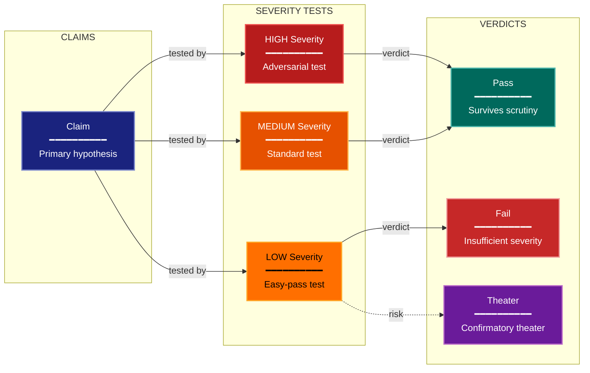

# Severity Testing Experimental Design Lens

> **Preflight:** Before acting on any `exploration-vector` directive below, call `enable_exploration` to establish read-only broker authority for this session; the vectors below assume broker access has already been granted.

**Philosophical Mode:** Falsificationist
**Primary Question:** "Would this design have caught the error?"
**Focus:** Adversarial Cases, Negative Controls, Falsification Tests, Easy-Pass Detection, Confirmatory Theater

## Arguments

`/autoskillit:exp-lens-severity-testing [context_path] [experiment_plan_path]`

- **context_path** (optional positional arg 1) — Absolute path to a lens context file
  containing IV/DV tables, H0/H1 hypotheses, controlled variables, and success criteria.
  If provided, read this file before beginning analysis to obtain structured context.
  If omitted, discover context by exploring the CWD.
- **experiment_plan_path** (optional positional arg 2) — Absolute path to the full
  experiment plan. If provided, read for complete experimental methodology and design.
  If omitted, locate the experiment plan by exploring the CWD.

## When to Use

- Evaluating whether positive results are meaningful or trivially achievable
- Checking for adversarial robustness of experimental conclusions
- User invokes `/autoskillit:exp-lens-severity-testing` or `/autoskillit:make-experiment-diag severity`

## Critical Constraints

**NEVER:**
- Fabricate, invent, or embellish information not supported by the available evidence or code.

- Modify any source code files
- Accept a "pass" result without asking what a false result would have looked like under this design
- Create files outside `{{AUTOSKILLIT_TEMP}}/exp-lens-severity-testing/`
- Execute target code, experiment workflows, or target test commands to gather exploration evidence
- Detach child delegations instead of joining them (joining every child is required)
- Run exploration leaves in the background
- Start independent child delegations sequentially

**ALWAYS:**
- For every positive claim, identify what error the test was capable of detecting
- Inventory negative controls and sanity checks explicitly — their absence is a finding
- Rate severity before reporting conclusions, not after
- Flag confirmatory theater: experiments designed to confirm rather than risk refutation
- BEFORE creating any diagram, LOAD the `/autoskillit:mermaid` skill using the Skill tool - this is MANDATORY
- If the Skill tool cannot be used (disable-model-invocation) or refuses this invocation, do NOT proceed with diagram creation. Abort this step and omit the diagram from output.
- Start all independent child delegations before awaiting any result to maximize concurrency
- Use the registered exploration roles for all repository reads
- Register every exploration vector below and route the missing-context fallback only for fields absent after parent-side argument parsing
- Allow parent-boundary handoff from artifact evidence to semantic code navigation when a bounded code frontier is required, without creating extra vectors
- Wait for every applicable exploration result before assessing claims, rating severity, identifying gaps, or creating the optional diagram
- Retain parent authority over falsification judgment, severity ratings, confirmatory-theater classification, recommendations, and diagram creation
- Write output to `{{AUTOSKILLIT_TEMP}}/exp-lens-severity-testing/exp_diag_severity_testing_{YYYY-MM-DD_HHMMSS}.md`
- After writing the file, emit the structured output token as **literal plain text** with no
  markdown formatting on the token name (the adjudicator performs a regex match):

  ```
  diagram_path = /absolute/path/to/{{AUTOSKILLIT_TEMP}}/exp-lens-severity-testing/exp_diag_severity_testing_{...}.md
  ```

---

## Analysis Workflow

### Step 0: Parse optional arguments

If positional arg 1 (context_path) is provided and the file exists, read it to obtain
IV/DV tables, H0/H1 hypotheses, controlled variables, and success criteria. If positional
arg 2 (experiment_plan_path) is provided and exists, read the experiment plan for full
methodology. Use this structured context as the foundation for Steps 1-5; skip the CWD
exploration for these fields if the context file supplies them.

<!-- autoskillit:exploration-vector id="missing-context-fields" -->
After the parent parses the optional context and experiment plan, dispatch repository retrieval only for required fields still absent. Never rediscover or override a supplied complete field. If no fields remain missing, report this vector not applicable and perform no search. If scoped evidence is absent or unrelated, report the field unavailable or unrelated without widening scope, inferring meaning, or importing or executing target code, tests, experiments, models, or benchmarks.
<!-- /autoskillit:exploration-vector -->

### Step 1: Launch the Routed Exploration Vectors (SINGLE MESSAGE)

Dispatch all ready, scope-disjoint Step-1 vectors through the deterministic router in a single message before awaiting any result. Do not iterate across multiple turns.

Do not output any prose between subagent dispatches. Immediately proceed to the next tool call.

Dispatch every Step-1 vector below under their registered role policies. The parent/router may hand a bounded code frontier to `semantic-code-navigator` when artifact evidence requires it; this does not create another vector. Each leaf returns terminal evidence only and must not execute the target, rate severity, judge falsification strength, identify confirmatory theater, create diagrams, or write lens output.

<!-- autoskillit:exploration-vector id="positive-results-claimed" -->
1. **Positive results claimed** — Identify conclusion and positive-claim artifacts, including demonstrates, improves, outperforms, achieves, shows, confirms, and validates statements and their references.
<!-- /autoskillit:exploration-vector -->

<!-- autoskillit:exploration-vector id="negative-controls-sanity-checks" -->
2. **Negative controls and sanity checks** — Identify negative controls, baselines, sanity checks, ablations, degenerate cases, trivial cases, null tests, random baselines, fixtures, and configuration.
<!-- /autoskillit:exploration-vector -->

<!-- autoskillit:exploration-vector id="adversarial-conditions" -->
3. **Adversarial conditions** — Identify adversarial and stress-test artifacts, including attacks, perturbations, corruption, noise, edge cases, fixtures, and consumers.
<!-- /autoskillit:exploration-vector -->

<!-- autoskillit:exploration-vector id="alternative-explanations-tested" -->
4. **Alternative explanations tested** — Identify evidence that alternative, confounding, artifact-based, spurious, coincidental, or luck-based explanations were examined.
<!-- /autoskillit:exploration-vector -->

<!-- autoskillit:exploration-vector id="prediction-specificity" -->
5. **Prediction specificity** — Identify prediction, hypothesis, preregistration, expectation, and prior declarations made before results, plus their supporting artifacts.
<!-- /autoskillit:exploration-vector -->

### Step 2: Assess Severity for Each Claim

For each claim:
1. What error was the test capable of detecting?
2. What would a false positive result have looked like under this design?
3. Were negative controls or sanity checks included?
4. Were adversarial conditions tested?
5. Is the test informative (would a bad result look different from a good result)?

### Step 3: Rate Severity and Identify Gaps

Severity ratings: HIGH / MEDIUM / LOW
Flag **confirmatory theater** when design is structured to confirm rather than risk refutation.

### Step 4: Create Optional Severity-Flow Diagram

Show Claims → HIGH/MEDIUM/LOW severity tests → Severity verdicts.

### Step 5: Write Output

Write the analysis to: `{{AUTOSKILLIT_TEMP}}/exp-lens-severity-testing/exp_diag_severity_testing_{YYYY-MM-DD_HHMMSS}.md` (relative to the current working directory)


## Output Template

```markdown
# Severity Testing Diagram: {Experiment Name}

**Lens:** Severity Testing (Falsificationist)
**Question:** Would this design have caught the error?
**Date:** {YYYY-MM-DD}
**Scope:** {What was analyzed}

## Severity Assessment

| Claim | Test | Negative Control? | Adversarial? | Severity | Theater? |
|-------|------|--------------------|--------------|----------|----------|
| {claim} | {test description} | {Yes/No} | {Yes/No} | {HIGH/MEDIUM/LOW} | {Yes/No} |

## Severity-Flow Diagram



**Color Legend:**
| Color | Category | Description |
|-------|----------|-------------|
| Dark Blue | Claims | Hypotheses under scrutiny |
| Red | High Severity | Adversarial and negative control tests |
| Orange | Medium Severity | Standard tests with moderate rigor |
| Amber | Low Severity | Easy-pass tests (potential theater) |
| Dark Teal | Pass | Claims surviving severe testing |
| Dark Red | Fail | Claims with insufficient test severity |
| Purple | Theater | Confirmatory theater detected |

## Recommendations

- {Recommendation 1}
- {Recommendation 2}
```

---

## Pre-Diagram Checklist


Before creating the diagram, verify:

- [ ] LOADED `/autoskillit:mermaid` skill using the Skill tool
- [ ] Using ONLY classDef styles from the mermaid skill (no invented colors)
- [ ] Diagram will include a color legend table

---

## Related Skills

- `/autoskillit:make-experiment-diag` - Parent skill
- `/autoskillit:mermaid` - MUST BE LOADED before creating diagram
- `/autoskillit:exp-lens-error-budget`
- `/autoskillit:exp-lens-validity-threats`
