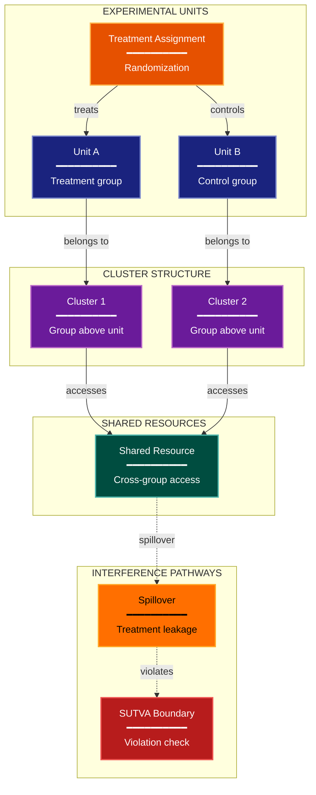

# Unit Interference Experimental Design Lens

**Philosophical Mode:** Causal-Structural
**Primary Question:** "What is the unit, and can treatments spill over?"
**Focus:** Experimental Unit, Cluster Structure, Shared Resources, Network Effects, SUTVA Violations

## Arguments

`/autoskillit:exp-lens-unit-interference [context_path] [experiment_plan_path]`

- **context_path** (optional positional arg 1) — Absolute path to a lens context file
  containing IV/DV tables, H0/H1 hypotheses, controlled variables, and success criteria.
  If provided, read this file before beginning analysis to obtain structured context.
  If omitted, discover context by exploring the CWD.
- **experiment_plan_path** (optional positional arg 2) — Absolute path to the full
  experiment plan. If provided, read for complete experimental methodology and design.
  If omitted, locate the experiment plan by exploring the CWD.

## When to Use

- Online A/B tests with shared infrastructure
- Distributed systems where units share caches, queues, or services
- Social or network experiments where units are connected
- User invokes `/autoskillit:exp-lens-unit-interference` or `/autoskillit:make-experiment-diag unit`

## Critical Constraints

**NEVER:**
- Fabricate, invent, or embellish information not supported by the available evidence or code.

- Modify any source code files
- Do not litter the codebase with useless comments, TODO markers, or explanatory annotations — the skill output and diagram speak for themselves
- Create files outside `{{AUTOSKILLIT_TEMP}}/exp-lens-unit-interference/`
- Run subagents in the background (`run_in_background: true` is prohibited)
- Issue subagent Task calls sequentially — ALL must be in a single parallel message

**ALWAYS:**
- Focus on the unit definition and whether SUTVA is plausible
- Map the full unit-cluster-resource hierarchy before assessing interference
- Identify every shared resource that could transmit treatment effects across groups
- Distinguish direct spillover (shared cache) from indirect spillover (market equilibrium)
- BEFORE creating any diagram, LOAD the `/autoskillit:mermaid` skill using the Skill tool - this is MANDATORY
- If the Skill tool cannot be used (disable-model-invocation) or refuses this invocation, do NOT proceed with diagram creation. Abort this step and omit the diagram from output.
- Issue all Task calls in a single message to maximize parallelism
- Write output to `{{AUTOSKILLIT_TEMP}}/exp-lens-unit-interference/exp_diag_unit_interference_{YYYY-MM-DD_HHMMSS}.md`
- After writing the file, emit the structured output token as **literal plain text** with no
  markdown formatting on the token name (the adjudicator performs a regex match):

  ```
  diagram_path = /absolute/path/to/{{AUTOSKILLIT_TEMP}}/exp-lens-unit-interference/exp_diag_unit_interference_{...}.md
  ```

---

## Analysis Workflow

### Step 0: Parse optional arguments

If positional arg 1 (context_path) is provided and the file exists, read it to obtain
IV/DV tables, H0/H1 hypotheses, controlled variables, and success criteria. If positional
arg 2 (experiment_plan_path) is provided and exists, read the experiment plan for full
methodology. Use this structured context as the foundation for Steps 1-5; skip the CWD
exploration for these fields if the context file supplies them. For any field absent from the context file, perform CWD exploration for that specific field only.

### Step 1: Launch Parallel Exploration Subagents (SINGLE MESSAGE)

**Issue ALL Explore/Task subagent calls in a single message — one per item — so they execute in parallel. Do NOT iterate across multiple turns.**

Do not output any prose between subagent dispatches. Immediately proceed to the next tool call.

Spawn Explore subagents to investigate:

**Unit Definition**
- Find what constitutes one experimental unit
- Is it a user, request, session, query, item, sample, trial, or instance?
- Look for: user, request, session, query, item, sample, trial, instance

**Cluster & Group Structure**
- Find groupings of units that might share treatment effects
- Identify natural clustering that predates treatment assignment
- Look for: cluster, group, shard, server, region, batch, household, team

**Shared Resources**
- Find infrastructure shared across treatment groups
- Identify components both treatment and control units touch
- Look for: cache, queue, pool, database, service, load_balancer, gpu, memory

**Network & Social Connections**
- Find connections between units that could transmit treatment effects
- Identify paths by which a treated unit could alter a control unit's experience
- Look for: network, graph, friend, neighbor, link, message, recommend, influence

**Treatment Assignment Boundary**
- Find where the treatment boundary is drawn
- Identify whether the assignment is at the unit level or a coarser level
- Look for: bucket, hash, experiment_id, variant, flag, feature_flag, rollout

### Step 2: Map the Unit-Cluster-Resource Hierarchy

For each level of the hierarchy:
- Can treatment at one level affect outcomes at another?
- Identify specific spillover pathways between levels
- Assess whether SUTVA (stable unit treatment value assumption) is plausible at each level

Document:
- **Unit Level**: The atomic entity receiving treatment
- **Cluster Level**: Natural groupings of units with shared context
- **System Level**: Infrastructure shared across all groups

### Step 3: Analyze Interference Pathways

**CRITICAL — Analyze Interference Pathways:**
For every shared resource or connection:
- Could treatment group A's behavior change the experience of control group B?
- Is this interference direct (shared cache hit rates) or indirect (market-level equilibrium effects)?
- What is the likely magnitude: negligible, moderate, or invalidating?
- Is there a mitigation strategy (cluster-level randomization, holdout, depletion correction)?

Rate each pathway:
- **HIGH**: Interference almost certainly contaminates the control group
- **MEDIUM**: Plausible interference under realistic usage patterns
- **LOW**: Theoretical but unlikely to affect measured outcomes

### Step 4: Create the Diagram

Use flowchart with:

**Direction:** `TB` (units nested within clusters nested within the system)

**Subgraphs:**
- "EXPERIMENTAL UNITS" (the atomic entities being randomized)
- "CLUSTER STRUCTURE" (groupings above the unit level)
- "SHARED RESOURCES" (infrastructure accessible by both groups)
- "INTERFERENCE PATHWAYS" (explicit spillover routes)

**Node Styling:**
- `cli` class: Experimental units
- `phase` class: Cluster / group nodes
- `stateNode` class: Shared resources
- `gap` class: Interference pathways
- `handler` class: Treatment assignment
- `detector` class: SUTVA boundary

### Step 5: Write Output

Write the diagram to: `{{AUTOSKILLIT_TEMP}}/exp-lens-unit-interference/exp_diag_unit_interference_{YYYY-MM-DD_HHMMSS}.md` (relative to the current working directory)

---

## Output Template

```markdown
# Unit Interference Assessment: {Experiment Name}

**Lens:** Unit Interference (Causal-Structural)
**Question:** What is the unit, and can treatments spill over?
**Date:** {YYYY-MM-DD}
**Scope:** {What was analyzed}

## Unit Hierarchy

| Level | Entity | Shares With | Clustering Risk |
|-------|--------|-------------|-----------------|
| {level} | {entity} | {shared resources} | {High/Medium/Low} |

## Interference Pathways

| Pathway | Type | Mechanism | Magnitude | Mitigation |
|---------|------|-----------|-----------|------------|
| {pathway} | {Direct/Indirect} | {mechanism} | {High/Medium/Low} | {mitigation} |

## Interference Diagram



**Color Legend:**
| Color | Category | Description |
|-------|----------|-------------|
| Dark Blue | Units | Experimental units (atomic entities) |
| Orange | Assignment | Treatment assignment mechanism |
| Purple | Clusters | Group structure above unit level |
| Teal | Shared Resources | Infrastructure accessible by both groups |
| Amber | Interference | Spillover pathways |
| Red | SUTVA | SUTVA boundary violation detection |

## Recommendations

- {Recommendation 1}
- {Recommendation 2}
```

---

## Pre-Diagram Checklist

Before creating the diagram, verify:

- [ ] LOADED `/autoskillit:mermaid` skill using the Skill tool
- [ ] Using ONLY classDef styles from the mermaid skill (no invented colors)
- [ ] Diagram will include a color legend table

---

## Related Skills

- `/autoskillit:make-experiment-diag` - Parent skill for experimental lens selection
- `/autoskillit:mermaid` - MUST BE LOADED before creating diagram
- `/autoskillit:exp-lens-causal-assumptions` - For DAG-level causal structure analysis
- `/autoskillit:exp-lens-randomization-blocking` - For randomization strategy and blocking design
