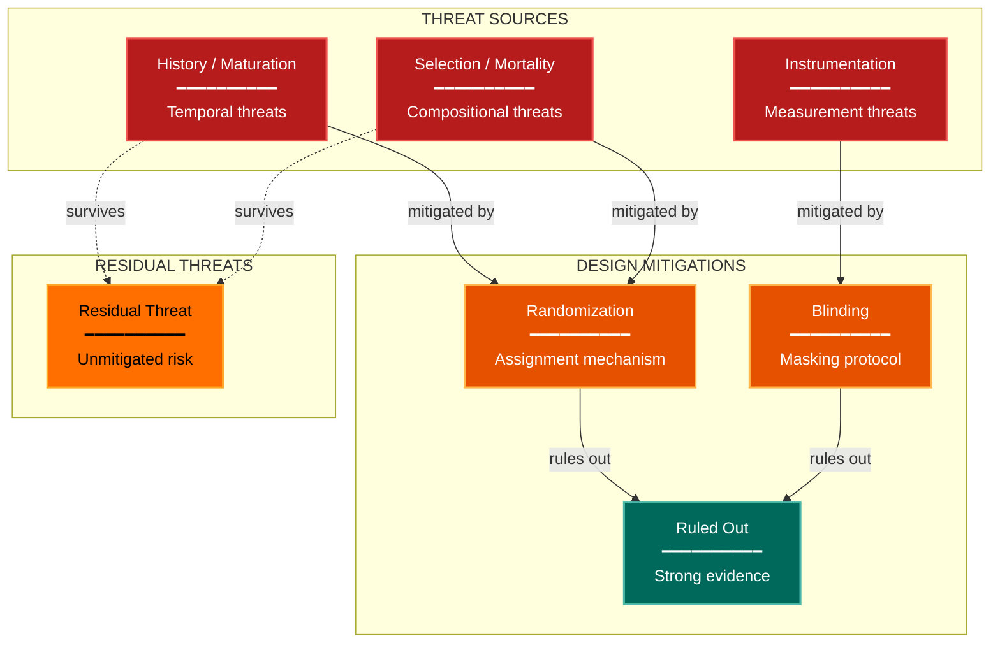

# Validity Threats Experimental Design Lens

**Philosophical Mode:** Adversarial
**Primary Question:** "What alternative explanations survive?"
**Focus:** History Effects, Instrumentation Changes, Selection Effects, Co-interventions, Treatment Diffusion

## Arguments

`/autoskillit:exp-lens-validity-threats [context_path] [experiment_plan_path]`

- **context_path** (optional positional arg 1) — Absolute path to a lens context file
  containing IV/DV tables, H0/H1 hypotheses, controlled variables, and success criteria.
  If provided, read this file before beginning analysis to obtain structured context.
  If omitted, discover context by exploring the CWD.
- **experiment_plan_path** (optional positional arg 2) — Absolute path to the full
  experiment plan. If provided, read for complete experimental methodology and design.
  If omitted, locate the experiment plan by exploring the CWD.

## When to Use

- Quasi-experimental designs without full randomization
- System experiments with environmental changes
- Longitudinal comparisons
- User invokes `/autoskillit:exp-lens-validity-threats` or `/autoskillit:make-experiment-diag validity`

## Critical Constraints

**NEVER:**
- Fabricate, invent, or embellish information not supported by the available evidence or code.

- Modify any source code files
- Create files outside `{{AUTOSKILLIT_TEMP}}/exp-lens-validity-threats/`
- Run subagents in the background (`run_in_background: true` is prohibited)
- Issue subagent Task calls sequentially — ALL must be in a single parallel message

**ALWAYS:**
- Apply Campbell & Stanley's full threat taxonomy — do not skip threats just because they seem unlikely
- For every observed difference, enumerate at least 3 alternative explanations
- Assess mitigation strength honestly — "partially mitigated" is better than false confidence
- Distinguish threats that are ruled out by design from those that remain plausible
- BEFORE creating any diagram, LOAD the `/autoskillit:mermaid` skill using the Skill tool - this is MANDATORY
- If the Skill tool cannot be used (disable-model-invocation) or refuses this invocation, do NOT proceed with diagram creation. Abort this step and omit the diagram from output.
- Issue all Task calls in a single message to maximize parallelism
- Write output to `{{AUTOSKILLIT_TEMP}}/exp-lens-validity-threats/exp_diag_validity_threats_{YYYY-MM-DD_HHMMSS}.md`
- After writing the file, emit the structured output token as **literal plain text** with no
  markdown formatting on the token name (the adjudicator performs a regex match):

  ```
  diagram_path = /absolute/path/to/{{AUTOSKILLIT_TEMP}}/exp-lens-validity-threats/exp_diag_validity_threats_{...}.md
  ```

---

## Analysis Workflow

### Step 0: Parse optional arguments

If positional arg 1 (context_path) is provided and the file exists, read it to obtain
IV/DV tables, H0/H1 hypotheses, controlled variables, and success criteria. If positional
arg 2 (experiment_plan_path) is provided and exists, read the experiment plan for full
methodology. Use this structured context as the foundation for Steps 1-5; skip the CWD
exploration for these fields if the context file supplies them. For any field absent from the context file, perform CWD exploration for that specific field only.

### Step 1: Launch Parallel Exploration Subagents (SINGLE MESSAGE)

**Issue ALL Explore/Task subagent calls in a single message — one per item — so they execute in parallel. Do NOT iterate across multiple turns.**

Do not output any prose between subagent dispatches. Immediately proceed to the next tool call.

Spawn Explore subagents to investigate:

**Temporal Changes (History)**
- Find system, environment, or data changes during the experiment
- Look for: deploy, release, update, change, migration, incident, outage, rollback

**Instrumentation Changes**
- Find changes to measurement tools or logging during the experiment
- Look for: logging, monitoring, metric, measure, instrument, version, schema

**Selection & Filtering**
- Find how subjects, samples, or data were selected
- Look for: filter, select, sample, eligibility, inclusion, exclusion, criteria

**Co-interventions**
- Find other changes running simultaneously with the treatment
- Look for: concurrent, parallel, simultaneous, co-running, other_experiment, a_b_overlap

**Treatment Diffusion**
- Find ways treatment effects could spread to control groups
- Look for: contamination, diffusion, spillover, shared, cross, control_exposure

### Step 2: Apply Threat Taxonomy

Apply Campbell & Stanley's threat taxonomy: plausibility, design mitigation, mitigation strength → build threat matrix.

### Step 3: Analyze Alternative Explanations

For every observed difference: list at least 3 alternative explanations, ruling-out evidence, consistent evidence.

### Step 4: Create the Diagram

**Direction:** TB. Subgraphs: THREAT SOURCES, DESIGN MITIGATIONS, RESIDUAL THREATS

### Step 5: Write Output

Write the diagram to: `{{AUTOSKILLIT_TEMP}}/exp-lens-validity-threats/exp_diag_validity_threats_{YYYY-MM-DD_HHMMSS}.md` (relative to the current working directory)

---

## Output Template

```markdown
# Validity Threats Assessment: {Experiment Name}

**Lens:** Validity Threats (Adversarial)
**Question:** What alternative explanations survive?
**Date:** {YYYY-MM-DD}
**Scope:** {What was analyzed}

## Campbell-Stanley Threat Matrix

| Threat | Plausibility | Design Mitigation | Mitigation Strength | Residual Risk |
|--------|-------------|--------------------|--------------------|---------------|
| {threat} | {High/Medium/Low} | {mitigation} | {Strong/Moderate/Weak/None} | {High/Medium/Low} |

## Alternative Explanations

| Observation | Alternative Explanation | Ruling-Out Evidence | Verdict |
|-------------|------------------------|---------------------|---------|
| {observation} | {explanation} | {evidence} | {Ruled Out/Plausible/Cannot Rule Out} |

## Validity Diagram



**Color Legend:**
| Color | Category | Description |
|-------|----------|-------------|
| Red | Threat Sources | Campbell-Stanley validity threats |
| Orange | Mitigations | Design features addressing threats |
| Dark Teal | Ruled Out | Threats with strong ruling-out evidence |
| Amber | Residual | Unmitigated threats requiring attention |

## Recommendations

- {Recommendation 1}
- {Recommendation 2}
```

---

## Campbell-Stanley Checklist

Apply to every experiment:
1. History — concurrent events confounding treatment
2. Maturation — natural changes in subjects over time
3. Testing — pre-test sensitization effects
4. Instrumentation — changes in measurement tools
5. Statistical Regression — regression to the mean
6. Selection — non-random group formation
7. Experimental Mortality — differential dropout
8. Selection-Maturation Interaction — groups maturing at different rates
9. Diffusion of Treatments — control group exposed to treatment
10. Co-interventions — simultaneous competing treatments

---

## Pre-Diagram Checklist

Before creating the diagram, verify:

- [ ] LOADED `/autoskillit:mermaid` skill using the Skill tool
- [ ] Using ONLY classDef styles from the mermaid skill (no invented colors)
- [ ] Diagram will include a color legend table

---

## Related Skills

- `/autoskillit:make-experiment-diag` - Parent skill
- `/autoskillit:mermaid` - MUST BE LOADED before creating diagram
- `/autoskillit:exp-lens-causal-assumptions`
- `/autoskillit:exp-lens-severity-testing`
