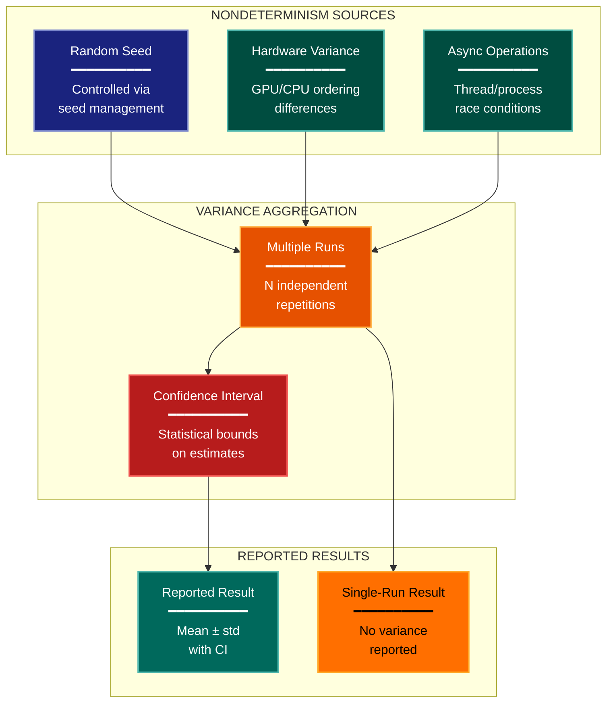

# Variance Stability Experimental Design Lens

**Philosophical Mode:** Stability
**Primary Question:** "Is the signal larger than the noise?"
**Focus:** Run-to-Run Variance, Seed Sensitivity, Nondeterminism Sources, Confidence Intervals, Noise Floor

## When to Use

- ML experiments with high variance across seeds
- Systems benchmarks with environmental noise
- Results where small differences are claimed as improvements
- User invokes `/autoskillit:exp-lens-variance-stability` or `/autoskillit:make-experiment-diag variance`

## Critical Constraints

**NEVER:**
- Modify any source code files
- Do not litter the codebase with useless comments, TODO markers, or explanatory annotations — the skill output and diagram speak for themselves
- Create files outside `.autoskillit/temp/exp-lens-variance-stability/`

**ALWAYS:**
- Count the actual number of independent runs — single-run results must be flagged prominently
- Assess whether claimed improvements exceed the observed standard deviation
- Identify all sources of nondeterminism, not just random seeds
- Report when confidence intervals are absent — absence is a finding, not an omission
- BEFORE creating any diagram, LOAD the `/autoskillit:mermaid` skill using the Skill tool - this is MANDATORY
- If the Skill tool cannot be used (disable-model-invocation) or refuses this invocation, do NOT proceed with diagram creation. Abort this step and omit the diagram from output.
- Write output to `.autoskillit/temp/exp-lens-variance-stability/exp_diag_variance_stability_{YYYY-MM-DD_HHMMSS}.md`
- After writing the file, emit the structured output token as **literal plain text** with no
  markdown formatting on the token name (the adjudicator performs a regex match):

  ```
  diagram_path = /absolute/path/to/.autoskillit/temp/exp-lens-variance-stability/exp_diag_variance_stability_{...}.md
  %%ORDER_UP%%
  ```

---

## Analysis Workflow

### Step 1: Launch Parallel Exploration Subagents

Spawn Explore subagents to investigate:

**Random Seed Management**
- Find how seeds are set and varied
- Look for: seed, random_state, torch.manual_seed, np.random, set_seed, PYTHONHASHSEED

**Nondeterminism Sources**
- Find sources of nondeterminism beyond seeds
- Look for: cudnn, benchmark, deterministic, parallel, async, thread, race, order, nondeterministic

**Multiple Run Protocol**
- Find how many runs are performed per condition
- Look for: n_runs, trials, repeat, replicate, mean, std, confidence, interval, aggregate

**Variance Reporting**
- Find how variance is reported (if at all)
- Look for: std, stderr, confidence, interval, range, median, quartile, bootstrap, error_bar

**Signal-to-Noise Assessment**
- Find whether claimed improvements exceed observed variance
- Look for: significant, difference, improvement, margin, effect_size, gap, overlap

### Step 2: Build Variance Profile

For each reported result:
1. How many independent runs?
2. What is the standard deviation across runs?
3. Does the claimed improvement exceed the noise floor?
4. Are confidence intervals reported?
5. What sources of nondeterminism exist beyond seeds?

Build the variance profile.

### Step 3: Analyze Signal vs Noise

**CRITICAL — Analyze Signal vs Noise:**
For every claimed improvement:
- Is the improvement magnitude larger than the run-to-run standard deviation?
- Could the ranking of methods change under reruns?
- Are the "best" results cherry-picked from multiple seeds?

### Step 4: Create the Diagram

Use the mermaid skill conventions to create a stochasticity diagram with:

**Direction:** `TB` (nondeterminism sources flow down through aggregation to reported results)

**Subgraphs:**
- NONDETERMINISM SOURCES
- VARIANCE AGGREGATION
- REPORTED RESULTS

**Node Styling:**
- `stateNode` class: Nondeterminism sources
- `handler` class: Aggregation methods
- `output` class: Reported results
- `gap` class: Unreported variance or single-run results
- `detector` class: Confidence intervals and statistical tests
- `cli` class: Seed management

### Step 5: Write Output

Write the diagram to: `.autoskillit/temp/exp-lens-variance-stability/exp_diag_variance_stability_{YYYY-MM-DD_HHMMSS}.md` (relative to the current working directory)

---

## Output Template

```markdown
# Variance Stability Analysis: {Experiment Name}

**Lens:** Variance Stability (Stability)
**Question:** Is the signal larger than the noise?
**Date:** {YYYY-MM-DD}
**Scope:** {What was analyzed}

## Variance Profile

| Experiment | N Runs | Mean | Std | CI | Signal > Noise? |
|------------|--------|------|-----|----|-----------------|
| {experiment} | {n} | {mean} | {std} | {CI or "Not reported"} | {Yes/No/Unclear} |

## Nondeterminism Inventory

| Source | Type | Controlled? | Impact |
|--------|------|-------------|--------|
| {source} | {seed/hardware/async/etc} | {Yes/No/Partial} | {Low/Medium/High} |

## Stochasticity Diagram



## Seed Sensitivity Assessment

| Seed | Run Result | Rank Among Methods |
|------|-----------|-------------------|
| {seed} | {result} | {rank} |

## Reporting Completeness Checklist

- [ ] Number of runs reported per condition
- [ ] Standard deviation or standard error reported
- [ ] Confidence intervals reported
- [ ] All seeds or seed range disclosed
- [ ] Nondeterminism sources acknowledged

## Key Findings

- {Description of whether signals exceed noise and reporting completeness}
```

---

## Pre-Diagram Checklist

Before creating the diagram, verify:

- [ ] LOADED `/autoskillit:mermaid` skill using the Skill tool
- [ ] Using ONLY classDef styles from the mermaid skill (no invented colors)
- [ ] Diagram will include a color legend table

---

## Related Skills

- `/autoskillit:make-experiment-diag` - Parent skill for lens selection
- `/autoskillit:mermaid` - MUST BE LOADED before creating diagram
- `/autoskillit:exp-lens-reproducibility-artifacts` - For environment and artifact reproducibility
- `/autoskillit:exp-lens-error-budget` - For systematic error and bias analysis
