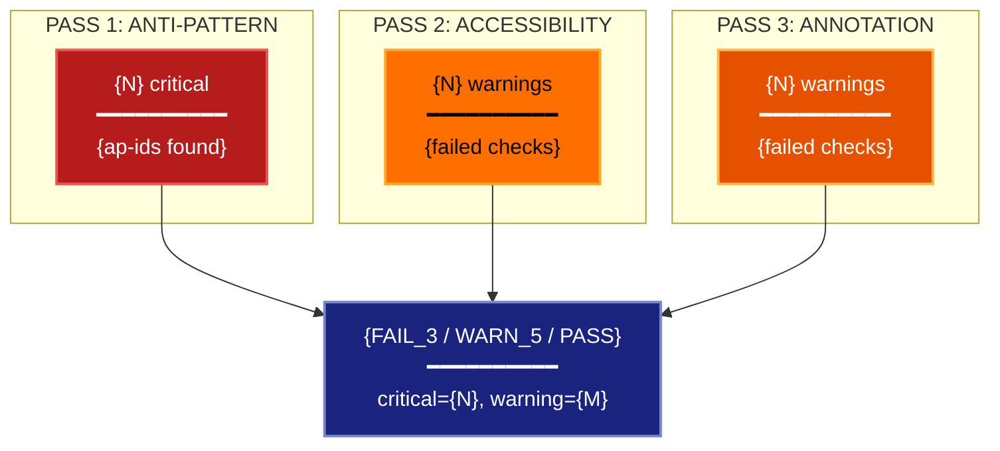

# Always-On Visualization Triage Lens

**Philosophical Mode:** Composite
**Primary Question:** "What are the blocking visualization issues?"
**Focus:** Anti-Pattern Detection, Accessibility, Annotation Completeness — combined triage

## Arguments

`/autoskillit:vis-lens-always-on [context_path] [experiment_plan_path]`

- **context_path** (optional positional arg 1) — Absolute path to a lens context file
  containing IV/DV tables, H0/H1 hypotheses, controlled variables, and success criteria.
  If provided, read this file before beginning analysis to obtain structured context.
  If omitted, discover context by exploring the CWD.
- **experiment_plan_path** (optional positional arg 2) — Absolute path to the full
  experiment plan. If provided, read for complete experimental methodology and design.
  If omitted, locate the experiment plan by exploring the CWD.

## When to Use

- Fast triage before any figure review or submission — run this first
- Lightweight check when you do not need the full depth of individual lenses
- CI-style gate: FAIL_N blocks, WARN_N is informational, PASS is green
- Quick scan of a figure plan to surface the most important blocking issues
- User invokes `/autoskillit:vis-lens-always-on`

## Critical Constraints

**NEVER:**
- Modify any source code files
- Do not litter the codebase with useless comments, TODO markers, or explanatory annotations — the skill output and diagram speak for themselves
- Create files outside `{{AUTOSKILLIT_TEMP}}/vis-lens-always-on/`
- Emit PASS if any critical finding exists — any single critical = FAIL_N

**ALWAYS:**
- Run all three passes in sequence; do not skip any pass
- Tally critical_count and warning_count across all three passes
- BEFORE creating any diagram, LOAD the `/autoskillit:mermaid` skill using the Skill tool - this is MANDATORY
- If the Skill tool cannot be used (disable-model-invocation) or refuses this invocation, do NOT proceed with diagram creation. Abort this step and omit the diagram from output.
- Write output to `{{AUTOSKILLIT_TEMP}}/vis-lens-always-on/vis_spec_always_on_{YYYY-MM-DD_HHMMSS}.md` (relative to the current working directory)
- After writing the file, emit the structured output token as **literal plain text** with no
  markdown formatting on the token name (the adjudicator performs a regex match):

  ```
  diagram_path = /absolute/path/to/{{AUTOSKILLIT_TEMP}}/vis-lens-always-on/vis_spec_always_on_{...}.md
  %%ORDER_UP%%
  ```

---

## Analysis Workflow

### Step 0: Parse optional arguments

If positional arg 1 (context_path) is provided and the file exists, read it to obtain
IV/DV tables, H0/H1 hypotheses, controlled variables, and success criteria. If positional
arg 2 (experiment_plan_path) is provided and exists, read the experiment plan for full
methodology. Use this structured context as the foundation for all three passes; skip the
CWD exploration for these fields if the context file supplies them.

### Step 1: Inventory All Figures

Before running passes, build a complete figure inventory from the experiment plan, context
file, code, and any existing output files. Every figure in this inventory is checked in
all three passes.

### Step 2: Run THREE Sequential Passes

#### Pass 1 — Anti-Pattern Scan

Check all figures against the 16 anti-patterns from `vis-lens-antipattern`:

| ID | Severity |
|----|----------|
| ap-3d-bar | critical |
| ap-dual-axis | critical |
| ap-rainbow | critical |
| ap-single-seed | critical |
| ap-truncated-bar | critical |
| ap-spider-radar | warning |
| ap-spaghetti | warning |
| ap-bar-no-error | warning |
| ap-smoothed-hidden | warning |
| ap-violin-small-n | warning |
| ap-cherry-baseline | warning |
| ap-overplotting | warning |
| ap-tsne-distance | warning |
| ap-tsne-no-perplexity | warning |
| ap-embedding-single-seed | warning |
| ap-area-encoding | info (counts as 0 in tally) |

Tally: `pass1_critical_count`, `pass1_warning_count`

#### Pass 2 — Accessibility Scan

For each figure, check all four accessibility criteria:

1. **colorblind_safe** — palette is wong, okabe-ito, viridis, or cividis? (PASS) or jet/rainbow/custom? (FAIL → warning)
2. **font_size_ok** — all axis labels, tick labels, legends ≥ 8pt? Check `fontsize` args in code or figure config. (PASS if ≥ 8pt or undetectable; FAIL → warning)
3. **no_color_only_encoding** — distinction between groups uses shape, pattern, or label in addition to color? Color-only encoding for distinction = FAIL → warning
4. **captions_present** — figure has alt-text, caption, or description in the paper/plan? No caption = FAIL → warning

Tally: count failures as `pass2_warning_count` (accessibility failures are warnings, not critical)

#### Pass 3 — Annotation Completeness

For each figure, check all five annotation criteria:

1. **all_titles** — every figure has a title or caption title? Missing = warning
2. **axis_labels** — both axes labeled with variable name and units? Missing = warning
3. **legends_ok** — multi-series figures have a legend? Missing = warning
4. **stat_overlay_labeled** — if an uncertainty overlay exists, is it labeled (e.g., "± CI95, n=5")? Unlabeled overlay = warning
5. **data_pointer** — figure has a data source reference or code pointer in caption? Missing = info (not counted in tally)

Tally: count failures as `pass3_warning_count`

### Step 3: Compute Combined Verdict

```
critical_count = pass1_critical_count
warning_count = pass1_warning_count + pass2_warning_count + pass3_warning_count

if critical_count > 0:
    verdict = f"FAIL_{critical_count}"
elif warning_count > 0:
    verdict = f"WARN_{warning_count}"
else:
    verdict = "PASS"
```

### Step 4: Emit yaml:spec-index Block and Mermaid Diagram

Emit the `yaml:spec-index` triage index (NOT yaml:figure-spec — this is a triage summary,
not a per-figure spec). Then LOAD `/autoskillit:mermaid` and create the triage diagram.

---

## Output Template

```markdown
# Always-On Triage Report: {System / Experiment Name}

**Lens:** Always-On Triage (Composite)
**Question:** What are the blocking visualization issues?
**Date:** {YYYY-MM-DD}
**Scope:** {What was analyzed}

## Triage Index

```yaml
# yaml:spec-index — Always-On triage index
verdict: "FAIL_3"         # PASS | WARN_N | FAIL_N
critical_count: 3
warning_count: 5
pass_1_antipattern: ["ap-single-seed", "ap-rainbow", "ap-dual-axis"]
pass_2_accessibility:
  colorblind_safe: true
  font_size_ok: false
  no_color_only_encoding: true
  captions_present: false
pass_3_annotation:
  all_titles: true
  axis_labels: false
  legends_ok: true
  stat_overlay_labeled: false
  data_pointer: true
figures_with_critical: ["fig-01-main-results", "fig-03-ablation"]
```

## Pass Results

### Pass 1 — Anti-Pattern Scan

| Figure | Anti-Patterns Found | Severity |
|--------|---------------------|----------|
| {fig-01} | ap-single-seed, ap-rainbow | critical, critical |
| {fig-03} | ap-dual-axis | critical |
| {fig-02} | ap-bar-no-error | warning |

### Pass 2 — Accessibility Scan

| Check | Result | Notes |
|-------|--------|-------|
| colorblind_safe | PASS | wong palette used throughout |
| font_size_ok | FAIL | fig-02 axis labels at 6pt |
| no_color_only_encoding | PASS | shapes used alongside color |
| captions_present | FAIL | fig-01, fig-03 missing captions |

### Pass 3 — Annotation Completeness

| Check | Result | Notes |
|-------|--------|-------|
| all_titles | PASS | all figures have titles |
| axis_labels | FAIL | fig-02 y-axis missing units |
| legends_ok | PASS | all multi-series figures have legends |
| stat_overlay_labeled | FAIL | fig-01 error bars unlabeled |
| data_pointer | PASS | all figures reference source |

## Triage Diagram



**Color Legend:**
| Color | Category | Description |
|-------|----------|-------------|
| Red | Pass 1 Critical | Anti-pattern findings (critical) |
| Amber | Pass 2 Warnings | Accessibility failures |
| Orange | Pass 3 Warnings | Annotation completeness failures |
| Dark Blue | Verdict | Combined PASS/WARN_N/FAIL_N |
```

---

## Pre-Diagram Checklist

Before creating the diagram, verify:

- [ ] LOADED `/autoskillit:mermaid` skill using the Skill tool
- [ ] Using ONLY classDef styles from the mermaid skill (no invented colors)
- [ ] Diagram will include a color legend table
- [ ] All three passes completed before computing verdict
- [ ] yaml:spec-index emitted (not yaml:figure-spec)
- [ ] verdict is FAIL_N if critical_count > 0, WARN_N if warning_count > 0, PASS otherwise
