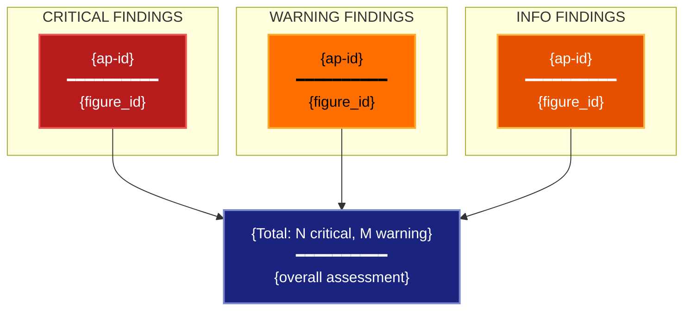

# Anti-Pattern Detection Visualization Lens

**Philosophical Mode:** Diagnostic
**Primary Question:** "Which visualization anti-patterns are present?"
**Focus:** Severity-Tiered Anti-Pattern Catalog, Evidence-Backed Findings, Remediation Guidance

## Arguments

`/autoskillit:vis-lens-antipattern [context_path] [experiment_plan_path]`

- **context_path** (optional positional arg 1) — Absolute path to a lens context file
  containing IV/DV tables, H0/H1 hypotheses, controlled variables, and success criteria.
  If provided, read this file before beginning analysis to obtain structured context.
  If omitted, discover context by exploring the CWD.
- **experiment_plan_path** (optional positional arg 2) — Absolute path to the full
  experiment plan. If provided, read for complete experimental methodology and design.
  If omitted, locate the experiment plan by exploring the CWD.

## When to Use

- Reviewing a figure plan or existing figures for visualization quality issues
- Pre-submission audit of all planned and existing figures
- Checking whether a specific anti-pattern (e.g., single random seed) is present
- Diagnosing why a reviewer rejected or criticized figure choices
- User invokes `/autoskillit:vis-lens-antipattern`

## Anti-Pattern Catalog

| ID | Name | Severity | Description | Remediation |
|----|------|----------|-------------|-------------|
| ap-3d-bar | 3D Bar Chart | critical | Occlusion + perspective distortion destroy comparability | Use 2D grouped bar |
| ap-dual-axis | Dual Y-Axis | critical | Two unrelated scales on one chart implies false correlation | Use two separate panels |
| ap-rainbow | Rainbow Colormap | critical | Rainbow has non-monotone luminance; perceptually misleading | Use viridis/cividis/wong |
| ap-single-seed | Single Random Seed | critical | Variance unquantifiable; results may not replicate | Report results across ≥3 seeds |
| ap-truncated-bar | Truncated Bar Y-axis | critical | Non-zero baseline exaggerates differences | Start Y-axis at zero for bars |
| ap-spider-radar | Spider/Radar Chart | warning | Area distorted by axis ordering; angle hard to compare | Use parallel coordinates or bar |
| ap-spaghetti | Spaghetti Line Plot | warning | ≥5 overlapping lines unreadable | Highlight key lines; small multiples |
| ap-bar-no-error | Bar without Error | warning | Mean shown without any uncertainty estimate | Add SE/CI bars or use box/violin |
| ap-smoothed-hidden | Smoothed Line Hiding Raw | warning | Smoothing hides variance structure | Show raw data or rug alongside |
| ap-violin-small-n | Violin with n<10 | warning | KDE shape unreliable at tiny n | Use strip plot or box |
| ap-cherry-baseline | Cherry-picked Baseline | warning | Baseline chosen to maximize apparent improvement | Report against strongest published baseline |
| ap-overplotting | Overplotting | warning | Dense scatter obscures distribution | Use alpha, jitter, hex-bin, or 2D KDE |
| ap-tsne-distance | t-SNE Distance Interpretation | warning | t-SNE distances not meaningful between clusters | Do not interpret inter-cluster distance |
| ap-tsne-no-perplexity | t-SNE Without Perplexity | warning | t-SNE layout varies with perplexity; single plot misleading | Show multiple perplexity values |
| ap-embedding-single-seed | Embedding with Single Random Init | warning | Random init produces different layouts; one layout misleads | Average across runs or show multiple |
| ap-area-encoding | Area Encoding for Data Values | info | Human perception of area is poor (Stevens power ~0.7) | Prefer length or position encoding |

## Critical Constraints

**NEVER:**
- Modify any source code files
- Do not litter the codebase with useless comments, TODO markers, or explanatory annotations — the skill output and diagram speak for themselves
- Create files outside `{{AUTOSKILLIT_TEMP}}/vis-lens-antipattern/`
- Skip checking figures that appear only in planning documents — anti-patterns in planned figures must be caught before implementation

**ALWAYS:**
- Check every identified figure against ALL 16 anti-patterns in the catalog
- Sort findings critical-first, then warning, then info
- Populate the `anti_patterns` field in each yaml:figure-spec with the IDs of matched patterns
- BEFORE creating any diagram, LOAD the `/autoskillit:mermaid` skill using the Skill tool - this is MANDATORY
- If the Skill tool cannot be used (disable-model-invocation) or refuses this invocation, do NOT proceed with diagram creation. Abort this step and omit the diagram from output.
- Write output to `{{AUTOSKILLIT_TEMP}}/vis-lens-antipattern/vis_spec_antipattern_{YYYY-MM-DD_HHMMSS}.md`
- After writing the file, emit the structured output token as **literal plain text** with no
  markdown formatting on the token name (the adjudicator performs a regex match):

  ```
  diagram_path = /absolute/path/to/{{AUTOSKILLIT_TEMP}}/vis-lens-antipattern/vis_spec_antipattern_{...}.md
  %%ORDER_UP%%
  ```

---

## Analysis Workflow

### Step 0: Parse optional arguments

If positional arg 1 (context_path) is provided and the file exists, read it to obtain
IV/DV tables, H0/H1 hypotheses, controlled variables, and success criteria. If positional
arg 2 (experiment_plan_path) is provided and exists, read the experiment plan for full
methodology. Use this structured context as the foundation for Steps 1–4; skip the CWD
exploration for these fields if the context file supplies them.

### Step 1: Scan for Chart Type and Visualization Clues

Scan experiment plan, context file, and codebase for evidence of chart type choices:

**Code Patterns**
- Look for: `plot3D`, `bar3d`, `Axes3D` → ap-3d-bar
- Look for: `twinx`, `twin_y`, `secondary_y` → ap-dual-axis
- Look for: `cmap='jet'`, `cmap='rainbow'`, `cmap='hsv'` → ap-rainbow
- Look for: `seed =`, `np.random.seed`, `torch.manual_seed` (single occurrence) → ap-single-seed
- Look for: `ylim(0.9`, `ylim(0.8`, non-zero bottom on bar axes → ap-truncated-bar
- Look for: `radar`, `spider`, `polar` plot → ap-spider-radar
- Look for: `n_lines >= 5`, many `ax.plot` calls in same axes → ap-spaghetti
- Look for: `ax.bar` without `yerr` or `ax.errorbar` → ap-bar-no-error
- Look for: `smooth`, `rolling`, `savgol_filter`, `gaussian_filter` on line data → ap-smoothed-hidden
- Look for: `violinplot` with n < 10 samples → ap-violin-small-n
- Look for: `TSNE`, `t-SNE`, `tsne` → ap-tsne-distance, ap-tsne-no-perplexity
- Look for: `UMAP`, `umap`, `PCA` single embedding → ap-embedding-single-seed
- Look for: `plt.scatter` with `s=` encoding data values → ap-area-encoding

**Planning Document Patterns**
- Look for descriptions like "3D bar", "dual axis", "radar chart", "single run"
- Look for baseline selection that seems hand-picked or unpublished

### Step 2: Check Each Figure Against All Anti-Patterns

For each figure identified, create a finding record:

```
Figure: {figure_id}
Anti-patterns checked: all 16
Matches found:
  - {ap-id}: {evidence excerpt} → {severity}
  - {ap-id}: {evidence excerpt} → {severity}
Clean: [{ap-ids not found}]
```

### Step 3: Build Severity-Sorted Finding List

Aggregate all findings and sort:
1. **critical** — must fix before submission
2. **warning** — should fix; reviewer will notice
3. **info** — consider fixing; minor perceptual improvement

For each critical finding, produce a one-line remediation instruction.

### Step 4: Emit yaml:figure-spec Blocks and Mermaid Diagram

For each figure, emit one `yaml:figure-spec` fenced block with `anti_patterns` field populated
with matched ap-* IDs. Then LOAD `/autoskillit:mermaid` and create the severity-bucketed diagram.

---

## Output Template

```markdown
# Anti-Pattern Detection Spec: {System / Experiment Name}

**Lens:** Anti-Pattern Detection (Diagnostic)
**Question:** Which visualization anti-patterns are present?
**Date:** {YYYY-MM-DD}
**Scope:** {What was analyzed}

## Findings Summary

| Severity | Count | Anti-Pattern IDs |
|----------|-------|-----------------|
| critical | {N} | {ap-ids} |
| warning | {N} | {ap-ids} |
| info | {N} | {ap-ids} |

## Detailed Findings

### CRITICAL: {ap-id} — {Name}

**Figure:** {figure_id}
**Evidence:** {code or planning doc excerpt}
**Remediation:** {one-line fix}

---

## Figure Specs

```yaml
# yaml:figure-spec — canonical schema (spec_version: "1.0")
figure_id: "fig-01-main-results"
figure_title: "Main Results"
spec_version: "1.0"
chart_type: "grouped-bar"
chart_type_fallback: "dot-plot"
perceptual_justification: "Position encoding; anti-patterns ap-3d-bar and ap-bar-no-error actively avoided."
data_source: "results/main.csv"
data_mapping:
  x: "method"
  y: "score"
  color: "dataset"
  size: ""
  facet: ""
layout:
  width_inches: 6.5
  height_inches: 4.0
  dpi: 300
stat_overlay:
  type: "error_bar"
  measure: "CI95"
  n_seeds: 5
annotations: []
anti_patterns: ["ap-bar-no-error"]
palette: "wong"
format: "pdf"
target_dpi: 300
library: "matplotlib"
report_section: "Section 4"
priority: "P0"
placement_tier: "main"
conflicts: []
metadata:
  created_by: "vis-lens-antipattern"
  reviewed_by: ""
  last_updated: "{YYYY-MM-DD}"
```

## Anti-Pattern Severity Diagram



**Color Legend:**
| Color | Category | Description |
|-------|----------|-------------|
| Red | Critical | Must fix before submission |
| Amber | Warning | Should fix; reviewer will notice |
| Orange | Info | Consider fixing; minor improvement |
| Dark Blue | Verdict | Aggregate severity assessment |
```

---

## Pre-Diagram Checklist

Before creating the diagram, verify:

- [ ] LOADED `/autoskillit:mermaid` skill using the Skill tool
- [ ] Using ONLY classDef styles from the mermaid skill (no invented colors)
- [ ] Diagram will include a color legend table
- [ ] All 16 anti-patterns were checked for each figure
- [ ] Findings are sorted critical-first
- [ ] Each yaml:figure-spec has `anti_patterns` field populated
