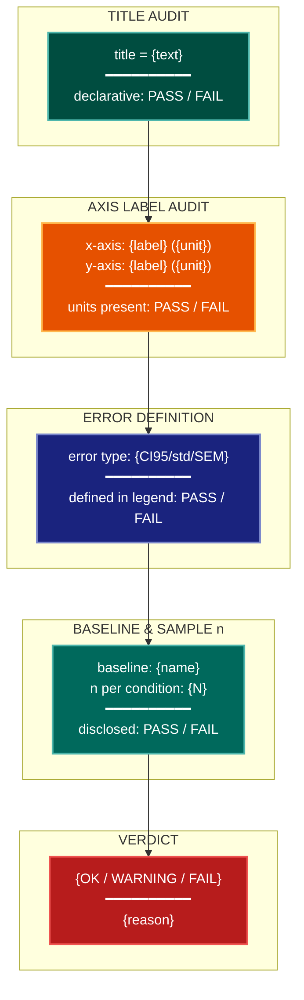

# Annotative Caption Visualization Lens

**Philosophical Mode:** Annotative
**Primary Question:** "Are figure captions and axis labels fully self-contained?"
**Focus:** Declarative titles (state the result, not "Figure N: Results"), axis labels with
           units, error definition in legend (CI95 / std / SEM), baseline references cited in
           caption, sample sizes disclosed per condition, venue-specific caption format

## Arguments

`/autoskillit:vis-lens-caption-annot [context_path] [experiment_plan_path]`

- **context_path** (optional positional arg 1) — Absolute path to a lens context file
  containing IV/DV tables, H0/H1 hypotheses, controlled variables, and success criteria.
  If provided, read this file before beginning analysis to obtain structured context.
  If omitted, discover context by exploring the CWD.
- **experiment_plan_path** (optional positional arg 2) — Absolute path to the full
  experiment plan. If provided, read for complete experimental methodology and design.
  If omitted, locate the experiment plan by exploring the CWD.

## When to Use

- Auditing figure captions before paper submission
- Checking whether axis labels carry units and direction information
- Verifying error bars are defined in the legend or caption
- Ensuring baseline conditions are referenced explicitly
- Disclosing sample size per plotted condition
- User invokes `/autoskillit:vis-lens-caption-annot`

## Critical Constraints

**NEVER:**
- Modify any source code files
- Do not litter the codebase with useless comments, TODO markers, or explanatory annotations — the skill output and diagram speak for themselves
- Create files outside `{{AUTOSKILLIT_TEMP}}/vis-lens-caption-annot/`
- Use a non-declarative title like "Results" or "Figure 3: Performance" — titles must state the takeaway (e.g., "Model A outperforms baseline on all benchmarks")
- Omit units from axis labels (e.g., write "Latency (ms)", not "Latency")

**ALWAYS:**
- Check every figure title for declarative language
- Verify every axis label carries a unit or categorical scale description
- Confirm error bars / shaded regions are defined (CI95, ±1 std, IQR, etc.) in the legend or caption
- Flag any figure that references a baseline without naming it explicitly
- Report sample size per plotted condition (n=X seeds, N=X subjects, etc.)
- BEFORE creating any diagram, LOAD the `/autoskillit:mermaid` skill using the Skill tool — this is MANDATORY
- If the Skill tool cannot be used (disable-model-invocation) or refuses this invocation, do NOT proceed with diagram creation. Abort this step and omit the diagram from output.
- Write output to `{{AUTOSKILLIT_TEMP}}/vis-lens-caption-annot/vis_spec_caption_annot_{YYYY-MM-DD_HHMMSS}.md` (relative to the current working directory)
- After writing the file, emit the structured output token as **literal plain text** with no
  markdown formatting on the token name (the adjudicator performs a regex match):

  ```
  diagram_path = /absolute/path/to/{{AUTOSKILLIT_TEMP}}/vis-lens-caption-annot/vis_spec_caption_annot_{...}.md
  ```

---

## Analysis Workflow

### Step 0: Parse optional arguments

If positional arg 1 (context_path) is provided and the file exists, read it to obtain
IV/DV tables, H0/H1 hypotheses, controlled variables, and success criteria. If positional
arg 2 (experiment_plan_path) is provided and exists, read the experiment plan for full
methodology. Use this structured context as the foundation for Steps 1–4; skip the CWD
exploration for these fields if the context file supplies them.

### Step 1: Inventory Figure Titles

For every figure in the experiment plan or codebase:
- Collect the current title string
- Classify: DECLARATIVE (states a result) vs DESCRIPTIVE (labels the figure)
- FAIL if title is purely descriptive (e.g. "Ablation Results", "Performance Comparison")
- PASS if title states the key finding (e.g. "Removing component X degrades accuracy by 8 pp")

### Step 2: Axis Label and Unit Audit

For every axis in every figure:
- Confirm the label is present (no unlabeled axes)
- Confirm units are stated for continuous quantities: time (ms/s), memory (MB/GB), accuracy (%), loss (nats/bits), etc.
- Confirm categorical axes name the grouping variable
- FLAG WARNING for any axis missing a unit on a continuous quantity

### Step 3: Error and Uncertainty Definition Audit

For every figure that shows error bars, shaded regions, or confidence intervals:
- Identify the error representation: CI (90/95/99%), ±1 std, ±1 SEM, IQR, min/max
- Verify the definition appears in the legend or caption text
- FLAG FAIL if error bars are shown but not defined

### Step 4: Baseline and Sample Size Disclosure

- Identify every "baseline" referenced in a figure or caption
- Verify the baseline name and source are stated (e.g. "GPT-4 (OpenAI, 2023)")
- For each plotted group/condition, verify sample size n is disclosed (seeds, subjects, runs)
- FLAG WARNING for any undisclosed baseline or missing n

### Step 5: Emit yaml:figure-spec Blocks

For each figure, emit one `yaml:figure-spec` fenced block with the `annotations` field
describing the caption audit result. Then LOAD `/autoskillit:mermaid` and create a diagram
showing: title audit → axis audit → error definition → baseline/n disclosure → verdict.

---

## Output Template

```markdown
# Annotative Caption Spec: {System / Experiment Name}

**Lens:** Annotative Caption (Annotative)
**Question:** Are figure captions and axis labels fully self-contained?
**Date:** {YYYY-MM-DD}
**Scope:** {What was analyzed}

## Caption Audit Summary

| Figure | Declarative Title | Axis Units | Error Defined | Baseline Named | Sample n | Status |
|--------|-------------------|-----------|---------------|----------------|----------|--------|
| fig-01 | FAIL (descriptive) | PASS | PASS | N/A | PASS | FAIL |
| fig-02 | PASS | PASS | PASS | PASS | PASS | OK |

## Figure Specs

```yaml
# yaml:figure-spec — canonical schema (spec_version: "1.0")
figure_id: "fig-02-ablation-comparison"
figure_title: "Removing component X degrades accuracy by 8 pp"
spec_version: "1.0"
chart_type: "bar"
chart_type_fallback: "table"
perceptual_justification: "Grouped bar chart shows per-component contribution directly."
data_source: "results/ablation.csv"
data_mapping:
  x: "variant"
  y: "accuracy_delta_pp"
  color: "component"
  size: ""
  facet: ""
layout:
  width_inches: 5.0
  height_inches: 3.5
  dpi: 300
stat_overlay:
  type: "error_bar"
  measure: "CI95"
  n_seeds: 5
annotations: ["Declarative title PASS; axis labels with units PASS; CI95 defined in legend PASS; n=5 seeds per condition PASS"]
anti_patterns: []
palette: "okabe-ito"
format: "pdf"
target_dpi: 300
library: "matplotlib"
report_section: "Section 5 Ablation"
priority: "P1"
placement_tier: "main"
conflicts: []
metadata:
  created_by: "vis-lens-caption-annot"
  reviewed_by: ""
  last_updated: "{YYYY-MM-DD}"
```

## Caption Annotation Diagram



**Color Legend:**
| Color | Category | Description |
|-------|----------|-------------|
| Dark Teal | Title | Declarative title audit |
| Orange | Axes | Axis label and unit audit |
| Dark Blue | Error | Error bar definition check |
| Teal | Disclosure | Baseline and sample size disclosure |
| Red | Verdict | OK / WARNING / FAIL assessment |
```

---

## Pre-Diagram Checklist

Before creating the diagram, verify:

- [ ] LOADED `/autoskillit:mermaid` skill using the Skill tool
- [ ] Using ONLY classDef styles from the mermaid skill (no invented colors)
- [ ] Diagram will include a color legend table
- [ ] Every figure with a non-declarative title is flagged as FAIL
- [ ] Every axis missing units on a continuous quantity is flagged as WARNING
- [ ] Every figure with undefined error bars is flagged as FAIL
