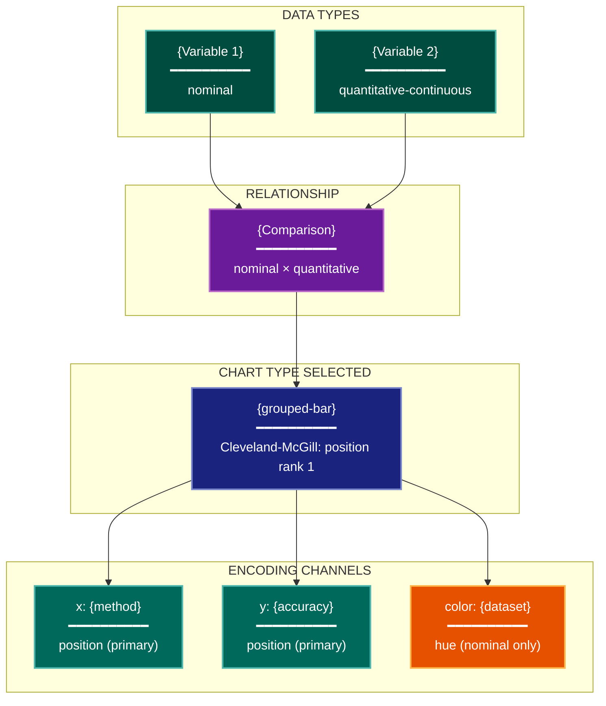

# Chart Type Selection Visualization Lens

**Philosophical Mode:** Typological
**Primary Question:** "Which chart type is perceptually optimal for this data?"
**Focus:** Encoding Channel Assignments, Cleveland-McGill Perceptual Hierarchy, Data-Type → Chart-Type Matrix

## Arguments

`/autoskillit:vis-lens-chart-select [context_path] [experiment_plan_path]`

- **context_path** (optional positional arg 1) — Absolute path to a lens context file
  containing IV/DV tables, H0/H1 hypotheses, controlled variables, and success criteria.
  If provided, read this file before beginning analysis to obtain structured context.
  If omitted, discover context by exploring the CWD.
- **experiment_plan_path** (optional positional arg 2) — Absolute path to the full
  experiment plan. If provided, read for complete experimental methodology and design.
  If omitted, locate the experiment plan by exploring the CWD.

## When to Use

- Selecting chart types for ML results (accuracy tables, loss curves, ablations)
- Deciding encoding channels (position, length, color, size, angle) for each variable
- Reviewing figure plans before implementation to catch perceptually suboptimal choices
- Building a figure plan from scratch and wanting principled chart-type assignments
- User invokes `/autoskillit:vis-lens-chart-select`

## yaml:figure-spec Schema

Canonical schema definition for a single figure planning specification:

```yaml
# yaml:figure-spec — canonical schema (spec_version: "1.0")
figure_id: str               # unique slug, e.g. "fig-01-main-accuracy"
figure_title: str            # human-readable title
spec_version: "1.0"          # schema version; increment on breaking change
chart_type: str              # CONTROLLED VOCAB (see below) — excludes "radar" and "pie"
chart_type_fallback: str     # secondary chart if primary unavailable
perceptual_justification: str  # Cleveland-McGill rank or encoding channel rationale
data_source: str             # variable or file that feeds this figure
data_mapping:
  x: str                     # x-axis variable / encoding
  y: str                     # y-axis variable / encoding
  color: str                 # color encoding (optional)
  size: str                  # size encoding (optional)
  facet: str                 # facet/panel variable (optional)
layout:
  width_inches: float
  height_inches: float
  dpi: int
stat_overlay:
  type: str                  # "error_bar" | "ci_band" | "violin" | "none"
  measure: str               # "SD" | "SE" | "CI95" | "PI95"
  n_seeds: int               # number of random seeds used
annotations: list[str]       # text annotations to include
anti_patterns: list[str]     # anti-pattern IDs being actively avoided (ap-* codes)
palette: str                 # colorblind-safe palette name, e.g. "wong", "okabe-ito"
format: str                  # "svg" | "png" | "pdf"
target_dpi: int              # 300 for publication, 150 for slides
library: str                 # "matplotlib" | "seaborn" | "plotly" | "ggplot2" | "vega"
report_section: str          # section of the paper/report this figure appears in
priority: str                # "P0" | "P1" | "P2"
placement_tier: str          # "main" | "appendix" | "supplementary"
conflicts: list[str]         # figure_ids this conflicts with (same data, different view)
metadata:
  created_by: str
  reviewed_by: str
  last_updated: str          # ISO date
```

**Controlled `chart_type` vocabulary** (radar and pie are excluded):

- bar, grouped-bar, stacked-bar
- line, scatter, scatter-matrix
- box, violin, strip
- heatmap, histogram, kde, ecdf
- forest-plot, dot-plot, bubble
- area, ribbon, step
- parallel-coordinates, table, matrix

## Critical Constraints

**NEVER:**
- Modify any source code files
- Do not litter the codebase with useless comments, TODO markers, or explanatory annotations — the skill output and diagram speak for themselves
- Create files outside `{{AUTOSKILLIT_TEMP}}/vis-lens-chart-select/`
- Use `radar` or `pie` chart types — these are perceptually inferior and excluded from the controlled vocabulary

**ALWAYS:**
- Apply the Cleveland-McGill perceptual hierarchy when ranking chart alternatives: **position > length > angle > area > color saturation > color hue**
- Assign explicit encoding channels (x, y, color, size, facet) for every figure variable
- Document why alternatives were rejected using the perceptual rank
- Use colorblind-safe palettes (wong, okabe-ito, viridis, cividis)
- BEFORE creating any diagram, LOAD the `/autoskillit:mermaid` skill using the Skill tool - this is MANDATORY
- If the Skill tool cannot be used (disable-model-invocation) or refuses this invocation, do NOT proceed with diagram creation. Abort this step and omit the diagram from output.
- Write output to `{{AUTOSKILLIT_TEMP}}/vis-lens-chart-select/vis_spec_chart_select_{YYYY-MM-DD_HHMMSS}.md`
- After writing the file, emit the structured output token as **literal plain text** with no
  markdown formatting on the token name (the adjudicator performs a regex match):

  ```
  diagram_path = /absolute/path/to/{{AUTOSKILLIT_TEMP}}/vis-lens-chart-select/vis_spec_chart_select_{...}.md
  %%ORDER_UP%%
  ```

---

## Analysis Workflow

### Step 0: Parse optional arguments

If positional arg 1 (context_path) is provided and the file exists, read it to obtain
IV/DV tables, H0/H1 hypotheses, controlled variables, and success criteria. If positional
arg 2 (experiment_plan_path) is provided and exists, read the experiment plan for full
methodology. Use this structured context as the foundation for Steps 1–4; skip the CWD
exploration for these fields if the context file supplies them.

### Step 1: Parallel Exploration

Spawn parallel exploration tasks to investigate:

**Existing Figure Inventory**
- Find all existing figures, plots, and visualizations in the project
- Look for: `fig`, `figure`, `plot`, `chart`, `image`, `png`, `svg`, `pdf`, `matplotlib`, `seaborn`, `plotly`

**Data Types and Variables**
- Find all variables, metrics, and data fields to be visualized
- Look for: `accuracy`, `loss`, `metric`, `score`, `embedding`, `distribution`, `time`, `epoch`

**Current Chart Choices**
- Find existing chart-type decisions in code, config, or planning docs
- Look for: `bar_plot`, `scatter`, `line_chart`, `heatmap`, `histogram`, `boxplot`, `violinplot`

**Encoding Channel Usage**
- Find existing axis assignments, color mappings, size mappings
- Look for: `xlabel`, `ylabel`, `hue`, `color`, `size`, `marker`, `alpha`, `facet`

### Step 2: Build the Data-Type → Chart-Type Matrix

For each figure slot identified:

1. Classify the data type of each variable: nominal, ordinal, quantitative-discrete, quantitative-continuous, temporal
2. Classify the relationship to visualize: comparison, distribution, composition, relationship, change-over-time
3. Apply the data-type × relationship matrix to identify candidate chart types
4. Assign encoding channels for all variables: primary (x/y position), secondary (color, size), tertiary (facet, shape)

| Data Type | Relationship | Recommended Chart Types |
|-----------|-------------|------------------------|
| Nominal × Quantitative | Comparison | bar, dot-plot, forest-plot |
| Quantitative × Quantitative | Relationship | scatter, bubble |
| Quantitative (single) | Distribution | histogram, kde, violin, box, strip, ecdf |
| Nominal × Quantitative (multi) | Comparison + Distribution | violin, box, strip |
| Temporal × Quantitative | Change-over-time | line, area, ribbon |
| Matrix / Grid | Relationship | heatmap, matrix |
| High-dimensional | Relationship | scatter-matrix, parallel-coordinates |

### Step 3d: Perceptual Rank

For each figure slot, rank the candidate chart types by Cleveland-McGill position:

1. **Position (highest accuracy):** bar, scatter, line, dot-plot — use whenever the data allows
2. **Length:** bar (horizontal) — good for labeled categories
3. **Angle:** avoid unless no positional alternative exists
4. **Area:** bubble, scatter (size encoding) — document the Stevens power law limitation (~0.7)
5. **Color saturation:** heatmap — acceptable for matrix data where position is already used
6. **Color hue (lowest accuracy):** nominal encoding only — never encode quantitative data with hue alone

Document the chosen rank for each figure and explicitly state why alternatives were rejected (e.g., "violin rejected: n < 10 → use strip plot; ecdf preferred over histogram: no bin-width sensitivity").

### Step 4: Emit Specs and Diagram

For each figure, emit one `yaml:figure-spec` fenced block. Then LOAD `/autoskillit:mermaid`
and create the mermaid diagram showing the data-type → chart-type assignment flow.

---

## Output Template

```markdown
# Chart Type Selection Spec: {System / Experiment Name}

**Lens:** Chart Type Selection (Typological)
**Question:** Which chart type is perceptually optimal for this data?
**Date:** {YYYY-MM-DD}
**Scope:** {What was analyzed}

## Figure Specs

```yaml
# yaml:figure-spec — canonical schema (spec_version: "1.0")
figure_id: "fig-01-main-accuracy"
figure_title: "Main Results: Accuracy by Method"
spec_version: "1.0"
chart_type: "grouped-bar"
chart_type_fallback: "dot-plot"
perceptual_justification: "Position encoding (Cleveland-McGill rank 1) for nominal × quantitative comparison; grouped-bar preferred over dot-plot for direct label alignment."
data_source: "results/main_results.csv"
data_mapping:
  x: "method"
  y: "accuracy"
  color: "dataset"
  size: ""
  facet: ""
layout:
  width_inches: 6.5
  height_inches: 4.0
  dpi: 300
stat_overlay:
  type: "error_bar"
  measure: "CI95"
  n_seeds: 5
annotations: ["Baseline at 0.72", "Best result starred"]
anti_patterns: ["ap-3d-bar", "ap-bar-no-error"]
palette: "wong"
format: "pdf"
target_dpi: 300
library: "matplotlib"
report_section: "Section 4.1 Main Results"
priority: "P0"
placement_tier: "main"
conflicts: []
metadata:
  created_by: "vis-lens-chart-select"
  reviewed_by: ""
  last_updated: "{YYYY-MM-DD}"
```

## Chart Type Assignment Diagram



**Color Legend:**
| Color | Category | Description |
|-------|----------|-------------|
| Dark Teal | Data Types | Input variable types |
| Purple | Relationship | Visualization relationship class |
| Dark Blue | Chart Type | Selected chart with perceptual justification |
| Teal | Encoding (positional) | x/y encoding channels |
| Orange | Encoding (color/size) | Secondary encoding channels |

## Perceptual Rank Summary

| Figure | Chosen Chart | Rank | Alternatives Rejected | Reason |
|--------|-------------|------|-----------------------|--------|
| {fig-01} | grouped-bar | position (1) | dot-plot | bar aligns better with discrete category labels |
```

---

## Pre-Diagram Checklist

Before creating the diagram, verify:

- [ ] LOADED `/autoskillit:mermaid` skill using the Skill tool
- [ ] Using ONLY classDef styles from the mermaid skill (no invented colors)
- [ ] Diagram will include a color legend table
- [ ] All chart types are from the controlled vocabulary (no radar, no pie)
- [ ] Each figure spec has `perceptual_justification` filled in
