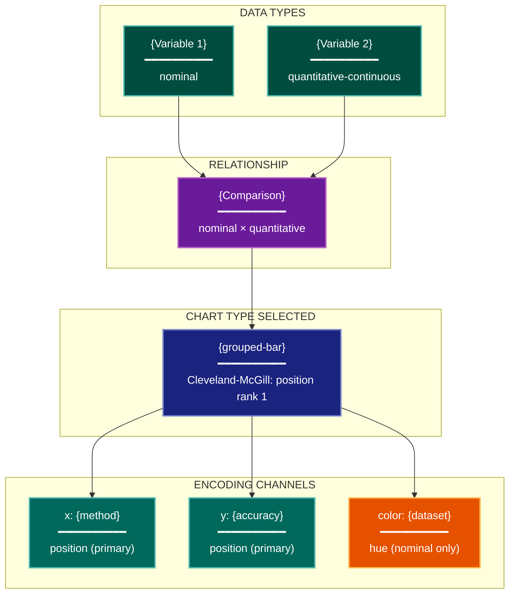

# Chart Type Selection Visualization Lens

**Philosophical Mode:** Typological
**Primary Question:** "Which chart type is perceptually optimal for this data?"
**Focus:** Encoding Channel Assignments, Cleveland-McGill Perceptual Hierarchy, Data-Type → Chart-Type Matrix

## Arguments

`/autoskillit:vis-lens-chart-select [context_path] [experiment_plan_path]`

- **context_path** (optional positional arg 1) — Absolute path to a lens context file
  containing IV/DV tables, H0/H1 hypotheses, controlled variables, and success criteria.
  If provided, read this file before beginning analysis to obtain structured context.
  If omitted, discover context by exploring the CWD.
- **experiment_plan_path** (optional positional arg 2) — Absolute path to the full
  experiment plan. If provided, read for complete experimental methodology and design.
  If omitted, locate the experiment plan by exploring the CWD.

## When to Use

- Selecting chart types for ML results (accuracy tables, loss curves, ablations)
- Deciding encoding channels (position, length, color, size, angle) for each variable
- Reviewing figure plans before implementation to catch perceptually suboptimal choices
- Building a figure plan from scratch and wanting principled chart-type assignments
- User invokes `/autoskillit:vis-lens-chart-select`

## yaml:figure-spec Schema

Canonical schema definition for a single figure planning specification:

```yaml
# yaml:figure-spec — canonical schema (spec_version: "1.0")
figure_id: str               # unique slug, e.g. "fig-01-main-accuracy"
figure_title: str            # human-readable title
spec_version: "1.0"          # schema version; increment on breaking change
chart_type: str              # CONTROLLED VOCAB (see below) — excludes "radar" and "pie"
chart_type_fallback: str     # secondary chart if primary unavailable
perceptual_justification: str  # Cleveland-McGill rank or encoding channel rationale
data_source: str             # variable or file that feeds this figure
data_mapping:
  x: str                     # x-axis variable / encoding
  y: str                     # y-axis variable / encoding
  color: str                 # color encoding (optional)
  size: str                  # size encoding (optional)
  facet: str                 # facet/panel variable (optional)
layout:
  width_inches: float
  height_inches: float
  dpi: int
stat_overlay:
  type: str                  # "error_bar" | "ci_band" | "violin" | "none"
  measure: str               # "SD" | "SE" | "CI95" | "PI95"
  n_seeds: int               # number of random seeds used
annotations: list[str]       # text annotations to include
anti_patterns: list[str]     # anti-pattern IDs being actively avoided (ap-* codes)
palette: str                 # colorblind-safe palette name, e.g. "wong", "okabe-ito"
format: str                  # "svg" | "png" | "pdf"
target_dpi: int              # 300 for publication, 150 for slides
library: str                 # "matplotlib" | "seaborn" | "plotly" | "ggplot2" | "vega"
report_section: str          # section of the paper/report this figure appears in
image_path: str              # populated by generate-report after rendering; empty until then
priority: str                # "P0" | "P1" | "P2"
placement_tier: str          # "main" | "appendix" | "supplementary"
conflicts: list[str]         # figure_ids this conflicts with (same data, different view)
metadata:
  created_by: str
  reviewed_by: str
  last_updated: str          # ISO date
```

**Controlled `chart_type` vocabulary** (radar and pie are excluded):

- bar, grouped-bar, stacked-bar
- line, scatter, scatter-matrix
- box, violin, strip
- heatmap, histogram, kde, ecdf
- forest-plot, dot-plot, bubble
- area, ribbon, step
- parallel-coordinates, table, matrix

## Critical Constraints

**NEVER:**
- Fabricate, invent, or embellish information not supported by the available evidence or code.

- Modify any source code files
- Do not litter the codebase with useless comments, TODO markers, or explanatory annotations — the skill output and diagram speak for themselves
- Create files outside `{{AUTOSKILLIT_TEMP}}/vis-lens-chart-select/`
- Use `radar` or `pie` chart types — these are perceptually inferior and excluded from the controlled vocabulary
- Detach child delegations instead of joining them (joining every child is required)
- Run exploration leaves in the background
- Start independent child delegations sequentially

**ALWAYS:**
- Apply the Cleveland-McGill perceptual hierarchy when ranking chart alternatives: **position > length > angle > area > color saturation > color hue**
- Assign explicit encoding channels (x, y, color, size, facet) for every figure variable
- Document why alternatives were rejected using the perceptual rank
- Use colorblind-safe palettes (wong, okabe-ito, viridis, cividis)
- BEFORE creating any diagram, LOAD the `/autoskillit:mermaid` skill using the Skill tool - this is MANDATORY
- If the Skill tool cannot be used (disable-model-invocation) or refuses this invocation, do NOT proceed with diagram creation. Abort this step and omit the diagram from output.
- Start all independent child delegations before awaiting any result to maximize concurrency
- Use the registered exploration roles for all repository reads
- Dispatch exactly 5 migrated exploration vectors through the deterministic router
- Route semantic plotting-code, symbol, and data-control-flow handoffs to `semantic-code-navigator` and bounded schema, configuration, generated-figure, table, test, fixture, reproduction, planning-document, and pre-existing artifact handoffs to `repository-impact-profiler` through the parent-owned plan
- Wait for every exploration result before classifying data types, selecting chart types, ranking encodings, or creating the diagram
- Retain parent authority over data-type classification, chart selection, perceptual ranking, encoding assignment, Mermaid, `yaml:figure-spec`, and output decisions
- Write output to `{{AUTOSKILLIT_TEMP}}/vis-lens-chart-select/vis_spec_chart_select_{YYYY-MM-DD_HHMMSS}.md` (relative to the current working directory)
- After writing the file, emit the structured output token as **literal plain text** with no
  markdown formatting on the token name (the adjudicator performs a regex match):

  ```
  diagram_path = /absolute/path/to/{{AUTOSKILLIT_TEMP}}/vis-lens-chart-select/vis_spec_chart_select_{...}.md
  ```

---

## Analysis Workflow

### Step 0: Parse optional arguments

<!-- autoskillit:exploration-vector id="caller-context" -->
If positional arg 1 (context_path) is provided and the file exists, read it to obtain
IV/DV tables, H0/H1 hypotheses, controlled variables, and success criteria. If positional
arg 2 (experiment_plan_path) is provided and exists, read the experiment plan for full
methodology. Use this structured context as the foundation for Steps 1–4.
<!-- /autoskillit:exploration-vector -->

<!-- autoskillit:exploration-vector id="missing-context-fields" -->
After the parent parses the optional context and experiment plan, dispatch repository retrieval only for required fields still absent. Never rediscover or override a supplied complete field. If no fields remain missing, report this vector not applicable and perform no search. If scoped evidence is absent or unrelated, report the field unavailable or unrelated without widening scope, inferring meaning, or importing or executing target code, tests, experiments, models, or benchmarks.
<!-- /autoskillit:exploration-vector -->

### Step 1: Launch 4 Routed Exploration Vectors (SINGLE MESSAGE)

Dispatch all ready, scope-disjoint vectors through the deterministic router in a single message before awaiting any result. Do not iterate across multiple turns.

Do not output any prose between subagent dispatches. Immediately proceed to the next tool call.

Dispatch exactly these four authored vectors under their registered role policies. Mixed code and declarative evidence remains one parent-owned plan; bounded role handoffs return to the originating vector and do not add graph dependencies.

<!-- autoskillit:exploration-vector id="existing-figure-inventory" -->
1. **Existing Figure Inventory** — Find all existing figures, plots, and visualizations through `fig`, `figure`, `plot`, `chart`, `image`, `png`, `svg`, `pdf`, `matplotlib`, `seaborn`, and `plotly` artifacts. Route semantic plotting-code relationships through the parent to the navigator. Use static repository evidence only; do not import or execute target code, tests, visualization pipelines, experiments, models, or benchmarks.
<!-- /autoskillit:exploration-vector -->

<!-- autoskillit:exploration-vector id="data-types-variables" -->
2. **Data Types and Variables** — Find all repository-local variables, metrics, and data fields to be visualized through `accuracy`, `loss`, `metric`, `score`, `embedding`, `distribution`, `time`, and `epoch` definitions and references. Route bounded schemas, configuration, data manifests, fixtures, and pre-existing artifacts through the parent to the profiler. Use static repository evidence only; do not import or execute target code, tests, visualization pipelines, experiments, models, or benchmarks.
<!-- /autoskillit:exploration-vector -->

<!-- autoskillit:exploration-vector id="current-chart-choices" -->
3. **Current Chart Choices** — Find existing chart-type decisions through `bar_plot`, `scatter`, `line_chart`, `heatmap`, `histogram`, `boxplot`, and `violinplot` definitions and call paths. Route bounded configuration and planning documents through the parent to the profiler. Use static repository evidence only; do not import or execute target code, tests, visualization pipelines, experiments, models, or benchmarks.
<!-- /autoskillit:exploration-vector -->

<!-- autoskillit:exploration-vector id="encoding-channel-usage" -->
4. **Encoding Channel Usage** — Find existing axis assignments, color mappings, and size mappings through `xlabel`, `ylabel`, `hue`, `color`, `size`, `marker`, `alpha`, and `facet` definitions and call paths. Route bounded figure specifications and generated artifacts through the parent to the profiler. Use static repository evidence only; do not import or execute target code, tests, visualization pipelines, experiments, models, or benchmarks.
<!-- /autoskillit:exploration-vector -->

### Step 2: Build the Data-Type → Chart-Type Matrix

For each figure slot identified:

1. Classify the data type of each variable: nominal, ordinal, quantitative-discrete, quantitative-continuous, temporal
2. Classify the relationship to visualize: comparison, distribution, composition, relationship, change-over-time
3. Apply the data-type × relationship matrix to identify candidate chart types
4. Assign encoding channels for all variables: primary (x/y position), secondary (color, size), tertiary (facet, shape)

| Data Type | Relationship | Recommended Chart Types |
|-----------|-------------|------------------------|
| Nominal × Quantitative | Comparison | bar, dot-plot, forest-plot |
| Quantitative × Quantitative | Relationship | scatter, bubble |
| Quantitative (single) | Distribution | histogram, kde, violin, box, strip, ecdf |
| Nominal × Quantitative (multi) | Comparison + Distribution | violin, box, strip |
| Temporal × Quantitative | Change-over-time | line, area, ribbon |
| Matrix / Grid | Relationship | heatmap, matrix |
| High-dimensional | Relationship | scatter-matrix, parallel-coordinates |

### Step 3: Perceptual Rank

For each figure slot, rank the candidate chart types by Cleveland-McGill position:

1. **Position (highest accuracy):** bar, scatter, line, dot-plot — use whenever the data allows
2. **Length:** bar (horizontal) — good for labeled categories
3. **Angle:** avoid unless no positional alternative exists
4. **Area:** bubble, scatter (size encoding) — document the Stevens power law limitation (~0.7)
5. **Color saturation:** heatmap — acceptable for matrix data where position is already used
6. **Color hue (lowest accuracy):** nominal encoding only — never encode quantitative data with hue alone

Document the chosen rank for each figure and explicitly state why alternatives were rejected (e.g., "violin rejected: n < 10 → use strip plot; ecdf preferred over histogram: no bin-width sensitivity").

### Step 4: Emit Specs and Diagram

For each figure, emit one `yaml:figure-spec` fenced block. Then LOAD `/autoskillit:mermaid`
and create the mermaid diagram showing the data-type → chart-type assignment flow.

---

## Output Template

```markdown
# Chart Type Selection Spec: {System / Experiment Name}

**Lens:** Chart Type Selection (Typological)
**Question:** Which chart type is perceptually optimal for this data?
**Date:** {YYYY-MM-DD}
**Scope:** {What was analyzed}

## Figure Specs

```yaml
# yaml:figure-spec — canonical schema (spec_version: "1.0")
figure_id: "fig-01-main-accuracy"
figure_title: "Main Results: Accuracy by Method"
spec_version: "1.0"
chart_type: "grouped-bar"
chart_type_fallback: "dot-plot"
perceptual_justification: "Position encoding (Cleveland-McGill rank 1) for nominal × quantitative comparison; grouped-bar preferred over dot-plot for direct label alignment."
data_source: "results/main_results.csv"
data_mapping:
  x: "method"
  y: "accuracy"
  color: "dataset"
  size: ""
  facet: ""
layout:
  width_inches: 6.5
  height_inches: 4.0
  dpi: 300
stat_overlay:
  type: "error_bar"
  measure: "CI95"
  n_seeds: 5
annotations: ["Baseline at 0.72", "Best result starred"]
anti_patterns: ["ap-3d-bar", "ap-bar-no-error"]
palette: "wong"
format: "pdf"
target_dpi: 300
library: "matplotlib"
report_section: "Section 4.1 Main Results"
image_path: ""           # populated by generate-report after rendering; empty until then
priority: "P0"
placement_tier: "main"
conflicts: []
metadata:
  created_by: "vis-lens-chart-select"
  reviewed_by: ""
  last_updated: "{YYYY-MM-DD}"
```

## Chart Type Assignment Diagram


```mermaid
%%{init: {'flowchart': {'nodeSpacing': 50, 'rankSpacing': 60, 'curve': 'basis'}}}%%
flowchart TB
    %% CLASS DEFINITIONS %%
    classDef cli fill:#1a237e,stroke:#7986cb,stroke-width:2px,color:#fff;
    classDef stateNode fill:#004d40,stroke:#4db6ac,stroke-width:2px,color:#fff;
    classDef handler fill:#e65100,stroke:#ffb74d,stroke-width:2px,color:#fff;
    classDef phase fill:#6a1b9a,stroke:#ba68c8,stroke-width:2px,color:#fff;
    classDef newComponent fill:#2e7d32,stroke:#81c784,stroke-width:2px,color:#fff;
    classDef output fill:#00695c,stroke:#4db6ac,stroke-width:2px,color:#fff;
    classDef detector fill:#b71c1c,stroke:#ef5350,stroke-width:2px,color:#fff;
    classDef gap fill:#ff6f00,stroke:#ffa726,stroke-width:2px,color:#000;

    subgraph DataTypes ["DATA TYPES"]
        DT1["{Variable 1}<br/>━━━━━━━━━━<br/>nominal"]
        DT2["{Variable 2}<br/>━━━━━━━━━━<br/>quantitative-continuous"]
    end

    subgraph Relationship ["RELATIONSHIP"]
        R1["{Comparison}<br/>━━━━━━━━━━<br/>nominal × quantitative"]
    end

    subgraph ChartType ["CHART TYPE SELECTED"]
        CT1["{grouped-bar}<br/>━━━━━━━━━━<br/>Cleveland-McGill: position rank 1"]
    end

    subgraph Encoding ["ENCODING CHANNELS"]
        E1["x: {method}<br/>━━━━━━━━━━<br/>position (primary)"]
        E2["y: {accuracy}<br/>━━━━━━━━━━<br/>position (primary)"]
        E3["color: {dataset}<br/>━━━━━━━━━━<br/>hue (nominal only)"]
    end

    DT1 --> R1
    DT2 --> R1
    R1 --> CT1
    CT1 --> E1
    CT1 --> E2
    CT1 --> E3

    class DT1,DT2 stateNode;
    class R1 phase;
    class CT1 cli;
    class E1,E2 output;
    class E3 handler;
```

**Color Legend:**
| Color | Category | Description |
|-------|----------|-------------|
| Dark Teal | Data Types | Input variable types |
| Purple | Relationship | Visualization relationship class |
| Dark Blue | Chart Type | Selected chart with perceptual justification |
| Teal | Encoding (positional) | x/y encoding channels |
| Orange | Encoding (color/size) | Secondary encoding channels |

## Perceptual Rank Summary

| Figure | Chosen Chart | Rank | Alternatives Rejected | Reason |
|--------|-------------|------|-----------------------|--------|
| {fig-01} | grouped-bar | position (1) | dot-plot | bar aligns better with discrete category labels |
```

---

## Pre-Diagram Checklist

Before creating the diagram, verify:

- [ ] LOADED `/autoskillit:mermaid` skill using the Skill tool
- [ ] Using ONLY classDef styles from the mermaid skill (no invented colors)
- [ ] Diagram will include a color legend table
- [ ] All chart types are from the controlled vocabulary (no radar, no pie)
- [ ] Each figure spec has `perceptual_justification` filled in

---

## Related Skills

- `/autoskillit:plan-visualization` - Parent skill for lens selection
- `/autoskillit:mermaid` - MUST BE LOADED before creating diagram
- `/autoskillit:vis-lens-antipattern` - For common visualization anti-pattern detection
- `/autoskillit:vis-lens-figure-table` - For figure versus table placement decisions
- `/autoskillit:vis-lens-uncertainty` - For statistical uncertainty visualization
- `/autoskillit:vis-lens-methodology-norms` - For field-specific methodology compliance
