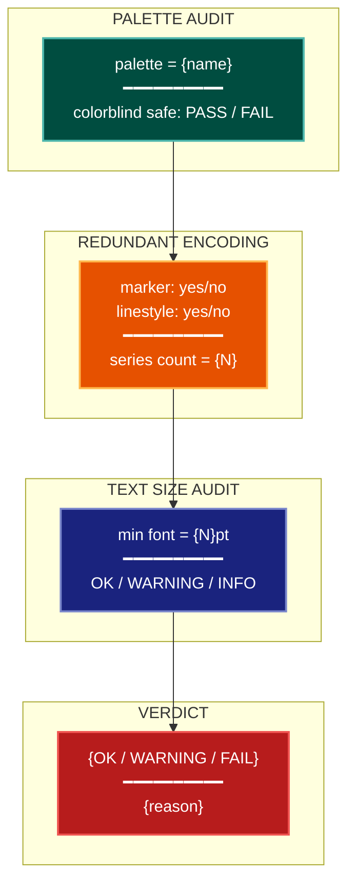

# Chromatic Accessibility Visualization Lens

**Philosophical Mode:** Chromatic
**Primary Question:** "Is the color encoding accessible and perceptually uniform?"
**Focus:** Colorblind Safety (Okabe-Ito, Paul Tol palettes), Perceptual Uniformity
           (viridis/cividis pass; jet/rainbow fail), Non-Color Redundant Encoding
           (shape + line-style), Text Size Minimums

## Arguments

`/autoskillit:vis-lens-color-access [context_path] [experiment_plan_path]`

- **context_path** (optional positional arg 1) — Absolute path to a lens context file
  containing IV/DV tables, H0/H1 hypotheses, controlled variables, and success criteria.
  If provided, read this file before beginning analysis to obtain structured context.
  If omitted, discover context by exploring the CWD.
- **experiment_plan_path** (optional positional arg 2) — Absolute path to the full
  experiment plan. If provided, read for complete experimental methodology and design.
  If omitted, locate the experiment plan by exploring the CWD.

## When to Use

- Auditing figures for colorblind accessibility before submission
- Checking whether colormaps are perceptually uniform for quantitative data
- Verifying that color-distinguished series have redundant non-color encodings
- Reviewing font sizes for accessibility and publication standards
- User invokes `/autoskillit:vis-lens-color-access`

## Critical Constraints

**NEVER:**
- Modify any source code files
- Do not litter the codebase with useless comments, TODO markers, or explanatory annotations — the skill output and diagram speak for themselves
- Create files outside `{{AUTOSKILLIT_TEMP}}/vis-lens-color-access/`
- Use `jet` or `rainbow` colormaps for any quantitative data — these are perceptually non-uniform and fail colorblind simulation
- Encode quantitative data with hue alone (no luminance gradient)

**ALWAYS:**
- Use Okabe-Ito (8 colors) or Paul Tol palettes for categorical nominal data
- Use viridis, cividis, or mako for sequential/diverging quantitative data
- Add a redundant non-color encoding (shape marker AND/OR line-style dash pattern) for every color-distinguished series in line and scatter plots
- Caption text and axis labels: minimum 8pt in final figure; 10pt preferred for publication
- BEFORE creating any diagram, LOAD the `/autoskillit:mermaid` skill using the Skill tool — this is MANDATORY
- If the Skill tool cannot be used (disable-model-invocation) or refuses this invocation, do NOT proceed with diagram creation. Abort this step and omit the diagram from output.
- Write output to `{{AUTOSKILLIT_TEMP}}/vis-lens-color-access/vis_spec_color_access_{YYYY-MM-DD_HHMMSS}.md` (relative to the current working directory)
- After writing the file, emit the structured output token as **literal plain text** with no
  markdown formatting on the token name (the adjudicator performs a regex match):

  ```
  diagram_path = /absolute/path/to/{{AUTOSKILLIT_TEMP}}/vis-lens-color-access/vis_spec_color_access_{...}.md
  %%ORDER_UP%%
  ```

---

## Analysis Workflow

### Step 0: Parse optional arguments

If positional arg 1 (context_path) is provided and the file exists, read it to obtain
IV/DV tables, H0/H1 hypotheses, controlled variables, and success criteria. If positional
arg 2 (experiment_plan_path) is provided and exists, read the experiment plan for full
methodology. Use this structured context as the foundation for Steps 1–4; skip the CWD
exploration for these fields if the context file supplies them.

### Step 1: Inventory Color Usage

Scan experiment plan, context file, and codebase for:

**Palette and Colormap Names**
- Find all palette names and colormap strings in plotting code
- Look for: `cmap=`, `palette=`, `color=`, `colors=`, `sns.color_palette`, `plt.cm.`
- Flag FAIL: `jet`, `rainbow`, `hsv`, `Spectral`, `hot`, `cool`
- Pass: `viridis`, `cividis`, `mako`, `okabe-ito`, `wong`, `tol`, `tab10`

**Hue-Only Encoding**
- Detect cases where quantitative data uses hue without luminance gradient
- Look for: diverging colormaps applied to continuous scales, categorical palettes applied to ordinal data

**Series Count**
- Count the number of color-distinguished series per figure
- Look for: legend entries, `label=` parameters, series lists

### Step 2: Redundant Encoding Audit

For each color-distinguished series in a line or scatter plot:
- Check whether a marker shape (`marker=`) is also assigned
- Check whether a line-style dash (`linestyle=`, `dashes=`) is also assigned
- If neither is present: flag as WARNING — "Series relies on color alone; add marker or linestyle"

### Step 3: Text Size Audit

Scan figure creation calls for font size parameters:
- Look for: `fontsize=`, `labelsize=`, `title_fontsize=`, `tick_params(labelsize=...)`, `rcParams`
- Flag any value < 8 as WARNING: "Font size {N}pt is below 8pt minimum"
- Flag any value < 10 as INFO: "Font size {N}pt is below 10pt preferred for publication"

### Step 4: Emit yaml:figure-spec Blocks

For each figure, emit one `yaml:figure-spec` fenced block with `palette` field filled.
Then LOAD `/autoskillit:mermaid` and create a diagram showing palette audit →
redundant encoding → text audit → verdict.

---

## Output Template

```markdown
# Chromatic Accessibility Spec: {System / Experiment Name}

**Lens:** Chromatic Accessibility (Chromatic)
**Question:** Is the color encoding accessible and perceptually uniform?
**Date:** {YYYY-MM-DD}
**Scope:** {What was analyzed}

## Color Audit Summary

| Figure | Palette | Colorblind Safe | Redundant Encoding | Min Font | Status |
|--------|---------|-----------------|-------------------|----------|--------|
| {fig-01} | jet | FAIL | no | 7pt | FAIL |
| {fig-02} | okabe-ito | PASS | yes (marker+dash) | 10pt | OK |

## Figure Specs

```yaml
# yaml:figure-spec — canonical schema (spec_version: "1.0")
figure_id: "fig-02-ablation-comparison"
figure_title: "Ablation: Component Contribution"
spec_version: "1.0"
chart_type: "line"
chart_type_fallback: "grouped-bar"
perceptual_justification: "Okabe-Ito is colorblind-safe; marker shapes provide redundant encoding."
data_source: "results/ablation.csv"
data_mapping:
  x: "epoch"
  y: "accuracy"
  color: "variant"
  size: ""
  facet: ""
layout:
  width_inches: 5.0
  height_inches: 3.5
  dpi: 300
stat_overlay:
  type: "error_bar"
  measure: "CI95"
  n_seeds: 5
annotations: ["okabe-ito palette; marker shapes assigned; 10pt axis labels"]
anti_patterns: ["ap-hue-only-encoding"]
palette: "okabe-ito"
format: "pdf"
target_dpi: 300
library: "matplotlib"
report_section: "Section 5 Ablation"
priority: "P1"
placement_tier: "main"
conflicts: []
metadata:
  created_by: "vis-lens-color-access"
  reviewed_by: ""
  last_updated: "{YYYY-MM-DD}"
```

## Chromatic Accessibility Diagram



**Color Legend:**
| Color | Category | Description |
|-------|----------|-------------|
| Dark Teal | Palette | Colorblind safety audit result |
| Orange | Redundant Encoding | Marker and linestyle check |
| Dark Blue | Text Size | Font size audit result |
| Red | Verdict | OK / WARNING / FAIL assessment |
```

---

## Pre-Diagram Checklist

Before creating the diagram, verify:

- [ ] LOADED `/autoskillit:mermaid` skill using the Skill tool
- [ ] Using ONLY classDef styles from the mermaid skill (no invented colors)
- [ ] Diagram will include a color legend table
- [ ] Every failing colormap (jet, rainbow) is explicitly flagged as FAIL
- [ ] Every color-distinguished series has been checked for redundant encoding
- [ ] Every font size below 8pt has been flagged as WARNING
