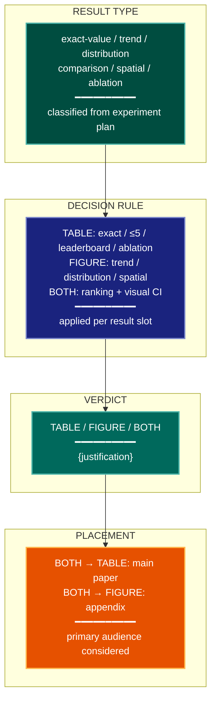

# Decisional Layout Visualization Lens

**Philosophical Mode:** Decisional
**Primary Question:** "Should this result be a figure or a table?"
**Focus:** Figure vs Table Selection Heuristics — Tables win: exact values, ≤5 items,
           leaderboards, ablation matrices; Figures win: trends, distributions, spatial
           patterns; Borderline → recommend both

## Arguments

`/autoskillit:vis-lens-figure-table [context_path] [experiment_plan_path]`

- **context_path** (optional positional arg 1) — Absolute path to a lens context file
  containing IV/DV tables, H0/H1 hypotheses, controlled variables, and success criteria.
  If provided, read this file before beginning analysis to obtain structured context.
  If omitted, discover context by exploring the CWD.
- **experiment_plan_path** (optional positional arg 2) — Absolute path to the full
  experiment plan. If provided, read for complete experimental methodology and design.
  If omitted, locate the experiment plan by exploring the CWD.

## When to Use

- Planning the presentation format for each result slot in a paper or report
- Deciding whether a leaderboard or ranking should be a table or a bar chart
- Evaluating whether ablation results communicate better as a matrix table or a figure
- Justifying borderline figure/table decisions before creating visualizations
- User invokes `/autoskillit:vis-lens-figure-table`

## Critical Constraints

**NEVER:**
- Modify any source code files
- Do not litter the codebase with useless comments, TODO markers, or explanatory annotations — the skill output and diagram speak for themselves
- Create files outside `{{AUTOSKILLIT_TEMP}}/vis-lens-figure-table/`
- Force a figure when the reader needs exact numeric values for a leaderboard or lookup
- Force a table when the primary message is a trend, curve, or distributional shape

**ALWAYS:**
- Apply the decision rule below to every result slot in the experiment plan
- When the verdict is BOTH, recommend the table in the main paper and the figure in the appendix (or vice versa depending on the primary audience)
- Justify borderline decisions with explicit reference to the decision rule criteria
- BEFORE creating any diagram, LOAD the `/autoskillit:mermaid` skill using the Skill tool — this is MANDATORY
- If the Skill tool cannot be used (disable-model-invocation) or refuses this invocation, do NOT proceed with diagram creation. Abort this step and omit the diagram from output.
- Write output to `{{AUTOSKILLIT_TEMP}}/vis-lens-figure-table/vis_spec_figure_table_{YYYY-MM-DD_HHMMSS}.md` (relative to the current working directory)
- After writing the file, emit the structured output token as **literal plain text** with no
  markdown formatting on the token name (the adjudicator performs a regex match):

  ```
  diagram_path = /absolute/path/to/{{AUTOSKILLIT_TEMP}}/vis-lens-figure-table/vis_spec_figure_table_{...}.md
  ```

---

## Analysis Workflow

### Step 0: Parse optional arguments

If positional arg 1 (context_path) is provided and the file exists, read it to obtain
IV/DV tables, H0/H1 hypotheses, controlled variables, and success criteria. If positional
arg 2 (experiment_plan_path) is provided and exists, read the experiment plan for full
methodology. Use this structured context as the foundation for Steps 1–4; skip the CWD
exploration for these fields if the context file supplies them.

### Step 1: Inventory Result Slots

Enumerate every metric, experiment result, or finding that needs to be communicated.
For each result slot, classify it as one of:
- **exact-value query**: reader needs the precise number (leaderboard, lookup table)
- **trend/curve**: the message is a trajectory or change over time/steps
- **distribution**: the message is the shape of a distribution (histogram, violin, KDE)
- **comparison/ranking**: multiple systems compared by a scalar metric
- **spatial/geometric**: data has a spatial or structural layout (heatmap, scatter)
- **ablation matrix**: systematic removal/addition of components in a table grid

### Step 2: Apply Decision Rule per Slot

| Signal | Verdict |
|--------|---------|
| Exact values needed OR ≤5 items OR leaderboard OR ablation matrix | TABLE |
| Trend over time/epochs OR distribution shape OR spatial pattern | FIGURE |
| Statistical comparison with CI bands | FIGURE |
| Ranking where exact delta matters AND visual trend also matters | BOTH |

For every BOTH verdict:
- Recommend the TABLE for the main paper body (exact values for citation)
- Recommend the FIGURE for the appendix (visual intuition for reviewers)
- Document the justification explicitly

### Step 3: Emit yaml:figure-spec Blocks

For FIGURE and BOTH verdicts only (TABLE-only results produce no figure-spec).
Then LOAD `/autoskillit:mermaid` and create a decision-tree diagram showing
result-type → verdict flow for all result slots.

---

## Output Template

```markdown
# Decisional Layout Spec: {System / Experiment Name}

**Lens:** Decisional Layout (Decisional)
**Question:** Should this result be a figure or a table?
**Date:** {YYYY-MM-DD}
**Scope:** {What was analyzed}

## Layout Decision Summary

| Result Slot | Type | Verdict | Justification |
|-------------|------|---------|---------------|
| {main-results} | exact-value query | TABLE | Leaderboard — readers need precise numbers |
| {loss-curve} | trend/curve | FIGURE | Training trajectory is the message |
| {ablation} | ablation matrix | TABLE | Component grid; exact deltas matter |
| {distribution} | distribution | FIGURE | Shape is the message |
| {ranking-with-ci} | comparison/ranking | BOTH | Exact deltas + visual CI bands |

## Figure Specs

```yaml
# yaml:figure-spec — canonical schema (spec_version: "1.0")
figure_id: "fig-loss-curve"
figure_title: "Training Loss Trajectory"
spec_version: "1.0"
chart_type: "line"
chart_type_fallback: "scatter"
perceptual_justification: "Trend over steps is the message; table would obscure the trajectory shape."
data_source: "results/loss_curves.csv"
data_mapping:
  x: "global_step"
  y: "train_loss"
  color: "variant"
  size: ""
  facet: ""
layout:
  width_inches: 6.0
  height_inches: 4.0
  dpi: 300
stat_overlay:
  type: "band"
  measure: "CI95"
  n_seeds: 5
annotations: ["FIGURE verdict: trend/curve; TABLE alternative in appendix for exact values"]
anti_patterns: []
palette: "okabe-ito"
format: "pdf"
target_dpi: 300
library: "matplotlib"
report_section: "Section 3 Training"
priority: "P1"
placement_tier: "main"
conflicts: []
metadata:
  created_by: "vis-lens-figure-table"
  reviewed_by: ""
  last_updated: "{YYYY-MM-DD}"
```

## Figure vs Table Decision Diagram



**Color Legend:**
| Color | Category | Description |
|-------|----------|-------------|
| Dark Teal | Result Type | Classification of the result slot |
| Dark Blue | Decision Rule | Rule application per slot |
| Teal | Verdict | TABLE / FIGURE / BOTH |
| Orange | Placement | Main paper vs appendix recommendation |
```

---

## Pre-Diagram Checklist

Before creating the diagram, verify:

- [ ] LOADED `/autoskillit:mermaid` skill using the Skill tool
- [ ] Using ONLY classDef styles from the mermaid skill (no invented colors)
- [ ] Diagram will include a color legend table
- [ ] Every result slot has been classified and assigned a verdict
- [ ] Every BOTH verdict has a documented placement recommendation
- [ ] No `yaml:figure-spec` emitted for TABLE-only result slots
