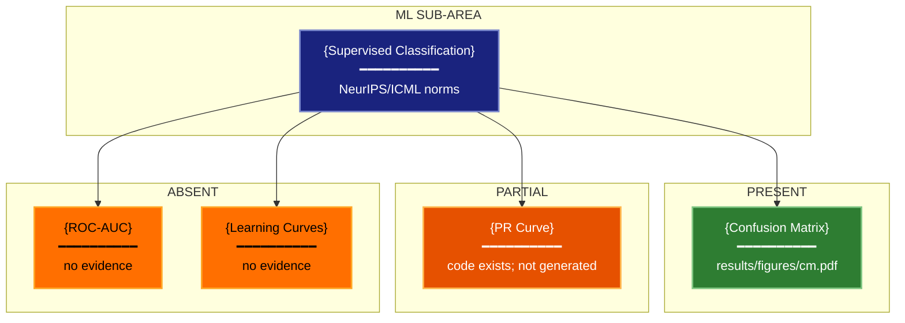

# Domain Norms Visualization Lens

**Philosophical Mode:** Domain-Normative
**Primary Question:** "Which domain-specific figures are expected by reviewers?"
**Focus:** ML Sub-Area Mandatory Figures, Community Conventions, Coverage Gap Analysis

## Arguments

`/autoskillit:vis-lens-methodology-norms [context_path] [experiment_plan_path]`

- **context_path** (optional positional arg 1) — Absolute path to a lens context file
  containing IV/DV tables, H0/H1 hypotheses, controlled variables, and success criteria.
  If provided, read this file before beginning analysis to obtain structured context.
  If omitted, discover context by exploring the CWD.
- **experiment_plan_path** (optional positional arg 2) — Absolute path to the full
  experiment plan. If provided, read for complete experimental methodology and design.
  If omitted, locate the experiment plan by exploring the CWD.
- **tradition_slug** (in context file) — When the context file contains a
  `## Methodology Tradition` section with a `tradition_slug` field, use that
  tradition directly instead of auto-detecting the ML sub-area in Step 0.
  The tradition slug maps to a bundled tradition YAML in
  `recipes/methodology-traditions/{slug}.yaml` which defines mandatory figures,
  anti-patterns, and community norms for that research methodology.

## When to Use

- Preparing a paper submission and checking what figures reviewers will expect
- Auditing a figure plan against community norms for the ML sub-area
- Identifying missing mandatory figures before the camera-ready deadline
- Onboarding to a new ML sub-area and learning its visualization conventions
- User invokes `/autoskillit:vis-lens-methodology-norms`

## ML Sub-Area Mandatory Figures

| ML Sub-Area | Mandatory Figures | Community Norm Source |
|-------------|-------------------|----------------------|
| Supervised Classification | Confusion matrix, precision-recall curve, ROC-AUC, learning curves | NeurIPS/ICML reviewer norms |
| NLP | Per-task accuracy table, error analysis examples, attention/saliency (if applicable) | ACL anthology norms |
| Computer Vision | Sample predictions grid, failure case gallery, per-class mAP bar | CVPR/ECCV norms |
| Reinforcement Learning | Episode reward curve (mean ± std across seeds), sample efficiency curve | NeurIPS RL track norms |
| Generative Models | Sample grids (unconditional + conditional), FID/IS table, failure modes | NeurIPS/ICLR generative norms |
| Foundation Models | Few-shot performance scaling curve, task contamination analysis, ablation table | LLM paper norms (BIG-bench style) |
| Agentic Systems | Task success rate bar (± CI), step-level trace examples, tool use breakdown | Emerging norm (2023–2025) |
| Time-Series | Forecasting horizon curve, decomposition plots, residual ACF | ICLR/NeurIPS temporal norms |

## Extensibility

This lens currently covers 8 ML sub-areas. Future domain-specific variants (e.g.,
`vis-lens-methodology-norms-cv`, `vis-lens-methodology-norms-rl`) may extend this catalog with
venue-specific norms, additional mandatory figure types, or sub-area-specific anti-pattern
overlays. The base lens should remain general enough to bootstrap any sub-area.

## Multi-Match Disambiguation Rules

When multiple methodology traditions match a research plan, disambiguation rules are applied
sequentially to determine the primary tradition and accumulate union rule sets.

### Disambiguation Resolution Order

1. **Rules 1–4** checked sequentially — first match determines `primary_tradition` and may add union rules
2. **Overlaps 5–9** checked in parallel — all matching overlaps accumulate `applied_union_rules`; if no rule set primary, the first matching overlap's `primary_tradition` is used
3. **Fallthrough** — highest-priority tradition (lowest `priority` number) from candidate set becomes primary

### Disambiguation Rules

| Order | Rule Name | Trigger Conditions | Resolution | Union Rules |
|-------|-----------|-------------------|------------|-------------|
| 1 | `prisma_dominance` | `systematic_synthesis` + any other tradition | primary = `systematic_synthesis` | — |
| 1 (exception) | `prisma_dominance` + `prediction_model_validation` | `systematic_synthesis` + `prediction_model_validation` | primary = `systematic_synthesis` | +TRIPOD_SRMA |
| 2 | `rct_economic_union` | `controlled_intervention` + `economic_evaluation` | primary = `controlled_intervention` | +CHEERS_union |
| 3 | `arrive_supersedes_consort` | `animal_preclinical` + `controlled_intervention` | primary = `animal_preclinical` | — |
| 4 | `benchmarking_prediction_nested` | `method_comparison_benchmarking` + `prediction_model_validation` | primary = `method_comparison_benchmarking` | +TRIPOD_nested |

### Cross-Tradition Overlaps

| Order | Overlap Name | Trigger Conditions | Primary if No Rule | Union Rules |
|-------|--------------|-------------------|-------------------|-------------|
| 5 | `tripod_consort_union` | `prediction_model_validation` + `controlled_intervention` | `controlled_intervention` | +TRIPOD_union |
| 6 | `strobe_prisma_moose` | `observational_correlational` + `systematic_synthesis` | `systematic_synthesis` | +MOOSE_override |
| 7 | `odd_controlled_nesting` | `simulation_modeling_tradition` + `controlled_intervention` | `simulation_modeling_tradition` | +controlled_intervention_secondary |
| 8 | `benchmarking_prisma_separation` | `method_comparison_benchmarking` + `systematic_synthesis` | `method_comparison_benchmarking` | +PRISMA_curation_phase |
| 9 | `srqr_consort_parallel` | `qualitative_interpretive_tradition` + `controlled_intervention` | `controlled_intervention` | +SRQR_parallel |

### Output Format

When disambiguation is invoked, the result includes:
- **`primary_tradition`**: The selected primary methodology tradition name
- **`applied_union_rules`**: Tuple of union rule strings accumulated from matching rules/overlaps
- **`precedence_trace`**: String describing which rules and overlaps fired (e.g., `rule_prisma_dominance+overlap_strobe_prisma_moose`)

## Critical Constraints

**NEVER:**
- Modify any source code files
- Do not litter the codebase with useless comments, TODO markers, or explanatory annotations — the skill output and diagram speak for themselves
- Create files outside `{{AUTOSKILLIT_TEMP}}/vis-lens-methodology-norms/`
- Declare a figure "present" if it exists only in code but is not yet generated — coverage requires the actual output file or a concrete plan entry

**ALWAYS:**
- Identify the ML sub-area from the experiment plan or context before checking mandatory figures
- For each mandatory figure type, assign one of three statuses: **present**, **partial**, **absent**
- Sort the gap list absent-first, then partial
- BEFORE creating any diagram, LOAD the `/autoskillit:mermaid` skill using the Skill tool - this is MANDATORY
- If the Skill tool cannot be used (disable-model-invocation) or refuses this invocation, do NOT proceed with diagram creation. Abort this step and omit the diagram from output.
- Write output to `{{AUTOSKILLIT_TEMP}}/vis-lens-methodology-norms/vis_spec_methodology_norms_{YYYY-MM-DD_HHMMSS}.md` (relative to the current working directory)
- After writing the file, emit the structured output token as **literal plain text** with no
  markdown formatting on the token name (the adjudicator performs a regex match):

  ```
  diagram_path = /absolute/path/to/{{AUTOSKILLIT_TEMP}}/vis-lens-methodology-norms/vis_spec_methodology_norms_{...}.md
  ```

---

## Analysis Workflow

### Step 0: Parse optional arguments and identify methodology tradition

If positional arg 1 (context_path) is provided and the file exists, read it. Check for
a `## Methodology Tradition` section containing `tradition_slug`. If present:
- Load the tradition YAML from `recipes/methodology-traditions/{tradition_slug}.yaml`
- Use the tradition's `mandatory_figures`, `strongly_expected_figures`, and `anti_patterns`
  as the norm source (instead of the ML Sub-Area table above)
- Skip ML sub-area keyword detection — the tradition replaces it

If no `tradition_slug` is provided, fall back to ML sub-area keyword detection:

Identify the ML sub-area by scanning for keywords:
- `classification`, `clf`, `precision`, `recall`, `confusion_matrix` → Supervised Classification
- `NLP`, `language model`, `BLEU`, `ROUGE`, `perplexity`, `token` → NLP
- `image`, `detection`, `segmentation`, `mAP`, `COCO`, `ImageNet` → Computer Vision
- `RL`, `reinforcement`, `reward`, `episode`, `policy`, `agent`, `environment` → Reinforcement Learning
- `GAN`, `VAE`, `diffusion`, `FID`, `IS`, `generation` → Generative Models
- `LLM`, `few-shot`, `zero-shot`, `foundation`, `BIG-bench`, `scaling` → Foundation Models
- `agentic`, `tool use`, `task success`, `step trace`, `function call` → Agentic Systems
- `time series`, `forecasting`, `temporal`, `ACF`, `seasonal`, `trend` → Time-Series

If multiple sub-areas match, analyze for all matching sub-areas.

### Step 1: Inventory Existing and Planned Figures

Scan experiment plan, context file, and codebase for:

**Existing Figures**
- Find all generated figure files: `*.png`, `*.pdf`, `*.svg` in results/figures directories
- Find figure-generating code: `savefig`, `plt.save`, `fig.write_image`

**Planned Figures**
- Find figure descriptions in experiment plan, README, or task descriptions
- Look for: `figure`, `plot`, `diagram`, `visualization`, `chart` in planning documents

**Figure Types Present**
- Match found figures to mandatory types from the sub-area table
- Classify each mandatory type as: present / partial / absent

### Step 2: Check Coverage for Each Mandatory Figure Type

For each mandatory figure type in the identified sub-area:

1. Search for evidence of this figure type in the codebase and plan
2. Assign coverage status:
   - **present** — figure exists as generated output or concrete implementation
   - **partial** — figure is planned but not generated, or exists but missing key elements
   - **absent** — no evidence of this figure type anywhere
3. Record the evidence (file path, code reference, or note of absence)

### Step 3: Build Gap List

Collect all absent and partial mandatory figures. Sort:
1. **absent** — highest priority gap; reviewer will flag as missing
2. **partial** — needs completion before submission

For each gap, assign a recommended figure spec (chart_type, data_source estimate).

### Step 4: Emit yaml:figure-spec Blocks and Mermaid Coverage Diagram

For each absent or partial mandatory figure, emit one `yaml:figure-spec` fenced block as a
recommendation. Then LOAD `/autoskillit:mermaid` and create the coverage diagram.

---

## Output Template

```markdown
# Domain Norms Spec: {System / Experiment Name}

**Lens:** Domain Norms (Domain-Normative)
**Question:** Which domain-specific figures are expected by reviewers?
**Date:** {YYYY-MM-DD}
**ML Sub-Area:** {detected sub-area}
**Scope:** {What was analyzed}

## Coverage Summary

| Mandatory Figure | Status | Evidence |
|-----------------|--------|----------|
| {Confusion matrix} | present | results/figures/confusion_matrix.pdf |
| {PR curve} | partial | code exists; figure not generated |
| {ROC-AUC} | absent | no evidence found |
| {Learning curves} | absent | no evidence found |

## Gap Analysis

| Priority | Figure Type | Status | Recommendation |
|----------|-------------|--------|----------------|
| 1 | ROC-AUC | absent | Add roc_curve plot with CI band |
| 2 | Learning curves | absent | Plot train/val loss vs epoch |
| 3 | PR curve | partial | Generate from existing pr_curve.py |

## Recommended Figure Specs

```yaml
# yaml:figure-spec — canonical schema (spec_version: "1.0")
figure_id: "fig-missing-roc-auc"
figure_title: "ROC-AUC Curve"
spec_version: "1.0"
chart_type: "line"
chart_type_fallback: "scatter"
perceptual_justification: "Line chart with position encoding for TPR vs FPR; standard domain norm for classification."
data_source: "results/predictions.csv"
data_mapping:
  x: "fpr"
  y: "tpr"
  color: "model"
  size: ""
  facet: ""
layout:
  width_inches: 5.0
  height_inches: 5.0
  dpi: 300
stat_overlay:
  type: "ci_band"
  measure: "CI95"
  n_seeds: 5
annotations: ["AUC = {value}", "diagonal baseline shown"]
anti_patterns: []
palette: "wong"
format: "pdf"
target_dpi: 300
library: "matplotlib"
report_section: "Section 4 Evaluation"
priority: "P0"
placement_tier: "main"
conflicts: []
metadata:
  created_by: "vis-lens-methodology-norms"
  reviewed_by: ""
  last_updated: "{YYYY-MM-DD}"
```

## Domain Norms Coverage Diagram



**Color Legend:**
| Color | Category | Description |
|-------|----------|-------------|
| Dark Blue | Sub-Area | Identified ML domain |
| Green | Present | Mandatory figure covered |
| Orange | Partial | Figure planned but incomplete |
| Amber | Absent | Mandatory figure missing |
```

---

## Pre-Diagram Checklist

Before creating the diagram, verify:

- [ ] LOADED `/autoskillit:mermaid` skill using the Skill tool
- [ ] Using ONLY classDef styles from the mermaid skill (no invented colors)
- [ ] Diagram will include a color legend table
- [ ] ML sub-area has been identified from context or experiment plan
- [ ] All mandatory figures for the sub-area have been checked
- [ ] Gap list is sorted absent-first, then partial
