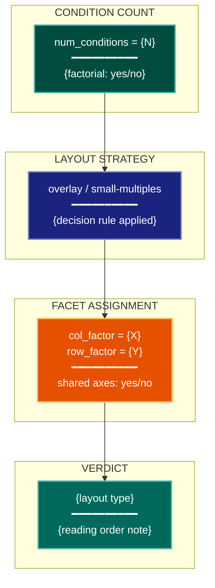

# Compositional Layout Visualization Lens

**Philosophical Mode:** Compositional
**Primary Question:** "Which layout — small multiples vs overlay — best reveals the comparison?"
**Focus:** Small Multiples vs Overlay, Faceting Strategy (row/col), Shared-Axis Alignment,
           Grouped vs Stacked Bars, Factorial Interaction Plots, Panel Reading Order

## Arguments

`/autoskillit:vis-lens-multi-compare [context_path] [experiment_plan_path]`

- **context_path** (optional positional arg 1) — Absolute path to a lens context file
  containing IV/DV tables, H0/H1 hypotheses, controlled variables, and success criteria.
  If provided, read this file before beginning analysis to obtain structured context.
  If omitted, discover context by exploring the CWD.
- **experiment_plan_path** (optional positional arg 2) — Absolute path to the full
  experiment plan. If provided, read for complete experimental methodology and design.
  If omitted, locate the experiment plan by exploring the CWD.

## When to Use

- Designing layouts for experiments with multiple conditions, factors, or treatments
- Deciding whether to use small multiples or overlapping traces in a figure
- Planning faceted grids for factorial designs (2+ independent variables × 2+ levels)
- Evaluating whether grouped or stacked bars serve the comparison goal
- User invokes `/autoskillit:vis-lens-multi-compare`

## Critical Constraints

**NEVER:**
- Modify any source code files
- Do not litter the codebase with useless comments, TODO markers, or explanatory annotations — the skill output and diagram speak for themselves
- Create files outside `{{AUTOSKILLIT_TEMP}}/vis-lens-multi-compare/`
- Use overlapping traces when ≥ 4 conditions are compared — prefer small multiples
- Use stacked bars for comparisons where the baseline shifts — use grouped bars instead

**ALWAYS:**
- Prefer small multiples over overlays when: num_conditions ≥ 5, OR data series overlap
  heavily, OR the comparison requires individual-panel annotation
- Apply consistent shared-axis limits across all panels in a small-multiples layout
- Enforce left-to-right, top-to-bottom panel reading order matching the experimental
  factor order (main factor changes columns; secondary factor changes rows)
- BEFORE creating any diagram, LOAD the `/autoskillit:mermaid` skill using the Skill tool — this is MANDATORY
- If the Skill tool cannot be used (disable-model-invocation) or refuses this invocation, do NOT proceed with diagram creation. Abort this step and omit the diagram from output.
- Write output to `{{AUTOSKILLIT_TEMP}}/vis-lens-multi-compare/vis_spec_multi_compare_{YYYY-MM-DD_HHMMSS}.md` (relative to the current working directory)
- After writing the file, emit the structured output token as **literal plain text** with no
  markdown formatting on the token name (the adjudicator performs a regex match):

  ```
  diagram_path = /absolute/path/to/{{AUTOSKILLIT_TEMP}}/vis-lens-multi-compare/vis_spec_multi_compare_{...}.md
  ```

---

## Analysis Workflow

### Step 0: Parse optional arguments

If positional arg 1 (context_path) is provided and the file exists, read it to obtain
IV/DV tables, H0/H1 hypotheses, controlled variables, and success criteria. If positional
arg 2 (experiment_plan_path) is provided and exists, read the experiment plan for full
methodology. Use this structured context as the foundation for Steps 1–4; skip the CWD
exploration for these fields if the context file supplies them.

### Step 1: Inventory Conditions and Factors

Scan experiment plan, context file, and codebase for:

**Condition and Factor Count**
- Count num_DVs (dependent variables), num_conditions (levels per factor), num_factors (IVs)
- Look for: condition lists, treatment arms, `conditions = [...]`, `groups = [...]`, factor tables

**Series Overlap**
- Assess whether plotting all conditions on a single axes would create heavy visual overlap
- Look for: overlapping confidence bands, dense line clusters, label collisions

**Factorial Structure**
- Detect whether the design is factorial (2+ IVs × 2+ levels each)
- Look for: interaction terms, crossed factors, `factorial`, `grid_search`

### Step 2: Apply Small-Multiples vs Overlay Decision Rule

For each figure that shows multi-condition data, determine the layout strategy:

**Overlay (single axes):**
- ≤ 3 conditions, no label collision, primary message is aggregate trend
- Use when: the comparison is a single-axis trend, conditions are well-separated visually

**Small Multiples (faceted grid):**
- ≥ 4 conditions, OR heavy overlap, OR per-panel annotation needed
- OR factorial (2+ IVs × 2+ levels): always use small multiples
- Assign `row_factor` and `col_factor` explicitly

**Stacked vs Grouped Bars:**
- Stacked bars: only when part-to-whole is the story AND baselines are shared
- Grouped bars: when individual comparison matters more than the total

### Step 3: Assign Facet Layout

For small-multiples layouts:
- Assign `col_factor` to the main independent variable (most levels or primary interest)
- Assign `row_factor` to the secondary independent variable
- Set shared x-axis and y-axis limits across all panels
- Document reading order: left-to-right (col_factor levels), top-to-bottom (row_factor levels)

### Step 4: Emit yaml:figure-spec Blocks

For each figure, emit one `yaml:figure-spec` fenced block with `facet` field populated.
Then LOAD `/autoskillit:mermaid` and create a panel-layout schematic diagram (boxes
representing panel grid with row/col labels).

---

## Output Template

```markdown
# Compositional Layout Spec: {System / Experiment Name}

**Lens:** Compositional Layout (Compositional)
**Question:** Which layout — small multiples vs overlay — best reveals the comparison?
**Date:** {YYYY-MM-DD}
**Scope:** {What was analyzed}
**num_conditions detected:** {N}

## Layout Decision Summary

| Figure | num_conditions | num_factors | Strategy | row_factor | col_factor |
|--------|---------------|-------------|----------|------------|------------|
| {fig-01} | 6 | 2 | small-multiples | method | dataset |
| {fig-02} | 3 | 1 | overlay | — | — |

## Figure Specs

```yaml
# yaml:figure-spec — canonical schema (spec_version: "1.0")
figure_id: "fig-01-factorial-accuracy"
figure_title: "Accuracy Across Methods × Datasets"
spec_version: "1.0"
chart_type: "line"
chart_type_fallback: "grouped-bar"
perceptual_justification: "Small multiples prevent overlap; shared y-axis enables cross-panel comparison."
data_source: "results/accuracy.csv"
data_mapping:
  x: "epoch"
  y: "accuracy"
  color: "variant"
  size: ""
  facet: "col=dataset, row=method"
layout:
  width_inches: 10.0
  height_inches: 6.0
  dpi: 300
stat_overlay:
  type: "error_bar"
  measure: "CI95"
  n_seeds: 5
annotations: ["shared y-axis; panel grid: 3 cols × 2 rows"]
anti_patterns: ["ap-overplotting"]
palette: "okabe-ito"
format: "pdf"
target_dpi: 300
library: "matplotlib"
report_section: "Section 4 Results"
priority: "P1"
placement_tier: "main"
conflicts: []
metadata:
  created_by: "vis-lens-multi-compare"
  reviewed_by: ""
  last_updated: "{YYYY-MM-DD}"
```

## Compositional Layout Diagram



**Color Legend:**
| Color | Category | Description |
|-------|----------|-------------|
| Dark Teal | Condition Count | Number of conditions and factorial structure |
| Dark Blue | Strategy | Overlay vs small-multiples decision |
| Orange | Facet Assignment | Row/col factor and shared-axis configuration |
| Teal | Verdict | Final layout recommendation |
```

---

## Pre-Diagram Checklist

Before creating the diagram, verify:

- [ ] LOADED `/autoskillit:mermaid` skill using the Skill tool
- [ ] Using ONLY classDef styles from the mermaid skill (no invented colors)
- [ ] Diagram will include a color legend table
- [ ] Every figure with ≥ 4 conditions has been assigned a small-multiples layout
- [ ] Every `yaml:figure-spec` has the `facet` field filled (or explicitly empty for overlays)
