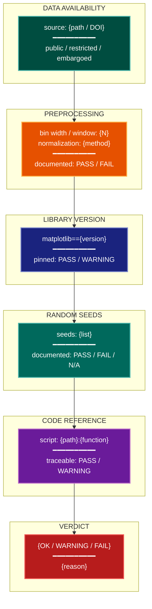

# Replicative Reproducibility Visualization Lens

**Philosophical Mode:** Replicative
**Primary Question:** "Can the figures be reproduced from the data and code?"
**Focus:** Data availability (public / restricted / embargoed), preprocessing parameter
           disclosure (bin widths, smoothing windows, normalization), plotting library and
           version pinning, random seed documentation, per-figure code reference (script or
           notebook cell)

## Arguments

`/autoskillit:vis-lens-reproducibility [context_path] [experiment_plan_path]`

- **context_path** (optional positional arg 1) — Absolute path to a lens context file
  containing IV/DV tables, H0/H1 hypotheses, controlled variables, and success criteria.
  If provided, read this file before beginning analysis to obtain structured context.
  If omitted, discover context by exploring the CWD.
- **experiment_plan_path** (optional positional arg 2) — Absolute path to the full
  experiment plan. If provided, read for complete experimental methodology and design.
  If omitted, locate the experiment plan by exploring the CWD.

## When to Use

- Auditing figure reproducibility before public release
- Checking whether preprocessing parameters are fully disclosed
- Verifying that random seeds are documented for stochastic plots
- Linking each figure to the script or notebook cell that generates it
- User invokes `/autoskillit:vis-lens-reproducibility`

## Critical Constraints

**NEVER:**
- Modify any source code files
- Do not litter the codebase with useless comments, TODO markers, or explanatory annotations — the skill output and diagram speak for themselves
- Create files outside `{{AUTOSKILLIT_TEMP}}/vis-lens-reproducibility/`
- Treat "code available on request" as equivalent to public availability
- Omit random seed documentation for any figure derived from stochastic processes

**ALWAYS:**
- Check data availability status for every figure (public/restricted/embargoed)
- Document bin widths for histograms, smoothing windows for time-series, normalization parameters for heatmaps
- Pin plotting library name and version (matplotlib 3.8.2, seaborn 0.13.0, etc.)
- Record the random seed(s) used for any stochastic component (sampling, bootstrapping, noise injection)
- Provide a per-figure code reference: script path or notebook cell identifier
- BEFORE creating any diagram, LOAD the `/autoskillit:mermaid` skill using the Skill tool — this is MANDATORY
- If the Skill tool cannot be used (disable-model-invocation) or refuses this invocation, do NOT proceed with diagram creation. Abort this step and omit the diagram from output.
- Write output to `{{AUTOSKILLIT_TEMP}}/vis-lens-reproducibility/vis_spec_reproducibility_{YYYY-MM-DD_HHMMSS}.md` (relative to the current working directory)
- After writing the file, emit the structured output token as **literal plain text** with no
  markdown formatting on the token name (the adjudicator performs a regex match):

  ```
  diagram_path = /absolute/path/to/{{AUTOSKILLIT_TEMP}}/vis-lens-reproducibility/vis_spec_reproducibility_{...}.md
  %%ORDER_UP%%
  ```

---

## Analysis Workflow

### Step 0: Parse optional arguments

If positional arg 1 (context_path) is provided and the file exists, read it to obtain
IV/DV tables, H0/H1 hypotheses, controlled variables, and success criteria. If positional
arg 2 (experiment_plan_path) is provided and exists, read the experiment plan for full
methodology. Use this structured context as the foundation for Steps 1–4; skip the CWD
exploration for these fields if the context file supplies them.

### Step 1: Data Availability Inventory

For each figure:
- Identify the data source (file path, dataset name, external URL)
- Classify availability: PUBLIC (DOI / URL), RESTRICTED (license required), EMBARGOED (not yet released)
- FLAG FAIL if data is restricted/embargoed with no access plan stated

### Step 2: Preprocessing Parameter Audit

For each figure, identify all preprocessing steps that affect visual output:
- **Histograms**: bin width or bin count; normalization (density vs count vs probability)
- **Time-series / learning curves**: smoothing window type (rolling mean, EMA) and window size
- **Heatmaps**: normalization method (min-max, z-score, none); colormap clipping range
- **Scatter/line with aggregation**: aggregation function (mean, median) and grouping
- FLAG WARNING for any preprocessing parameter not documented

### Step 3: Library and Version Audit

Scan the codebase for plotting imports:
- Record: `import matplotlib`, `import seaborn`, `import plotly`, etc.
- Check `pyproject.toml` or `requirements.txt` for pinned versions
- FLAG WARNING if plotting library version is not pinned

### Step 4: Random Seed Audit

For each figure involving a stochastic component:
- Identify source of randomness: bootstrapping, subsampling, t-SNE/UMAP, noise injection
- Verify `random_state`, `seed`, `np.random.seed`, or equivalent is documented per figure
- FLAG FAIL if any stochastic figure has no documented seed

### Step 5: Per-Figure Code Reference

For each figure:
- Identify the script or notebook cell that generates it
- Record: file path + function or cell ID
- FLAG WARNING if a figure has no traceable code reference

### Step 6: Emit yaml:figure-spec Blocks

For each figure, emit one `yaml:figure-spec` fenced block with `data_source` and
`annotations` fields capturing reproducibility metadata. Then LOAD `/autoskillit:mermaid`
and create a diagram showing: data availability → preprocessing → library version →
seed documentation → code reference → verdict.

---

## Output Template

```markdown
# Replicative Reproducibility Spec: {System / Experiment Name}

**Lens:** Replicative Reproducibility (Replicative)
**Question:** Can the figures be reproduced from the data and code?
**Date:** {YYYY-MM-DD}
**Scope:** {What was analyzed}

## Reproducibility Audit Summary

| Figure | Data Available | Preprocessing Documented | Library Pinned | Seed Documented | Code Reference | Status |
|--------|---------------|--------------------------|----------------|-----------------|----------------|--------|
| fig-01 | PUBLIC | PASS | PASS | N/A | scripts/plot_main.py | OK |
| fig-02 | RESTRICTED | WARNING | FAIL | PASS | notebooks/ablation.ipynb#cell-7 | FAIL |

## Figure Specs

```yaml
# yaml:figure-spec — canonical schema (spec_version: "1.0")
figure_id: "fig-01-main-result"
figure_title: "Model A achieves state-of-the-art on all benchmarks"
spec_version: "1.0"
chart_type: "bar"
chart_type_fallback: "table"
perceptual_justification: "Bars communicate exact values; error bars show CI95 over 5 seeds."
data_source: "results/main.csv (DOI: 10.xxxx/xxxxx)"
data_mapping:
  x: "benchmark"
  y: "score"
  color: "model"
  size: ""
  facet: ""
layout:
  width_inches: 6.0
  height_inches: 4.0
  dpi: 300
stat_overlay:
  type: "error_bar"
  measure: "CI95"
  n_seeds: 5
annotations: ["data: public (DOI); preprocessing: none; library: matplotlib==3.8.2; seeds: 0,1,2,3,4; code: scripts/plot_main.py:plot_main_result()"]
anti_patterns: []
palette: "okabe-ito"
format: "pdf"
target_dpi: 300
library: "matplotlib==3.8.2"
report_section: "Section 4 Results"
priority: "P0"
placement_tier: "main"
conflicts: []
metadata:
  created_by: "vis-lens-reproducibility"
  reviewed_by: ""
  last_updated: "{YYYY-MM-DD}"
```

## Reproducibility Diagram



**Color Legend:**
| Color | Category | Description |
|-------|----------|-------------|
| Dark Teal | Data | Data availability status |
| Orange | Preprocessing | Parameter documentation check |
| Dark Blue | Library | Plotting library version pin |
| Teal | Seeds | Random seed documentation |
| Purple | Code Ref | Per-figure code traceability |
| Red | Verdict | OK / WARNING / FAIL assessment |
```

---

## Pre-Diagram Checklist

Before creating the diagram, verify:

- [ ] LOADED `/autoskillit:mermaid` skill using the Skill tool
- [ ] Using ONLY classDef styles from the mermaid skill (no invented colors)
- [ ] Diagram will include a color legend table
- [ ] Every restricted/embargoed dataset is flagged as FAIL or WARNING
- [ ] Every histogram bin width and time-series smoothing window is audited
- [ ] Every stochastic figure has its seeds documented or flagged
