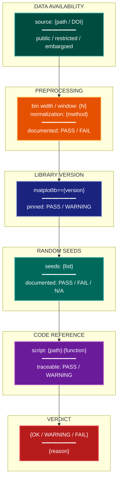

# Replicative Reproducibility Visualization Lens

**Philosophical Mode:** Replicative
**Primary Question:** "Can the figures be reproduced from the data and code?"
**Focus:** Data availability (public / restricted / embargoed), preprocessing parameter
           disclosure (bin widths, smoothing windows, normalization), plotting library and
           version pinning, random seed documentation, per-figure code reference (script or
           notebook cell)

## Arguments

`/autoskillit:vis-lens-reproducibility [context_path] [experiment_plan_path]`

- **context_path** (optional positional arg 1) — Absolute path to a lens context file
  containing IV/DV tables, H0/H1 hypotheses, controlled variables, and success criteria.
  If provided, read this file before beginning analysis to obtain structured context.
  If omitted, discover context by exploring the CWD.
- **experiment_plan_path** (optional positional arg 2) — Absolute path to the full
  experiment plan. If provided, read for complete experimental methodology and design.
  If omitted, locate the experiment plan by exploring the CWD.

## When to Use

- Auditing figure reproducibility before public release
- Checking whether preprocessing parameters are fully disclosed
- Verifying that random seeds are documented for stochastic plots
- Linking each figure to the script or notebook cell that generates it
- User invokes `/autoskillit:vis-lens-reproducibility`

## Critical Constraints

**NEVER:**
- Fabricate, invent, or embellish information not supported by the available evidence or code.

- Modify any source code files
- Do not litter the codebase with useless comments, TODO markers, or explanatory annotations — the skill output and diagram speak for themselves
- Create files outside `{{AUTOSKILLIT_TEMP}}/vis-lens-reproducibility/`
- Treat "code available on request" as equivalent to public availability
- Omit random seed documentation for any figure derived from stochastic processes
- Import or execute target code, tests, experiments, models, benchmarks, notebooks, or plotting workflows to gather evidence

**ALWAYS:**
- Check data availability status for every figure (public/restricted/embargoed)
- Document bin widths for histograms, smoothing windows for time-series, normalization parameters for heatmaps
- Pin plotting library name and version (matplotlib 3.8.2, seaborn 0.13.0, etc.)
- Record the random seed(s) used for any stochastic component (sampling, bootstrapping, noise injection)
- Provide a per-figure code reference: script path or notebook cell identifier
- Use the registered exploration roles for all repository reads
- Route the missing-context vector only for fields absent after direct caller-context parsing, and dispatch the 5 repo-local audit vectors through the deterministic router
- Allow parent-boundary handoff between semantic code navigation and declarative or generated-artifact evidence without creating extra vectors
- Keep external availability, licensing, and network checks lens-owned and outside native exploration
- Wait for every applicable exploration result before making reproducibility decisions, emitting figure specifications, or creating the diagram
- Retain parent authority over warnings, failures, availability classification, disclosure judgment, figure-spec synthesis, and diagram creation
- BEFORE creating any diagram, LOAD the `/autoskillit:mermaid` skill using the Skill tool — this is MANDATORY
- If the Skill tool cannot be used (disable-model-invocation) or refuses this invocation, do NOT proceed with diagram creation. Abort this step and omit the diagram from output.
- Write output to `{{AUTOSKILLIT_TEMP}}/vis-lens-reproducibility/vis_spec_reproducibility_{YYYY-MM-DD_HHMMSS}.md` (relative to the current working directory)
- After writing the file, emit the structured output token as **literal plain text** with no
  markdown formatting on the token name (the adjudicator performs a regex match):

  ```
  diagram_path = /absolute/path/to/{{AUTOSKILLIT_TEMP}}/vis-lens-reproducibility/vis_spec_reproducibility_{...}.md
  ```

---

## Analysis Workflow

### Step 0: Parse optional arguments

If positional arg 1 (context_path) is provided and the file exists, read it to obtain
IV/DV tables, H0/H1 hypotheses, controlled variables, and success criteria. If positional
arg 2 (experiment_plan_path) is provided and exists, read the experiment plan for full
methodology. Use this structured context as the foundation for Steps 1–4; skip the CWD
exploration for these fields if the context file supplies them.

<!-- autoskillit:exploration-vector id="missing-context-fields" -->
After the parent parses the optional context and experiment plan, dispatch repository retrieval only for required fields still absent. Never rediscover or override a supplied complete field. If no fields remain missing, report this vector not applicable and perform no search. If scoped evidence is absent or unrelated, report the field unavailable or unrelated without widening scope, inferring meaning, or importing or executing target code, tests, experiments, models, or benchmarks.
<!-- /autoskillit:exploration-vector -->

### Step 1: Data Availability Inventory

<!-- autoskillit:exploration-vector id="data-availability-inventory" -->
For each pre-existing figure or figure specification, identify repo-local data file paths, dataset names, manifests, data-source fields, and declared external references. Return bounded artifact evidence only; do not access the network, resolve licenses, or classify availability.
<!-- /autoskillit:exploration-vector -->

The parent classifies availability as PUBLIC, RESTRICTED, or EMBARGOED using direct evidence and lens-owned external checks, and flags failure when restricted or embargoed data has no stated access plan.

### Step 2: Preprocessing Parameter Audit

<!-- autoskillit:exploration-vector id="preprocessing-parameter-audit" -->
Trace preprocessing definitions and parameters that affect visual output: histogram bin width or count and normalization; time-series smoothing method and window; heatmap normalization and clipping; and scatter or line aggregation and grouping. Return code relationships and declared values only.
<!-- /autoskillit:exploration-vector -->

The parent flags any undocumented preprocessing parameter as a warning.

### Step 3: Library and Version Audit

<!-- autoskillit:exploration-vector id="library-version-audit" -->
Trace plotting-library imports and references, including matplotlib, seaborn, and plotly. Include bounded parent-mediated handoff of dependency manifests and version declarations to the repository-impact profiler.
<!-- /autoskillit:exploration-vector -->

The parent records the library and version and flags an unpinned version as a warning.

### Step 4: Random Seed Audit

<!-- autoskillit:exploration-vector id="random-seed-audit" -->
For each stochastic figure path, trace sources of randomness such as bootstrapping, subsampling, dimensionality reduction, and noise injection, plus random-state and seed definitions and calls. Return evidence only.
<!-- /autoskillit:exploration-vector -->

The parent verifies per-figure seed documentation and flags failure when it is absent.

### Step 5: Per-Figure Code Reference

<!-- autoskillit:exploration-vector id="per-figure-code-reference" -->
For each pre-existing figure or figure specification, identify declared generating scripts, notebooks, cell identifiers, and referenced functions. Use parent-mediated navigator handoff for bounded symbol tracing; do not execute notebooks or plotting code.
<!-- /autoskillit:exploration-vector -->

The parent records the file and function or cell identifier and flags missing traceability as a warning.

### Step 6: Emit yaml:figure-spec Blocks

For each figure, emit one `yaml:figure-spec` fenced block with `data_source` and
`annotations` fields capturing reproducibility metadata. Then LOAD `/autoskillit:mermaid`
and create a diagram showing: data availability → preprocessing → library version →
seed documentation → code reference → verdict.

---

## Output Template

```markdown
# Replicative Reproducibility Spec: {System / Experiment Name}

**Lens:** Replicative Reproducibility (Replicative)
**Question:** Can the figures be reproduced from the data and code?
**Date:** {YYYY-MM-DD}
**Scope:** {What was analyzed}

## Reproducibility Audit Summary

| Figure | Data Available | Preprocessing Documented | Library Pinned | Seed Documented | Code Reference | Status |
|--------|---------------|--------------------------|----------------|-----------------|----------------|--------|
| fig-01 | PUBLIC | PASS | PASS | N/A | scripts/plot_main.py | OK |
| fig-02 | RESTRICTED | WARNING | FAIL | PASS | notebooks/ablation.ipynb#cell-7 | FAIL |

## Figure Specs

```yaml
# yaml:figure-spec — canonical schema (spec_version: "1.0")
figure_id: "fig-01-main-result"
figure_title: "Model A achieves state-of-the-art on all benchmarks"
spec_version: "1.0"
chart_type: "bar"
chart_type_fallback: "table"
perceptual_justification: "Bars communicate exact values; error bars show CI95 over 5 seeds."
data_source: "results/main.csv (DOI: 10.xxxx/xxxxx)"
data_mapping:
  x: "benchmark"
  y: "score"
  color: "model"
  size: ""
  facet: ""
layout:
  width_inches: 6.0
  height_inches: 4.0
  dpi: 300
stat_overlay:
  type: "error_bar"
  measure: "CI95"
  n_seeds: 5
annotations: ["data: public (DOI); preprocessing: none; library: matplotlib==3.8.2; seeds: 0,1,2,3,4; code: scripts/plot_main.py:plot_main_result()"]
anti_patterns: []
palette: "okabe-ito"
format: "pdf"
target_dpi: 300
library: "matplotlib==3.8.2"
report_section: "Section 4 Results"
image_path: ""
priority: "P0"
placement_tier: "main"
conflicts: []
metadata:
  created_by: "vis-lens-reproducibility"
  reviewed_by: ""
  last_updated: "{YYYY-MM-DD}"
```

## Reproducibility Diagram


```mermaid
%%{init: {'flowchart': {'nodeSpacing': 50, 'rankSpacing': 60, 'curve': 'basis'}}}%%
flowchart TB
    %% CLASS DEFINITIONS %%
    classDef cli fill:#1a237e,stroke:#7986cb,stroke-width:2px,color:#fff;
    classDef stateNode fill:#004d40,stroke:#4db6ac,stroke-width:2px,color:#fff;
    classDef handler fill:#e65100,stroke:#ffb74d,stroke-width:2px,color:#fff;
    classDef output fill:#00695c,stroke:#4db6ac,stroke-width:2px,color:#fff;
    classDef detector fill:#b71c1c,stroke:#ef5350,stroke-width:2px,color:#fff;
    classDef phase fill:#6a1b9a,stroke:#ba68c8,stroke-width:2px,color:#fff;

    subgraph Data ["DATA AVAILABILITY"]
        D1["source: {path / DOI}<br/>━━━━━━━━━━<br/>public / restricted / embargoed"]
    end

    subgraph Preproc ["PREPROCESSING"]
        P1["bin width / window: {N}<br/>normalization: {method}<br/>━━━━━━━━━━<br/>documented: PASS / FAIL"]
    end

    subgraph Library ["LIBRARY VERSION"]
        L1["matplotlib=={version}<br/>━━━━━━━━━━<br/>pinned: PASS / WARNING"]
    end

    subgraph Seeds ["RANDOM SEEDS"]
        S1["seeds: {list}<br/>━━━━━━━━━━<br/>documented: PASS / FAIL / N/A"]
    end

    subgraph CodeRef ["CODE REFERENCE"]
        C1["script: {path}:{function}<br/>━━━━━━━━━━<br/>traceable: PASS / WARNING"]
    end

    subgraph Verdict ["VERDICT"]
        V1["{OK / WARNING / FAIL}<br/>━━━━━━━━━━<br/>{reason}"]
    end

    D1 --> P1
    P1 --> L1
    L1 --> S1
    S1 --> C1
    C1 --> V1

    class D1 stateNode;
    class P1 handler;
    class L1 cli;
    class S1 output;
    class C1 phase;
    class V1 detector;
```

**Color Legend:**
| Color | Category | Description |
|-------|----------|-------------|
| Dark Teal | Data | Data availability status |
| Orange | Preprocessing | Parameter documentation check |
| Dark Blue | Library | Plotting library version pin |
| Teal | Seeds | Random seed documentation |
| Purple | Code Ref | Per-figure code traceability |
| Red | Verdict | OK / WARNING / FAIL assessment |
```

---

## Pre-Diagram Checklist

Before creating the diagram, verify:

- [ ] LOADED `/autoskillit:mermaid` skill using the Skill tool
- [ ] Using ONLY classDef styles from the mermaid skill (no invented colors)
- [ ] Diagram will include a color legend table
- [ ] Every restricted/embargoed dataset is flagged as FAIL or WARNING
- [ ] Every histogram bin width and time-series smoothing window is audited
- [ ] Every stochastic figure has its seeds documented or flagged

---

## Related Skills

- `/autoskillit:plan-visualization` - Parent skill for lens selection
- `/autoskillit:mermaid` - MUST BE LOADED before creating diagram
- `/autoskillit:vis-lens-methodology-norms` - For field-specific methodology compliance
- `/autoskillit:vis-lens-multi-compare` - For multi-condition comparison layouts
- `/autoskillit:vis-lens-uncertainty` - For statistical uncertainty visualization
