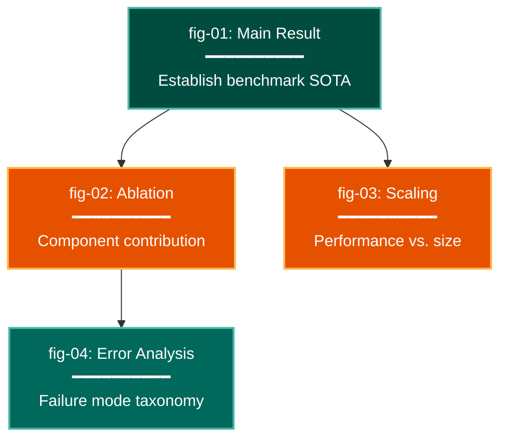

# Narrative Story Arc Visualization Lens

**Philosophical Mode:** Narrative
**Primary Question:** "Do the figures tell a coherent story across the report?"
**Focus:** Visual consistency (same color = same model everywhere), logical figure progression
           (each figure builds on the previous), no redundant figures (same data shown twice),
           narrative dependency between figures (figure N motivates figure N+1)

## Arguments

`/autoskillit:vis-lens-story-arc [context_path] [experiment_plan_path]`

- **context_path** (optional positional arg 1) — Absolute path to a lens context file
  containing IV/DV tables, H0/H1 hypotheses, controlled variables, and success criteria.
  If provided, read this file before beginning analysis to obtain structured context.
  If omitted, discover context by exploring the CWD.
- **experiment_plan_path** (optional positional arg 2) — Absolute path to the full
  experiment plan. If provided, read for complete experimental methodology and design.
  If omitted, locate the experiment plan by exploring the CWD.

## When to Use

- Planning the figure sequence for a paper or technical report
- Checking that the same model/condition uses the same color across all figures
- Identifying redundant figures that show the same data twice
- Verifying that each figure's narrative position is justified
- User invokes `/autoskillit:vis-lens-story-arc`

## Critical Constraints

**NEVER:**
- Modify any source code files
- Do not litter the codebase with useless comments, TODO markers, or explanatory annotations — the skill output and diagram speak for themselves
- Create files outside `{{AUTOSKILLIT_TEMP}}/vis-lens-story-arc/`
- Assign the same color to two different models, conditions, or categories across figures
- Include a figure that presents the same data and conclusion as another figure already in the plan

**ALWAYS:**
- Build a global color→entity mapping table across all figures; flag any inconsistency
- Number all figures and write a one-sentence narrative role for each
- Flag any figure whose narrative role duplicates another (same question, same data)
- Verify that figures appear in a logical dependency order (motivation → method → result → implication)
- The primary diagram output is a **figure-sequence flow diagram** (mermaid) showing narrative dependencies
- BEFORE creating any diagram, LOAD the `/autoskillit:mermaid` skill using the Skill tool — this is MANDATORY
- If the Skill tool cannot be used (disable-model-invocation) or refuses this invocation, do NOT proceed with diagram creation. Abort this step and omit the diagram from output.
- Write output to `{{AUTOSKILLIT_TEMP}}/vis-lens-story-arc/vis_spec_story_arc_{YYYY-MM-DD_HHMMSS}.md` (relative to the current working directory)
- After writing the file, emit the structured output token as **literal plain text** with no
  markdown formatting on the token name (the adjudicator performs a regex match):

  ```
  diagram_path = /absolute/path/to/{{AUTOSKILLIT_TEMP}}/vis-lens-story-arc/vis_spec_story_arc_{...}.md
  %%ORDER_UP%%
  ```

---

## Analysis Workflow

### Step 0: Parse optional arguments

If positional arg 1 (context_path) is provided and the file exists, read it to obtain
IV/DV tables, H0/H1 hypotheses, controlled variables, and success criteria. If positional
arg 2 (experiment_plan_path) is provided and exists, read the experiment plan for full
methodology. Use this structured context as the foundation for Steps 1–4; skip the CWD
exploration for these fields if the context file supplies them.

### Step 1: Enumerate and Number All Figures

List all planned figures in document order. For each figure record:
- Figure ID (fig-01, fig-02, ...)
- Title / description
- What data/question it addresses
- Which section it appears in (intro, method, results, discussion, appendix)

### Step 2: Build Global Color Map

Scan all figure descriptions and plotting code for color/palette assignments:
- Build table: { color_hex_or_name → entity_name }
- Check: is the same entity always the same color across all figures?
- FLAG INCONSISTENCY if entity A is blue in fig-02 but orange in fig-05

### Step 3: Detect Redundant Figures

For each pair of figures, check:
- Do they display the same underlying data (same x/y variables, same conditions)?
- Do they answer the same question?
- If YES → flag as REDUNDANT; recommend merging or removing one

### Step 4: Map Narrative Dependencies

For each figure, identify:
- Which figure(s) it logically depends on (must be read first)
- Which figure(s) it motivates (enables interpretation of)
- Whether its narrative position (section) matches its dependency order

### Step 5: Emit yaml:figure-spec Blocks and Sequence Diagram

For each figure, emit one `yaml:figure-spec` fenced block. Then LOAD `/autoskillit:mermaid`
and create a **figure-sequence flow diagram** showing narrative dependencies between figures.

---

## Output Template

```markdown
# Narrative Story Arc Spec: {System / Experiment Name}

**Lens:** Narrative Story Arc (Narrative)
**Question:** Do the figures tell a coherent story across the report?
**Date:** {YYYY-MM-DD}
**Scope:** {What was analyzed}

## Global Color Map

| Color | Entity | Consistent Across Figures |
|-------|--------|--------------------------|
| #1f77b4 | Model A | PASS |
| #ff7f0e | Baseline | FAIL (blue in fig-03) |

## Figure Sequence Summary

| Figure | Section | Narrative Role | Depends On | Redundant? |
|--------|---------|----------------|------------|------------|
| fig-01 | Results | Establish main result | — | No |
| fig-02 | Results | Show ablation | fig-01 | No |

## Figure Specs

```yaml
# yaml:figure-spec — canonical schema (spec_version: "1.0")
figure_id: "fig-01-main-result"
figure_title: "Model A achieves state-of-the-art on all benchmarks"
spec_version: "1.0"
chart_type: "bar"
chart_type_fallback: "table"
perceptual_justification: "Grouped bars directly compare models; color consistent with fig-02 through fig-05."
data_source: "results/main.csv"
data_mapping:
  x: "benchmark"
  y: "score"
  color: "model"
  size: ""
  facet: ""
layout:
  width_inches: 6.0
  height_inches: 4.0
  dpi: 300
stat_overlay:
  type: "error_bar"
  measure: "CI95"
  n_seeds: 5
annotations: ["Narrative role: introduce main result; motivates fig-02 ablation"]
anti_patterns: []
palette: "okabe-ito"
format: "pdf"
target_dpi: 300
library: "matplotlib"
report_section: "Section 4 Results"
priority: "P0"
placement_tier: "main"
conflicts: []
metadata:
  created_by: "vis-lens-story-arc"
  reviewed_by: ""
  last_updated: "{YYYY-MM-DD}"
```

## Figure Sequence Flow Diagram



**Color Legend:**
| Color | Category | Description |
|-------|----------|-------------|
| Dark Teal | Anchor | Primary result figure |
| Orange | Derived | Figures that build on anchor |
| Dark Teal (output) | Terminal | Figures that conclude a narrative thread |
```

---

## Pre-Diagram Checklist

Before creating the diagram, verify:

- [ ] LOADED `/autoskillit:mermaid` skill using the Skill tool
- [ ] Using ONLY classDef styles from the mermaid skill (no invented colors)
- [ ] Diagram will include a color legend table
- [ ] Global color map table is complete before creating the diagram
- [ ] Every color inconsistency has been flagged
- [ ] Every redundant figure pair has been identified
