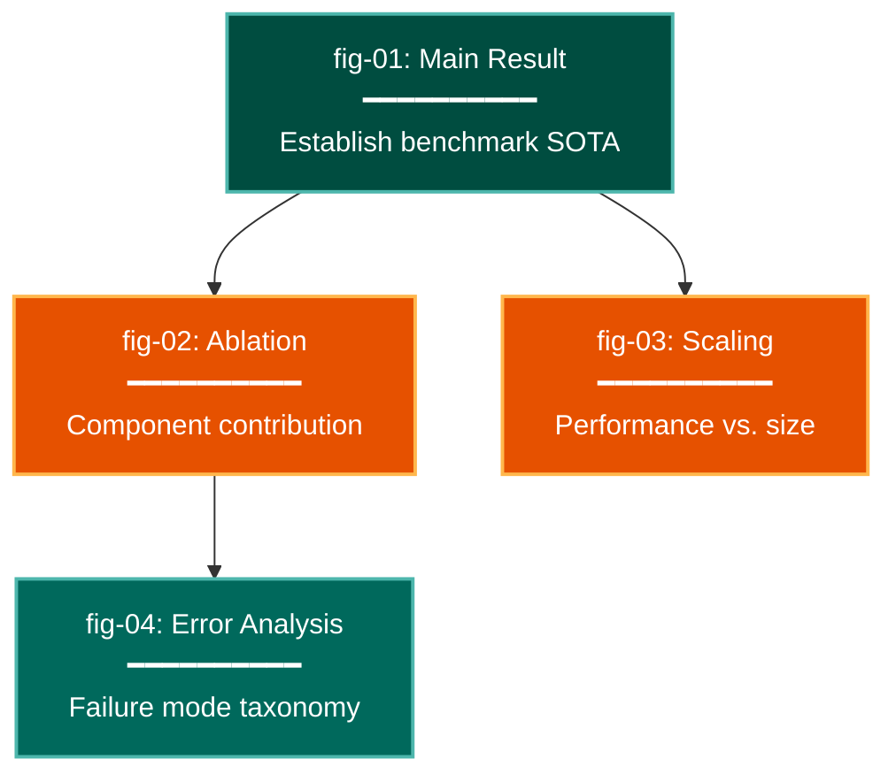

# Narrative Story Arc Visualization Lens

> **Preflight:** Before acting on any `exploration-vector` directive below, call `enable_exploration` to establish read-only broker authority for this session; the vectors below assume broker access has already been granted.

**Philosophical Mode:** Narrative
**Primary Question:** "Do the figures tell a coherent story across the report?"
**Focus:** Visual consistency (same color = same model everywhere), logical figure progression
           (each figure builds on the previous), no redundant figures (same data shown twice),
           narrative dependency between figures (figure N motivates figure N+1)

## Arguments

`/autoskillit:vis-lens-story-arc [context_path] [experiment_plan_path]`

- **context_path** (optional positional arg 1) — Absolute path to a lens context file
  containing IV/DV tables, H0/H1 hypotheses, controlled variables, and success criteria.
  If provided, read this file before beginning analysis to obtain structured context.
  If omitted, discover context by exploring the CWD.
- **experiment_plan_path** (optional positional arg 2) — Absolute path to the full
  experiment plan. If provided, read for complete experimental methodology and design.
  If omitted, locate the experiment plan by exploring the CWD.

## When to Use

- Planning the figure sequence for a paper or technical report
- Checking that the same model/condition uses the same color across all figures
- Identifying redundant figures that show the same data twice
- Verifying that each figure's narrative position is justified
- User invokes `/autoskillit:vis-lens-story-arc`

## Critical Constraints

**NEVER:**
- Fabricate, invent, or embellish information not supported by the available evidence or code.

- Modify any source code files
- Do not litter the codebase with useless comments, TODO markers, or explanatory annotations — the skill output and diagram speak for themselves
- Create files outside `{{AUTOSKILLIT_TEMP}}/vis-lens-story-arc/`
- Assign the same color to two different models, conditions, or categories across figures
- Include a figure that presents the same data and conclusion as another figure already in the plan
- Import or execute target code, tests, experiments, models, benchmarks, notebooks, or plotting workflows to gather evidence

- Detach child delegations instead of joining them (joining every child is required)
- Start independent child delegations sequentially

**ALWAYS:**
- Start all independent child delegations before awaiting any result to maximize concurrency
- Build a global color→entity mapping table across all figures; flag any inconsistency
- Number all figures and write a one-sentence narrative role for each
- Flag any figure whose narrative role duplicates another (same question, same data)
- Verify that figures appear in a logical dependency order (motivation → method → result → implication)
- The primary diagram output is a **figure-sequence flow diagram** (mermaid) showing narrative dependencies
- Use the registered exploration roles for all repository reads
- Route the missing-context vector only for fields absent after direct caller-context parsing, dispatch the global-color-map repo scan through the deterministic router, and keep retained narrative blocks parent-owned
- Allow parent-boundary handoff between declarative or generated-artifact evidence and semantic code navigation without creating extra vectors
- Keep external availability, licensing, and network checks lens-owned and outside native exploration
- Wait for every applicable exploration result before judging consistency or redundancy, mapping narrative dependencies, emitting figure specifications, or creating the diagram
- Retain parent authority over figure enumeration, color consistency and redundancy judgments, narrative dependency interpretation, figure-spec synthesis, and diagram creation
- BEFORE creating any diagram, LOAD the `/autoskillit:mermaid` skill using the Skill tool — this is MANDATORY
- If the Skill tool cannot be used (disable-model-invocation) or refuses this invocation, do NOT proceed with diagram creation. Abort this step and omit the diagram from output.
- Write output to `{{AUTOSKILLIT_TEMP}}/vis-lens-story-arc/vis_spec_story_arc_{YYYY-MM-DD_HHMMSS}.md` (relative to the current working directory)
- After writing the file, emit the structured output token as **literal plain text** with no
  markdown formatting on the token name (the adjudicator performs a regex match):

  ```
  diagram_path = /absolute/path/to/{{AUTOSKILLIT_TEMP}}/vis-lens-story-arc/vis_spec_story_arc_{...}.md
  ```

---

## Analysis Workflow

### Step 0: Parse optional arguments

If positional arg 1 (context_path) is provided and the file exists, read it to obtain
IV/DV tables, H0/H1 hypotheses, controlled variables, and success criteria. If positional
arg 2 (experiment_plan_path) is provided and exists, read the experiment plan for full
methodology. Use this structured context as the foundation for Steps 1–4; skip the CWD
exploration for these fields if the context file supplies them.

<!-- autoskillit:exploration-vector id="missing-context-fields" -->
After the parent parses the optional context and experiment plan, dispatch repository retrieval only for required fields still absent. Never rediscover or override a supplied complete field. If no fields remain missing, report this vector not applicable and perform no search. If scoped evidence is absent or unrelated, report the field unavailable or unrelated without widening scope, inferring meaning, or importing or executing target code, tests, experiments, models, or benchmarks.
<!-- /autoskillit:exploration-vector -->

### Step 1: Enumerate and Number All Figures

<!-- autoskillit:exploration-vector id="enumerate-number-figures" -->
From the supplied or pre-existing figure plan, list all planned figures in document order. For each figure record its identifier, title or description, addressed data or question, and report section.
<!-- /autoskillit:exploration-vector -->

### Step 2: Build Global Color Map

<!-- autoskillit:exploration-vector id="global-color-map" -->
Inventory color and palette assignments declared by pre-existing figure descriptions, figure specifications, generated artifacts, and visualization configuration. Use parent-mediated semantic navigator handoff for bounded tracing of plotting-code color assignments; do not import or execute plotting code.
<!-- /autoskillit:exploration-vector -->

The parent builds the color-to-entity table, checks that every entity keeps one color across figures, and flags inconsistency when assignments differ.

### Step 3: Detect Redundant Figures

<!-- autoskillit:exploration-vector id="detect-redundant-figures" -->
For each pair of known figures, compare the underlying data mapping, variables, conditions, and addressed question. The parent flags a pair as redundant and recommends merging or removal only when both the data and conclusion duplicate one another.
<!-- /autoskillit:exploration-vector -->

### Step 4: Map Narrative Dependencies

<!-- autoskillit:exploration-vector id="map-narrative-dependencies" -->
For each known figure, identify which earlier figures must be read first, which later figures it motivates or enables, and whether its report section matches that dependency order. Keep the narrative interpretation and ordering judgment with the parent.
<!-- /autoskillit:exploration-vector -->

### Step 5: Emit yaml:figure-spec Blocks and Sequence Diagram

For each figure, emit one `yaml:figure-spec` fenced block. Then LOAD `/autoskillit:mermaid`
and create a **figure-sequence flow diagram** showing narrative dependencies between figures.

---

## Output Template

```markdown
# Narrative Story Arc Spec: {System / Experiment Name}

**Lens:** Narrative Story Arc (Narrative)
**Question:** Do the figures tell a coherent story across the report?
**Date:** {YYYY-MM-DD}
**Scope:** {What was analyzed}

## Global Color Map

| Color | Entity | Consistent Across Figures |
|-------|--------|--------------------------|
| #1f77b4 | Model A | PASS |
| #ff7f0e | Baseline | FAIL (blue in fig-03) |

## Figure Sequence Summary

| Figure | Section | Narrative Role | Depends On | Redundant? |
|--------|---------|----------------|------------|------------|
| fig-01 | Results | Establish main result | — | No |
| fig-02 | Results | Show ablation | fig-01 | No |

## Figure Specs

```yaml
# yaml:figure-spec — canonical schema (spec_version: "1.0")
figure_id: "fig-01-main-result"
figure_title: "Model A achieves state-of-the-art on all benchmarks"
spec_version: "1.0"
chart_type: "bar"
chart_type_fallback: "table"
perceptual_justification: "Grouped bars directly compare models; color consistent with fig-02 through fig-05."
data_source: "results/main.csv"
data_mapping:
  x: "benchmark"
  y: "score"
  color: "model"
  size: ""
  facet: ""
layout:
  width_inches: 6.0
  height_inches: 4.0
  dpi: 300
stat_overlay:
  type: "error_bar"
  measure: "CI95"
  n_seeds: 5
annotations: ["Narrative role: introduce main result; motivates fig-02 ablation"]
anti_patterns: []
palette: "okabe-ito"
format: "pdf"
target_dpi: 300
library: "matplotlib"
report_section: "Section 4 Results"
image_path: ""
priority: "P0"
placement_tier: "main"
conflicts: []
metadata:
  created_by: "vis-lens-story-arc"
  reviewed_by: ""
  last_updated: "{YYYY-MM-DD}"
```

## Figure Sequence Flow Diagram


```mermaid
%%{init: {'flowchart': {'nodeSpacing': 50, 'rankSpacing': 60, 'curve': 'basis'}}}%%
flowchart TB
    %% CLASS DEFINITIONS %%
    classDef cli fill:#1a237e,stroke:#7986cb,stroke-width:2px,color:#fff;
    classDef stateNode fill:#004d40,stroke:#4db6ac,stroke-width:2px,color:#fff;
    classDef handler fill:#e65100,stroke:#ffb74d,stroke-width:2px,color:#fff;
    classDef output fill:#00695c,stroke:#4db6ac,stroke-width:2px,color:#fff;
    classDef detector fill:#b71c1c,stroke:#ef5350,stroke-width:2px,color:#fff;

    F1["fig-01: Main Result<br/>━━━━━━━━━━<br/>Establish benchmark SOTA"]
    F2["fig-02: Ablation<br/>━━━━━━━━━━<br/>Component contribution"]
    F3["fig-03: Scaling<br/>━━━━━━━━━━<br/>Performance vs. size"]
    F4["fig-04: Error Analysis<br/>━━━━━━━━━━<br/>Failure mode taxonomy"]

    F1 --> F2
    F1 --> F3
    F2 --> F4

    class F1 stateNode;
    class F2,F3 handler;
    class F4 output;
```

**Color Legend:**
| Color | Category | Description |
|-------|----------|-------------|
| Dark Teal | Anchor | Primary result figure |
| Orange | Derived | Figures that build on anchor |
| Dark Teal (output) | Terminal | Figures that conclude a narrative thread |
```

---

## Pre-Diagram Checklist

Before creating the diagram, verify:

- [ ] LOADED `/autoskillit:mermaid` skill using the Skill tool
- [ ] Using ONLY classDef styles from the mermaid skill (no invented colors)
- [ ] Diagram will include a color legend table
- [ ] Global color map table is complete before creating the diagram
- [ ] Every color inconsistency has been flagged
- [ ] Every redundant figure pair has been identified

---

## Related Skills

- `/autoskillit:plan-visualization` - Parent skill for lens selection
- `/autoskillit:mermaid` - MUST BE LOADED before creating diagram
- `/autoskillit:vis-lens-figure-table` - For figure versus table placement decisions
- `/autoskillit:vis-lens-temporal` - For time-series and training curve analysis
- `/autoskillit:vis-lens-multi-compare` - For multi-condition comparison layouts
