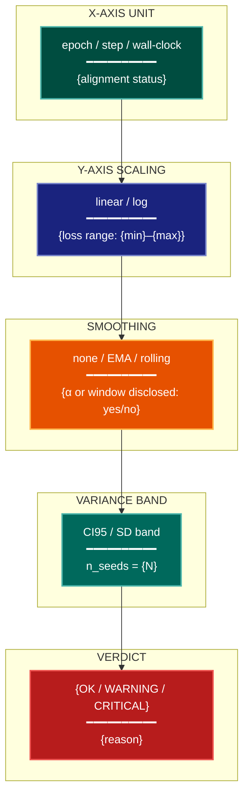

# Temporal Dynamics Visualization Lens

**Philosophical Mode:** Temporal
**Primary Question:** "Are training dynamics shown clearly and honestly?"
**Focus:** Axis Scaling (linear vs log), Smoothing Disclosure, Epoch/Step Alignment,
           Run Aggregation (mean + variance bands), Early-Stopping Markers,
           Wall-Clock vs Step-Count X-Axis

## Arguments

`/autoskillit:vis-lens-temporal [context_path] [experiment_plan_path]`

- **context_path** (optional positional arg 1) — Absolute path to a lens context file
  containing IV/DV tables, H0/H1 hypotheses, controlled variables, and success criteria.
  If provided, read this file before beginning analysis to obtain structured context.
  If omitted, discover context by exploring the CWD.
- **experiment_plan_path** (optional positional arg 2) — Absolute path to the full
  experiment plan. If provided, read for complete experimental methodology and design.
  If omitted, locate the experiment plan by exploring the CWD.

## When to Use

- Reviewing training curves, learning curves, or any metric-vs-step/epoch plots
- Checking whether x-axis units are consistent across compared runs
- Evaluating whether smoothing is disclosed and appropriate
- Planning multi-run aggregation with variance bands
- User invokes `/autoskillit:vis-lens-temporal`

## Critical Constraints

**NEVER:**
- Modify any source code files
- Do not litter the codebase with useless comments, TODO markers, or explanatory annotations — the skill output and diagram speak for themselves
- Create files outside `{{AUTOSKILLIT_TEMP}}/vis-lens-temporal/`
- Omit the CRITICAL flag when n_seeds == 1 for training curves — single-seed variance is unquantifiable
- Apply smoothing without disclosing the smoothing window or method
- Mix epoch-count and step-count x-axes on the same multi-run comparison without alignment

**ALWAYS:**
- CRITICAL: if `n_seeds == 1` for any training curve, flag as **CRITICAL** — single-seed training curves cannot demonstrate stability or convergence robustness
- Disclose smoothing: state the EMA α or window size in the figure caption or axis label
- When comparing runs with different batch sizes or learning rate schedules, align on
  wall-clock time OR total gradient steps (not raw epochs), and document the choice
- Use log-scale y-axis when loss spans more than one order of magnitude
- Mark early-stopping epoch/step as a vertical dashed line with label
- BEFORE creating any diagram, LOAD the `/autoskillit:mermaid` skill using the Skill tool — this is MANDATORY
- If the Skill tool cannot be used (disable-model-invocation) or refuses this invocation, do NOT proceed with diagram creation. Abort this step and omit the diagram from output.
- Write output to `{{AUTOSKILLIT_TEMP}}/vis-lens-temporal/vis_spec_temporal_{YYYY-MM-DD_HHMMSS}.md` (relative to the current working directory)
- After writing the file, emit the structured output token as **literal plain text** with no
  markdown formatting on the token name (the adjudicator performs a regex match):

  ```
  diagram_path = /absolute/path/to/{{AUTOSKILLIT_TEMP}}/vis-lens-temporal/vis_spec_temporal_{...}.md
  %%ORDER_UP%%
  ```

---

## Analysis Workflow

### Step 0: Parse optional arguments

If positional arg 1 (context_path) is provided and the file exists, read it to obtain
IV/DV tables, H0/H1 hypotheses, controlled variables, and success criteria. If positional
arg 2 (experiment_plan_path) is provided and exists, read the experiment plan for full
methodology. Use this structured context as the foundation for Steps 1–4; skip the CWD
exploration for these fields if the context file supplies them.

### Step 1: Inventory Training Curves

Scan experiment plan, context file, and codebase for:

**Learning and Loss Curves**
- Find all learning curves, loss curves, metric-vs-step plots
- Look for: `train_loss`, `val_loss`, `reward`, `accuracy_vs_epoch`, `loss_curve`, `plt.plot`

**Seed Count**
- Find n_seeds for each training run
- Look for: `n_seeds`, `num_seeds`, `seeds`, `SEEDS`, `random_state`, `runs`

**Smoothing Calls**
- Detect whether smoothing is applied and whether it is disclosed
- Look for: `smooth`, `ema`, `rolling_mean`, `gaussian_filter`, `savgol_filter`, EMA α parameters

**X-Axis Type**
- Determine whether x-axis is epoch-count, step-count, or wall-clock time
- Look for: `epochs`, `steps`, `global_step`, `time_elapsed`, x-axis labels

**Early Stopping**
- Detect early-stopping usage and whether it is marked on the plot
- Look for: `early_stopping`, `patience`, `best_epoch`, `EarlyStopping`

### Step 2: Determine Axis Scaling

For each loss or metric curve, check the range:
- If loss spans more than one order of magnitude (max/min > 10): recommend log-scale y-axis
- If loss is bounded (e.g., accuracy 0–1): linear scale is acceptable
- Document the recommendation with the detected range

### Step 3: Alignment Check

For all multi-run comparisons:
- Verify that all compared runs use the same x-axis unit (epoch vs step vs time)
- Flag mismatches as WARNING: "Runs use mixed x-axis units — align on gradient steps or wall-clock time"
- Check batch size and learning rate schedule consistency across compared runs

### Step 4: Emit yaml:figure-spec Blocks

For each figure, emit one `yaml:figure-spec` fenced block with the `stat_overlay`
variance band filled in. Then LOAD `/autoskillit:mermaid` and create a temporal flow
diagram showing x-axis unit → scaling choice → smoothing annotation → variance band → verdict.

---

## Output Template

```markdown
# Temporal Dynamics Spec: {System / Experiment Name}

**Lens:** Temporal Dynamics (Temporal)
**Question:** Are training dynamics shown clearly and honestly?
**Date:** {YYYY-MM-DD}
**Scope:** {What was analyzed}
**n_seeds detected:** {N}

## Temporal Audit Summary

| Figure | n_seeds | x_axis | y_scale | smoothing | early_stop_marked | Status |
|--------|---------|--------|---------|-----------|-------------------|--------|
| {fig-01} | 1 | epoch | linear | none | no | CRITICAL |
| {fig-02} | 5 | step | log | EMA α=0.9 | yes | OK |

## Figure Specs

```yaml
# yaml:figure-spec — canonical schema (spec_version: "1.0")
figure_id: "fig-02-loss-curve"
figure_title: "Training Loss vs Gradient Steps"
spec_version: "1.0"
chart_type: "line"
chart_type_fallback: "scatter"
perceptual_justification: "Log-scale y-axis spans 2 orders of magnitude; variance band shows run stability."
data_source: "results/loss_curves.csv"
data_mapping:
  x: "global_step"
  y: "train_loss"
  color: "run_id"
  size: ""
  facet: ""
layout:
  width_inches: 6.0
  height_inches: 4.0
  dpi: 300
stat_overlay:
  type: "band"
  measure: "CI95"
  n_seeds: 5
annotations: ["log-scale y; EMA α=0.9 disclosed; early-stop at step 4200"]
anti_patterns: ["ap-missing-variance-band"]
palette: "okabe-ito"
format: "pdf"
target_dpi: 300
library: "matplotlib"
report_section: "Section 3 Training"
priority: "P1"
placement_tier: "main"
conflicts: []
metadata:
  created_by: "vis-lens-temporal"
  reviewed_by: ""
  last_updated: "{YYYY-MM-DD}"
```

## Temporal Dynamics Diagram



**Color Legend:**
| Color | Category | Description |
|-------|----------|-------------|
| Dark Teal | X-Axis | Unit choice and alignment status |
| Dark Blue | Y-Axis | Scaling decision based on loss range |
| Orange | Smoothing | Disclosure status |
| Teal | Variance | Band type and seed count |
| Red | Verdict | OK / WARNING / CRITICAL assessment |
```

---

## Pre-Diagram Checklist

Before creating the diagram, verify:

- [ ] LOADED `/autoskillit:mermaid` skill using the Skill tool
- [ ] Using ONLY classDef styles from the mermaid skill (no invented colors)
- [ ] Diagram will include a color legend table
- [ ] Every CRITICAL (n_seeds == 1) training curve is flagged
- [ ] Every smoothing call has its parameters disclosed in the figure spec
- [ ] Early-stopping markers are noted for all curves with early stopping
