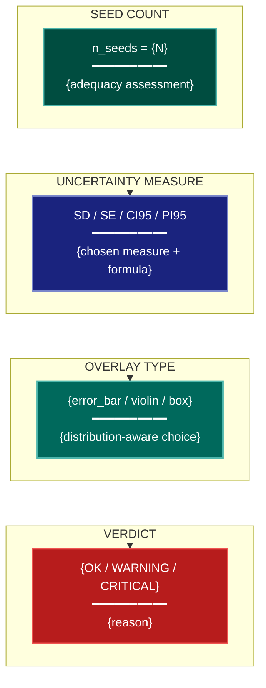

# Uncertainty Representation Visualization Lens

**Philosophical Mode:** Statistical
**Primary Question:** "How is uncertainty honestly represented?"
**Focus:** Error Bar Definitions, Distribution-Aware Alternatives, Multi-Seed Variance Protocols

## Arguments

`/autoskillit:vis-lens-uncertainty [context_path] [experiment_plan_path]`

- **context_path** (optional positional arg 1) — Absolute path to a lens context file
  containing IV/DV tables, H0/H1 hypotheses, controlled variables, and success criteria.
  If provided, read this file before beginning analysis to obtain structured context.
  If omitted, discover context by exploring the CWD.
- **experiment_plan_path** (optional positional arg 2) — Absolute path to the full
  experiment plan. If provided, read for complete experimental methodology and design.
  If omitted, locate the experiment plan by exploring the CWD.

## When to Use

- Reviewing figures that show means, scores, or aggregate metrics without uncertainty
- Checking whether error bars are correctly defined (SD vs SE vs CI is not interchangeable)
- Evaluating whether n_seeds is sufficient to quantify variance
- Planning uncertainty overlays for distribution-heavy results (RL reward curves, ablations)
- User invokes `/autoskillit:vis-lens-uncertainty`

## Critical Constraints

**NEVER:**
- Modify any source code files
- Do not litter the codebase with useless comments, TODO markers, or explanatory annotations — the skill output and diagram speak for themselves
- Create files outside `{{AUTOSKILLIT_TEMP}}/vis-lens-uncertainty/`
- Conflate SD, SE, CI95, and PI95 — they have fundamentally different interpretations
- Omit the CRITICAL flag when n_seeds == 1; single-seed variance is unquantifiable

**ALWAYS:**
- CRITICAL: if `n_seeds == 1`, flag the figure as **CRITICAL** — single-seed variance is unquantifiable and must be reported
- If `n_seeds >= 10`, prefer violin/box/strip over error bars to show the full distribution shape
- Label every uncertainty overlay with its exact measure (SD, SE, CI95, PI95) and n in the figure caption
- BEFORE creating any diagram, LOAD the `/autoskillit:mermaid` skill using the Skill tool - this is MANDATORY
- If the Skill tool cannot be used (disable-model-invocation) or refuses this invocation, do NOT proceed with diagram creation. Abort this step and omit the diagram from output.
- Write output to `{{AUTOSKILLIT_TEMP}}/vis-lens-uncertainty/vis_spec_uncertainty_{YYYY-MM-DD_HHMMSS}.md`
- After writing the file, emit the structured output token as **literal plain text** with no
  markdown formatting on the token name (the adjudicator performs a regex match):

  ```
  diagram_path = /absolute/path/to/{{AUTOSKILLIT_TEMP}}/vis-lens-uncertainty/vis_spec_uncertainty_{...}.md
  %%ORDER_UP%%
  ```

---

## Analysis Workflow

### Step 0: Parse optional arguments

If positional arg 1 (context_path) is provided and the file exists, read it to obtain
IV/DV tables, H0/H1 hypotheses, controlled variables, and success criteria. If positional
arg 2 (experiment_plan_path) is provided and exists, read the experiment plan for full
methodology. Use this structured context as the foundation for Steps 1–4; skip the CWD
exploration for these fields if the context file supplies them.

### Step 1: Inventory Figures and Seeds

Scan experiment plan, context file, and codebase for:

**Figures with Error-Bearing Quantities**
- Find all figures that aggregate over multiple runs, seeds, or samples
- Look for: `mean`, `average`, `std`, `stderr`, `ci`, `error_bar`, `errorbar`, `fill_between`

**Seed Count**
- Find the number of random seeds or independent runs used
- Look for: `n_seeds`, `num_seeds`, `seeds`, `SEEDS`, `random_state`, `seed_list`, `runs`

**Existing Uncertainty Representation**
- Find whether any uncertainty overlay exists at all
- Look for: `plt.fill_between`, `ax.errorbar`, `capsize`, `yerr`, `xerr`, `ci=`, `sd=`, `ci_band`

**Claims About Variance**
- Find claims that assert robustness, stability, or statistical significance
- Look for: `significant`, `robust`, `stable`, `p-value`, `consistent`, `reproducible`

### Step 2: Determine Correct Uncertainty Measure Per Figure

For each figure that shows an aggregated quantity, determine the correct measure:

**SD — Standard Deviation**
- Definition: spread of the data distribution (population variability), not inference error
- When to use: when the claim is about spread of the distribution, not precision of the mean
- Formula: `σ = sqrt(1/(n-1) × Σ(xᵢ - x̄)²)`

**SE — Standard Error of the Mean**
- Definition: SD / √n — sampling error of the estimated mean
- When to use: when the claim is about how precisely the mean is estimated
- Formula: `SE = SD / √n`

**CI 95% — Confidence Interval**
- Definition: mean ± t(0.975, n−1) × SE — inferential, sample-size dependent
- When to use: when making statistical inference claims; shrinks with larger n
- Formula: `CI = mean ± t(0.975, n−1) × (SD / √n)`

**PI 95% — Prediction Interval**
- Definition: interval for a future single observation (wider than CI)
- When to use: when the claim is about where a new individual result will fall
- Formula: `PI = mean ± t(0.975, n−1) × SD × sqrt(1 + 1/n)`

**Distribution-Aware Selection:**
- n_seeds == 1 → **CRITICAL**: variance cannot be quantified; flag this immediately
- n_seeds 2–4 → CI95 or SE; warn that the interval is unreliable at low n
- n_seeds 5–9 → error_bar with CI95 is acceptable; consider box plot
- n_seeds ≥ 10 → prefer violin/box/strip over error bars to show full distribution shape

### Step 3: Flag Critical Cases

For every figure where `n_seeds == 1`:
- Mark with severity: **CRITICAL**
- Reason: single-seed variance is unquantifiable; the result may not replicate
- Remediation: report results across ≥ 3 seeds minimum (5+ recommended)

For figures where the wrong measure is used (e.g., SD labeled as CI, or CI claimed without stating n):
- Mark with severity: **WARNING**
- Document the specific mislabeling and the correct interpretation

### Step 4: Emit yaml:figure-spec Blocks

For each figure, emit one `yaml:figure-spec` fenced block (schema defined in vis-lens-chart-select)
with `stat_overlay` filled in. Then LOAD `/autoskillit:mermaid` and create the mermaid diagram.

---

## Output Template

```markdown
# Uncertainty Representation Spec: {System / Experiment Name}

**Lens:** Uncertainty Representation (Statistical)
**Question:** How is uncertainty honestly represented?
**Date:** {YYYY-MM-DD}
**Scope:** {What was analyzed}
**n_seeds detected:** {N}

## Uncertainty Measure Summary

| Figure | n_seeds | Recommended Measure | Current Measure | Status |
|--------|---------|---------------------|-----------------|--------|
| {fig-01} | 1 | N/A — CRITICAL | none | CRITICAL |
| {fig-02} | 5 | CI95 | SE | WARNING — mislabeled |
| {fig-03} | 10 | violin | error_bar | WARNING — prefer distribution plot |
| {fig-04} | 5 | CI95 | CI95 | OK |

## Figure Specs

```yaml
# yaml:figure-spec — canonical schema (spec_version: "1.0")
figure_id: "fig-02-ablation-accuracy"
figure_title: "Ablation Study: Component Contribution"
spec_version: "1.0"
chart_type: "grouped-bar"
chart_type_fallback: "dot-plot"
perceptual_justification: "Position encoding for nominal × quantitative comparison."
data_source: "results/ablation.csv"
data_mapping:
  x: "variant"
  y: "accuracy"
  color: "component"
  size: ""
  facet: ""
layout:
  width_inches: 5.0
  height_inches: 3.5
  dpi: 300
stat_overlay:
  type: "error_bar"
  measure: "CI95"
  n_seeds: 5
annotations: ["n=5 seeds; CI95 shown"]
anti_patterns: ["ap-bar-no-error"]
palette: "okabe-ito"
format: "pdf"
target_dpi: 300
library: "matplotlib"
report_section: "Section 5 Ablation"
priority: "P1"
placement_tier: "main"
conflicts: []
metadata:
  created_by: "vis-lens-uncertainty"
  reviewed_by: ""
  last_updated: "{YYYY-MM-DD}"
```

## Uncertainty Representation Diagram



**Color Legend:**
| Color | Category | Description |
|-------|----------|-------------|
| Dark Teal | Seed Count | Number of independent runs |
| Dark Blue | Measure | Chosen uncertainty measure |
| Teal | Overlay | Distribution-aware display type |
| Red | Verdict | OK / WARNING / CRITICAL assessment |
```

---

## Pre-Diagram Checklist

Before creating the diagram, verify:

- [ ] LOADED `/autoskillit:mermaid` skill using the Skill tool
- [ ] Using ONLY classDef styles from the mermaid skill (no invented colors)
- [ ] Diagram will include a color legend table
- [ ] Every CRITICAL (n_seeds == 1) figure is flagged
- [ ] Every stat_overlay has both `measure` and `n_seeds` filled in
